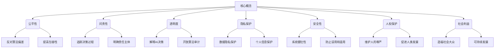

以下是关于"伦理问题 (Ethical Issues)"的技术博客文章正文部分:

# 伦理问题 (Ethical Issues)

## 1. 背景介绍

### 1.1 问题的由来

伴随着人工智能(AI)和机器学习技术的快速发展,AI系统越来越深入地融入到我们的日常生活中。从语音助手到自动驾驶汽车,从医疗诊断到金融投资决策,AI无所不在。然而,AI的广泛应用也引发了一系列伦理问题和社会担忧,这些问题亟待解决。

AI系统的决策过程通常是一个"黑箱",很难追踪和解释其内部机理。这可能导致AI系统做出不公平、歧视性或不道德的决策。例如,一些人脸识别系统对于非裔美国人的识别准确率较低,而对白人的识别准确率较高。这种算法偏差可能会加剧社会不平等。

此外,AI系统可能被误用或滥用,从而产生严重的负面影响。例如,一些国家可能利用AI进行大规模监控,侵犯公民隐私;或者AI武器可能失控,造成大规模杀伤。因此,制定相关法律法规和伦理准则来规范AI的发展和应用至关重要。

### 1.2 研究现状  

近年来,AI伦理问题受到了广泛关注。学术界、业界和政府机构都在努力探索如何在发展AI的同时,确保其符合伦理和社会价值观。一些著名的AI伦理原则和框架包括:

- IEEE全球AI伦理倡议
- 欧盟人工智能伦理准则
- 谷歌AI原则
- 微软AI伦理准则

这些原则强调了诸如透明度、公平性、隐私保护、安全性、问责制等核心价值观。然而,如何将这些抽象原则转化为具体的技术实践和管理措施,仍然是一个巨大的挑战。

### 1.3 研究意义

解决AI伦理问题对于人类社会的可持续发展至关重要。如果我们无法确保AI系统的公平性、透明度和安全性,就可能导致严重的社会分裂、经济动荡和人权侵犯。相反,如果我们能够建立一个健全的AI伦理框架,就能最大限度地发挥AI的积极作用,促进社会进步。

因此,研究AI伦理问题不仅是一个技术挑战,更是一个社会责任。我们需要整合多学科的知识和智慧,在技术、法律、伦理和社会各个层面采取综合措施,以确保AI的健康发展。

### 1.4 本文结构  

本文将全面探讨AI伦理问题的各个方面。我们将首先介绍AI伦理的核心概念和原则,然后分析核心算法原理及其潜在的伦理风险。接下来,我们将建立相关的数学模型,并给出公式推导和案例分析。在此基础上,我们将介绍一些实际的项目实践,展示如何将伦理考虑因素融入到AI系统的设计和开发中。最后,我们将探讨AI伦理在不同应用场景中的实践,分享相关的工具和资源,并对未来的发展趋势和挑战进行展望。

## 2. 核心概念与联系

AI伦理涉及多个核心概念,包括公平性、问责性、透明度、隐私保护、安全性、人权保护和社会利益等。这些概念相互关联、相互影响。

- **公平性**要求AI系统避免算法偏差,提高包容性,确保不同群体受到公平对待。
- **问责性**要求AI决策过程可追踪,责任主体明确。
- **透明度**要求AI决策过程可解释,算法开放接受审计。
- **隐私保护**要求保护个人数据和信息隐私。
- **安全性**要求AI系统健壮可靠,防止误用和滥用。
- **人权保护**要求AI维护人的尊严,促进人类发展。
- **社会利益**要求AI造福社会大众,实现可持续发展。

这些概念构成了AI伦理的基础框架,相互支撑、相互制约。只有综合考虑所有因素,AI才能真正符合伦理准则,获得社会认可和信任。

## 3. 核心算法原理 & 具体操作步骤

### 3.1 算法原理概述

在探讨AI算法的伦理风险之前,我们需要先了解一些核心算法原理。AI算法主要分为三大类:

1. **符号主义AI**:基于逻辑规则和知识库,模拟人类推理过程。主要算法包括专家系统、决策树等。

2. **连接主义AI**:模拟人脑神经网络,通过训练数据学习模式。主要算法包括人工神经网络、深度学习等。

3. **进化计算AI**:模拟生物进化过程,通过遗传算法等优化求解。

其中,连接主义AI算法由于其"黑箱"特性和对大量数据的依赖,面临最大的伦理挑战。我们将重点分析这一类算法。

### 3.2 算法步骤详解

以深度学习算法为例,其主要步骤包括:

1. **数据收集与预处理**:收集大量标注数据,进行清洗、标准化等预处理。
2. **模型构建**:设计神经网络架构,确定激活函数、损失函数等参数。
3. **模型训练**:使用训练数据对模型进行迭代训练,优化网络权重。
4. **模型评估**:在测试数据上评估模型性能,包括准确率、精确率、召回率等指标。
5. **模型部署**:将训练好的模型部署到实际系统中,用于决策或预测。

在每个步骤中,都可能存在潜在的伦理风险,我们将在下一节详细分析。

### 3.3 算法优缺点

深度学习算法的优点包括:

- 强大的模式识别和预测能力
- 自动从数据中学习特征,减少人工干预
- 可处理高维、非线性、复杂的问题

但同时也存在一些缺点和风险:

- 需要大量高质量的训练数据,存在数据偏差风险
- 模型内部机理难以解释,决策过程不透明
- 可能放大或继承训练数据中的偏见和歧视
- 存在对抗样本风险,模型可能被欺骗
- 缺乏因果推理能力,只能发现相关性而非因果关系

这些缺点和风险正是导致AI伦理问题的主要根源。因此,我们需要在算法设计和应用中采取相应的缓解措施。

### 3.4 算法应用领域

深度学习等AI算法已经广泛应用于多个领域,包括但不限于:

- 计算机视觉:图像分类、目标检测、人脸识别等
- 自然语言处理:机器翻译、文本生成、情感分析等
- 推荐系统:个性化推荐、内容过滤等
- 金融:交易决策、欺诈检测、风险管理等
- 医疗:疾病诊断、药物开发、医疗影像分析等
- 交通:自动驾驶、交通管控、路径规划等
- 安防:视频监控、人员检测、入侵检测等

每个领域都面临着不同的伦理挑战,我们需要针对具体情况采取相应的伦理保障措施。

## 4. 数学模型和公式 & 详细讲解 & 举例说明

### 4.1 数学模型构建

为了量化和分析AI算法中的伦理风险,我们需要建立相应的数学模型。一种常见的方法是将伦理考虑因素作为约束条件或惩罚项,融入到算法的目标函数中。

以二元分类问题为例,传统的目标函数通常是最小化交叉熵损失:

$$J(\theta) = -\frac{1}{N}\sum_{i=1}^{N}[y_i\log(\hat{y}_i) + (1-y_i)\log(1-\hat{y}_i)]$$

其中,$\theta$表示模型参数,$y_i$和$\hat{y}_i$分别表示真实标签和预测标签。

为了考虑公平性,我们可以在目标函数中加入组间差异惩罚项:

$$J'(\theta) = J(\theta) + \lambda \sum_{j=1}^{M}\left|\frac{1}{N_j}\sum_{i\in G_j}\hat{y}_i - \frac{1}{N}\sum_{i=1}^{N}\hat{y}_i\right|$$

其中,$\lambda$是惩罚系数,$M$是保护组数量(如性别、种族等),$N_j$是第$j$个组的样本数,$G_j$表示第$j$个组的样本索引集合。该惩罚项度量了不同组之间预测值的差异,从而降低了算法的潜在偏差。

通过构建合适的数学模型,我们可以将伦理考虑因素量化,并融入到算法的优化过程中,从而提高AI系统的公平性、透明度和可解释性。

### 4.2 公式推导过程

接下来,我们将推导一种常用的公平度量指标——统计率差异(Statistical Parity Difference)。

假设我们有两个保护组$G_0$和$G_1$,目标是使两组的正例率相等。我们定义$\hat{y}_{G_j}$为组$G_j$中正例的平均预测值:

$$\hat{y}_{G_j} = \frac{1}{N_j}\sum_{i\in G_j}\hat{y}_i$$

则统计率差异可以表示为:

$$\text{SPD} = |\hat{y}_{G_0} - \hat{y}_{G_1}|$$

我们的目标是最小化SPD,从而达到组间统计率的平等。将其作为惩罚项加入目标函数:

$$J''(\theta) = J(\theta) + \lambda |\hat{y}_{G_0} - \hat{y}_{G_1}|$$

通过优化$J''(\theta)$,我们可以获得一个在保持较高预测准确率的同时,组间统计率差异也较小的模型。

需要注意的是,统计率差异只是公平度量的一种方式,还有其他指标如均等机会、条件统计率等,具体使用哪一种取决于具体的应用场景和需求。

### 4.3 案例分析与讲解

为了更好地理解公平算法的原理,我们来分析一个人力资源管理的案例。

假设一家公司希望使用AI系统来筛选简历,并确保不同性别和种族的候选人得到公平对待。我们可以构建一个二元分类模型,输入是候选人的简历信息,输出是"建议录用"或"不建议录用"。

在训练数据中,我们发现存在一些潜在的性别和种族偏差。例如,对于拥有相似教育背景和工作经验的候选人,女性候选人的录用率低于男性候选人,而非裔美国人候选人的录用率也低于白人候选人。

为了消除这种偏差,我们在目标函数中加入统计率差异惩罚项:

$$J'''(\theta) = J(\theta) + \lambda_1 |\hat{y}_\text{male} - \hat{y}_\text{female}| + \lambda_2 |\hat{y}_\text{white} - \hat{y}_\text{black}|$$

其中,$\lambda_1$和$\lambda_2$分别是性别和种族组的惩罚系数,可根据具体需求进行调整。

通过优化该目标函数,我们可以获得一个在性别和种族之间具有较小统计率差异的模型。当然,我们还需要在测试数据上评估