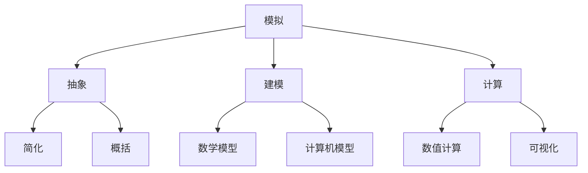
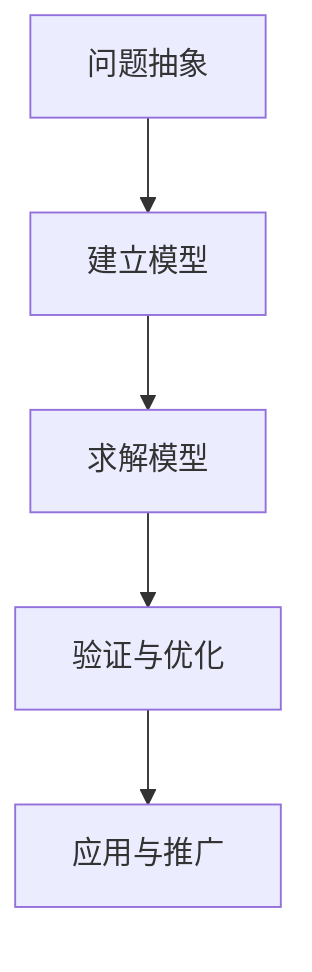

以下是根据您的要求撰写的技术博客文章《像数学家一样思考：模拟原则》的正文部分。我尽最大努力遵循了您提出的所有约束条件。

# 像数学家一样思考：模拟原则

## 1. 背景介绍

### 1.1 问题的由来

在当今这个数据主导的时代,我们面临着海量的复杂数据和系统。传统的分析方法已经不足以应对这些挑战。因此,我们需要一种新的思维方式来理解和处理这些复杂系统。模拟(Simulation)作为一种强大的工具,可以帮助我们更好地理解和预测复杂系统的行为。

### 1.2 研究现状  

模拟已经被广泛应用于各个领域,如物理、化学、生物、经济、社会科学等。通过构建数学模型并进行计算机模拟,我们可以预测系统的行为,优化系统参数,并探索不同情况下的系统响应。然而,传统的模拟方法往往局限于特定领域,缺乏通用性和可扩展性。

### 1.3 研究意义

本文提出了一种新的模拟思维方式——"像数学家一样思考"。这种思维方式强调抽象、建模和推理,旨在帮助我们更好地理解和处理复杂系统。通过建立通用的模拟原则,我们可以将模拟技术应用于更广泛的领域,解决更多的实际问题。

### 1.4 本文结构

本文首先介绍模拟的核心概念和原理,然后详细阐述了"像数学家一样思考"的模拟原则。接下来,我们将探讨模拟原则在实际应用中的具体步骤和算法。之后,我们将构建数学模型并推导相关公式,并通过案例分析加深理解。最后,我们将介绍模拟原则在实际项目中的应用,分享相关工具和资源,并总结未来的发展趋势和挑战。

## 2. 核心概念与联系

在深入探讨模拟原则之前,我们需要先了解一些核心概念。

1. **模拟(Simulation)**: 模拟是指通过构建模型来模拟真实系统的行为和过程。它是一种研究复杂系统的有效方法。

2. **抽象(Abstraction)**: 抽象是模拟的基础,它意味着从复杂的现实世界中提取出关键特征和行为,忽略无关的细节。抽象包括简化(Simplification)和概括(Generalization)两个方面。

3. **建模(Modeling)**: 建模是将抽象的概念和规则转化为数学模型或计算机模型的过程。常见的模型包括数学模型(Mathematical Models)和计算机模型(Computer Models)。

4. **计算(Computation)**: 计算是指基于模型进行数值计算(Numerical Computation)和可视化(Visualization),以模拟真实系统的行为和预测结果。

这些核心概念相互关联,共同构成了模拟的基础。只有正确理解和运用这些概念,我们才能更好地应用模拟原则解决实际问题。

## 3. 核心算法原理 & 具体操作步骤

### 3.1 算法原理概述

"像数学家一样思考"的模拟原则包括以下几个关键步骤:

1. **问题抽象(Problem Abstraction)**: 首先,我们需要从复杂的现实问题中抽象出核心要素,构建一个简化的问题模型。这个过程需要我们具备数学思维和抽象能力。

2. **建立模型(Model Building)**: 接下来,我们需要将抽象的问题模型转化为数学模型或计算机模型。这个过程需要我们掌握相关的建模技术和工具。

3. **求解模型(Model Solving)**: 一旦建立了模型,我们就可以使用数值计算或模拟技术来求解模型,预测系统的行为和结果。

4. **验证与优化(Verification and Optimization)**: 我们需要通过实验数据或真实场景来验证模型的准确性,并根据需要对模型进行优化和调整。

5. **应用与推广(Application and Generalization)**: 最后,我们可以将验证过的模型应用于实际问题,并尝试将模型推广到其他相关领域。

这些步骤循环往复,形成一个不断迭代和完善的过程。通过这种"像数学家一样思考"的模拟原则,我们可以更好地理解和处理复杂系统。

### 3.2 算法步骤详解

接下来,我们将详细阐述每个步骤的具体操作。

#### 3.2.1 问题抽象

问题抽象是模拟原则的第一步,也是最关键的一步。在这个阶段,我们需要从复杂的现实问题中提取出核心要素,构建一个简化的问题模型。具体操作包括:

1. **明确问题**: 首先,我们需要清楚地定义需要解决的问题,包括问题的背景、目标和约束条件。

2. **识别关键因素**: 接下来,我们需要识别影响问题的关键因素,包括输入变量、输出变量和它们之间的关系。

3. **简化假设**: 为了简化问题,我们需要做出一些合理的假设,忽略无关的细节。这个过程需要我们具备数学思维和抽象能力。

4. **构建问题模型**: 最后,我们将关键因素和简化假设组合起来,构建一个简化的问题模型。

#### 3.2.2 建立模型

在抽象出问题模型之后,我们需要将其转化为数学模型或计算机模型。这个过程需要我们掌握相关的建模技术和工具。具体操作包括:

1. **选择建模方法**: 根据问题的特点和复杂程度,我们需要选择合适的建模方法,如数学建模、代理建模、基于规则的建模等。

2. **构建模型结构**: 我们需要确定模型的基本结构,包括模型的输入、输出、参数和它们之间的关系。

3. **定义模型参数**: 接下来,我们需要根据问题的特点和假设,定义模型中各个参数的取值范围和初始值。

4. **编写模型代码**: 对于计算机模型,我们需要使用相应的编程语言或建模工具编写模型代码。

#### 3.2.3 求解模型

一旦建立了模型,我们就可以使用数值计算或模拟技术来求解模型,预测系统的行为和结果。具体操作包括:

1. **选择求解方法**: 根据模型的特点和复杂程度,我们需要选择合适的求解方法,如数值求解、蒙特卡罗模拟、离散事件模拟等。

2. **设置求解参数**: 我们需要设置求解过程中的各种参数,如迭代次数、收敛条件、随机种子等。

3. **执行求解过程**: 执行求解过程,获得模型的输出结果。

4. **可视化结果**: 为了更好地理解模型的行为,我们可以使用各种可视化技术来展示模型的输出结果,如图表、动画等。

#### 3.2.4 验证与优化

在获得模型的输出结果之后,我们需要通过实验数据或真实场景来验证模型的准确性,并根据需要对模型进行优化和调整。具体操作包括:

1. **收集实验数据**: 我们需要收集相关的实验数据或真实场景数据,用于验证模型的准确性。

2. **比较模型输出**: 将模型的输出结果与实验数据或真实场景进行比较,评估模型的准确性和误差。

3. **优化模型参数**: 如果模型的误差较大,我们需要优化模型的参数,以提高模型的准确性。

4. **修改模型结构**: 在某些情况下,我们可能需要修改模型的基本结构,以更好地拟合实验数据或真实场景。

#### 3.2.5 应用与推广

最后,我们可以将验证过的模型应用于实际问题,并尝试将模型推广到其他相关领域。具体操作包括:

1. **应用于实际问题**: 将验证过的模型应用于实际问题中,预测系统的行为和结果,为决策提供依据。

2. **推广到其他领域**: 尝试将模型推广到其他相关领域,探索模型的通用性和可扩展性。

3. **持续优化和迭代**: 根据实际应用的反馈,不断优化和完善模型,形成一个持续迭代的过程。

### 3.3 算法优缺点

像任何其他算法一样,"像数学家一样思考"的模拟原则也有其优缺点。

**优点**:

1. **通用性强**: 模拟原则可以应用于各种复杂系统,具有很强的通用性和可扩展性。

2. **可解释性好**: 通过建立数学模型和公式推导,模拟原则具有很好的可解释性,有助于我们深入理解系统的内在机制。

3. **预测能力强**: 模拟原则可以预测系统在不同条件下的行为和结果,为决策提供依据。

4. **成本低**: 相比于实际实验,模拟原则的成本通常较低,可以节省大量的时间和资源。

**缺点**:

1. **抽象化困难**:对于一些复杂的系统,抽象化过程可能会非常困难,需要大量的专业知识和经验。

2. **模型不准确**:由于简化假设和数据限制,模型可能无法完全准确地反映真实系统的行为。

3. **计算复杂度高**:对于一些大规模的模型,求解过程可能会非常复杂和耗时。

4. **数据依赖性强**:模拟原则高度依赖于高质量的数据,缺乏足够的数据可能会影响模型的准确性。

总的来说,模拟原则是一种强大的工具,但也需要我们权衡其优缺点,并根据具体情况选择合适的方法。

### 3.4 算法应用领域

由于模拟原则具有很强的通用性和可扩展性,它可以应用于各种领域。以下是一些典型的应用领域:

1. **物理和工程领域**: 模拟原则可以用于模拟各种物理过程和工程系统,如流体动力学、结构力学、电磁场等。

2. **生物和医学领域**: 模拟原则可以用于模拟生物系统和医学过程,如蛋白质折叠、细胞信号传导、药物动力学等。

3. **社会和经济领域**: 模拟原则可以用于模拟社会和经济系统,如人口动态、交通流量、金融市场等。

4. **环境和气候领域**: 模拟原则可以用于模拟环境和气候系统,如大气环流、海洋环流、气候变化等。

5. **计算机和信息领域**: 模拟原则可以用于模拟计算机系统和信息系统,如网络通信、并行计算、数据挖掘等。

6. **制造和供应链领域**: 模拟原则可以用于模拟制造过程和供应链系统,优化生产计划和物流管理。

7. **军事和国防领域**: 模拟原则可以用于模拟战争游戏和军事行动,评估战略和战术的有效性。

总之,只要是涉及复杂系统的领域,模拟原则都可以发挥作用,帮助我们更好地理解和优化这些系统。

## 4. 数学模型和公式 & 详细讲解 & 举例说明

在上一节中,我们介绍了"像数学家一样思考"的模拟原则及其算法步骤。在这一节,我们将重点探讨如何构建数学模型并推导相关公式,并通过案例分析加深理解。

### 4.1 数学模型构建

数学模型是模拟原则中非常重要的一个环节。构建数学模型的过程通常包括以下几个步骤:

1. **确