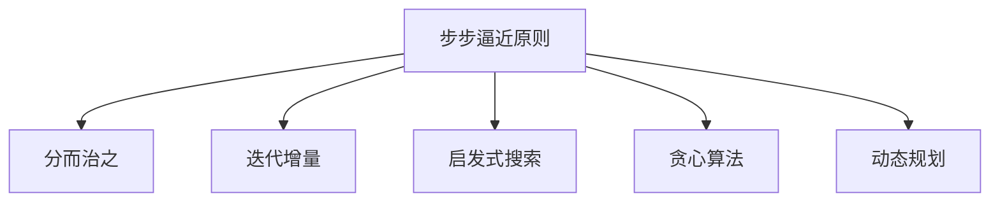

以下是根据您提供的要求和约束条件，为主题《像数学家一样思考：步步逼近原则》撰写的技术博客文章正文内容：

# 像数学家一样思考：步步逼近原则

## 1. 背景介绍

### 1.1 问题的由来

在日常生活和工作中，我们经常会遇到各种复杂的问题需要解决。这些问题可能涉及多个领域、多个变量,并且存在诸多未知因素和不确定性。传统的解决方式往往是尝试直接攻克问题的症结,但这种做法在面对复杂问题时常常会陷入困境。

### 1.2 研究现状 

数学家们在解决复杂问题时,采用了一种被称为"步步逼近"(Successive Approximation)的思维方式。这种方法的核心思想是将一个复杂的问题分解为多个相对简单的子问题,先求解这些子问题的近似解,然后逐步改进和优化,最终得到满意的问题解。

### 1.3 研究意义

步步逼近思维方式为我们提供了一种全新的解决复杂问题的范式。它不再盲目地直接对抗问题的复杂性,而是将注意力集中在可控的简单子问题上,通过不断逼近的方式最终达成目标。这种思维模式具有以下优势:

1. 降低问题复杂度,有助于理解和把控
2. 分阶段解决,避免资源浪费
3. 可调整方向,提高解决方案的适用性
4. 可重复迭代,不断优化和完善

### 1.4 本文结构

本文将从以下几个方面深入探讨步步逼近原则:

1. 核心概念及其与其他思维模式的关联
2. 原理的数学基础及算法步骤
3. 建模方法和数学公式推导
4. 实际应用案例和代码实现
5. 在不同领域的应用场景
6. 相关工具和学习资源推荐
7. 未来发展趋势和面临的挑战

## 2. 核心概念与联系

步步逼近原则的核心思想是通过将复杂问题分解为简单子问题,并对这些子问题进行逐步求解和逼近的过程,最终得到满意的问题解。这一思维方式与其他一些著名的思维模型和方法论存在内在联系:

1. 分而治之(Divide and Conquer)
2. 迭代增量(Iterative Incremental)  
3. 启发式搜索(Heuristic Search)
4. 贪心算法(Greedy Algorithm)
5. 动态规划(Dynamic Programming)

这些思维模型和算法都基于将复杂问题分解为可控的子问题,并通过某种策略对子问题进行求解和组合,从而逐步逼近最终目标。步步逼近原则可以看作是一种更加通用和高层次的思维框架,上述模型和算法都可以视为其特例。

## 3. 核心算法原理与具体操作步骤

### 3.1 算法原理概述

步步逼近算法的核心思想是将一个复杂的目标问题分解为多个相对简单的子问题,并通过迭代的方式不断优化子问题的解,最终得到满意的整体问题解。算法的执行过程可以概括为以下几个关键步骤:

1. **问题分解**: 将原始复杂问题分解为多个相对简单的子问题
2. **初始解构建**: 为每个子问题构建一个初始的近似解
3. **局部优化**: 针对每个子问题的近似解进行局部优化,得到更好的近似解
4. **全局组合**: 将所有优化后的子问题解进行合理的组合,构建整体问题的近似解
5. **收敛性检查**: 检查整体近似解是否满足预期目标,如果不满足则重复3-5步骤
6. **终止条件**: 当整体近似解满足预期目标或达到最大迭代次数时,算法终止并输出最终解

### 3.2 算法步骤详解

1. **问题分解**

   问题分解是步步逼近算法的第一步,也是最关键的一步。将一个复杂的问题合理地分解为多个相对简单的子问题,是算法能否高效运行的前提。分解的granularity(粒度)需要根据具体问题进行权衡,过细会导致子问题过多,过粗又可能无法真正简化问题。

   常见的分解策略有:

   - 基于问题的物理拓扑结构(如空间或时序上的划分)
   - 基于问题的逻辑模块或功能块
   - 基于问题的不同决策层级或阶段

2. **初始解构建**

   对于每个分解出的子问题,我们需要给出一个初始的近似解。这个近似解不需要是最优解,但至少应该是一个可行解。初始解的构建可以基于启发式方法、贪心策略或者简单的规则系统等。

3. **局部优化**  

   在获得每个子问题的初始近似解后,我们需要针对性地对这些近似解进行优化,使其更加接近子问题的精确解。常用的优化方法有:

   - 局部搜索(Local Search)
   - 模拟退火(Simulated Annealing)
   - 遗传算法(Genetic Algorithm)

   优化的目标函数和约束条件需要根据具体子问题进行设计。

4. **全局组合**

   当所有子问题的近似解都被优化到一定程度后,我们需要将它们进行合理的组合,构建出整个原始问题的一个近似解。

   组合的方式有多种,包括加权求和、投票机制、优先级拼接等。组合函数的设计需要考虑子问题解之间的相关性和冲突,并对异常情况进行处理。

5. **收敛性检查**

   获得原始问题的一个近似解后,我们需要检查该近似解是否满足预期目标。如果满足,则算法可以终止;如果不满足,则需要重复局部优化和全局组合的步骤,直到满足目标或达到最大迭代次数。

   检查近似解是否满足目标的方法,通常是将其代入目标函数或评估函数中,看是否符合预期值或约束条件。

6. **终止条件**

   算法的终止条件有两种:

   - 满足目标:当整体近似解满足预先设定的目标函数或评估函数时,算法终止并输出该近似解作为最终解
   - 达到最大迭代次数:为避免算法无限循环,我们需要设置一个最大迭代次数,当迭代次数达到该值时,算法强制终止并输出当前最佳近似解

### 3.3 算法优缺点

步步逼近算法具有以下优点:

1. 将复杂问题分解,降低了问题的整体复杂度
2. 分阶段求解,可以更好地控制计算资源的使用
3. 通过迭代优化,最终解的质量可以不断提高
4. 具有一定的鲁棒性,可以应对动态变化的问题环境

但该算法也存在一些缺点:

1. 问题分解和子问题求解策略的设计需要一定的领域知识和经验
2. 子问题解的局部最优并不能保证全局最优
3. 迭代次数的设置需要平衡计算代价和解的质量
4. 并行化实现较为困难,可能影响算法的效率

### 3.4 算法应用领域

由于步步逼近算法具有通用性,因此可以应用于多个领域的复杂问题求解:

- 组合优化问题(如旅行商、车辆调度等)
- 控制理论(如PID控制、自适应控制等)
- 机器学习与模式识别(如聚类、分类等)
- 多智能体系统(如多Agent协作等)
- 工程设计与制造(如电路设计、工艺流程优化等)
- 运筹与决策支持(如资源调度、投资组合优化等)

## 4. 数学模型和公式及详细讲解与举例说明

### 4.1 数学模型构建

为了形式化地描述步步逼近算法,我们可以构建如下数学模型:

假设原始复杂问题可以表示为:

$$\min\limits_{x} f(x)$$
$$s.t. \quad g_i(x) \leq 0, \quad i=1,2,...,m$$
$$h_j(x) = 0, \quad j=1,2,...,p$$

其中:
- $f(x)$是目标函数
- $g_i(x)$是不等式约束
- $h_j(x)$是等式约束

我们将该问题分解为$n$个子问题:

$$\min\limits_{x_k} f_k(x_k), \quad k=1,2,...,n$$
$$s.t. \quad g_{ik}(x_k) \leq 0, \quad i=1,2,...,m_k$$
$$h_{jk}(x_k) = 0, \quad j=1,2,...,p_k$$

其中$x_k$是子问题$k$的决策变量,目标函数和约束条件也针对每个子问题分别设置。

步步逼近算法的目标是求解:

$$\min\limits_{x_1,x_2,...,x_n} F(x_1,x_2,...,x_n)$$
$$s.t. \quad G_i(x_1,x_2,...,x_n) \leq 0, \quad i=1,2,...,M$$
$$H_j(x_1,x_2,...,x_n) = 0, \quad j=1,2,...,P$$

其中$F$是将所有子问题目标函数$f_k$合成的全局目标函数,$G_i$和$H_j$分别是全局不等式和等式约束。

这个模型的关键是如何构建$F$、$G_i$和$H_j$,使其能够合理地反映原始问题的目标和约束,同时又能利用子问题的解$x_k$。

### 4.2 公式推导过程

我们以一个简单的例子来推导$F$、$G_i$和$H_j$的具体形式。假设原始问题是要找到一个$n$维向量$\boldsymbol{x}$,使得:

$$\min\limits_{\boldsymbol{x}} \sum\limits_{i=1}^n x_i^2$$
$$s.t. \quad \sum\limits_{i=1}^n x_i = 1$$
$$0 \leq x_i \leq 1, \quad i=1,2,...,n$$

我们将这个问题分解为$n$个单变量子问题:

$$\min\limits_{x_k} x_k^2, \quad k=1,2,...,n$$
$$s.t. \quad 0 \leq x_k \leq 1$$

现在,我们需要构造出全局目标函数$F$和约束$G$和$H$,使得求解:

$$\min\limits_{x_1,x_2,...,x_n} F(x_1,x_2,...,x_n)$$
$$s.t. \quad G(x_1,x_2,...,x_n) \leq 0$$
$$H(x_1,x_2,...,x_n) = 0$$

等价于求解原始问题。

一种可能的构造方式是:

$$F(x_1,x_2,...,x_n) = \sum\limits_{k=1}^n x_k^2$$
$$G(x_1,x_2,...,x_n) = \begin{cases}
-\sum\limits_{k=1}^n x_k + 1, & 0 \leq x_k \leq 1 \\
+\infty, & otherwise
\end{cases}$$
$$H(x_1,x_2,...,x_n) = 0$$

这样,通过求解所有子问题,再将它们的解代入$F$和$G$,我们就可以还原出原始问题的解。

### 4.3 案例分析与讲解

现在我们用一个实际案例来分析步步逼近算法的应用。假设我们需要为一个工厂设计生产计划,使得在满足原材料、人力等资源约束的前提下,尽可能最大化产出和利润。

这是一个典型的组合优化问题,包含多个决策变量(如产品种类、产量、工人分配等)和约束条件(如原材料存量、工人数量等)。我们可以将其建模为:

$$\max\limits_{\boldsymbol{x}} \sum\limits_{i=1}^n p_i x_i - C(\boldsymbol{x})$$
$$s.t. \quad \sum\limits_{i=1}^n r_{ij} x_i \le