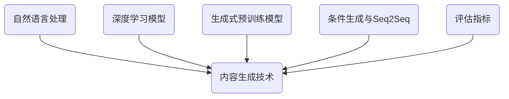

好的,我会严格遵守您提出的约束条件,以专业的技术语言写一篇关于"内容生成(Content Generation) - 原理与代码实例讲解"的深度博客文章。让我们开始吧!

# 内容生成(Content Generation) - 原理与代码实例讲解

## 1. 背景介绍

### 1.1 问题的由来

在当今信息时代,海量的数据和内容正以前所未有的速度被创建和传播。无论是社交媒体平台、新闻门户网站还是企业内部知识库,都需要持续不断地生成新的、高质量的内容来满足用户的需求。然而,手工创作内容是一个耗时耗力的过程,难以跟上内容需求的快速增长。因此,自动化内容生成(Content Generation)技术应运而生,旨在利用人工智能和自然语言处理等技术,自动化地生成高质量、多样化的内容。

### 1.2 研究现状  

近年来,自然语言处理(NLP)和深度学习技术的飞速发展为自动内容生成提供了强大的技术支持。诸如GPT(Generative Pre-trained Transformer)等大型语言模型展现出了令人惊叹的文本生成能力,能够生成看似人类水平的连贯、流畅的文本。同时,条件生成(Conditional Generation)、序列到序列(Seq2Seq)模型等技术也为内容生成提供了新的解决方案。

然而,现有技术仍然面临诸多挑战,例如生成内容的一致性、多样性、语义理解能力等,都有待进一步提高和改进。此外,如何将内容生成技术应用到实际场景中,并满足不同领域的特定需求,也是一个亟待解决的问题。

### 1.3 研究意义

自动内容生成技术的发展将为多个领域带来深远的影响:

- 新闻媒体和出版业:自动生成新闻报道、文学作品等,提高内容产出效率。
- 营销和广告业:生成个性化的营销文案、产品描述等,提升转化率。
- 客户服务和教育领域:自动回答常见问题,生成个性化学习资料等。
- 企业知识管理:自动生成技术文档、报告等,提高知识传播效率。

总的来说,自动内容生成技术有望极大地提高内容创作的效率,降低成本,并为各行业带来全新的发展机遇。

### 1.4 本文结构

本文将全面介绍内容生成的核心概念、算法原理、数学模型,并通过实际代码示例和应用场景分析,为读者提供一个深入的技术解析。文章主要包括以下几个部分:

1. 核心概念与联系
2. 核心算法原理与具体操作步骤  
3. 数学模型和公式详细讲解与案例分析
4. 项目实践:代码实例和详细解释
5. 实际应用场景分析
6. 工具和学习资源推荐
7. 总结:未来发展趋势与挑战
8. 附录:常见问题解答

## 2. 核心概念与联系

在深入探讨内容生成的算法和模型之前,我们需要先了解一些核心概念及其之间的关联。

### 2.1 自然语言处理(NLP)

自然语言处理(Natural Language Processing,NLP)是人工智能的一个分支,旨在使计算机能够理解和生成人类语言。NLP技术为内容生成奠定了基础,例如:

- 文本预处理:分词、词性标注、命名实体识别等
- 语义理解:词向量表示、主题模型等
- 语言生成:机器翻译、文本摘要、对话系统等

### 2.2 深度学习

深度学习(Deep Learning)是机器学习的一个新兴热点领域,其中的神经网络模型展现出了强大的特征学习和模式识别能力。在内容生成任务中,常用的深度学习模型包括:

- 循环神经网络(RNN)及其变体(LSTM、GRU)
- 卷积神经网络(CNN) 
- 注意力机制(Attention Mechanism)
- 变换器(Transformer)模型

这些模型能够从大量文本数据中自动提取特征,并生成新的文本序列。

### 2.3 生成式预训练模型

生成式预训练模型(Generative Pre-trained Models),例如GPT、BERT等,是近年来自然语言处理领域的一大突破。这些模型通过在大规模语料库上进行预训练,获得了极为丰富的语言知识,并可以通过微调(Fine-tuning)的方式应用到下游任务中,展现出了令人惊叹的性能表现。

对于内容生成任务,GPT等模型可以直接生成看似人类水平的连贯文本,是目前最先进的内容生成技术之一。

### 2.4 条件生成与序列到序列模型

条件生成(Conditional Generation)指的是根据给定的条件(如标题、提示词等)生成相应的文本内容。序列到序列(Sequence-to-Sequence,Seq2Seq)模型则是将输入序列(如文本)映射为输出序列(如另一种语言的文本)的一种广义模型框架。

这两种技术为内容生成提供了新的解决方案,使得模型能够根据特定的条件或上下文生成所需的内容,如标题生成、文本续写、机器翻译等。

### 2.5 评估指标

由于内容生成是一个开放性的生成任务,因此如何评估生成内容的质量是一个重要的课题。常用的评估指标包括:

- 困惑度(Perplexity):衡量模型对语言模型的拟合程度
- BLEU(Bilingual Evaluation Understudy):基于n-gram的指标,常用于机器翻译评估
- ROUGE(Recall-Oriented Understudy for Gisting Evaluation):基于n-gram覆盖率的指标,常用于文本摘要评估
- 人工评分:由人工评判生成内容的质量、连贯性、信息量等

除了这些量化指标外,人工评估也是内容生成质量评估的重要手段。

### 2.6 核心概念关联

上述核心概念相互关联、相辅相成,共同推动了内容生成技术的发展:

- NLP技术为内容生成提供了基础的语言处理能力
- 深度学习模型赋予了系统强大的特征学习和生成能力
- 生成式预训练模型带来了突破性的语言理解和生成性能
- 条件生成和Seq2Seq技术使得内容生成过程可控
- 评估指标为内容质量的衡量提供了标准和方法

只有将这些核心概念融会贯通,内容生成技术才能不断迭代和完善。

## 3. 核心算法原理与具体操作步骤

在了解了内容生成的核心概念后,我们来深入探讨其核心算法原理和具体操作步骤。

### 3.1 算法原理概述  

内容生成的核心算法原理可以概括为以下几个关键步骤:

1. **文本表示**:将原始文本转换为机器可以理解的数值表示形式,通常采用词向量(Word Embedding)或子词(Subword)表示。
2. **编码(Encoding)**:使用深度学习模型(如RNN、Transformer等)对输入文本进行编码,获取其语义表示。
3. **解码(Decoding)**:基于编码后的语义表示,通过解码器(Decoder)生成新的文本序列。
4. **条件信息融合**:对于条件生成任务,需要将条件信息(如标题、提示词等)融合到编码或解码的过程中。
5. **梯度更新**:通过最小化生成文本与参考文本之间的损失函数(如交叉熵损失),反向传播更新模型参数。

这一过程可以概括为"编码-解码"的 Seq2Seq 范式,是当前主流的内容生成算法框架。

### 3.2 算法步骤详解

下面我们对上述算法原理进行更加详细的解释和分析。

#### 3.2.1 文本表示

将原始文本转换为数值表示是内容生成算法的第一步。常用的文本表示方法包括:

1. **One-Hot编码**:将每个词映射为一个高维稀疏向量,维度等于词表大小。缺点是维度过高,无法捕捉词与词之间的语义关系。
2. **词向量(Word Embedding)**: 通过神经网络模型(如Word2Vec、GloVe等)将每个词映射为一个低维稠密向量,能够较好地捕捉词与词之间的语义关系。
3. **子词(Subword)表示**:由于存在未登录词(OOV)的问题,一种解决方案是将词拆分为字符级或子词级的组合(如Byte-Pair Encoding,BPE),然后对这些子词单元进行embedding。

通常情况下,我们倾向于采用词向量或子词表示,因为它们不仅能有效降低计算复杂度,而且能够很好地捕捉词与词之间的语义关联关系。

#### 3.2.2 编码(Encoding)

编码阶段的目标是将输入文本映射为语义表示,以捕捉其中蕴含的语义和上下文信息。常用的编码模型包括:

1. **循环神经网络(RNN)**:RNN及其变体(LSTM、GRU)可以有效地对序列数据进行建模,但存在梯度消失/爆炸的问题,难以捕捉长距离依赖关系。
2. **卷积神经网络(CNN)**: CNN能够有效地提取局部特征,但在捕捉长距离依赖关系方面表现一般。
3. **自注意力机制(Self-Attention)**: 自注意力机制通过计算每个词与其他词之间的相关性,能够直接捕捉长距离依赖关系,是Transformer模型的核心组件。

目前,基于自注意力机制的Transformer模型被广泛应用于编码阶段,展现出了优异的性能表现。

#### 3.2.3 解码(Decoding)

解码阶段的目标是根据编码后的语义表示,生成新的文本序列。常用的解码模型包括:

1. **贪婪搜索(Greedy Search)**: 在每个时间步,选择概率最大的单词作为输出。缺点是无法获得全局最优解。
2. **束搜索(Beam Search)**: 在每个时间步保留概率最大的 k 个候选序列,最终输出概率最大的序列。能够获得较优解,但计算代价较高。
3. **自回归(Autoregressive)**: 利用已生成的部分序列作为条件,预测下一个单词。常与Transformer模型结合使用。

除了上述基本解码策略外,还可以引入注意力机制、拷贝机制(Copy Mechanism)、上下文向量(Context Vector)等技术来提高解码质量。

#### 3.2.4 条件信息融合

对于条件生成任务(如标题生成、文本续写等),我们需要将条件信息(如标题、上文内容等)融合到编码或解码的过程中。常见的融合方式包括:

1. **条件编码(Conditional Encoding)**: 将条件信息与输入序列拼接,然后一起进行编码。
2. **初始状态融合(Initial State Fusion)**: 将条件信息编码为初始隐状态,并作为解码器的初始状态输入。
3. **注意力融合(Attention Fusion)**: 在解码过程中,通过注意力机制将条件信息融合到每个时间步的隐状态中。

不同的融合方式各有利弊,需要根据具体任务场景进行选择和调优。

#### 3.2.5 梯度更新

在完成文本生成后,我们需要定义损失函数(Loss Function)来衡量生成文本与参考文本之间的差异,常用的损失函数包括:

1. **交叉熵损失(Cross-Entropy Loss)**: 衡量生成序列与参考序列在每个时间步的差异,是最常用的损失函数。
2. **序列级别损失(Sequence-Level Loss)**: 直接衡量整个生成序列与参考序列之间的差异,如BLEU、ROUGE等。

通