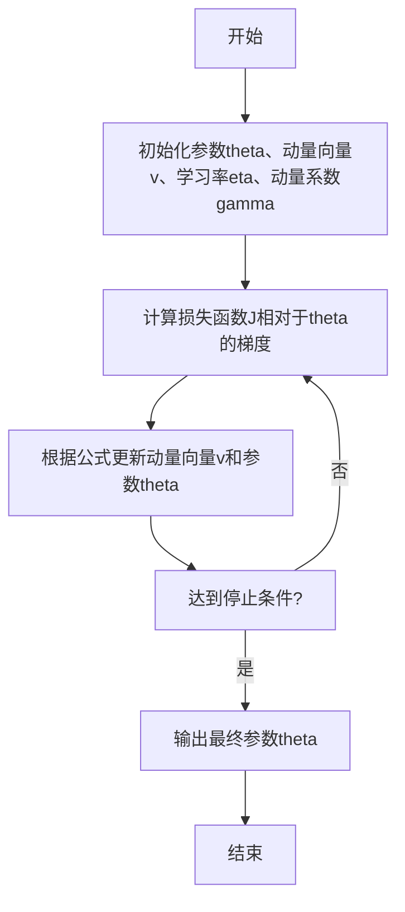

以下是题为《动量优化算法原理与代码实战案例讲解》的技术博客文章正文部分：

# 动量优化算法原理与代码实战案例讲解

## 1. 背景介绍

### 1.1 问题的由来

在机器学习和深度学习领域中,优化算法扮演着至关重要的角色。传统的优化算法如梯度下降(Gradient Descent)虽然简单有效,但在处理高维非凸优化问题时往往会陷入局部最优解,导致模型性能受限。为了解决这一问题,动量优化算法(Momentum Optimization Algorithms)应运而生。

### 1.2 研究现状  

动量优化算法的核心思想是在梯度更新过程中引入了"动量"(Momentum)项,使得参数在相关方向上累积更新值,从而更好地逃离局部最优解。目前,动量优化算法已广泛应用于深度学习、无约束优化、对抗生成网络等诸多领域,取得了卓越的性能表现。

### 1.3 研究意义

本文深入探讨动量优化算法的原理、数学模型以及实战案例,旨在为读者提供全面的理解和实践指导。通过掌握动量优化算法,可以显著提升机器学习模型的收敛速度和泛化性能,推动人工智能技术的发展。

### 1.4 本文结构

本文首先阐述动量优化算法的核心概念,并与其他优化算法进行对比分析。接下来详细介绍算法原理、数学模型推导以及具体实现步骤。在代码实战部分,提供完整的代码示例并进行逐行解读。最后探讨动量优化算法在实际应用中的场景,并对未来发展趋势和挑战进行展望。

## 2. 核心概念与联系

动量优化算法的核心思想是在梯度下降的基础上引入"动量"项,使得参数在相关方向上累积更新值,从而更好地逃离局部最优解。具体来说,动量项是指前一个时间步长的梯度更新值乘以一个动量系数。通过合理设置动量系数,可以平滑梯度更新过程,加快收敛速度。

与传统的梯度下降算法相比,动量优化算法具有以下优势:

1. **更快的收敛速度**:动量项可以加速参数在相关方向上的更新,从而提高算法的收敛速度。
2. **更好的泛化性能**:动量项有助于算法跳出局部最优解,找到更优的全局最优解,提升模型的泛化能力。
3. **更稳定的训练过程**:动量项可以平滑梯度更新过程,减少了由于梯度噪声导致的剧烈参数波动,使训练过程更加稳定。

目前,动量优化算法已广泛应用于深度学习、无约束优化、对抗生成网络等多个领域,展现出了优异的性能表现。

## 3. 核心算法原理 & 具体操作步骤  

### 3.1 算法原理概述

动量优化算法的核心思想是在梯度下降的基础上引入"动量"项,使得参数在相关方向上累积更新值。算法的更新规则可以表示为:

$$v_{t+1} = \gamma v_t + \eta \nabla_\theta J(\theta)$$
$$\theta_{t+1} = \theta_t - v_{t+1}$$

其中:
- $v_t$表示第t时刻的动量向量
- $\gamma$是动量系数,控制动量项对当前梯度更新的影响程度,一般取值在0.5~0.9之间
- $\eta$是学习率,控制梯度更新的步长
- $\nabla_\theta J(\theta)$是损失函数相对于参数$\theta$的梯度

从上述更新规则可以看出,动量优化算法在每一步的更新中不仅考虑了当前梯度方向,还融合了过去几步的梯度信息。这使得参数在相关方向上累积更新值,从而更容易逃离局部最优解,加快收敛速度。

动量优化算法的流程图如下所示:

### 3.2 算法步骤详解

1. **初始化**：初始化模型参数$\theta$、动量向量$v$、学习率$\eta$和动量系数$\gamma$。一般将$v$初始化为0向量。
2. **计算梯度**：计算损失函数$J$相对于参数$\theta$的梯度$\nabla_\theta J(\theta)$。
3. **更新动量向量**：根据公式$v_{t+1} = \gamma v_t + \eta \nabla_\theta J(\theta)$更新动量向量$v$。
4. **更新参数**：根据公式$\theta_{t+1} = \theta_t - v_{t+1}$更新参数$\theta$。
5. **重复步骤2~4**：重复执行步骤2~4,直到达到停止条件(如最大迭代次数或损失函数收敛)。
6. **输出结果**：输出最终的模型参数$\theta$。

需要注意的是,动量系数$\gamma$的设置对算法性能有重要影响。一般而言,$\gamma$的取值范围在0.5~0.9之间。较大的$\gamma$值会给予过去梯度更大的权重,有助于加快收敛速度,但可能会导致参数振荡;较小的$\gamma$值则会减小动量项的影响,收敛速度变慢。在实践中,通常需要根据具体问题对$\gamma$值进行调优。

### 3.3 算法优缺点

**优点**:

1. **加快收敛速度**:动量项有助于加快算法在相关方向上的收敛,从而提高优化效率。
2. **提高泛化性能**:动量项有助于算法跳出局部最优解,找到更优的全局最优解,提升模型的泛化能力。
3. **平滑训练过程**:动量项可以减小梯度噪声的影响,使得训练过程更加平稳。

**缺点**:

1. **超参数sensitiveness**:动量优化算法对超参数(如学习率、动量系数)比较敏感,需要进行调参。
2. **初始化影响较大**:不同的初始化方式可能导致算法收敛到不同的最优解。
3. **梯度爆炸问题**:在某些情况下,动量项可能会导致梯度值过大,引发梯度爆炸问题。

### 3.4 算法应用领域

动量优化算法广泛应用于以下领域:

- **深度学习**:用于训练深度神经网络模型,如卷积神经网络、递归神经网络等。
- **无约束优化**:求解高维非凸优化问题,如logistic回归、支持向量机等。
- **对抗生成网络**:训练生成对抗网络中的生成器和判别器模型。
- **强化学习**:训练强化学习智能体的策略网络。
- **自然语言处理**:训练文本分类、机器翻译等NLP模型。

## 4. 数学模型和公式 & 详细讲解 & 举例说明

### 4.1 数学模型构建

动量优化算法的数学模型基于梯度下降法,在每一步的梯度更新中引入了动量项。具体来说,设目标函数为$J(\theta)$,其中$\theta$为模型参数。传统梯度下降法的更新规则为:

$$\theta_{t+1} = \theta_t - \eta \nabla_\theta J(\theta_t)$$

其中$\eta$为学习率,控制梯度更新的步长。

动量优化算法在梯度更新中引入了动量向量$v_t$,更新规则变为:

$$v_{t+1} = \gamma v_t + \eta \nabla_\theta J(\theta_t)$$ 
$$\theta_{t+1} = \theta_t - v_{t+1}$$

可以看出,动量向量$v_{t+1}$是前一时刻动量$v_t$和当前梯度$\nabla_\theta J(\theta_t)$的加权和。其中,动量系数$\gamma \in [0,1)$控制了过去动量对当前更新的影响程度。当$\gamma=0$时,动量优化算法等价于普通梯度下降法。

### 4.2 公式推导过程

我们来推导一下动量优化算法更新规则的数学解释。首先定义:

$$g_t = \nabla_\theta J(\theta_t)$$

即$g_t$为第t步的梯度。则动量优化算法的更新规则可以表示为:

$$\begin{aligned}
v_{t+1} &= \gamma v_t + \eta g_t\\
\theta_{t+1} &= \theta_t - v_{t+1}\\
           &= \theta_t - \gamma v_t - \eta g_t\\
           &= \theta_t - \gamma(\theta_t - \theta_{t-1}) - \eta g_t\\
           &= (1+\gamma)\theta_t - \gamma\theta_{t-1} - \eta g_t
\end{aligned}$$

将$\theta_{t-1}$代入上式,我们可以得到:

$$\begin{aligned}
\theta_{t+1} &= (1+\gamma)\theta_t - \gamma[(1+\gamma)\theta_{t-1} - \gamma\theta_{t-2} - \eta g_{t-1}] - \eta g_t\\
            &= (1+\gamma)^2\theta_t - \gamma(1+\gamma)\theta_{t-1} + \gamma^2\theta_{t-2} - \eta(1+\gamma)g_t - \eta\gamma g_{t-1}
\end{aligned}$$

依次类推,我们可以得到动量优化算法的更一般形式:

$$\theta_{t+1} = \sum_{i=0}^t \gamma^i\theta_{t-i} - \eta\sum_{i=0}^t(1+\gamma)^i g_{t-i}$$

从上式可以看出,动量优化算法的参数更新不仅考虑了当前梯度,还融合了过去所有时刻的梯度信息,其中过去梯度的权重由动量系数$\gamma$控制。这使得算法在相关方向上累积更新值,从而更容易逃离局部最优解,加快收敛速度。

### 4.3 案例分析与讲解

为了更好地理解动量优化算法的原理,我们来分析一个具体的案例。假设我们需要优化一个二次函数:

$$J(\theta) = \theta^2$$

使用动量优化算法求解该函数的最小值。设置初始参数$\theta_0=5$,学习率$\eta=0.1$,动量系数$\gamma=0.9$。

**第1步**:初始化动量向量$v_0=0$,计算梯度$g_0=\nabla_\theta J(\theta_0)=2\theta_0=10$。

**第2步**:根据更新规则,计算$v_1$和$\theta_1$:
$$\begin{aligned}
v_1 &= \gamma v_0 + \eta g_0 = 0.9 \times 0 + 0.1 \times 10 = 1\\
\theta_1 &= \theta_0 - v_1 = 5 - 1 = 4
\end{aligned}$$

**第3步**:计算新的梯度$g_1=\nabla_\theta J(\theta_1)=2\theta_1=8$,更新$v_2$和$\theta_2$:
$$\begin{aligned}
v_2 &= \gamma v_1 + \eta g_1 = 0.9 \times 1 + 0.1 \times 8 = 1.7\\
\theta_2 &= \theta_1 - v_2 = 4 - 1.7 = 2.3
\end{aligned}$$

**第4步**:重复上述过程,直到算法收敛。下图展示了动量优化算法在该案例中的收敛过程:

从图中可以看出,动量优化算法在初始阶段由于动量项的作用,参数更新值较大,收敛速度较快;当接近最优解时,动量项的影响减小,算法收敛变得平缓。最终算法收敛到了全局最优解$\theta=0$。

相比之下,如果使用普通梯度下降法(即$\gamma=0$),收敛速度将大幅降低,如下图所示:

可以看出,动量优化算法在该