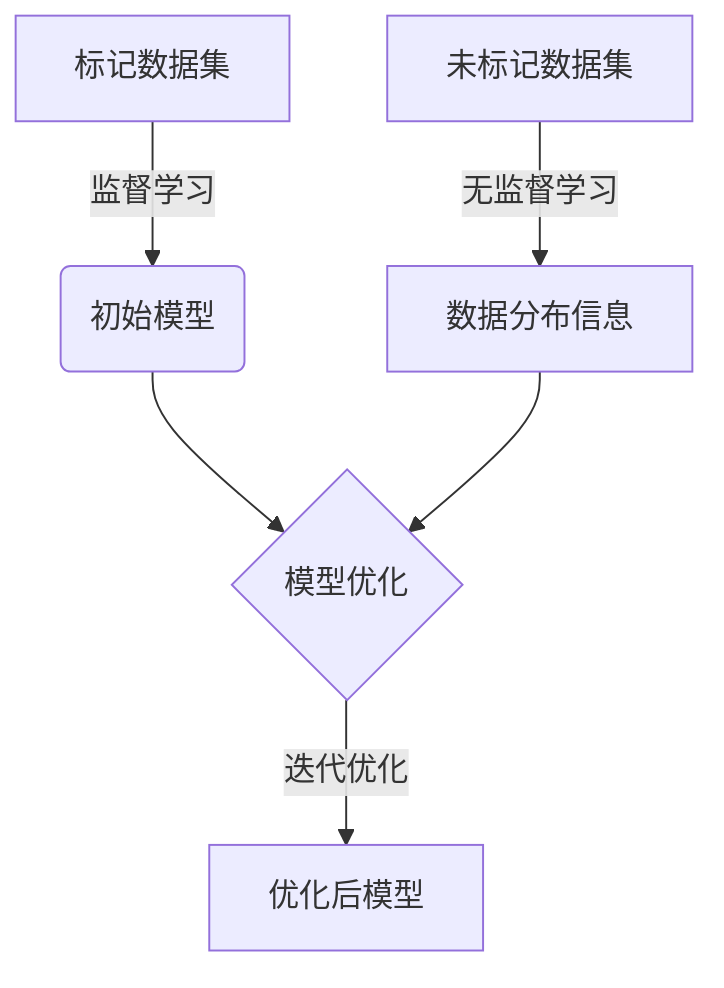
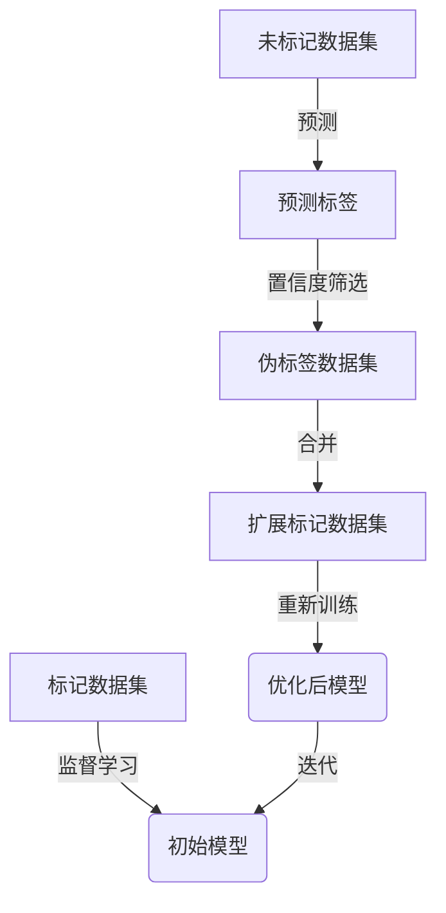

以下是关于"半监督学习(Semi-Supervised Learning) - 原理与代码实例讲解"的技术博客文章正文内容：

# 半监督学习(Semi-Supervised Learning) - 原理与代码实例讲解

## 1. 背景介绍

### 1.1 问题的由来

在现实世界中,我们经常面临着数据的稀缺性问题。获取大量高质量的标记数据通常是一项艰巨的任务,需要耗费大量的人力和财力。与此同时,未标记的数据却随处可得,只需很小的代价就能获取大量。那么,如何有效利用这些未标记的数据,结合少量的标记数据,来训练出性能良好的机器学习模型,就成为了一个值得探索的课题。

半监督学习(Semi-Supervised Learning)应运而生,它旨在同时利用标记数据和未标记数据进行模型训练,从而提高模型的泛化能力。相比于监督学习和无监督学习,半监督学习可以在标记数据较少的情况下,充分利用未标记数据中蕴含的信息,从而达到更好的学习效果。

### 1.2 研究现状  

半监督学习作为一种有效的机器学习范式,近年来受到了广泛的关注和研究。目前,半监督学习已经在多个领域取得了卓越的成果,如图像分类、自然语言处理、推荐系统等。不同的半监督学习算法也不断涌现,如生成对抗网络(GAN)、自训练(Self-Training)、共训练(Co-Training)等。

然而,半监督学习仍然面临着一些挑战,例如如何有效利用未标记数据、如何避免模型在训练过程中偏离正确的方向、如何处理异常数据等。因此,设计出更加鲁棒、高效的半监督学习算法,是当前研究的重点方向之一。

### 1.3 研究意义

半监督学习的研究具有重要的理论意义和应用价值:

- **理论意义**:半监督学习为机器学习提供了一种新的学习范式,它突破了传统监督学习和无监督学习的局限性,为我们探索数据本质特征提供了新的思路。研究半监督学习有助于我们深入理解机器学习的本质,推动机器学习理论的发展。

- **应用价值**:在现实世界中,获取大量高质量的标记数据通常是一项昂贵的工作。半监督学习可以充分利用未标记数据,降低数据标注的成本,从而在医疗、金融、安防等领域发挥重要作用。

### 1.4 本文结构

本文将全面介绍半监督学习的原理和实践。首先,我们将探讨半监督学习的核心概念和算法思想。接下来,详细阐述几种经典的半监督学习算法,包括自训练、共训练和生成对抗网络等。然后,我们将构建数学模型,并推导相关公式。此外,还将提供代码实例,帮助读者更好地理解和实践半监督学习。最后,我们将讨论半监督学习在实际应用中的场景,以及未来的发展趋势和挑战。

## 2. 核心概念与联系

半监督学习(Semi-Supervised Learning)是介于监督学习(Supervised Learning)和无监督学习(Unsupervised Learning)之间的一种机器学习范式。它旨在同时利用少量标记数据(Labeled Data)和大量未标记数据(Unlabeled Data)进行模型训练,从而提高模型的泛化能力。

在半监督学习中,我们通常将数据集划分为两部分:

- 标记数据集(Labeled Dataset): 包含了输入特征和对应的标签,用于监督学习。
- 未标记数据集(Unlabeled Dataset): 只包含输入特征,没有对应的标签,用于无监督学习。

半监督学习算法的目标是利用标记数据和未标记数据之间的相关性,从而学习出更加准确和鲁棒的模型。具体来说,半监督学习算法通常包括以下几个步骤:

1. **监督学习**:使用标记数据集进行初始模型训练,获得初始模型参数。
2. **无监督学习**:利用未标记数据集,通过无监督学习方法(如聚类、降维等)捕获数据的内在结构和分布信息。
3. **模型优化**:将监督学习和无监督学习的结果相结合,优化模型参数,使得模型在标记数据和未标记数据上的性能都得到提升。

半监督学习算法的关键在于如何有效地利用未标记数据,并将其与标记数据相结合,从而提高模型的泛化能力。不同的半监督学习算法采用了不同的策略,如自训练(Self-Training)、共训练(Co-Training)、生成对抗网络(Generative Adversarial Networks, GAN)等。

下面是半监督学习的一个简单流程图:

半监督学习与监督学习和无监督学习有着密切的联系:

- **与监督学习的关系**:半监督学习利用了标记数据进行初始模型训练,这一步骤与监督学习相同。
- **与无监督学习的关系**:半监督学习利用了未标记数据,通过无监督学习方法捕获数据的内在结构和分布信息,这一步骤与无监督学习相同。

半监督学习可以看作是监督学习和无监督学习的有机结合,它同时利用了标记数据和未标记数据,从而达到更好的学习效果。

## 3. 核心算法原理 & 具体操作步骤  

### 3.1 算法原理概述

半监督学习算法的核心思想是利用未标记数据的分布信息来辅助模型训练,从而提高模型的泛化能力。根据不同的策略,半监督学习算法可以分为以下几种主要类型:

1. **自训练(Self-Training)**:自训练算法首先使用标记数据训练一个初始模型,然后使用该模型对未标记数据进行预测,并将置信度最高的预测结果作为伪标签,将这些伪标签数据加入到标记数据集中,重新训练模型。该过程迭代进行,直到模型收敛或达到停止条件。

2. **共训练(Co-Training)**:共训练算法假设数据由两个或多个独立且冗余的特征子集描述,算法基于这些特征子集训练多个独立的学习器。每个学习器使用自己的特征子集和其他学习器标记的数据进行训练,然后将新标记的数据添加到其他学习器的训练集中。该过程迭代进行,直到所有学习器收敛。

3. **生成对抗网络(Generative Adversarial Networks, GAN)**:GAN由一个生成器(Generator)和一个判别器(Discriminator)组成。生成器的目标是生成与真实数据分布相似的样本,而判别器的目标是区分生成的样本和真实样本。通过生成器和判别器的对抗训练,GAN可以学习到数据的真实分布,从而辅助半监督学习任务。

4. **图正则化(Graph Regularization)**:图正则化算法将数据表示为一个图,其中节点表示数据样本,边表示样本之间的相似度。算法的目标是在标记数据和未标记数据之间传播标签信息,使得相似的样本具有相似的标签。

5. **基于聚类的半监督学习(Clustering-based Semi-Supervised Learning)**:这类算法首先对未标记数据进行聚类,然后将聚类结果作为辅助信息,与标记数据一起训练模型。

下面我们将详细介绍其中几种经典的半监督学习算法,包括自训练、共训练和生成对抗网络。

### 3.2 算法步骤详解

#### 3.2.1 自训练(Self-Training)算法

自训练算法是半监督学习中最简单和最直观的算法之一。它的基本思想是:首先使用标记数据训练一个初始模型,然后使用该模型对未标记数据进行预测,并将置信度最高的预测结果作为伪标签,将这些伪标签数据加入到标记数据集中,重新训练模型。该过程迭代进行,直到模型收敛或达到停止条件。

自训练算法的具体步骤如下:

1. 使用标记数据集 $D_L = \{(x_i, y_i)\}_{i=1}^{l}$ 训练一个初始模型 $f_\theta$,其中 $\theta$ 表示模型参数。
2. 使用训练好的模型 $f_\theta$ 对未标记数据集 $D_U = \{x_i\}_{i=1}^{u}$ 进行预测,获得预测标签 $\hat{y}_i = f_\theta(x_i)$。
3. 从预测结果中选择置信度最高的 $k$ 个样本,构建伪标记数据集 $D_P = \{(x_i, \hat{y}_i)\}_{i=1}^{k}$。
4. 将伪标记数据集 $D_P$ 与原始标记数据集 $D_L$ 合并,形成扩展的标记数据集 $D_E = D_L \cup D_P$。
5. 使用扩展的标记数据集 $D_E$ 重新训练模型,获得新的模型参数 $\theta'$。
6. 重复步骤 2-5,直到模型收敛或达到停止条件。

自训练算法的优点是简单易懂,易于实现。但它也存在一些缺陷,例如:

- 伪标签的质量对模型性能影响较大,如果初始模型质量较差,伪标签的质量也会较差,从而影响后续模型的训练。
- 算法容易陷入确认偏差(Confirmation Bias),即模型倾向于预测与自身已有知识相一致的标签,从而限制了模型的泛化能力。

为了解决这些问题,研究者提出了多种改进版本的自训练算法,如引入置信度阈值、样本选择策略、正则化技术等。

下面是自训练算法的流程图:

#### 3.2.2 共训练(Co-Training)算法

共训练算法是另一种经典的半监督学习算法,它假设数据由两个或多个独立且冗余的特征子集描述。算法基于这些特征子集训练多个独立的学习器,每个学习器使用自己的特征子集和其他学习器标记的数据进行训练,然后将新标记的数据添加到其他学习器的训练集中。该过程迭代进行,直到所有学习器收敛。

共训练算法的具体步骤如下:

1. 将特征空间划分为两个或多个独立且冗余的特征子集 $X_1, X_2, \dots, X_n$。
2. 对于每个特征子集 $X_i$,使用标记数据集 $D_L$ 中对应的特征训练一个初始学习器 $f_i$。
3. 使用每个学习器 $f_i$ 对未标记数据集 $D_U$ 进行预测,获得预测标签 $\hat{y}_i^j = f_i(x_j)$,其中 $j$ 表示样本索引。
4. 对于每个学习器 $f_i$,从其他学习器的预测结果中选择置信度最高的 $k$ 个样本,构建伪标记数据集 $D_P^i$。
5. 将伪标记数据集 $D_P^i$ 与原始标记数据集 $D_L$ 合并,形成扩展的标记数据集 $D_E^i$。
6. 使用扩展的标记数据集 $D_E^i$ 重新训练学习器 $f_i$。
7. 重复步骤 3-6,直到所有学习器收敛或达到停止条件。

共训练算法的优点是可以利用数据的多视角信息,提高模型的泛化能力。但它也存在一些限制,例如