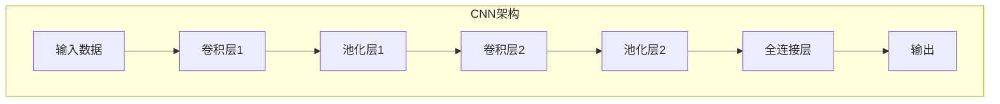

好的,我会按照您提供的要求和模板,尽最大努力为您撰写一篇高质量的技术博客文章。请稍等片刻,我需要一些时间来整理资料和构思内容。

# 卷积神经网络 (CNN) 原理与代码实例讲解

## 1. 背景介绍

### 1.1 问题的由来

在过去几十年中,人工智能领域取得了长足的进步,尤其是在计算机视觉和模式识别等领域。传统的机器学习算法如支持向量机、决策树等依赖于手工设计的特征提取,这些特征的质量直接决定了模型的性能上限。而深度学习则能够自动从原始数据中学习特征表示,极大地提高了模型的性能和泛化能力。

作为深度学习中的一个重要分支,卷积神经网络(Convolutional Neural Networks, CNN)在计算机视觉任务中表现出色,成为了解决图像分类、目标检测、语义分割等问题的主流方法。CNN灵感来源于生物学中视觉皮层的神经结构,能够有效地捕捉图像的局部模式和层次结构信息。

### 1.2 研究现状

早期的卷积神经网络可以追溯到20世纪80年代,如Kunihiko Fukushima提出的神经认知机(Neocognitron)。1998年,LeCun等人提出的LeNet-5网络在手写数字识别任务上取得了巨大成功,被认为是现代CNN的奠基之作。

2012年,Krizhevsky等人在ImageNet大规模视觉识别挑战赛中,使用深度卷积神经网络AlexNet取得了突破性的成绩,从而引发了深度学习在计算机视觉领域的热潮。随后,VGGNet、GoogleNet、ResNet等新型CNN架构不断被提出,在各种视觉任务中表现优异。

### 1.3 研究意义

CNN在计算机视觉领域的卓越表现,推动了人工智能技术在众多实际应用场景中的落地,如无人驾驶、机器人视觉、医学影像分析等,为人类社会的发展做出了重要贡献。

研究CNN的原理和实现细节,不仅能够帮助我们更好地理解和应用这一强大的技术,还可以为设计新型网络架构、优化训练策略等提供理论基础和技术支持。此外,CNN在视觉任务之外的其他领域(如自然语言处理、时间序列分析等)也展现出广阔的应用前景。

### 1.4 本文结构

本文将全面介绍卷积神经网络的核心概念、算法原理、数学模型、代码实现细节,以及在实际应用中的案例分析。内容安排如下:

- 第2部分阐述CNN的核心概念,如卷积操作、池化层等,并分析它们之间的联系。
- 第3部分详细讲解CNN的核心算法原理,包括前向传播和反向传播过程。
- 第4部分构建CNN的数学模型,推导公式并结合实例进行讲解。
- 第5部分提供CNN的代码实现细节,并对关键模块进行解读和分析。
- 第6部分介绍CNN在实际应用中的常见场景,并展望未来的发展方向。
- 第7部分总结CNN的研究现状,分析面临的挑战并对未来发展趋势进行展望。
- 第8部分列出常见问题并给出解答,以帮助读者更好地理解CNN。

## 2. 核心概念与联系

卷积神经网络(CNN)是一种前馈神经网络,它的灵感来源于生物学中视觉皮层的神经结构,专门用于处理具有网格拓朴结构(如图像)的数据。CNN由多个卷积层、池化层和全连接层组成,这些层按照一定的顺序堆叠在一起。

### 2.1 卷积层

卷积层(Convolutional Layer)是CNN的核心组成部分,它通过卷积操作在输入数据上提取局部特征。卷积操作的基本思想是,使用一个可学习的小窗口(称为卷积核或滤波器)在输入数据上滑动,对每个局部区域进行加权求和,得到新的特征映射。

卷积层的参数包括卷积核的权重和偏置。在训练过程中,这些参数会不断被优化,使得卷积核能够有效地捕捉输入数据中的重要特征。

### 2.2 池化层

池化层(Pooling Layer)通常在卷积层之后,对卷积层的输出进行下采样,减小特征图的维度。常用的池化操作有最大池化(Max Pooling)和平均池化(Average Pooling)。

池化层的作用包括:

1. 减小计算量,提高训练效率。
2. 实现一定程度的平移不变性,提高模型的鲁棒性。
3. 缓解过拟合问题。

### 2.3 全连接层

全连接层(Fully Connected Layer)是CNN的最后一个部分,它将前面卷积层和池化层提取的高级特征进行整合,并输出最终的分类或回归结果。

全连接层的每个神经元与前一层的所有神经元相连,因此参数量很大,计算开销也比较昂贵。在实际应用中,全连接层通常只占据CNN的一小部分。

### 2.4 激活函数

激活函数在CNN的各个层中都会使用,它引入了非线性,使得网络能够拟合更加复杂的函数。常用的激活函数包括ReLU(整流线性单元)、Sigmoid、Tanh等。

### 2.5 正则化

为了防止CNN过拟合,通常需要采用一些正则化技术,如L1/L2正则化、Dropout、BatchNormalization等。这些技术能够提高模型的泛化能力,从而在测试数据上获得更好的性能。

### 2.6 损失函数

CNN的训练目标是最小化一个损失函数(Loss Function),常用的损失函数包括交叉熵损失(用于分类任务)和均方误差损失(用于回归任务)。通过反向传播算法,可以计算出每个参数相对于损失函数的梯度,并使用优化算法(如SGD、Adam等)不断更新参数值。

## 3. 核心算法原理与具体操作步骤

### 3.1 算法原理概述

卷积神经网络的核心算法原理包括前向传播(Forward Propagation)和反向传播(Backward Propagation)两个过程。

**前向传播**是指将输入数据(如图像)传递到网络的各个层,经过卷积、池化等操作,最终得到输出结果(如分类概率)的过程。这个过程模拟了人类视觉皮层对图像信息的层层处理和抽象。

**反向传播**是指根据输出结果与真实标签之间的差异(即损失函数值),计算每个参数相对于损失函数的梯度,并通过优化算法(如梯度下降)不断更新参数值,使得损失函数值最小化的过程。这个过程实现了CNN的"学习"能力,使其能够从大量训练数据中自动获取有效的特征表示。

前向传播和反向传播在CNN的训练过程中交替进行,直到模型收敛或达到指定的迭代次数。在推理阶段,只需要执行前向传播过程即可得到最终的预测结果。

### 3.2 算法步骤详解

1. **前向传播过程**

   - 输入层: 将输入数据(如图像)传递到网络的第一层。
   - 卷积层: 对输入数据进行卷积操作,提取局部特征。
     - 卷积核在输入数据上滑动,对每个局部区域进行加权求和。
     - 通过多个卷积核可以提取不同的特征。
   - 激活层: 对卷积层的输出应用非线性激活函数(如ReLU),增加网络的表达能力。
   - 池化层: 对激活层的输出进行下采样,减小特征图的维度。
     - 常用的池化操作有最大池化和平均池化。
   - 重复上述步骤,构建多个卷积层和池化层,逐层提取更高级的特征。
   - 全连接层: 将前面层的高级特征进行整合,得到最终的输出(如分类概率)。

2. **反向传播过程**

   - 计算输出层与真实标签之间的损失函数值(如交叉熵损失)。
   - 根据链式法则,计算每个参数相对于损失函数的梯度。
     - 从输出层开始,逐层反向传播梯度。
     - 在每一层,计算该层参数的梯度。
   - 使用优化算法(如SGD、Adam等)更新每个参数的值。
     - 参数值 = 参数值 - 学习率 * 梯度
   - 重复上述步骤,直到模型收敛或达到指定的迭代次数。

### 3.3 算法优缺点

**优点:**

- 自动从原始数据中学习特征表示,无需人工设计特征。
- 具有一定的平移不变性和尺度不变性,能够有效捕捉图像的局部模式和层次结构信息。
- 通过权重共享机制,大大减少了网络参数的数量,降低了计算开销和存储需求。
- 在计算机视觉任务中表现出色,成为了解决图像分类、目标检测、语义分割等问题的主流方法。

**缺点:**

- 需要大量的训练数据和计算资源,训练过程耗时较长。
- 对于小尺寸的目标或高分辨率的图像,CNN的性能可能会受到影响。
- 对于序列数据(如自然语言、时间序列等)的处理能力相对较弱。
- 存在一些理论缺陷,如池化层导致的信息丢失、全连接层参数过多等。

### 3.4 算法应用领域

卷积神经网络在计算机视觉领域有着广泛的应用,包括但不限于:

- **图像分类**: 将图像分类到预定义的类别中,如物体识别、场景分类等。
- **目标检测**: 在图像中定位并识别出感兴趣的目标物体。
- **语义分割**: 对图像中的每个像素进行分类,实现像素级别的目标分割。
- **超分辨率重建**: 从低分辨率图像生成高分辨率图像。
- **图像描述**: 根据图像内容自动生成文本描述。
- **人脸识别**: 从图像或视频中识别出人脸及其身份信息。
- **医学影像分析**: 辅助医生诊断疾病,如癌症检测、病理分类等。
- **无人驾驶**: 实时检测和识别道路标志、行人、障碍物等。
- **机器人视觉**: 帮助机器人理解周围环境,实现导航、抓取等功能。

除了计算机视觉领域,CNN在自然语言处理、语音识别、时间序列预测等领域也展现出良好的潜力。

## 4. 数学模型和公式详细讲解举例说明

### 4.1 数学模型构建

为了更好地理解卷积神经网络的原理,我们需要构建其数学模型。CNN的核心操作包括卷积(Convolution)和池化(Pooling),下面将分别介绍它们的数学表达式。

#### 4.1.1 卷积操作

卷积操作的数学表达式如下:

$$
(I * K)(i, j) = \sum_{m} \sum_{n} I(i+m, j+n) K(m, n)
$$

其中:

- $I$表示输入数据(如图像)
- $K$表示卷积核(也称为滤波器)
- $i, j$表示输出特征图的坐标
- $m, n$表示卷积核的坐标

卷积操作的过程是,将卷积核在输入数据上滑动,对每个局部区域进行加权求和,得到新的特征映射。通过多个卷积核,可以提取不同的特征。

#### 4.1.2 池化操作

池化操作的数学表达式取决于具体的池化方式,如最大池化和平均池化。

**最大池化**的表达式为:

$$
\text{max\_pool}(X)_{i,j} =