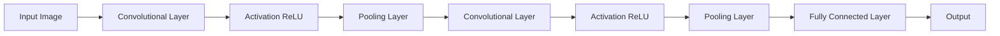

# 卷积神经网络CNN原理与代码实例讲解

关键词：卷积神经网络、深度学习、图像识别、特征提取、池化、全连接层

## 1. 背景介绍
### 1.1  问题的由来
随着人工智能技术的飞速发展,计算机视觉领域取得了令人瞩目的成就。其中,卷积神经网络(Convolutional Neural Network, CNN)作为一种深度学习算法,在图像分类、目标检测、语义分割等任务中表现出色,受到学术界和工业界的广泛关注。CNN通过局部感受野、权值共享等机制,能够自动学习图像中的层次化特征,极大地提升了视觉任务的性能。

### 1.2  研究现状
自从2012年AlexNet在ImageNet图像分类竞赛中大放异彩以来,CNN迅速成为计算机视觉的研究热点。各种CNN变体如VGGNet、GoogLeNet、ResNet等相继问世,不断刷新着图像识别的性能记录。同时,CNN也被应用到目标检测(如RCNN系列)、语义分割(如FCN、U-Net)、人脸识别等众多领域,展现出强大的特征表示能力和泛化性能。

### 1.3  研究意义
深入理解CNN的原理,掌握其代码实现,对于从事计算机视觉研究和应用开发的人员来说至关重要。一方面,我们可以在CNN已有成果的基础上,针对不同任务设计出更加高效、精准的网络结构。另一方面,对CNN内部机制的洞察也有助于我们分析其局限性,探索新的改进方向。总之,系统地学习CNN,将助力我们在人工智能时代抓住机遇,推动智能视觉技术的进步。

### 1.4  本文结构
本文将全面讲解CNN的原理与代码实现。第2节介绍CNN的核心概念。第3节阐述CNN的工作原理,包括卷积、池化、激活等操作。第4节建立CNN的数学模型,推导前向传播和反向传播公式。第5节给出基于Python和Pytorch的CNN代码实例。第6节讨论CNN在图像分类、目标检测等任务中的应用。第7节推荐相关学习资源。第8节总结全文,并展望CNN的发展趋势与挑战。

## 2. 核心概念与联系
CNN的核心概念包括:

- 卷积(Convolution):通过滑动窗口对图像局部区域进行特征提取,得到特征图(Feature Map)。
- 池化(Pooling):对特征图进行下采样,减小数据维度,提取主要特征。
- 激活函数(Activation Function):为网络引入非线性因素,增强模型的表达能力。常见的有ReLU、Sigmoid等。  
- 全连接层(Fully Connected Layer):对卷积和池化后的特征进行展平,送入传统的神经网络进行分类预测。

下图展示了CNN的基本架构,由若干卷积层、池化层、全连接层组成:

各层之间通过前向传播(Forward Propagation)依次计算,并用反向传播(Backpropagation)更新权重,实现端到端的训练学习。

## 3. 核心算法原理 & 具体操作步骤
### 3.1  算法原理概述
CNN通过模拟人类视觉系统的层次化认知过程,逐层提取图像特征。其核心是卷积操作,即用学习到的卷积核(Filter)对图像进行滑动窗口计算,得到表征局部特征的特征图。接着用池化缩小特征图尺寸,提取主要特征。多次卷积池化后,再用全连接层对高层特征进行分类。整个过程通过梯度下降等优化算法进行端到端学习。

### 3.2  算法步骤详解
以输入图像$\boldsymbol{X}$,卷积核$\boldsymbol{W}$,偏置项$\boldsymbol{b}$为例,CNN的前向传播如下:
1. 卷积层:用卷积核$\boldsymbol{W}$对图像$\boldsymbol{X}$进行滑动窗口卷积,得到特征图$\boldsymbol{F}$:
$$
\boldsymbol{F} = \boldsymbol{W} * \boldsymbol{X} + \boldsymbol{b}
$$

2. 激活层:对$\boldsymbol{F}$应用激活函数$f(\cdot)$(如ReLU),引入非线性:
$$
\boldsymbol{A} = f(\boldsymbol{F})
$$

3. 池化层:对$\boldsymbol{A}$进行下采样,减小数据维度。常用最大池化或平均池化:
$$
\boldsymbol{P} = \text{Pooling}(\boldsymbol{A})
$$

4. 重复步骤1-3,得到多个池化后的特征图。

5. 全连接层:将多个特征图展平为向量$\boldsymbol{x}$,送入全连接网络,输出预测结果$\boldsymbol{\hat{y}}$:
$$
\boldsymbol{\hat{y}} = \boldsymbol{W}_{fc}\boldsymbol{x} + \boldsymbol{b}_{fc}
$$

6. 计算损失函数$L(\boldsymbol{\hat{y}}, \boldsymbol{y})$,并通过反向传播更新各层权重,优化模型。

### 3.3  算法优缺点
优点:
- 局部连接和权值共享,大大减少了参数数量,降低了过拟合风险。
- 平移不变性,对同一目标在不同位置的识别鲁棒。
- 多层次结构,能够提取图像的层次化特征表示。

缺点:  
- 需要大量标注数据进行训练,对训练样本有较强依赖。
- 模型参数量大,训练时间长,对计算资源要求高。
- 端到端的黑盒学习,可解释性较差,难以分析推理过程。

### 3.4  算法应用领域
CNN在计算机视觉的众多任务中得到广泛应用,如:

- 图像分类:对图像的语义内容进行分类,如CIFAR-10、ImageNet等。
- 目标检测:检测图像中感兴趣的目标,并给出位置和类别,如RCNN系列算法。
- 语义分割:对图像中每个像素进行类别标注,如FCN、U-Net等。
- 人脸识别:识别图像中的人脸身份,如DeepFace、FaceNet等。

此外,CNN还被用于视频分析、医学影像、无人驾驶等诸多领域。

## 4. 数学模型和公式 & 详细讲解 & 举例说明
### 4.1  数学模型构建
考虑一个输入图像$\boldsymbol{X} \in \mathbb{R}^{H \times W \times C}$,其中$H$、$W$、$C$分别为图像的高度、宽度和通道数。令卷积核为$\boldsymbol{W} \in \mathbb{R}^{K \times K \times C}$,偏置项为$\boldsymbol{b} \in \mathbb{R}$,其中$K$为卷积核大小。定义步长为$S$,填充为$P$。

则卷积层输出的特征图$\boldsymbol{F} \in \mathbb{R}^{H' \times W' \times C'}$,其中:
$$
\begin{aligned}
H' &= \lfloor \frac{H + 2P - K}{S} \rfloor + 1 \\
W' &= \lfloor \frac{W + 2P - K}{S} \rfloor + 1 \\
C' &= \text{number of filters}
\end{aligned}
$$

特征图$\boldsymbol{F}$中的每个元素$\boldsymbol{F}_{i,j,c}$表示输入图像在位置$(i,j)$处的局部区域与第$c$个卷积核的卷积结果。

### 4.2  公式推导过程
对于特征图$\boldsymbol{F}$中的每个元素$\boldsymbol{F}_{i,j,c}$,其计算公式为:

$$
\boldsymbol{F}_{i,j,c} = \sum_{k=1}^{K} \sum_{l=1}^{K} \sum_{m=1}^{C} \boldsymbol{W}_{k,l,m,c} \cdot \boldsymbol{X}_{i+k-1,j+l-1,m} + \boldsymbol{b}_c
$$

其中,$\boldsymbol{W}_{k,l,m,c}$表示第$c$个卷积核在位置$(k,l)$处第$m$个通道上的权重,$\boldsymbol{b}_c$为第$c$个卷积核的偏置项。

接着,特征图$\boldsymbol{F}$通过激活函数$f(\cdot)$得到激活后的特征图$\boldsymbol{A}$:

$$
\boldsymbol{A}_{i,j,c} = f(\boldsymbol{F}_{i,j,c})
$$

常用的激活函数如ReLU:
$$
\text{ReLU}(x) = \max(0, x)
$$

然后,对激活后的特征图$\boldsymbol{A}$进行池化操作,得到池化后的特征图$\boldsymbol{P}$。以最大池化为例,假设池化核大小为$K_p \times K_p$,步长为$S_p$,则:

$$
\boldsymbol{P}_{i,j,c} = \max_{1 \leq k \leq K_p, 1 \leq l \leq K_p} \boldsymbol{A}_{S_p(i-1)+k, S_p(j-1)+l, c}
$$

最后,将多个池化后的特征图展平为向量$\boldsymbol{x}$,送入全连接层,得到输出$\boldsymbol{\hat{y}}$:

$$
\boldsymbol{\hat{y}} = \boldsymbol{W}_{fc}\boldsymbol{x} + \boldsymbol{b}_{fc}
$$

其中,$\boldsymbol{W}_{fc}$和$\boldsymbol{b}_{fc}$分别为全连接层的权重矩阵和偏置向量。

给定训练集$\{(\boldsymbol{X}_i, \boldsymbol{y}_i)\}_{i=1}^N$,CNN的训练目标是最小化损失函数:

$$
\min_{\boldsymbol{W},\boldsymbol{b}} \frac{1}{N} \sum_{i=1}^N L(\boldsymbol{\hat{y}}_i, \boldsymbol{y}_i) + \lambda R(\boldsymbol{W})
$$

其中,$L(\cdot)$为损失函数(如交叉熵),$R(\cdot)$为正则化项(如L2范数),$\lambda$为正则化系数。

### 4.3  案例分析与讲解
下面以一个简单的二分类任务为例,说明如何用CNN进行图像识别。假设输入图像大小为$28 \times 28$,只有一个通道。我们设计一个包含两个卷积层、两个池化层和两个全连接层的CNN。

第一个卷积层:
- 输入:$28 \times 28 \times 1$
- 卷积核:$5 \times 5$,共16个
- 步长:$S=1$,填充:$P=0$
- 输出:$24 \times 24 \times 16$

第一个池化层:  
- 输入:$24 \times 24 \times 16$
- 池化核:$2 \times 2$,步长:$S_p=2$
- 输出:$12 \times 12 \times 16$ 

第二个卷积层:
- 输入:$12 \times 12 \times 16$
- 卷积核:$3 \times 3$,共32个
- 步长:$S=1$,填充:$P=1$
- 输出:$12 \times 12 \times 32$

第二个池化层:
- 输入:$12 \times 12 \times 32$  
- 池化核:$2 \times 2$,步长:$S_p=2$
- 输出:$6 \times 6 \times 32$

将第二个池化层的输出展平,得到长度为$6 \times 6 \times 32=1152$的特征向量。接着送入两个全连接层:
- 第一个全连接层:1152 $\to$ 128
- 第二个全连接层(输出层):128 $\to$ 2

最后用Softmax函数将输出转化为概率分布,预测图像的类别。

在训练过程中,我们用小批量梯度下降法更新模型参数。前向传播计算预测输出,反向传播计算梯度,