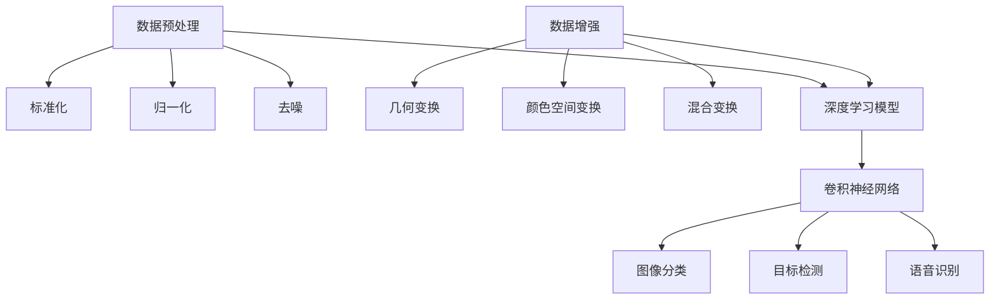

好的，我会按照您的要求，以"卷积神经网络的数据预处理与数据增强"为主题，撰写一篇专业的技术博客文章。文章将遵循逻辑清晰、结构紧凑、语言专业易懂的原则，并包含详细的理论解释、数学模型推导、代码实例分析和实践指导等内容。本文将为读者提供卷积神经网络数据预处理和数据增强的全面介绍和深入探讨。

# 卷积神经网络的数据预处理与数据增强

## 1. 背景介绍

### 1.1 问题的由来

在深度学习领域中，卷积神经网络(Convolutional Neural Networks, CNN)因其在计算机视觉、自然语言处理等领域的卓越表现而备受关注。然而,训练高质量的CNN模型需要大量的训练数据,而获取和标注这些数据通常是一项耗时且昂贵的过程。此外,即使拥有足够的训练数据,也可能存在数据分布不均衡、噪声干扰等问题,这些问题会导致模型过拟合或欠拟合,从而影响模型的泛化能力。

为了解决上述问题,数据预处理和数据增强技术应运而生。数据预处理旨在清理和标准化原始数据,消除噪声和异常值,使数据更加一致和规范。而数据增强则是通过对现有数据进行一系列变换(如旋转、平移、缩放等)来人为增加训练数据的多样性,从而提高模型的泛化能力。

### 1.2 研究现状

近年来,数据预处理和数据增强技术在深度学习领域得到了广泛的研究和应用。研究人员提出了多种预处理方法,如标准化、归一化、去噪等,以及多种数据增强策略,如几何变换、颜色空间变换、混合变换等。这些技术已被成功应用于各种任务,如图像分类、目标检测、语音识别等,显著提高了模型的性能。

然而,现有的数据预处理和数据增强技术仍存在一些局限性。例如,传统的数据增强方法通常是基于人工设计的规则,缺乏自适应性和智能性。另外,不同任务和数据集可能需要不同的预处理和增强策略,如何自动选择和优化这些策略仍是一个挑战。

### 1.3 研究意义

合理的数据预处理和数据增强对于训练高质量的CNN模型至关重要。有效的数据预处理可以消除噪声和异常值,提高数据质量,从而提高模型的准确性和稳定性。而恰当的数据增强则可以增加训练数据的多样性,缓解过拟合问题,提高模型的泛化能力。

本文将系统地介绍卷积神经网络的数据预处理和数据增强技术,包括理论基础、核心算法、数学模型推导、代码实现等内容。我们将探讨不同预处理和增强策略的优缺点,并提供实践指导和案例分析。同时,我们还将展望未来的发展趋势和挑战,为读者提供全面的理解和应用参考。

### 1.4 本文结构

本文的结构安排如下:

1. 背景介绍
2. 核心概念与联系
3. 核心算法原理与具体操作步骤
4. 数学模型和公式详细讲解与举例说明
5. 项目实践:代码实例和详细解释说明
6. 实际应用场景
7. 工具和资源推荐
8. 总结:未来发展趋势与挑战
9. 附录:常见问题与解答

## 2. 核心概念与联系

在深入探讨数据预处理和数据增强技术之前,我们需要先了解一些核心概念及它们之间的联系。



上图展示了数据预处理、数据增强、深度学习模型之间的关系。

- **数据预处理**是指对原始数据进行清理和标准化的过程,包括标准化、归一化、去噪等操作。这些操作可以消除噪声和异常值,提高数据质量,为后续的模型训练做好准备。
- **数据增强**则是通过对现有数据进行一系列变换(如几何变换、颜色空间变换、混合变换等)来人为增加训练数据的多样性,从而提高模型的泛化能力,缓解过拟合问题。
- **深度学习模型**是指基于深度神经网络的机器学习模型,如卷积神经网络(CNN)、循环神经网络(RNN)等。这些模型通过对大量训练数据进行学习,从而获得解决特定任务(如图像分类、目标检测、语音识别等)的能力。
- **卷积神经网络(CNN)**是一种深度前馈神经网络,通过卷积、池化等操作对输入数据(如图像)进行特征提取和模式识别,在计算机视觉领域表现出色。

数据预处理和数据增强技术为深度学习模型(特别是CNN)的训练提供了高质量和多样化的数据,从而提高了模型的性能和泛化能力。本文将重点介绍在CNN中应用的数据预处理和数据增强方法。

## 3. 核心算法原理与具体操作步骤

### 3.1 算法原理概述

在CNN中,数据预处理和数据增强通常分为以下几个步骤:

1. **数据读取和解码**:首先从文件系统或数据库中读取原始数据(如图像文件),并将其解码为内存中的张量表示。

2. **数据预处理**:对解码后的数据进行一系列预处理操作,如标准化、归一化、去噪等,以提高数据质量和一致性。

3. **数据增强**:对预处理后的数据应用一系列变换操作,如几何变换、颜色空间变换、混合变换等,以生成新的训练样本,增加数据多样性。

4. **批量化和混洗**:将增强后的数据组织成批次(batch),并对每个批次中的样本进行混洗(shuffle),以破坏数据的有序性,提高训练的稳定性和泛化能力。

5. **数据输入管道**:构建数据输入管道(data pipeline),将预处理和增强后的数据批次按序传递给CNN模型进行训练或推理。

这些步骤共同构成了CNN中数据预处理和数据增强的核心算法流程。下面我们将详细介绍每个步骤的具体操作。

### 3.2 算法步骤详解

#### 3.2.1 数据读取和解码

在这一步骤中,我们需要从文件系统或数据库中读取原始数据(如图像文件)。常见的数据格式包括JPEG、PNG、BMP等图像格式,以及TFRecord、HDF5等数据格式。

读取数据后,需要将其解码为内存中的张量表示。对于图像数据,通常需要将其解码为具有`[height, width, channels]`形状的张量,其中`channels`表示颜色通道数(如RGB图像的`channels=3`)。

以TensorFlow为例,我们可以使用`tf.io.decode_image`函数来解码图像文件:

```python
import tensorflow as tf

# 读取图像文件
image_bytes = tf.io.read_file(image_path)

# 解码图像
image_tensor = tf.io.decode_image(image_bytes, channels=3, dtype=tf.uint8)
```

解码后的张量将被传递给后续的预处理和增强步骤。

#### 3.2.2 数据预处理

数据预处理旨在清理和标准化原始数据,消除噪声和异常值,使数据更加一致和规范。常见的预处理操作包括:

1. **标准化(Normalization)**:将数据缩放到特定范围(如0到1或-1到1),以消除不同特征之间的量级差异。对于图像数据,通常需要将像素值从0到255的整数范围缩放到0到1的浮点范围。

   ```python
   # 标准化图像像素值
   image_tensor = tf.cast(image_tensor, tf.float32) / 255.0
   ```

2. **归一化(Standardization)**:将数据转换为均值为0、标准差为1的标准正态分布,以消除不同特征之间的统计差异。对于图像数据,可以计算整个数据集的像素均值和标准差,然后对每个图像进行归一化。

   ```python
   # 计算数据集的像素均值和标准差
   dataset_mean, dataset_std = compute_dataset_stats(dataset)

   # 归一化图像
   image_tensor = (image_tensor - dataset_mean) / dataset_std
   ```

3. **去噪(Denoising)**:消除图像中的噪声和artifact,以提高图像质量。常见的去噪方法包括高斯滤波、中值滤波等。

   ```python
   # 使用高斯滤波去噪
   image_tensor = tf.nn.depthwise_conv2d(image_tensor, gaussian_kernel, ...)
   ```

4. **数据增强(Data Augmentation)**:我们将在下一节详细介绍数据增强技术。

经过预处理后,数据的质量和一致性将得到显著提高,为后续的模型训练做好准备。

#### 3.2.3 数据增强

数据增强是通过对现有数据进行一系列变换操作,生成新的训练样本,从而增加数据多样性,提高模型的泛化能力。常见的数据增强操作包括:

1. **几何变换**:包括旋转、平移、缩放、翻转等操作,可以增加图像的方向和尺度多样性。

   ```python
   # 随机旋转图像
   image_tensor = tfa.image.rotate(image_tensor, angles)

   # 随机平移图像
   image_tensor = tfa.image.translate_xyz(image_tensor, translations)
   ```

2. **颜色空间变换**:包括亮度调整、对比度调整、色彩抖动等操作,可以增加图像的光照和颜色多样性。

   ```python
   # 调整图像亮度
   image_tensor = tf.image.adjust_brightness(image_tensor, delta)

   # 调整图像对比度
   image_tensor = tf.image.adjust_contrast(image_tensor, contrast_factor)
   ```

3. **混合变换**:将多种变换操作组合在一起,生成更加丰富的训练样本。常见的混合变换包括CutMix、MixUp、AugMix等。

   ```python
   # 应用CutMix变换
   image_tensor, label_tensor = augmentation.cutmix(image_tensor, label_tensor)
   ```

4. **随机遮挡(Random Erasing)**:在图像上随机遮挡部分区域,模拟遮挡和occlusion情况,增强模型的鲁棒性。

   ```python
   # 应用随机遮挡
   image_tensor = augmentation.random_erasing(image_tensor)
   ```

通过上述变换操作,我们可以从有限的原始数据中生成大量新的训练样本,增加数据的多样性,从而提高模型的泛化能力,缓解过拟合问题。

#### 3.2.4 批量化和混洗

在将增强后的数据输入CNN模型之前,我们通常需要将其组织成批次(batch),并对每个批次中的样本进行混洗(shuffle),以破坏数据的有序性,提高训练的稳定性和泛化能力。

批量化可以通过`tf.data.Dataset.batch`操作实现:

```python
# 构建数据集
dataset = tf.data.Dataset.from_tensor_slices((images, labels))

# 批量化
batched_dataset = dataset.batch(batch_size)
```

混洗可以通过`tf.data.Dataset.shuffle`操作实现:

```python
# 混洗
shuffled_dataset = batched_dataset.shuffle(buffer_size)
```

其中,`buffer_size`参数控制了混洗缓冲区的大小,通常设置为批次数量的倍数。

#### 3.2.5 数据输入管道

最后,我们需要构建数据输入管道(data pipeline),将预处理和增强后的数据批次按序传递给CNN模型进行训练或推理。

在TensorFlow中,我们可以使用`tf.data.Dataset`API构建高效的数据输入管道:

```python
# 构建数据集
dataset = tf.data.Dataset.from_tensor_slices((images, labels))

# 应