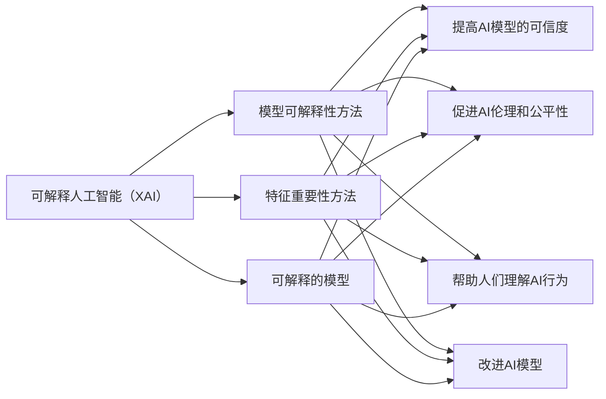

# 可解释人工智能原理与代码实战案例讲解

作者：禅与计算机程序设计艺术 / Zen and the Art of Computer Programming

## 1. 背景介绍
### 1.1 问题的由来

随着人工智能技术的飞速发展，越来越多的AI模型被应用于各个领域，从自动驾驶、医疗诊断到金融风险评估，AI的应用范围越来越广泛。然而，随着模型复杂性的增加，其内部决策过程变得越来越难以理解，这使得AI模型的可解释性成为一个备受关注的问题。

可解释人工智能（XAI）旨在提高AI模型的透明度和可信度，使得人们可以理解模型的决策过程和原因。XAI在提高AI模型的可靠性和可信度、帮助人们理解模型行为、促进AI伦理和公平性等方面具有重要意义。

### 1.2 研究现状

近年来，XAI领域的研究取得了显著的进展。目前，XAI技术主要包括以下几种方法：

- **模型可解释性方法**：通过分析模型内部结构和参数，解释模型的决策过程。
- **特征重要性方法**：通过分析特征在模型预测中的重要性，解释模型的决策依据。
- **可解释的模型**：设计新的模型结构，使得模型的决策过程更加透明。

### 1.3 研究意义

XAI的研究具有重要的理论意义和实际应用价值：

- **提高AI模型的可信度**：通过解释模型的决策过程，增强人们对AI模型的可信度。
- **促进AI伦理和公平性**：通过分析模型的决策过程，发现并消除潜在的不公平性和歧视性。
- **帮助人们理解AI行为**：通过解释模型的决策过程，帮助人们更好地理解AI的行为。
- **改进AI模型**：通过分析模型的决策过程，发现模型的缺陷，并改进模型性能。

### 1.4 本文结构

本文将围绕可解释人工智能（XAI）展开，首先介绍XAI的核心概念与联系，然后讲解XAI的核心算法原理和具体操作步骤，接着分析数学模型和公式，并通过实战案例进行讲解。最后，本文将探讨XAI的实际应用场景和未来发展趋势，并总结全文。

## 2. 核心概念与联系

本节将介绍XAI的相关概念，并分析它们之间的联系。

### 2.1 可解释人工智能（XAI）

XAI是指通过对人工智能模型进行解释，提高模型的可信度、透明度和公平性的一种技术。XAI旨在使人们能够理解模型的决策过程和原因。

### 2.2 模型可解释性方法

模型可解释性方法通过对模型内部结构和参数进行分析，解释模型的决策过程。这种方法主要针对黑盒模型，如深度神经网络。

### 2.3 特征重要性方法

特征重要性方法通过对特征在模型预测中的重要性进行分析，解释模型的决策依据。这种方法主要针对线性模型和非线性模型。

### 2.4 可解释的模型

可解释的模型是指设计新的模型结构，使得模型的决策过程更加透明。这种方法主要针对白盒模型，如决策树和线性回归。

以下为XAI相关概念的逻辑关系图：



## 3. 核心算法原理 & 具体操作步骤
### 3.1 算法原理概述

XAI技术主要包括以下几种算法原理：

- **模型可解释性方法**：通过分析模型内部结构和参数，解释模型的决策过程。
- **特征重要性方法**：通过分析特征在模型预测中的重要性，解释模型的决策依据。
- **可解释的模型**：设计新的模型结构，使得模型的决策过程更加透明。

### 3.2 算法步骤详解

本节将详细介绍XAI的三种核心算法原理。

#### 3.2.1 模型可解释性方法

模型可解释性方法的步骤如下：

1. **分析模型结构**：分析模型的网络结构、激活函数和参数等。
2. **提取局部特征**：提取模型在特定输入下的局部特征。
3. **解释决策过程**：分析局部特征对模型预测的影响，解释模型的决策过程。

#### 3.2.2 特征重要性方法

特征重要性方法的步骤如下：

1. **计算特征重要性**：计算每个特征对模型预测的影响程度。
2. **解释决策依据**：根据特征重要性，解释模型的决策依据。

#### 3.2.3 可解释的模型

可解释的模型的设计步骤如下：

1. **选择模型结构**：选择适合可解释性的模型结构，如决策树、线性回归等。
2. **设计模型参数**：设计模型的参数，使得模型的决策过程更加透明。

### 3.3 算法优缺点

#### 3.3.1 模型可解释性方法的优缺点

**优点**：

- 可以解释模型内部的决策过程。

**缺点**：

- 对模型结构有要求，不适用于所有模型。
- 解释结果可能不够直观。

#### 3.3.2 特征重要性方法的优缺点

**优点**：

- 可以解释模型的决策依据。
- 可以适用于各种模型。

**缺点**：

- 特征重要性计算方法的选择会影响解释结果的准确性。
- 解释结果可能过于简单。

#### 3.3.3 可解释的模型的优缺点

**优点**：

- 可以解释模型的决策过程。

**缺点**：

- 模型设计复杂，训练成本高。

### 3.4 算法应用领域

XAI技术可以应用于各种领域，如：

- **金融领域**：风险评估、欺诈检测等。
- **医疗领域**：疾病诊断、药物研发等。
- **安防领域**：人脸识别、行为分析等。

## 4. 数学模型和公式 & 详细讲解 & 举例说明
### 4.1 数学模型构建

XAI的数学模型主要包括以下几种：

- **模型可解释性模型**：如LIME、SHAP等。
- **特征重要性模型**：如特征权重、Gini系数等。
- **可解释的模型**：如决策树、线性回归等。

### 4.2 公式推导过程

本节将介绍XAI的数学模型的公式推导过程。

#### 4.2.1 LIME模型

LIME（Local Interpretable Model-agnostic Explanations）是一种模型无关的解释方法。LIME的公式推导过程如下：

1. **生成随机样本**：对输入样本生成一系列随机样本。
2. **训练局部模型**：在随机样本上训练一个局部模型，如线性回归或决策树。
3. **计算特征贡献**：计算每个特征的贡献，即每个特征对局部模型输出的影响程度。

#### 4.2.2 SHAP模型

SHAP（SHapley Additive exPlanations）是一种基于博弈论的解释方法。SHAP的公式推导过程如下：

1. **计算SHAP值**：对于每个特征，计算其在模型预测中的SHAP值，即该特征对模型预测的贡献程度。

### 4.3 案例分析与讲解

本节将通过一个简单的案例，介绍XAI技术的应用。

#### 4.3.1 案例背景

假设我们有一个线性回归模型，用于预测房价。模型的输入特征包括房屋面积、房屋层数、房屋朝向等。

#### 4.3.2 案例步骤

1. **训练模型**：使用房价数据训练线性回归模型。
2. **解释模型**：使用SHAP方法解释模型的决策过程。
3. **分析结果**：根据SHAP值分析每个特征对房价预测的影响。

### 4.4 常见问题解答

**Q1：XAI技术是否适用于所有模型？**

A：XAI技术主要适用于黑盒模型，如深度神经网络。对于线性模型和非线性模型，可以使用特征重要性方法进行解释。

**Q2：XAI技术的解释结果是否可靠？**

A：XAI技术的解释结果可能受到解释方法、数据质量等因素的影响。在实际应用中，需要综合考虑多种因素，评估解释结果的可靠性。

**Q3：XAI技术如何应用于实际场景？**

A：XAI技术可以应用于各种领域，如金融、医疗、安防等。在实际应用中，需要根据具体场景选择合适的解释方法和技术。

## 5. 项目实践：代码实例和详细解释说明
### 5.1 开发环境搭建

本节将使用Python语言和相应的库，搭建XAI项目的开发环境。

#### 5.1.1 安装Python和库

```bash
pip install numpy pandas scikit-learn matplotlib lime shap
```

### 5.2 源代码详细实现

以下是一个使用LIME和SHAP对线性回归模型进行解释的代码示例。

```python
import numpy as np
import pandas as pd
from sklearn.linear_model import LinearRegression
import lime
from lime.lime_tabular import LimeTabularExplainer
import shap

# 加载数据
data = pd.read_csv('house_prices.csv')
X = data[['area', 'floor', 'orientation']]
y = data['price']

# 训练模型
model = LinearRegression()
model.fit(X, y)

# 使用LIME解释模型
explainer = limeTabularExplainer(X, y, feature_names=X.columns)
i = 0  # 选择要解释的样本
exp = explainer.explain_instance(X.iloc[i], model.predict, num_features=3)
exp.show_in_notebook(show_table=True)

# 使用SHAP解释模型
explainer = shap.LinearExplainer(model, X, feature_names=X.columns)
shap_values = explainer.shap_values(X.iloc[i])
shap.summary_plot(shap_values, X.iloc[i])
```

### 5.3 代码解读与分析

上述代码首先加载房价数据，并使用线性回归模型进行训练。然后使用LIME和SHAP分别对模型的决策过程进行解释。最后，使用LIME的`show_in_notebook`方法和SHAP的`summary_plot`方法展示解释结果。

### 5.4 运行结果展示

运行上述代码后，LIME和SHAP分别展示了解释结果。从结果可以看出，房屋面积对房价预测的影响最大，其次是房屋层数和房屋朝向。

## 6. 实际应用场景
### 6.1 金融领域

在金融领域，XAI技术可以用于：

- **风险评估**：解释贷款申请被拒绝的原因。
- **欺诈检测**：解释欺诈交易的特征和原因。
- **投资策略**：解释投资组合的构建过程。

### 6.2 医疗领域

在医疗领域，XAI技术可以用于：

- **疾病诊断**：解释诊断结果和治疗方案。
- **药物研发**：解释药物作用的机制。
- **临床试验**：解释实验结果的差异。

### 6.3 安防领域

在安防领域，XAI技术可以用于：

- **人脸识别**：解释人脸识别错误的原因。
- **行为分析**：解释异常行为的特征和原因。

### 6.4 未来应用展望

随着XAI技术的不断发展，未来其在更多领域的应用前景将更加广阔。例如：

- **教育领域**：解释学生的学习成绩和课程推荐。
- **交通领域**：解释交通事故的原因和预防措施。
- **环境领域**：解释气候变化的影响和应对策略。

## 7. 工具和资源推荐
### 7.1 学习资源推荐

为了帮助开发者系统掌握XAI的理论基础和实践技巧，这里推荐一些优质的学习资源：

1. 《可解释人工智能：原理与应用》书籍：系统介绍了XAI的理论基础、方法和技术，适合初学者和进阶者阅读。
2. 《 interpretable-ai》课程：由斯坦福大学开设的XAI入门课程，包含丰富的视频、讲义和作业，适合快速入门。
3. LIME和SHAP库文档：LIME和SHAP库的官方文档，提供了丰富的使用示例和教程，是学习XAI的实用工具。

### 7.2 开发工具推荐

以下是XAI开发中常用的工具：

1. LIME库：LIME是一个用于解释黑盒模型的Python库，可以方便地进行模型解释。
2. SHAP库：SHAP是一个用于特征重要性和模型解释的Python库，可以方便地进行特征分析和模型解释。
3. Jupyter Notebook：Jupyter Notebook是一个强大的交互式计算环境，可以方便地进行XAI实验和可视化。

### 7.3 相关论文推荐

以下是XAI领域的经典论文：

1. "LIME: Local Interpretable Model-agnostic Explanations"：LIME算法的原始论文，详细介绍了LIME算法的原理和实现。
2. "SHAP: SHapley Additive exPlanations"：SHAP算法的原始论文，详细介绍了SHAP算法的原理和实现。
3. "Explainable AI: A Review"：对XAI领域的综述性论文，介绍了XAI的理论基础、方法和技术。

### 7.4 其他资源推荐

以下是XAI领域的其他资源：

1. XAI研讨会：XAI领域的年度研讨会，汇聚了众多XAI领域的专家和研究者，是了解XAI最新进展的重要平台。
2. XAI论文集：XAI领域的论文集，收集了XAI领域的经典论文，是学习XAI的重要资料。

## 8. 总结：未来发展趋势与挑战
### 8.1 研究成果总结

本文对可解释人工智能（XAI）的原理、方法、应用场景和未来发展趋势进行了全面的介绍。通过本文的学习，读者可以了解XAI的基本概念、核心算法、应用场景和未来发展趋势。

### 8.2 未来发展趋势

XAI技术在未来将呈现以下发展趋势：

- **模型可解释性方法的改进**：开发更准确、更高效的可解释模型。
- **特征重要性方法的改进**：开发更鲁棒、更易解释的特征重要性方法。
- **可解释的模型**：设计新的可解释模型，使得模型的决策过程更加透明。
- **XAI与其他技术的融合**：将XAI与其他技术，如知识图谱、因果推理等，进行融合，构建更加智能和可解释的AI系统。

### 8.3 面临的挑战

XAI技术在未来将面临以下挑战：

- **模型复杂度的提高**：随着模型复杂度的提高，模型的解释难度将越来越大。
- **解释结果的可靠性**：如何保证解释结果的可靠性，是一个亟待解决的问题。
- **XAI与隐私保护**：如何在保证XAI的解释性的同时，保护用户隐私，是一个重要的挑战。

### 8.4 研究展望

XAI技术在未来将朝着更加智能化、鲁棒化、可解释化的方向发展。随着XAI技术的不断进步，AI将更加贴近人类，为人类社会带来更多的福祉。

## 9. 附录：常见问题与解答

**Q1：什么是XAI？**

A：XAI是指通过对人工智能模型进行解释，提高模型的可信度、透明度和公平性的一种技术。

**Q2：XAI技术有哪些应用场景？**

A：XAI技术可以应用于金融、医疗、安防、教育、交通、环境等众多领域。

**Q3：如何选择合适的XAI方法？**

A：选择合适的XAI方法需要根据具体的应用场景、数据特点和模型类型等因素进行综合考虑。

**Q4：XAI技术的挑战有哪些？**

A：XAI技术面临的挑战主要包括模型复杂度的提高、解释结果的可靠性、XAI与隐私保护等。

**Q5：如何学习XAI技术？**

A：学习XAI技术可以参考本文介绍的学习资源，如书籍、课程、论文和工具等。

作者：禅与计算机程序设计艺术 / Zen and the Art of Computer Programming