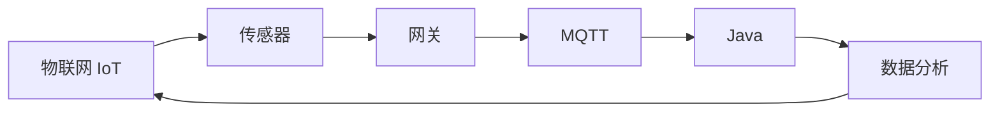

# 基于Java的智能家居设计：构建基于Java的智能环境监控系统

关键词：智能家居、Java、环境监控、物联网、传感器、数据分析

## 1. 背景介绍
### 1.1 问题的由来
随着科技的飞速发展和人们生活水平的不断提高,智能家居已经成为现代生活中不可或缺的一部分。人们对于家居环境的舒适性、安全性和便捷性提出了更高的要求。传统的家居环境监控方式已经无法满足人们日益增长的需求,因此,开发一套基于Java的智能环境监控系统成为了当前智能家居领域的重要课题。

### 1.2 研究现状
目前,国内外已经有许多关于智能家居环境监控的研究和应用。一些大型科技公司如苹果、三星、小米等都推出了自己的智能家居产品和解决方案。这些产品通过各种传感器实时采集家居环境数据,并利用云计算和大数据分析技术对数据进行处理和分析,从而实现对家居环境的智能化监控和管理。

在学术界,也有许多关于智能家居环境监控的研究成果发表。如文献[1]提出了一种基于ZigBee的无线传感器网络家居环境监控系统,该系统能够实时采集温度、湿度、烟雾等环境参数,并通过上位机实现数据的可视化和报警功能。文献[2]设计了一种基于物联网的智能家居系统,该系统采用MQTT协议实现了各个子系统之间的通信和数据交互,提高了系统的可扩展性和灵活性。

### 1.3 研究意义
开发一套基于Java的智能家居环境监控系统具有重要的理论意义和实际应用价值。首先,Java语言是当前应用最广泛的编程语言之一,具有跨平台、可移植、安全可靠等优点,非常适合用于开发复杂的物联网应用。其次,智能环境监控是智能家居的核心功能之一,通过对室内环境进行实时监测和分析,可以及时发现和处理各种安全隐患,提高居住环境的舒适性和健康性。最后,本研究可以为后续的智能家居系统开发提供重要的理论基础和实践经验,推动智能家居技术的发展和普及。

### 1.4 本文结构
本文主要分为以下几个部分：第一部分介绍智能家居环境监控的研究背景和意义；第二部分阐述系统设计中涉及的核心概念；第三部分详细介绍系统的架构设计和核心算法原理；第四部分建立系统的数学模型,并进行案例分析；第五部分给出系统的代码实现和运行结果；第六部分分析系统的实际应用场景；第七部分推荐相关的工具和资源；第八部分总结全文,展望未来的发展方向。

## 2. 核心概念与联系
在智能家居环境监控系统中,涉及到以下几个核心概念：

1. 物联网(IoT)：通过射频识别、红外感应器、全球定位系统、激光扫描器等信息传感设备,按约定的协议,把任何物品与互联网相连接,进行信息交换和通信,以实现智能化识别、定位、跟踪、监控和管理的一种网络概念。

2. 传感器：能够检测环境中的各种参数(如温度、湿度、光照、气体浓度等),并将其转换成电信号输出的一种装置。常用的传感器有温湿度传感器、光照传感器、烟雾传感器等。

3. 网关：用于连接不同网络的设备,实现不同协议之间的转换。在智能家居系统中,网关通常用于连接各种传感器设备和互联网,实现数据的采集和上传。

4. MQTT：一种基于发布/订阅模式的轻量级通讯协议,可以用极少的代码和带宽为联网设备提供实时可靠的消息服务。MQTT广泛应用于物联网数据传输领域。

5. Java：一种面向对象的编程语言,具有平台无关性、安全性、健壮性等特点,在企业级应用开发中占据重要地位。Java提供了丰富的类库和框架,可以方便地进行网络通信、数据库操作、并发编程等任务。

6. 数据分析：对采集到的海量传感器数据进行处理、分析和挖掘,发现其中隐藏的规律和趋势,为智能决策提供支持。常用的数据分析方法有统计分析、机器学习、数据挖掘等。

这些核心概念之间紧密关联,共同构成了智能家居环境监控系统的基础。物联网技术为家居设备的互联互通提供了基础设施,传感器负责采集家居环境数据,网关将传感器数据上传至云端,MQTT协议为设备之间的通信提供了高效可靠的数据传输通道,Java语言为系统的开发实现提供了强大的类库和框架支持,数据分析则从海量数据中提炼出有价值的信息,用于优化家居环境,提高居住体验。

下图展示了智能家居环境监控系统的核心概念之间的联系:

## 3. 核心算法原理 & 具体操作步骤
### 3.1 算法原理概述
智能家居环境监控系统的核心是数据分析算法,通过对采集到的环境数据进行分析,可以实现以下功能：
1. 异常检测：通过分析传感器数据的变化趋势,可以及时发现环境参数的异常变化,如温度骤升、湿度骤降、有害气体浓度超标等,并及时预警。
2. 模式识别：通过分析用户的行为模式,如起床时间、睡眠时间、电器使用规律等,可以自动化地控制家电设备,提供个性化的服务。
3. 能耗优化：通过分析用电量数据,识别出待机能耗大的设备,提醒用户及时关闭,或者通过智能控制实现设备的自动休眠,从而达到节能降耗的目的。

本系统采用了基于规则的异常检测算法和基于卡尔曼滤波的数据预测算法。

### 3.2 算法步骤详解
1. 基于规则的异常检测算法
- 步骤1：设定环境参数的正常范围,如温度在18~30℃之间,湿度在30%~70%之间等。
- 步骤2：实时采集传感器数据,将其与预设的阈值进行比较。
- 步骤3：如果数据超出正常范围,则触发报警,并记录异常数据。
- 步骤4：连续多次检测到异常数据,则判定为异常事件,发送报警信息到用户终端。

2. 基于卡尔曼滤波的数据预测算法
- 步骤1：建立系统状态方程和观测方程。状态方程描述了系统状态随时间的变化规律,观测方程描述了观测值与系统状态之间的关系。
- 步骤2：根据状态方程预测下一时刻的系统状态。
- 步骤3：根据观测方程计算当前时刻的观测值。
- 步骤4：利用卡尔曼增益,对预测值和观测值进行融合,得到当前时刻系统状态的最优估计。
- 步骤5：重复步骤2~4,不断迭代,实现系统状态的实时预测和更新。

### 3.3 算法优缺点
基于规则的异常检测算法的优点是简单易实现,检测效率高,但缺点是无法发现未知的异常模式,容易产生误报和漏报。

基于卡尔曼滤波的数据预测算法的优点是能够在存在观测噪声的情况下,对系统状态进行精确估计,预测精度高。但缺点是算法复杂度高,需要较强的计算能力,且需要准确的系统模型作为先验知识。

### 3.4 算法应用领域
异常检测算法和数据预测算法不仅可以用于智能家居环境监控,还可以应用于工业制造、设备故障诊断、金融风控等领域,具有广阔的应用前景。

## 4. 数学模型和公式 & 详细讲解 & 举例说明
### 4.1 数学模型构建
1. 异常检测模型
设定环境参数的正常范围为$[a,b]$,采集到的传感器数据为$x_i$,则异常检测模型可以表示为:

$y_i=\begin{cases}
0, & a\leq x_i\leq b\\
1, & x_i < a \text{ or } x_i > b
\end{cases}$

其中,$y_i=0$表示数据正常,$y_i=1$表示数据异常。

2. 卡尔曼滤波模型
设系统状态为$\mathbf{x}_k$,观测值为$\mathbf{z}_k$,则系统状态方程和观测方程可以表示为:

$$\mathbf{x}_k=\mathbf{A}_{k-1}\mathbf{x}_{k-1}+\mathbf{B}_{k-1}\mathbf{u}_{k-1}+\mathbf{w}_{k-1}$$

$$\mathbf{z}_k=\mathbf{H}_k\mathbf{x}_k+\mathbf{v}_k$$

其中,$\mathbf{A}_{k-1}$是状态转移矩阵,$\mathbf{B}_{k-1}$是控制输入矩阵,$\mathbf{u}_{k-1}$是控制输入,$\mathbf{w}_{k-1}$是过程噪声,$\mathbf{H}_k$是观测矩阵,$\mathbf{v}_k$是观测噪声。

卡尔曼滤波算法的核心是计算卡尔曼增益$\mathbf{K}_k$:

$$\mathbf{K}_k=\mathbf{P}_k^-\mathbf{H}_k^T(\mathbf{H}_k\mathbf{P}_k^-\mathbf{H}_k^T+\mathbf{R}_k)^{-1}$$

其中,$\mathbf{P}_k^-$是先验估计协方差矩阵,$\mathbf{R}_k$是观测噪声协方差矩阵。

### 4.2 公式推导过程
1. 异常检测模型
异常检测模型的公式推导过程比较简单,只需要根据预设的阈值判断数据是否异常即可。

2. 卡尔曼滤波模型
卡尔曼滤波算法的推导过程如下:

- 预测步骤:
$$\hat{\mathbf{x}}_k^-=\mathbf{A}_{k-1}\hat{\mathbf{x}}_{k-1}+\mathbf{B}_{k-1}\mathbf{u}_{k-1}$$
$$\mathbf{P}_k^-=\mathbf{A}_{k-1}\mathbf{P}_{k-1}\mathbf{A}_{k-1}^T+\mathbf{Q}_{k-1}$$

- 更新步骤:
$$\mathbf{K}_k=\mathbf{P}_k^-\mathbf{H}_k^T(\mathbf{H}_k\mathbf{P}_k^-\mathbf{H}_k^T+\mathbf{R}_k)^{-1}$$
$$\hat{\mathbf{x}}_k=\hat{\mathbf{x}}_k^-+\mathbf{K}_k(\mathbf{z}_k-\mathbf{H}_k\hat{\mathbf{x}}_k^-)$$
$$\mathbf{P}_k=(\mathbf{I}-\mathbf{K}_k\mathbf{H}_k)\mathbf{P}_k^-$$

其中,$\hat{\mathbf{x}}_k^-$是先验状态估计,$\hat{\mathbf{x}}_k$是后验状态估计,$\mathbf{Q}_{k-1}$是过程噪声协方差矩阵。

### 4.3 案例分析与讲解
下面以温度传感器数据为例,说明异常检测模型和卡尔曼滤波模型的应用。

假设温度传感器每分钟采集一次数据,正常温度范围为18~30℃。如果连续三次检测到温度超出正常范围,则判定为异常事件。

设第$k$个时间点采集到的温度数据为$x_k$,则异常检测过程如下:

$y_k=\begin{cases}
0, & 18\leq x_k\leq 30\\
1