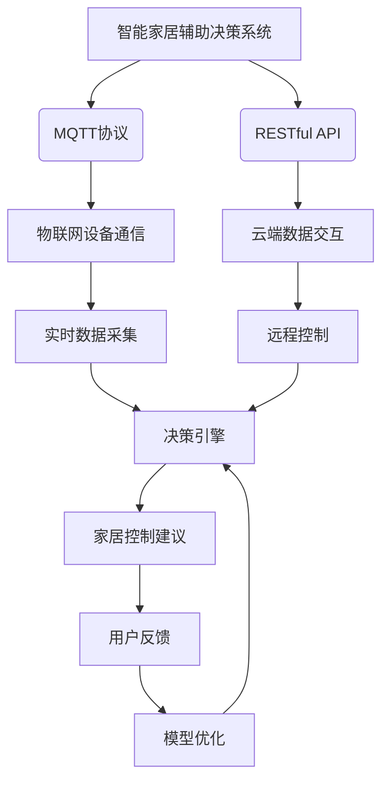

以下是基于您的要求，撰写的技术博客文章正文内容:

# 基于MQTT协议和RESTful API的智能家居辅助决策系统

## 1. 背景介绍

### 1.1 问题的由来

随着物联网技术的快速发展,智能家居系统逐渐走进了我们的生活。智能家居旨在通过互联网将家中的各种设备连接起来,实现对家居环境的自动化控制和远程管理,从而提高生活质量。然而,现有的智能家居系统大多只能被动地执行预设的操作,缺乏主动的决策能力。用户仍需手动操作才能实现所需的家居控制,这在很大程度上降低了系统的智能化水平和用户体验。

### 1.2 研究现状  

目前,已有一些研究致力于赋予智能家居系统一定的决策能力,以提高其自主性和智能化水平。其中,基于规则的决策系统是一种常见的方法,它通过预先定义一系列规则来指导系统的决策过程。但是,这种方法的灵活性和适应性较差,难以应对复杂的家居环境和用户需求的变化。

另一种方法是基于机器学习的决策系统,它可以从历史数据中自动学习决策模型,具有较强的适应性。然而,这种方法需要大量的训练数据,且模型的可解释性较差,给用户带来了"黑箱"的体验。

### 1.3 研究意义

本文提出了一种基于MQTT协议和RESTful API的智能家居辅助决策系统,旨在提高智能家居系统的决策能力和用户体验。该系统融合了规则引擎和机器学习模型,能够根据用户的偏好和家居环境的实时状态,为用户提供个性化的家居控制建议。同时,系统采用了MQTT协议和RESTful API,实现了设备与云端的高效通信和数据交互,确保了系统的实时性和可扩展性。

### 1.4 本文结构

本文首先介绍了系统的核心概念和整体架构,然后详细阐述了决策引擎的工作原理和算法流程。接下来,对系统的数学模型进行了推导和案例分析。之后,通过代码实例和实际应用场景,展示了系统的具体实现和应用前景。最后,对系统的发展趋势和面临的挑战进行了总结和展望。

## 2. 核心概念与联系

智能家居辅助决策系统的核心概念包括:

1. **MQTT协议**: 一种轻量级的发布/订阅式消息传输协议,用于实现物联网设备与系统之间的实时通信。
2. **RESTful API**: 一种基于HTTP协议的应用程序接口,用于实现云端系统与其他应用程序之间的数据交互。
3. **物联网设备通信**: 通过MQTT协议,系统可以实时采集家中各种传感器的数据,如温度、湿度、灯光等。
4. **云端数据交互**: 通过RESTful API,系统可以与云端的其他应用程序进行数据交换,如获取天气预报、用户偏好等信息。
5. **决策引擎**: 系统的核心部分,融合了规则引擎和机器学习模型,根据实时数据和用户偏好,为用户提供个性化的家居控制建议。
6. **家居控制建议**: 决策引擎的输出,包括对家中各种设备(如空调、灯光、窗帘等)的控制建议。
7. **用户反馈**: 用户对系统建议的反馈,将被用于优化决策模型。
8. **模型优化**: 根据用户反馈,系统会不断优化决策模型,提高决策的准确性和个性化程度。

这些核心概念相互关联、环环相扣,共同构建了一个高效、智能、可扩展的智能家居辅助决策系统。

## 3. 核心算法原理 & 具体操作步骤

### 3.1 算法原理概述

该系统的决策引擎采用了一种混合决策算法,融合了基于规则的决策和基于机器学习的决策,以充分发挥两者的优势。

1. **基于规则的决策**:

   系统预先定义了一系列规则,用于描述特定家居环境下的控制策略。这些规则由专家知识和用户偏好共同确定,具有较强的可解释性和可控性。

2. **基于机器学习的决策**:

   系统利用历史数据训练了一个机器学习模型,能够自动学习家居环境与控制策略之间的映射关系。该模型具有较强的适应性和泛化能力,可以处理复杂的决策场景。

在实际决策过程中,系统首先使用规则引擎进行初步决策,如果规则无法完全覆盖当前场景,则将剩余部分交由机器学习模型进行决策。最终,两部分决策结果将被融合,形成综合的家居控制建议。

### 3.2 算法步骤详解

该算法的具体步骤如下:

1. **数据采集**:通过MQTT协议,实时采集家中各种传感器的数据,如温度、湿度、灯光等。同时,通过RESTful API获取其他相关信息,如天气预报、用户偏好等。

2. **数据预处理**:对采集的原始数据进行清洗、标准化和特征提取等预处理,以满足后续决策模型的输入要求。

3. **规则匹配**:将预处理后的数据输入规则引擎,匹配预定义的规则,得到基于规则的初步决策结果。

4. **规则决策评估**:评估规则决策结果的覆盖率和置信度,确定是否需要机器学习模型的辅助决策。

5. **机器学习决策**:将未被规则覆盖的数据输入机器学习模型,得到基于模型的辅助决策结果。

6. **决策融合**:将规则决策和机器学习决策的结果进行融合,生成综合的家居控制建议。

7. **建议执行**:通过MQTT协议和RESTful API,将控制建议下发到相应的家居设备,执行家居控制操作。

8. **用户反馈收集**:收集用户对控制建议的反馈,如满意度评分、修改建议等。

9. **模型优化**:利用用户反馈数据,对规则库和机器学习模型进行优化,不断提高决策的准确性和个性化程度。

10. **循环迭代**:重复上述步骤,实现持续的数据采集、决策优化和控制调整。

### 3.3 算法优缺点

**优点**:

- 融合规则引擎和机器学习模型,结合了两者的优势,提高了决策的准确性和适应性。
- 规则引擎确保了决策的可解释性和可控性,机器学习模型提供了强大的泛化能力。
- 通过用户反馈优化,算法可以不断提高决策的个性化水平,更好地满足用户需求。
- 采用MQTT和RESTful API,保证了系统的实时性、可扩展性和开放性。

**缺点**:

- 算法的性能在一定程度上受到规则库和训练数据的限制,需要持续的知识积累和数据采集。
- 决策融合过程可能会引入一些不确定性,需要精心设计融合策略。
- 系统的部署和维护相对复杂,需要具备一定的技术基础。

### 3.4 算法应用领域

该算法不仅可以应用于智能家居领域,还可以推广到其他需要辅助决策的场景,如:

- 智能建筑控制
- 智能农业决策
- 智能交通管理
- 智能制造优化
- 医疗辅助诊断
- 金融风险决策

只要场景涉及复杂的决策过程,且存在一定的专家知识和历史数据,该算法就可以发挥作用,提供高效、智能的辅助决策支持。

## 4. 数学模型和公式 & 详细讲解 & 举例说明

### 4.1 数学模型构建

为了量化描述家居环境和控制策略之间的映射关系,我们构建了一个数学模型。假设家居环境可以用 $n$ 个特征 $\boldsymbol{x} = (x_1, x_2, \ldots, x_n)$ 来表示,其中 $x_i$ 可以是温度、湿度、光照等连续值,也可以是天气状况、用户在家等离散值。

对于 $m$ 种可能的控制策略 $\boldsymbol{y} = (y_1, y_2, \ldots, y_m)$,我们希望找到一个映射函数 $f$,使得:

$$
\boldsymbol{y} = f(\boldsymbol{x})
$$

其中,函数 $f$ 需要同时满足两个目标:

1. 符合预定义的规则集合 $\mathcal{R}$
2. 拟合历史数据 $\mathcal{D} = \{(\boldsymbol{x}_i, \boldsymbol{y}_i)\}_{i=1}^N$

为了实现这两个目标,我们将 $f$ 分解为两部分:

$$
f(\boldsymbol{x}) = g(\boldsymbol{x}) + h(\boldsymbol{x})
$$

其中,

- $g(\boldsymbol{x})$ 是基于规则的决策部分,它是一个离散函数,能够精确匹配规则集合 $\mathcal{R}$。
- $h(\boldsymbol{x})$ 是基于机器学习的决策部分,它是一个连续函数,能够拟合历史数据 $\mathcal{D}$。

### 4.2 公式推导过程

#### 4.2.1 规则决策部分

对于规则集合 $\mathcal{R} = \{r_1, r_2, \ldots, r_K\}$,每一条规则 $r_k$ 可以表示为:

$$
r_k: \text{IF } \boldsymbol{x} \in \mathcal{X}_k \text{ THEN } \boldsymbol{y} = \boldsymbol{y}_k
$$

其中,

- $\mathcal{X}_k$ 是规则 $r_k$ 的前提条件,描述了一个特征空间子集
- $\boldsymbol{y}_k$ 是规则 $r_k$ 的结论部分,描述了对应的控制策略

那么,规则决策部分 $g(\boldsymbol{x})$ 可以定义为:

$$
g(\boldsymbol{x}) = \begin{cases}
\boldsymbol{y}_k, & \text{if } \boldsymbol{x} \in \mathcal{X}_k\\
\boldsymbol{0}, & \text{otherwise}
\end{cases}
$$

#### 4.2.2 机器学习决策部分

对于机器学习决策部分 $h(\boldsymbol{x})$,我们可以使用一个参数化的函数 $\boldsymbol{\phi}(\boldsymbol{x}; \boldsymbol{\theta})$ 来拟合,其中 $\boldsymbol{\theta}$ 是待优化的参数。具体来说,我们希望最小化以下损失函数:

$$
\mathcal{L}(\boldsymbol{\theta}) = \sum_{i=1}^N \left\|\boldsymbol{y}_i - g(\boldsymbol{x}_i) - \boldsymbol{\phi}(\boldsymbol{x}_i; \boldsymbol{\theta})\right\|^2 + \Omega(\boldsymbol{\theta})
$$

其中,

- 第一项是数据拟合项,要求 $\boldsymbol{\phi}(\boldsymbol{x}_i; \boldsymbol{\theta})$ 能够拟合未被规则覆盖的残差 $\boldsymbol{y}_i - g(\boldsymbol{x}_i)$
- $\Omega(\boldsymbol{\theta})$ 是正则化项,用于控制模型复杂度,避免过拟合

通过优化算法(如梯度下降)求解上述损失函数,我们可以得到最优参数 $\boldsymbol{\theta}^*$,从而确定机器学习决策部分:

$$
h(\boldsymbol{x}) = \boldsymbol{\phi}(\boldsymbol{x}; \boldsymbol{\theta}^*)
$$

#### 4.2.