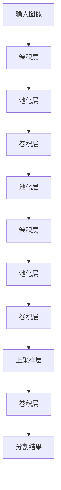

以下是基于卷积神经网络的医学图像分割的技术博客文章正文部分：

# 基于卷积神经网络的医学图像分割

## 1. 背景介绍

### 1.1 问题的由来

医学图像在临床诊断和治疗中扮演着非常重要的角色。准确的图像分割对于病灶检测、器官识别和手术规划等任务至关重要。然而,传统的基于手工特征提取的分割方法存在着一些局限性,例如需要大量的领域知识、对图像质量要求较高、分割精度有限等。近年来,随着深度学习技术的迅猛发展,基于卷积神经网络(Convolutional Neural Network, CNN)的医学图像分割方法逐渐受到广泛关注。

### 1.2 研究现状

CNN在计算机视觉领域取得了巨大成功,在图像分类、目标检测等任务上表现出色。受此启发,研究人员开始将CNN应用于医学图像分割任务。目前,基于CNN的医学图像分割方法主要分为两大类:基于编码器-解码器架构的全卷积网络(Fully Convolutional Network, FCN)和基于U-Net架构的网络。

FCN通过将传统CNN的全连接层替换为卷积层,使网络能够接受任意大小的输入图像,并输出与输入图像相同大小的分割结果。U-Net则是一种特殊的编码器-解码器架构,通过跨层连接实现了精细特征的传递,从而提高了分割精度。

### 1.3 研究意义

基于CNN的医学图像分割方法具有以下优势:

1. **自动化程度高**:CNN能够自动学习图像特征,无需手工设计特征提取算子,降低了人工参与程度。
2. **泛化能力强**:CNN具有强大的模式识别能力,能够从有限的训练数据中学习到有效的特征表示,从而在新的测试数据上获得良好的分割性能。
3. **分割精度高**:CNN能够捕捉图像的高级语义信息,提高了分割的精确性和鲁棒性。
4. **端到端训练**:CNN可以通过端到端的方式进行训练,简化了分割流程。

基于CNN的医学图像分割技术有望为临床诊疗带来革命性的变革,提高诊断效率和准确性,促进个性化医疗的发展。

### 1.4 本文结构

本文将全面介绍基于CNN的医学图像分割技术。首先阐述核心概念和基本原理,然后详细讲解核心算法和数学模型,并通过实际案例进行分析和讲解。接下来,介绍项目实践中的代码实现细节。最后,探讨实际应用场景、工具资源推荐,并对未来发展趋势和挑战进行展望。

## 2. 核心概念与联系

在深入探讨基于CNN的医学图像分割算法之前,我们先介绍一些核心概念和背景知识。

**卷积神经网络(CNN)**是一种前馈神经网络,其灵感来源于生物学上视觉皮层的神经结构,专门用于处理具有网格拓扑结构的数据,如图像数据。CNN由多个卷积层、池化层和全连接层组成,能够自动学习图像的层次特征表示。

**图像分割**是将图像划分为若干个具有相似特征的区域的过程,是计算机视觉和图像处理领域的一个基础性问题。医学图像分割的目标是从医学图像(如CT、MRI等)中准确分割出感兴趣的器官或病灶区域,为后续的诊断和治疗提供支持。

**全卷积网络(FCN)**是将CNN应用于语义分割任务的一种重要方法。与传统CNN不同,FCN将最后的全连接层替换为卷积层,使得网络能够接受任意大小的输入图像,并输出与输入图像相同大小的分割结果。

**U-Net**是一种特殊的编码器-解码器架构,专门设计用于医学图像分割任务。U-Net通过跨层连接实现了精细特征的传递,从而提高了分割精度,尤其擅长于分割小目标。

**数据增强**是一种常用的技术,通过对原始训练数据进行一系列变换(如旋转、平移、缩放等)来产生新的训练样本,从而扩大训练数据集的规模,提高模型的泛化能力。

**迁移学习**是一种将在源领域学习到的知识迁移到目标领域的技术,可以有效解决训练数据缺乏的问题。在医学图像分割任务中,常将在自然图像数据集上预训练的CNN模型迁移到医学图像数据集上进行微调。

上述概念相互关联、环环相扣,共同构建了基于CNN的医学图像分割技术体系。下一节将详细阐述其核心算法原理。

## 3. 核心算法原理 & 具体操作步骤

### 3.1 算法原理概述

基于CNN的医学图像分割算法的核心思想是:利用CNN的强大特征提取能力,从医学图像中自动学习到有效的特征表示,然后基于这些特征对图像进行像素级别的分类,从而实现对感兴趣区域的分割。

该算法的基本流程如下:

1. **数据预处理**:对原始医学图像进行标准化、归一化等预处理操作,以满足CNN的输入要求。
2. **CNN特征提取**:将预处理后的图像输入到CNN中,通过多个卷积层和池化层自动提取图像的层次特征。
3. **上采样和分类**:将CNN提取的高级特征通过上采样操作(如反卷积、反池化等)恢复到与原始图像相同的分辨率,然后对每个像素进行分类,得到分割结果。
4. **后处理**:对分割结果进行形态学操作、平滑滤波等后处理,以提高分割质量。

不同的CNN架构在具体实现细节上会有所差异,但总体思路是相似的。下面将重点介绍两种常用的CNN架构:FCN和U-Net。

### 3.2 算法步骤详解

#### 3.2.1 全卷积网络(FCN)

FCN是将CNN应用于语义分割任务的一种经典方法,由Jonathan Long等人于2015年提出。FCN的核心思想是将传统CNN的最后几个全连接层替换为卷积层,使得网络能够接受任意大小的输入图像,并输出与输入图像相同大小的分割结果。

FCN的基本架构如下所示:

FCN的具体步骤如下:

1. **编码器部分**:与传统CNN类似,FCN的前几层是卷积层和池化层,用于从输入图像中提取特征。
2. **解码器部分**:在编码器的最后一层特征图上,通过上采样操作(如反卷积、反池化等)将特征图恢复到与输入图像相同的分辨率。
3. **分类层**:对上采样后的特征图进行像素级别的分类,得到每个像素属于不同类别(如器官、病灶等)的概率分布。
4. **后处理**:对分类结果进行形态学操作、平滑滤波等后处理,以提高分割质量。

FCN的优点是结构简单、易于训练,缺点是由于直接对低分辨率特征图进行上采样,可能会导致分割结果缺乏细节和边缘信息。

#### 3.2.2 U-Net

U-Net是Olaf Ronneberger等人于2015年专门为医学图像分割任务设计的一种编码器-解码器架构。U-Net的核心思想是通过跨层连接实现了精细特征的传递,从而提高了分割精度,尤其擅长于分割小目标。

U-Net的基本架构如下所示:

```mermaid
graph TD
    Input[输入图像] --> Conv[卷积层]
    Conv --> Pool[池化层]
    Pool --> Conv2[卷积层]
    Conv2 --> Pool2[池化层]
    Pool2 --> Conv3[卷积层]
    Conv3 --> Pool3[池化层]
    Pool3 --> Conv4[卷积层]
    Conv4 --> Pool4[池化层]
    Pool4 --> Conv5[卷积层]
    Conv5 --> Upsampling[上采样层]
    Upsampling --> Concat[连接层]
    Concat --> Conv6[卷积层]
    Conv6 --> Upsampling2[上采样层]
    Upsampling2 --> Concat2[连接层]
    Concat2 --> Conv7[卷积层]
    Conv7 --> Upsampling3[上采样层]
    Upsampling3 --> Concat3[连接层]
    Concat3 --> Conv8[卷积层]
    Conv8 --> Upsampling4[上采样层]
    Upsampling4 --> Concat4[连接层]
    Concat4 --> Conv9[卷积层]
    Conv9 --> Output[分割结果]
```

U-Net的具体步骤如下:

1. **编码器部分**:与FCN类似,U-Net的编码器部分由卷积层和池化层组成,用于从输入图像中提取特征。
2. **解码器部分**:在解码器的每一层,将编码器对应层的特征图与上采样后的特征图进行连接(concatenate),以保留精细的特征信息。
3. **分类层**:对最后一层的特征图进行像素级别的分类,得到每个像素属于不同类别的概率分布。
4. **后处理**:对分类结果进行形态学操作、平滑滤波等后处理,以提高分割质量。

U-Net的优点是能够有效捕捉图像的上下文信息和细节特征,分割精度较高。缺点是网络结构相对复杂,训练时间较长。

### 3.3 算法优缺点

基于CNN的医学图像分割算法具有以下优点:

1. **自动化程度高**:CNN能够自动学习图像特征,无需手工设计特征提取算子,降低了人工参与程度。
2. **泛化能力强**:CNN具有强大的模式识别能力,能够从有限的训练数据中学习到有效的特征表示,从而在新的测试数据上获得良好的分割性能。
3. **分割精度高**:CNN能够捕捉图像的高级语义信息,提高了分割的精确性和鲁棒性。
4. **端到端训练**:CNN可以通过端到端的方式进行训练,简化了分割流程。

同时,该算法也存在一些不足之处:

1. **对训练数据依赖性强**:CNN需要大量高质量的标注数据进行训练,而医学图像数据的获取和标注往往是一个巨大的挑战。
2. **黑盒操作**:CNN的内部运作机理相对复杂,缺乏可解释性,难以满足医疗领域对可解释性的要求。
3. **计算资源需求高**:训练CNN模型通常需要大量的计算资源,对硬件设备的要求较高。
4. **过拟合风险**:CNN容易过拟合训练数据,需要采取有效的正则化策略。

### 3.4 算法应用领域

基于CNN的医学图像分割算法可以广泛应用于以下领域:

1. **器官分割**:准确分割出人体内部器官(如肝脏、肺部、心脏等),为后续的疾病诊断和手术规划提供支持。
2. **肿瘤分割**:自动分割出肿瘤区域,监测肿瘤的大小、位置和形状变化,指导临床治疗方案。
3. **血管分割**:分割出人体血管结构,用于心血管疾病的诊断和介入手术的规划。
4. **细胞分割**:分割出细胞及其核区域,用于细胞计数、形态分析等任务。
5. **皮肤病变分割**:分割出皮肤病变区域,辅助皮肤病的诊断和治疗。
6. **其他领域**:如骨骼分割、脑部分割、胎儿分割等。

总的来说,基于CNN的医学图像分割技术为临床诊疗带来了革命性的变革,提高了诊断效率和准确性,促进了个性化医