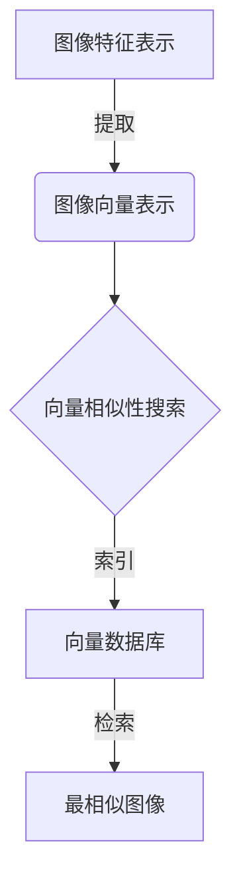

# 基于向量数据库的图像搜索技术进展

## 1. 背景介绍

### 1.1 问题的由来

在当今的数字时代,图像数据的产生和积累呈现出爆炸式增长。无论是个人照片、商业广告,还是安防监控视频,图像数据无处不在。然而,如何高效地管理和检索这些海量图像数据,一直是计算机视觉和多媒体信息检索领域的一大挑战。

传统的基于文本元数据(如标签、注释等)的图像检索方式,需要人工标注,成本高且效率低下。而基于内容的图像检索(CBIR)技术通过自动提取图像的视觉特征(如颜色、纹理、形状等),从而实现对图像的相似性匹配和检索,被认为是解决这一难题的有效途径。

### 1.2 研究现状  

近年来,benefiting from the rapid development of deep learning技术,基于深度卷积神经网络(CNN)的图像特征表示学习取得了长足进展,使得CBIR技术的性能得到了极大提升。然而,当数据集规模达到亿级或更高时,传统的向量相似性搜索方法(如基于树、哈希等索引结构)将面临可扩展性和效率的挑战。

为了解决大规模图像检索的难题,研究人员开始探索将先进的向量相似性搜索技术(如局部敏感哈希、向量乘积量化等)与图像特征表示相结合,从而构建高效的大规模图像检索系统。其中,基于向量数据库的图像检索技术逐渐成为研究的热点。

### 1.3 研究意义

基于向量数据库的图像检索技术,能够支持亿级或更高规模的图像数据集,在检索效率、可扩展性和准确性等方面具有显著优势。它不仅可以满足传统图像检索的需求,还能为新兴的计算机视觉应用(如视觉搜索、内容审核、版权保护等)提供强有力的技术支撑。

此外,向量数据库技术与深度学习技术的结合,为图像检索系统的性能优化、模型压缩和硬件加速等方面带来了新的机遇,有望推动图像检索技术的创新发展。

### 1.4 本文结构  

本文将全面介绍基于向量数据库的图像搜索技术的最新进展。我们将从核心概念和原理出发,深入探讨关键算法和数学模型,并结合实际应用场景和代码实例,为读者提供全景式的技术解析。最后,我们将总结该领域的发展趋势和挑战,并给出相关的学习资源推荐。

## 2. 核心概念与联系

基于向量数据库的图像搜索技术涉及多个核心概念,包括图像特征表示、向量相似性搜索和向量数据库等,它们之间存在紧密的联系。

1. **图像特征表示**:通过深度卷积神经网络等技术,可以将图像映射为高维的特征向量表示,这是进行相似性搜索的基础。
2. **向量相似性搜索**:针对高维向量数据,设计高效的相似性搜索算法,快速找到与查询向量最相似的向量集合。常用算法包括局部敏感哈希、向量乘积量化等。
3. **向量数据库**:一种专门存储和索引高维向量数据的数据库系统,支持高效的向量相似性查询操作。

上述三个核心概念环环相扣,共同构成了基于向量数据库的图像搜索技术的完整解决方案。图像首先被映射为高维特征向量,然后通过向量相似性搜索算法在向量数据库中快速检索出最相似的图像集合。

## 3. 核心算法原理 & 具体操作步骤  

### 3.1 算法原理概述

基于向量数据库的图像搜索技术的核心算法主要包括两个部分:向量相似性搜索算法和向量数据库索引算法。

**向量相似性搜索算法**的目标是在海量高维向量数据中,快速找到与给定查询向量最相似的 Top-K 个向量。常见的算法有:

1. **局部敏感哈希(LSH)**:通过设计多个哈希函数,将相似的向量映射到相同的哈希桶中,从而实现近似最近邻搜索。
2. **向量乘积量化(PQ)**:将高维向量分解为多个低维子向量,分别对每个子向量进行量化编码,从而提高搜索效率。
3. **层次导航小世界(HNSW)**:构建一种分层的近邻导航结构,通过有效的邻居选择策略实现高效的近似最近邻搜索。

**向量数据库索引算法**则侧重于如何在数据库系统中高效地存储和索引海量向量数据,以支持快速的向量相似性查询。常见的索引算法有:

1. **倒排索引(Inverted Index)**:将向量数据按照特定编码方式(如哈希编码)分组,构建倒排索引结构,支持快速的向量查找操作。
2. **矢量场(Vector Field)**:将向量数据直接存储在数据库中的特殊字段中,利用数据库的查询优化器实现高效的相似性搜索。
3. **近似最近邻索引(ANN Index)**:将向量相似性搜索算法(如 LSH、PQ 等)与数据库索引结构相结合,构建专门的近似最近邻索引。

上述算法通常需要结合具体的应用场景和数据特征,进行合理的参数调优和策略选择,以获得最佳的搜索性能。

### 3.2 算法步骤详解

以局部敏感哈希(LSH)算法为例,我们详细介绍其具体的操作步骤:

1. **构建 LSH 函数族**:首先需要设计一组局部敏感的哈希函数 $\{h_1, h_2, \dots, h_k\}$,使得相似的向量有较高的概率被映射到相同的哈希桶中。常用的 LSH 函数包括 p-stable 分布、SimHash 等。

2. **构建哈希表**:对于每个向量数据 $\vec{v}$,通过上述哈希函数计算其哈希值 $g(\vec{v}) = (h_1(\vec{v}), h_2(\vec{v}), \dots, h_k(\vec{v}))$,并将 $\vec{v}$ 存储在对应的哈希桶 $\text{Bucket}[g(\vec{v})]$ 中。

3. **查询过程**:对于给定的查询向量 $\vec{q}$,同样计算其哈希值 $g(\vec{q})$,并检索对应哈希桶中的所有向量数据,作为候选集合 $C$。

4. **重排序**:计算查询向量 $\vec{q}$ 与候选集合 $C$ 中每个向量的实际距离,并按距离从小到大排序,取前 $K$ 个最相似的向量作为最终结果。

5. **提高查询精度**:为了提高查询精度,可以使用多个哈希表(每个哈希表使用不同的哈希函数族),并对多个候选集合的并集进行重排序。

LSH 算法的关键在于设计高质量的哈希函数族,使相似的向量有较高的概率落入相同的哈希桶中。同时,通过增加哈希表的数量和长度,可以在查询精度和效率之间进行权衡。

### 3.3 算法优缺点

**优点**:

1. **高效性**:相比于线性扫描或基于树的索引方法,LSH 和 PQ 等向量相似性搜索算法在大规模数据集上具有更高的查询效率。
2. **可扩展性**:这些算法通常具有良好的可扩展性,能够支持亿级或更高规模的向量数据集。
3. **近似搜索**:通过近似最近邻搜索,可以在保证一定查询精度的前提下,进一步提升查询效率。

**缺点**:

1. **查询精度折衷**:近似最近邻搜索算法无法保证100%的查询精度,需要在精度和效率之间进行权衡。
2. **参数调优**:算法的性能通常依赖于多个参数的合理设置,需要根据具体数据集和应用场景进行调优。
3. **距离度量限制**:某些算法(如 LSH)对距离度量的选择有一定限制,可能无法直接应用于特定的距离函数。

### 3.4 算法应用领域

基于向量数据库的图像搜索技术可以广泛应用于以下领域:

1. **内容识别与版权保护**:通过图像指纹技术将图像映射为特征向量,实现图像内容的快速识别和版权保护。
2. **视觉搜索与推荐**:在电商、社交媒体等场景中,根据用户上传的图像查找相似商品或内容,提供个性化推荐服务。
3. **内容审核与安全监控**:对图像和视频内容进行自动审核,识别不当内容,确保内容安全。
4. **医疗影像诊断**:通过相似性搜索技术,快速检索与患者影像相似的历史病例,辅助医生诊断。
5. **地理信息系统**:基于卫星影像和航拍图像的相似性检索,用于地理信息数据的更新和补充。

总的来说,任何需要对海量图像数据进行快速检索和相似性匹配的应用场景,都可以考虑采用基于向量数据库的图像搜索技术。

## 4. 数学模型和公式 & 详细讲解 & 举例说明

### 4.1 数学模型构建

在基于向量数据库的图像搜索技术中,我们需要构建数学模型来量化图像之间的相似性。最常用的相似性度量是**余弦相似度**,它定义为两个向量的点积与它们范数的乘积之比:

$$
\text{sim}(\vec{u}, \vec{v}) = \frac{\vec{u} \cdot \vec{v}}{\|\vec{u}\| \|\vec{v}\|} = \frac{\sum_{i=1}^{d} u_i v_i}{\sqrt{\sum_{i=1}^{d} u_i^2} \sqrt{\sum_{i=1}^{d} v_i^2}}
$$

其中 $\vec{u}$ 和 $\vec{v}$ 是 $d$ 维的向量,表示两个图像的特征表示。余弦相似度的取值范围在 $[-1, 1]$ 之间,值越接近 1,表示两个向量越相似。

在实际应用中,我们通常使用**欧几里得距离**或其平方作为相似性的度量,它与余弦相似度成反比:

$$
\text{dist}(\vec{u}, \vec{v}) = \|\vec{u} - \vec{v}\| = \sqrt{\sum_{i=1}1}^{d} (u_i - v_i)^2
$$

许多向量相似性搜索算法(如 LSH、PQ 等)都是基于这些相似性度量来设计和优化的。

### 4.2 公式推导过程

现在,我们来推导局部敏感哈希(LSH)算法中的一个关键公式:两个向量被哈希到同一个桶的概率。

假设我们使用 p-stable 分布作为 LSH 函数族,其概率密度函数为:

$$
f(x) = \frac{1}{2\pi} \int_{-\infty}^{\infty} e^{-|t|^p} e^{-ixt} dt
$$

对于任意向量 $\vec{u}$,我们定义 $h(\vec{u}) = \text{sgn}(\vec{a} \cdot \vec{u})$,其中 $\vec{a}$ 是一个随机向量,服从 p-stable 分布。

我们需要计算两个向量 $\vec{u}$ 和 $\vec{v}$ 被哈希到同一个桶的概率:

$$
\begin{aligned}
\Pr[h(\vec{u}) = h(\vec{v})] &= \Pr[\text{sgn}(\vec{a} \cdot \vec{u}) = \text{sgn}(\vec{a} \cdot \vec{v})] \\
&= 1 - \frac{\theta(\vec{u}, \vec{v})}{\pi}
\end{aligned}
$$

其中 $\theta(\vec{u