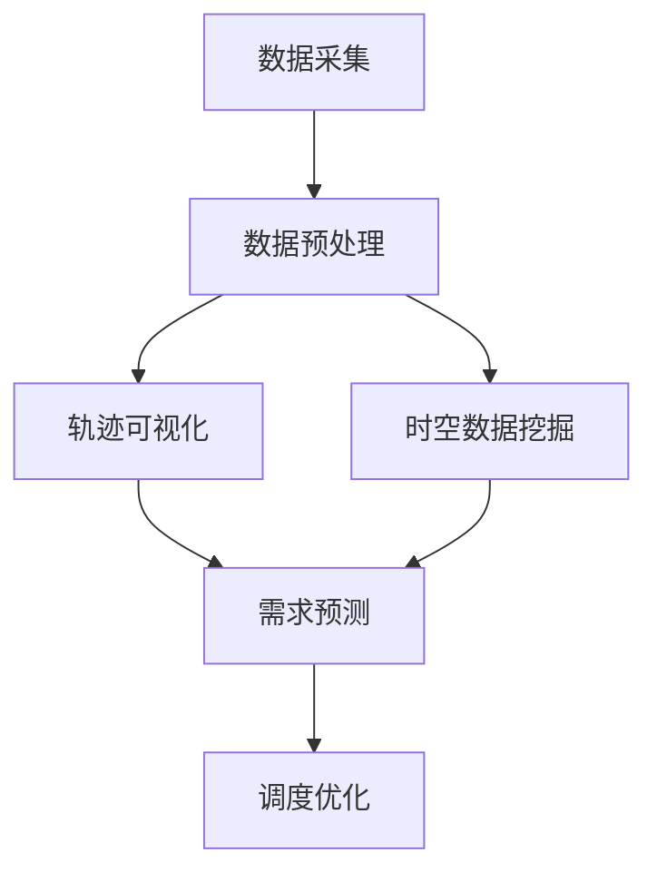

# 基于地图数据的新加坡出租车接送乘客轨迹可视化及需求预测

## 1. 背景介绍

### 1.1 问题的由来

在当今城市化进程不断加快的背景下,交通拥堵、环境污染等问题日益严重。有效的公共交通系统不仅能够缓解这些问题,还能为市民提供便捷的出行方式。作为主要的公共交通工具之一,出租车在城市交通中扮演着重要角色。然而,传统的出租车调度方式存在诸多弊端,如盲目巡游寻客、供需失衡等,导致能源浪费和乘客等候时间过长。

为了优化出租车运营效率,提高乘客乘车体验,新加坡政府着手构建一个基于大数据分析的智能调度系统。该系统将利用历史出租车运营数据,对未来出租车需求进行预测,从而指导车辆合理调配,实现供需精准匹配。作为该项目的重要组成部分,出租车轨迹可视化和需求预测技术就显得尤为关键。

### 1.2 研究现状

近年来,随着物联网、人工智能等新兴技术的发展,基于大数据的智能交通系统备受关注。学术界和工业界都在积极探索如何利用海量交通数据优化交通运营。其中,出租车轨迹数据由于其覆盖面广、时间连续性强等特点,成为交通大数据分析的热门研究对象。

目前,国内外已有多项研究致力于出租车轨迹可视化和需求预测技术。在可视化方面,研究人员提出了多种基于地理信息系统(GIS)的可视化方法,如热力图、轨迹聚类等,以直观展现出租车的空间分布和运行模式。在需求预测方面,常见的方法包括基于深度学习的时空序列预测模型、基于图神经网络的需求预测模型等,这些模型能够从历史出租车数据中挖掘潜在的时空规律,对未来需求进行精准预测。

### 1.3 研究意义  

基于地图数据的出租车轨迹可视化及需求预测技术,能够为城市交通管理部门和出租车公司提供有力的决策支持,具有重要的理论意义和应用价值:

1. **理论意义**
   - 拓展了交通大数据分析的研究领域,为智能交通系统的发展提供了新的技术支撑。
   - 促进了人工智能、机器学习等前沿技术在交通领域的应用,推动了跨学科融合创新。
   - 为解决复杂的城市交通问题提供了新的思路和方法。

2. **应用价值**
   - 帮助交通管理部门科学调配出租车资源,缓解交通拥堵,提高运营效率。
   - 为出租车公司提供精准的需求预测,优化调度策略,提升服务质量。
   - 为市民提供更加便捷、舒适的出行体验,缓解"最后一公里"问题。
   - 促进智慧城市建设,推动城市可持续发展。

### 1.4 本文结构

本文将全面介绍基于地图数据的新加坡出租车接送乘客轨迹可视化及需求预测技术。文章首先阐述研究背景和意义,然后详细解析核心概念、算法原理和数学模型,并通过实际项目实践展示具体的技术实现。最后,探讨该技术在实际应用场景中的作用,分享相关学习资源,并对未来发展趋势和挑战进行展望。全文共分为九个部分:

1. 背景介绍
2. 核心概念与联系
3. 核心算法原理与具体操作步骤
4. 数学模型和公式详细讲解与举例说明
5. 项目实践:代码实例和详细解释说明
6. 实际应用场景
7. 工具和资源推荐
8. 总结:未来发展趋势与挑战
9. 附录:常见问题与解答

## 2. 核心概念与联系

在探讨出租车轨迹可视化及需求预测技术之前,我们需要先了解几个核心概念及其内在联系。

### 2.1 轨迹数据

轨迹数据是指移动对象在特定时间段内的位置序列,通常由一系列的时空坐标点组成。对于出租车而言,轨迹数据记录了车辆在特定时间和地点的位置信息,包括经纬度、时间戳等要素。通过分析出租车的历史轨迹数据,我们可以挖掘出租车的运行规律,为优化调度策略提供依据。

### 2.2 地理信息系统(GIS)

地理信息系统(Geographic Information System, GIS)是一种集成了计算机硬件、软件和地理数据的系统,用于获取、存储、管理、分析和显示与地理位置相关的信息。在出租车轨迹可视化中,GIS技术能够将出租车轨迹数据与地图数据相结合,形象直观地展现出租车的运行状况。

### 2.3 时空数据挖掘

时空数据挖掘(Spatio-Temporal Data Mining)是一种从具有时间和空间属性的大数据集中发现有趣模式的过程。由于出租车轨迹数据具有明显的时空特征,因此时空数据挖掘技术可以用于发现出租车运行的时空规律,如热点区域、拥堵时段等,为需求预测提供支持。

### 2.4 需求预测

需求预测(Demand Forecasting)是指根据历史数据和其他相关信息,预测未来一段时间内出租车需求量的过程。准确的需求预测可以帮助出租车公司合理调配车辆资源,提高运营效率,缩短乘客等候时间。

### 2.5 概念联系

上述四个核心概念之间存在着内在联系:

1. 轨迹数据是需求预测的基础数据源,记录了出租车的历史运行信息。
2. GIS技术将轨迹数据与地图数据相结合,为轨迹可视化提供支持。
3. 时空数据挖掘技术能够从轨迹数据中发现出租车运行的时空规律,为需求预测提供依据。
4. 需求预测则是整个技术的最终目标,通过对未来需求的精准预测,指导出租车的合理调度。

四个概念相互依赖、环环相扣,共同构建了一个完整的出租车轨迹可视化及需求预测技术体系。

## 3. 核心算法原理与具体操作步骤

### 3.1 算法原理概述

基于地图数据的新加坡出租车接送乘客轨迹可视化及需求预测技术,主要包括三个核心算法:轨迹可视化算法、时空数据挖掘算法和需求预测算法。

1. **轨迹可视化算法**

轨迹可视化算法的主要目标是将出租车的历史轨迹数据与地图数据相结合,形象直观地展现出租车的运行状况。常见的可视化方法包括热力图、轨迹聚类等。

2. **时空数据挖掘算法**

时空数据挖掘算法旨在从出租车的历史轨迹数据中发现隐藏的时空规律,如热点区域、拥堵时段等。这些规律对于理解出租车的运行模式、优化调度策略具有重要意义。常见的挖掘算法包括时空聚类、频繁模式挖掘等。

3. **需求预测算法**

需求预测算法的目标是根据历史出租车数据和时空规律,对未来一段时间内的出租车需求进行准确预测。常见的预测算法包括基于深度学习的时空序列预测模型、基于图神经网络的需求预测模型等。

这三个核心算法相互配合,共同实现了出租车轨迹可视化及需求预测的功能。具体的操作步骤如下:

### 3.2 算法步骤详解

1. **数据采集**

首先,需要从出租车上安装的GPS设备或手机APP等渠道采集出租车的实时位置数据,形成原始的轨迹数据集。同时,还需要收集其他相关数据,如地图数据、天气数据、人口统计数据等,为后续的分析提供支持。

2. **数据预处理**

由于原始数据通常存在噪声、缺失值等问题,因此需要进行数据清洗和格式转换,将数据转换为统一的格式,以便后续的算法处理。常见的预处理操作包括去噪、插值、坐标转换等。

3. **轨迹可视化**

将预处理后的出租车轨迹数据与地图数据相结合,利用热力图、轨迹聚类等可视化技术,直观展现出租车的空间分布和运行模式。可视化结果不仅能够帮助交通管理部门掌握整体交通状况,还能为后续的时空数据挖掘和需求预测提供直观的参考。

4. **时空数据挖掘**

利用时空聚类、频繁模式挖掘等算法,从出租车的历史轨迹数据中发现隐藏的时空规律,如热点区域、拥堵时段等。这些规律对于理解出租车的运行模式、优化调度策略具有重要意义。

5. **需求预测**

基于历史出租车数据和挖掘得到的时空规律,利用深度学习、图神经网络等算法,对未来一段时间内的出租车需求进行准确预测。需求预测的结果将为出租车调度提供决策依据。

6. **调度优化**

根据需求预测的结果,结合实时交通状况和车辆位置信息,优化出租车的调度策略,实现供需精准匹配,提高运营效率,缩短乘客等候时间。

### 3.3 算法优缺点

上述算法在实现出租车轨迹可视化及需求预测的同时,也存在一定的优缺点:

**优点:**

1. 能够充分利用出租车的历史轨迹数据,挖掘隐藏的时空规律,为需求预测提供有力支持。
2. 将可视化技术、时空数据挖掘和需求预测有机结合,形成了一个完整的技术体系。
3. 预测结果能够为出租车调度提供科学依据,提高运营效率,缩短乘客等候时间。
4. 算法具有一定的通用性,不仅适用于出租车领域,也可以扩展到其他移动对象的轨迹分析和需求预测。

**缺点:**

1. 算法的准确性在很大程度上依赖于数据的质量和完整性,对数据的要求较高。
2. 需要综合考虑多种影响因素,如天气、节假日等,增加了算法的复杂性。
3. 算法的计算量较大,对硬件资源的要求较高,可能会影响实时性。
4. 算法的参数调优过程较为复杂,需要大量的实验和经验积累。

### 3.4 算法应用领域

基于地图数据的出租车轨迹可视化及需求预测技术不仅适用于出租车领域,还可以扩展到其他移动对象的轨迹分析和需求预测,如:

1. **共享单车调度**
   利用共享单车的历史轨迹数据,可以预测未来的用车需求,优化单车的投放和调度策略。

2. **物流运输优化**
   分析货运车辆的轨迹数据,可以发现运输路线的拥堵情况,优化运输路线和车辆调度。

3. **旅游路线规划**
   根据游客的历史轨迹数据,可以预测热门景点的游客量,为旅游路线规划提供决策依据。

4. **应急救援调度**
   通过分析救援车辆的历史轨迹,可以预测突发事件的发生概率,优化救援资源的调配。

5. **无人机航线规划**
   利用无人机的飞行轨迹数据,可以预测未来的航线拥堵情况,规划更加合理的航线。

总的来说,该技术具有广阔的应用前景,有望为各个领