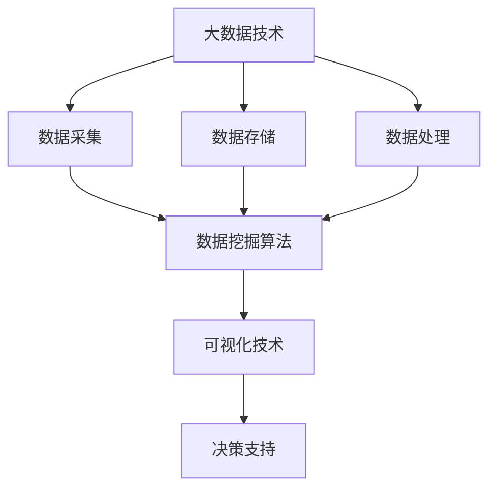

# 基于大数据的汽车营销可视化分析与研究

## 1. 背景介绍

### 1.1 问题的由来

在当前快节奏的商业环境中，汽车营销已经成为汽车制造商赖以生存和发展的关键因素。传统的营销策略和方法已经难以满足现代消费者不断变化的需求和偏好。随着大数据技术的兴起,基于大数据的汽车营销分析成为了一个重要的研究方向。

汽车制造商每天都会收集大量的客户数据、销售数据、市场数据等,这些数据蕴含着宝贵的营销洞见。然而,由于数据量巨大且种类繁多,很难通过传统的数据分析方法来发现隐藏其中的模式和规律。因此,需要一种高效的大数据分析方法来处理这些海量数据,并将分析结果以可视化的形式呈现出来,以便于决策者快速获取洞见。

### 1.2 研究现状

近年来,大数据分析在汽车营销领域的应用受到了广泛关注。一些学者和企业已经开始探索如何利用大数据技术来优化营销策略、提高销售业绩。然而,由于汽车营销涉及的数据种类繁多、数据量庞大,现有的大数据分析方法还存在一些不足,无法完全满足汽车营销的需求。

目前,大多数研究都集中在利用机器学习算法对客户数据进行分析,以发现潜在的客户群体并制定个性化的营销策略。但是,这些研究往往忽视了其他重要数据源,如市场数据、竞争对手数据等,导致分析结果存在偏差。另外,现有的可视化方法也存在一些不足,无法清晰地呈现复杂的数据模式和关系。

### 1.3 研究意义

基于大数据的汽车营销可视化分析具有重要的理论和实践意义。从理论层面上讲,它将推动大数据分析技术在汽车营销领域的应用和发展,促进跨学科的交叉研究。从实践层面上讲,它将帮助汽车制造商更好地了解市场动态和客户需求,制定更加精准的营销策略,提高销售业绩和市场竞争力。

此外,本研究还将探索新颖的大数据可视化技术,以更加直观和生动的方式呈现复杂的数据模式和关系,为决策者提供更加全面和深入的洞见。这将极大地提高大数据分析在汽车营销领域的应用价值。

### 1.4 本文结构

本文将首先介绍基于大数据的汽车营销可视化分析的核心概念和理论基础,包括大数据技术、数据挖掘算法、可视化技术等。接下来,将详细阐述核心算法的原理和具体操作步骤,并介绍相关的数学模型和公式。

然后,本文将通过一个实际项目案例,展示如何将这些理论和算法应用到实践中,包括开发环境搭建、代码实现、结果分析等。随后,将探讨基于大数据的汽车营销可视化分析在实际应用场景中的作用和价值。

最后,本文将总结研究成果,讨论未来的发展趋势和面临的挑战,并推荐相关的学习资源、开发工具和论文,为读者提供进一步的学习和研究方向。

## 2. 核心概念与联系

基于大数据的汽车营销可视化分析涉及多个核心概念,包括大数据技术、数据挖掘算法、可视化技术等。这些概念相互关联,共同构建了一个完整的分析框架。

1. **大数据技术**是整个分析框架的基础,包括数据采集、存储和处理等方面。它确保了海量数据的高效获取和管理,为后续的数据挖掘和可视化奠定了坚实的基础。

2. **数据挖掘算法**是核心环节,负责从海量数据中发现隐藏的模式和规律。常用的算法包括聚类分析、关联规则挖掘、决策树等。这些算法能够从多个维度深入挖掘数据,提取有价值的信息。

3. **可视化技术**则将算法的输出结果以直观和生动的方式呈现出来,帮助决策者快速获取洞见。常用的可视化技术包括图表、地图、仪表盘等。良好的可视化设计能够突出重点,清晰地传达信息。

这三个核心概念相互依赖、密切关联。大数据技术为数据挖掘算法提供原材料,数据挖掘算法则为可视化技术提供内容,而可视化技术则将分析结果以易于理解的形式呈现出来,为决策提供支持。只有三者有机结合,才能充分发挥基于大数据的汽车营销可视化分析的价值。

## 3. 核心算法原理 & 具体操作步骤

### 3.1 算法原理概述

在基于大数据的汽车营销可视化分析中,常用的核心算法包括聚类分析、关联规则挖掘和决策树等。这些算法能够从海量数据中发现隐藏的模式和规律,为营销决策提供有价值的洞见。

1. **聚类分析**算法的目标是将数据集中的对象划分为若干个"簇",使得同一个簇中的对象相似度较高,而不同簇之间的对象相似度较低。在汽车营销中,聚类分析可用于发现潜在的客户群体,并针对不同群体制定个性化的营销策略。

2. **关联规则挖掘**算法则旨在发现数据集中存在的频繁模式,即哪些事物或属性之间存在着强关联关系。在汽车营销中,关联规则挖掘可用于发现客户购买习惯之间的关联,从而优化产品组合和促销活动。

3. **决策树**算法通过构建一棵决策树来对数据进行分类或回归预测。在汽车营销中,决策树可用于预测客户是否会购买某款车型,或者预测客户的潜在价值,从而制定针对性的营销策略。

这些算法都具有一定的优缺点,需要根据具体的应用场景和数据特征来选择合适的算法。下面将详细介绍其中一种核心算法的原理和操作步骤。

### 3.2 算法步骤详解

以**K-Means聚类算法**为例,其步骤如下:

1. **初始化**:随机选择K个数据点作为初始聚类中心。

2. **计算距离**:对于每个数据点,计算它与每个聚类中心的距离,并将其分配到最近的聚类中。

   $$d(x, c) = \sqrt{\sum_{i=1}^{n}(x_i - c_i)^2}$$

   其中,d(x, c)表示数据点x与聚类中心c的距离,n是数据维度。

3. **更新中心**:重新计算每个聚类的中心点,作为新的聚类中心。

   $$c_j = \frac{1}{|C_j|}\sum_{x \in C_j}x$$

   其中,|C_j|表示第j个聚类的数据点个数。

4. **迭代**:重复步骤2和3,直到聚类中心不再发生变化或达到最大迭代次数。

5. **输出结果**:输出最终的聚类结果。

该算法的核心思想是不断迭代,使得同一个聚类内的数据点越来越相似,而不同聚类之间的数据点越来越不相似。算法的时间复杂度为O(nkt),其中n是数据点个数,k是聚类数,t是迭代次数。

### 3.3 算法优缺点

K-Means聚类算法具有以下优点:

- 算法简单,易于理解和实现。
- 计算效率较高,能够处理大规模数据集。
- 对于球形的数据分布效果较好。

但是,它也存在一些缺点:

- 需要预先指定聚类数K,对结果影响较大。
- 对噪声和异常值敏感,容易受到初始中心点的影响。
- 对非球形的数据分布效果较差。

### 3.4 算法应用领域

K-Means聚类算法在汽车营销领域有广泛的应用:

1. **客户细分**:根据客户的人口统计特征、购买行为等数据,将客户划分为不同的群体,针对不同群体制定个性化的营销策略。

2. **产品组合优化**:分析客户对不同车型的偏好,优化产品线并推荐相关产品。

3. **营销活动评估**:根据客户对不同营销活动的反应,评估活动的有效性并优化未来的营销策略。

4. **异常检测**:发现异常的客户行为或交易,以防范欺诈和风险。

除了汽车营销领域,K-Means聚类算法还广泛应用于图像分割、文本挖掘、基因组学等多个领域。

## 4. 数学模型和公式 & 详细讲解 & 举例说明

### 4.1 数学模型构建

在基于大数据的汽车营销可视化分析中,常常需要构建数学模型来描述和解释数据中的模式和规律。一种常用的数学模型是**线性回归模型**,它可以用于预测连续型目标变量(如销售额)与一个或多个自变量(如广告投放、价格等)之间的关系。

线性回归模型的基本形式如下:

$$y = \beta_0 + \beta_1x_1 + \beta_2x_2 + ... + \beta_nx_n + \epsilon$$

其中:

- y是目标变量(因变量)
- x1, x2, ..., xn是自变量
- β0是常数项(截距项)
- β1, β2, ..., βn是各自变量的系数(斜率)
- ε是随机误差项

该模型的目标是找到最佳的系数β,使得预测值y与实际观测值之间的差异(残差平方和)最小化。

### 4.2 公式推导过程

为了找到最佳的系数β,我们可以使用**最小二乘法**。具体步骤如下:

1. 定义残差平方和(RSS)为:

   $$RSS = \sum_{i=1}^{n}(y_i - \hat{y_i})^2 = \sum_{i=1}^{n}(y_i - \beta_0 - \beta_1x_{i1} - ... - \beta_nx_{in})^2$$

   其中,n是观测值的个数,yi是第i个观测值,而$\hat{y_i}$是第i个预测值。

2. 对RSS关于β0, β1, ..., βn分别求偏导数,并令其等于0,得到n+1个方程:

   $$\begin{align*}
   \frac{\partial RSS}{\partial \beta_0} &= -2\sum_{i=1}^{n}(y_i - \beta_0 - \beta_1x_{i1} - ... - \beta_nx_{in}) = 0\\
   \frac{\partial RSS}{\partial \beta_j} &= -2\sum_{i=1}^{n}x_{ij}(y_i - \beta_0 - \beta_1x_{i1} - ... - \beta_nx_{in}) = 0, \quad j = 1, 2, ..., n
   \end{align*}$$

3. 将这n+1个方程联立求解,即可得到β0, β1, ..., βn的最小二乘估计值。

需要注意的是,线性回归模型有一些基本假设,如残差独立同分布、自变量与残差无关等。如果这些假设不满足,模型的预测效果可能会受到影响。

### 4.3 案例分析与讲解

现在,我们来看一个具体的案例。假设一家汽车制造商想预测某款新车型的销售额,并根据预测结果制定营销策略。他们收集了以下数据:

- y:该车型在不同城市的月销售额(万元)
- x1:该城市的人均可支配收入(万元)
- x2:该城市的广告投放费用(万元)
- x3:该城市的竞争对手车型的价格(万元)

我们可以构建如下的多元线性回归模型:

$$y = \beta_0 + \beta_1x_1