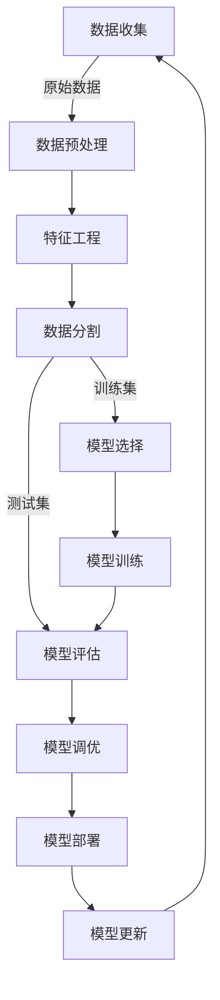

# 基于机器学习的电信防骚扰模型设计与实现

## 1. 背景介绍

### 1.1 问题的由来

在当今社会中，骚扰电话已经成为一个日益严重的问题,给很多人的生活带来了极大的困扰。骚扰电话不仅侵犯了个人隐私,也浪费了大量的时间和精力。传统的防骚扰方法,如黑名单、人工审查等,效率低下且成本高昂。因此,迫切需要一种高效、智能的解决方案来应对这一挑战。

### 1.2 研究现状

近年来,机器学习技术在多个领域取得了突破性进展,展现出巨大的潜力。一些研究人员开始尝试将机器学习应用于电信防骚扰领域,取得了初步成果。然而,现有的解决方案往往存在一定缺陷,如准确率不高、适用场景有限等,因此需要进一步的改进和优化。

### 1.3 研究意义

设计一种基于机器学习的电信防骚扰模型,可以有效地解决骚扰电话问题,保护用户的隐私和权益。同时,这也将推动机器学习技术在电信领域的应用,为相关研究提供新的思路和方向。此外,成功的防骚扰模型还可以为其他领域的类似问题提供借鉴和参考。

### 1.4 本文结构

本文将首先介绍相关的核心概念和背景知识,然后详细阐述所提出的基于机器学习的电信防骚扰模型的算法原理、数学模型和公式推导。接下来,将通过实际项目实践,展示模型的代码实现和运行结果。最后,探讨模型的应用场景、未来发展趋势和面临的挑战。

## 2. 核心概念与联系

在深入讨论防骚扰模型之前,我们需要先了解一些核心概念和背景知识。

### 2.1 骚扰电话

骚扰电话是指未经允许,反复拨打电话骚扰他人的行为。骚扰电话不仅侵犯了个人隐私,也造成了严重的社会问题。常见的骚扰电话类型包括诈骗电话、营销电话、恶意骚扰等。

### 2.2 机器学习

机器学习是一门人工智能的分支,它赋予计算机系统在没有明确编程的情况下,通过学习数据并建立算法模型来预测和决策的能力。机器学习算法可以从大量数据中自动发现模式和规律,并应用于各种任务,如分类、回归、聚类等。

常见的机器学习算法包括:

- 监督学习算法:线性回归、逻辑回归、支持向量机、决策树、随机森林等。
- 无监督学习算法:K-Means聚类、层次聚类、主成分分析等。
- 深度学习算法:卷积神经网络、递归神经网络、生成对抗网络等。

### 2.3 特征工程

特征工程是机器学习中一个非常重要的环节,它旨在从原始数据中提取有意义的特征,以供算法模型进行训练和预测。良好的特征工程可以极大地提高模型的性能和准确性。常见的特征工程技术包括:

- 数值型特征处理:标准化、归一化等。
- 类别型特征处理:One-Hot编码、目标编码等。
- 文本特征处理:TF-IDF、Word2Vec等。
- 特征选择:Filter方法、Wrapper方法等。

### 2.4 模型评估

为了评估机器学习模型的性能,我们需要使用一些评估指标。常见的评估指标包括:

- 分类问题:准确率、精确率、召回率、F1分数、ROC曲线等。
- 回归问题:均方根误差、平均绝对误差等。

适当选择评估指标对于构建高质量的模型至关重要。

## 3. 核心算法原理与具体操作步骤

### 3.1 算法原理概述

本文提出的基于机器学习的电信防骚扰模型,采用了监督学习的方法。具体来说,我们将收集大量已标记的电话通话记录数据,作为模型的训练集。这些数据包括电话号码、通话时间、通话时长等特征,以及该通话是否为骚扰电话的标签。

然后,我们将对这些数据进行预处理和特征工程,提取出对于判断骚扰电话最有意义的特征。接下来,将处理后的数据输入到机器学习算法中进行训练,得到一个能够预测新的电话通话是否为骚扰电话的模型。

在实际应用中,当有新的电话通话发生时,我们将提取相应的特征,输入到训练好的模型中,模型将输出该通话是否为骚扰电话的预测结果。如果被预测为骚扰电话,系统将采取相应的措施,如拦截、记录等。

该模型的核心思想是利用机器学习算法从历史数据中自动学习骚扰电话的模式和规律,从而能够准确地识别新的骚扰电话。相比于传统的基于规则的方法,机器学习模型具有更强的泛化能力和适应性,可以有效应对复杂多变的骚扰电话形式。

### 3.2 算法步骤详解

1. **数据收集**:从电信运营商处收集大量电话通话记录数据,包括电话号码、通话时间、通话时长等特征,以及该通话是否为骚扰电话的标签。

2. **数据预处理**:对收集到的原始数据进行清洗和格式化,处理缺失值、异常值等问题。

3. **特征工程**:从原始数据中提取有意义的特征,如:
   - 电话号码特征:号码前缀、号码长度等。
   - 时间特征:通话时间、通话时长、通话频率等。
   - 其他特征:被叫号码所在地区、号码是否在黑名单等。

4. **数据分割**:将处理后的数据集随机分为训练集和测试集,通常按照7:3或8:2的比例划分。

5. **模型选择**:根据问题的特点和数据的性质,选择合适的机器学习算法,如逻辑回归、决策树、随机森林等。

6. **模型训练**:使用训练集数据,对选定的机器学习算法进行训练,得到一个能够预测新的电话通话是否为骚扰电话的模型。

7. **模型评估**:使用测试集数据,评估训练好的模型在新数据上的性能,计算准确率、精确率、召回率等指标。

8. **模型调优**:根据模型评估的结果,通过调整算法参数、特征选择等方式,对模型进行优化和改进。

9. **模型部署**:将优化后的模型部署到实际的电信系统中,用于新的电话通话的骚扰检测。

10. **模型更新**:定期收集新的数据,重新训练模型,以适应骚扰电话形式的变化,保持模型的有效性。

该算法的关键在于特征工程和模型选择。良好的特征工程可以极大提高模型的准确性,而合适的机器学习算法则能够有效捕捉数据中的模式和规律。此外,模型评估和调优也是非常重要的环节,能够确保模型的性能和泛化能力。

### 3.3 算法优缺点

**优点**:

1. **准确性高**:机器学习算法能够从大量历史数据中自动学习骚扰电话的模式和规律,比传统的基于规则的方法更加准确。

2. **泛化能力强**:模型具有较强的泛化能力,能够有效识别新的、未见过的骚扰电话形式。

3. **自动化程度高**:一旦模型训练完成,可以自动化地对新的电话通话进行骚扰检测,减少了人工干预的需求。

4. **可解释性**:某些机器学习算法(如决策树)具有一定的可解释性,可以分析模型内部的决策逻辑。

5. **可扩展性**:该模型可以通过增加新的特征或调整算法参数来适应不同的应用场景。

**缺点**:

1. **数据质量要求高**:模型的性能很大程度上依赖于训练数据的质量和标注的准确性。

2. **黑箱操作**:某些机器学习算法(如深度神经网络)存在黑箱问题,决策过程难以解释。

3. **过拟合风险**:如果训练数据不够充足或存在噪声,模型可能出现过拟合的情况,导致泛化能力下降。

4. **算力需求高**:训练某些复杂的机器学习模型需要消耗大量的计算资源。

5. **持续学习成本高**:为了适应骚扰电话形式的变化,需要持续收集新数据并重新训练模型,成本较高。

### 3.4 算法应用领域

基于机器学习的电信防骚扰模型不仅可以应用于骚扰电话检测,还可以扩展到其他相关领域,如:

1. **垃圾短信过滤**:通过对短信内容进行文本特征提取,训练分类模型以过滤垃圾短信。

2. **网络钓鱼检测**:分析网页链接、电子邮件等特征,识别潜在的网络钓鱼行为。

3. **欺诈检测**:在金融、电子商务等领域,利用交易数据训练模型以发现欺诈行为。

4. **异常检测**:在网络安全、制造业等领域,检测异常事件或故障。

5. **内容审核**:对用户生成的文本、图像、视频等内容进行审核,过滤不当内容。

总的来说,该算法可以广泛应用于需要对大量数据进行分类和模式识别的场景。

## 4. 数学模型和公式详细讲解与举例说明

在设计基于机器学习的电信防骚扰模型时,我们需要构建合适的数学模型和公式,以准确描述问题并指导算法的实现。本节将详细介绍相关的数学模型和公式,并通过具体案例进行讲解和说明。

### 4.1 数学模型构建

我们将电信防骚扰问题建模为一个二分类问题。给定一个电话通话记录 $x$,我们需要预测它是否为骚扰电话,即将其分类为正类(骚扰电话)或负类(正常电话)。

设 $y \in \{0, 1\}$ 为类别标签,其中 $y=1$ 表示骚扰电话, $y=0$ 表示正常电话。我们的目标是学习一个分类函数 $f(x)$,使得对于任意输入 $x$,都有:

$$
f(x) = \begin{cases}
1, & \text{if } x \text{ is a spam call}\\
0, & \text{if } x \text{ is a normal call}
\end{cases}
$$

在监督学习的框架下,我们将使用一个训练数据集 $\mathcal{D} = \{(x_i, y_i)\}_{i=1}^N$ 来学习这个分类函数 $f(x)$。训练数据集中的每个样本 $(x_i, y_i)$ 都包含一个电话通话记录 $x_i$ 及其对应的标签 $y_i$。

我们的目标是找到一个最优的函数 $f^*(x)$,使得在训练数据集上的分类误差最小化:

$$
f^*(x) = \arg\min_{f} \sum_{i=1}^N L(y_i, f(x_i))
$$

其中, $L(\cdot)$ 是一个损失函数,用于衡量预测值与真实值之间的差距。常见的损失函数包括0-1损失函数、平方损失函数、交叉熵损失函数等。

对于不同的机器学习算法,函数 $f(x)$ 的具体形式会有所不同。例如,在逻辑回归中,我们假设 $f(x