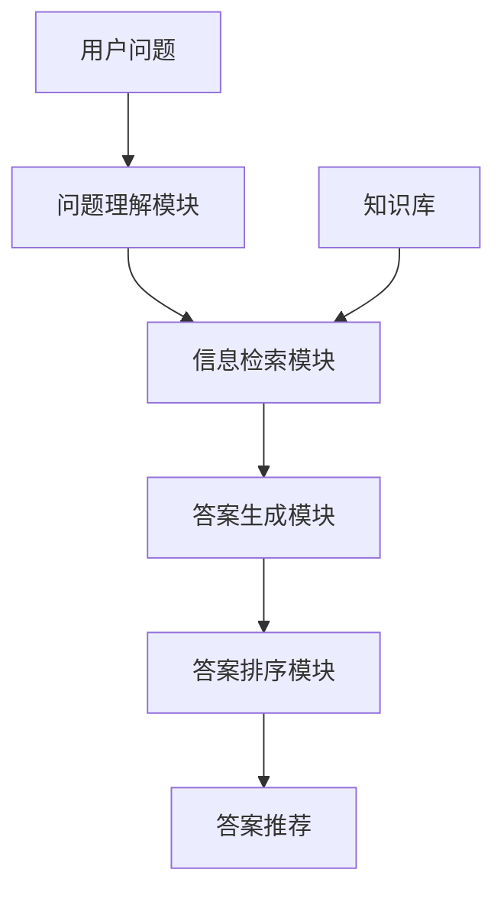

# 基于机器学习的问答推荐算法设计

## 1. 背景介绍

### 1.1 问题的由来

在当今信息时代,海量的数据和知识被不断产生和积累。人们面临着从海量信息中快速获取所需知识的挑战。传统的搜索引擎虽然可以帮助检索相关信息,但往往需要用户耗费大量时间和精力去筛选和理解搜索结果。因此,开发一种能够直接回答用户自然语言问题的智能问答系统,成为了一个备受关注的研究热点。

问答系统旨在通过自然语言处理和机器学习技术,理解用户的问题,从知识库中检索相关信息,并生成针对性的答复。这种系统可以为用户提供更加直接和高效的知识获取方式,避免了浏览大量无关信息的繁琐过程。

然而,构建一个高性能的问答系统并非易事。它需要解决多个关键挑战,包括自然语言理解、知识表示、信息检索和答案生成等。特别是在面对开放域的问题时,系统需要具备广博的知识储备和强大的推理能力,才能生成准确、相关和连贯的答复。

### 1.2 研究现状

近年来,随着深度学习技术的不断发展,基于机器学习的问答系统取得了长足进步。研究人员提出了多种创新模型,如记忆增强神经网络、注意力机制、预训练语言模型等,显著提高了系统的自然语言理解和答案生成能力。

其中,预训练语言模型(如BERT、GPT等)被广泛应用于问答任务。这些模型通过在大规模语料库上进行预训练,获得了丰富的语义和上下文知识,从而能够更好地理解自然语言问题,并生成高质量的答复。

除了模型创新,知识库的构建和知识表示方式也是问答系统研究的重点。一些系统采用结构化知识库(如知识图谱),将知识以三元组的形式表示;另一些系统则利用非结构化的文本语料作为知识源。不同的知识表示方式对系统的检索和推理能力产生了重要影响。

### 1.3 研究意义

构建高性能的问答系统不仅具有重要的理论价值,也具有广阔的应用前景。智能问答系统可以应用于多个领域,如客户服务、教育辅助、医疗诊断等,为用户提供个性化的知识服务。它有望极大提高人们获取知识的效率,缓解信息过载带来的挑战。

从理论层面看,问答系统的研究涉及自然语言处理、信息检索、机器学习等多个领域的前沿技术,推动了这些领域的发展。同时,问答系统也为人工智能领域提出了新的挑战,如如何建模人类的推理过程、如何融合多模态信息等,这将促进人工智能技术的进一步创新。

### 1.4 本文结构

本文将围绕基于机器学习的问答推荐算法展开全面讨论。第2节介绍问答系统的核心概念和关键组成部分;第3节详细阐述问答推荐算法的原理和具体步骤;第4节构建相关数学模型,并给出公式推导过程;第5节通过实际项目实践,提供代码实例和解释说明;第6节探讨算法的实际应用场景;第7节推荐相关工具和学习资源;第8节总结研究成果,并展望未来发展趋势和挑战;最后的附录部分回答一些常见问题。

## 2. 核心概念与联系

问答推荐系统是一种智能系统,旨在根据用户提出的自然语言问题,从知识库中检索相关信息,并生成针对性的答复推荐。它通常由以下几个核心组成部分构成:

1. **问题理解模块**:接收用户输入的自然语言问题,并通过自然语言处理技术(如词法分析、句法分析、语义分析等)将其转换为机器可理解的形式,捕获问题的关键信息和意图。

2. **知识库**:存储系统所需的各种知识,可以是结构化的知识库(如知识图谱)或非结构化的文本语料库。知识库的构建方式和表示形式对系统的检索和推理能力有重要影响。

3. **信息检索模块**:根据问题理解的结果,在知识库中检索相关的信息片段或知识实体,作为生成答案的候选资源。这一模块通常采用信息检索技术(如关键词匹配、语义匹配等)来完成检索任务。

4. **答案生成模块**:综合问题信息和检索到的相关知识,通过机器学习模型(如序列到序列模型、生成式模型等)生成自然语言形式的答复。该模块需要具备强大的自然语言生成能力,以产生流畅、连贯和信息丰富的答案。

5. **答案排序模块**:当存在多个候选答案时,该模块根据答案的相关性、质量等指标对答案进行打分和排序,从而推荐给用户最合适的答复。

这些核心模块相互协作,共同实现了问答推荐系统的功能。其中,问答推荐算法作为系统的核心,负责指导各个模块的工作,并将它们的输出综合起来生成最终的答案推荐。

## 3. 核心算法原理与具体操作步骤

### 3.1 算法原理概述

问答推荐算法是问答系统的核心部分,它的主要任务是根据用户的自然语言问题,从知识库中检索相关信息,并生成高质量的答案推荐。该算法通常采用机器学习和深度学习技术,综合利用自然语言处理、信息检索、知识表示等多种技术,实现端到端的问答过程。

算法的基本原理可概括为以下几个关键步骤:

1. **问题理解**: 利用自然语言处理技术(如词法分析、句法分析、语义分析等)对用户输入的问题进行分析,提取问题的关键信息(如实体、关系、意图等),构建问题的语义表示。

2. **相关信息检索**: 根据问题的语义表示,在知识库中检索与问题相关的信息片段或知识实体,作为生成答案的候选资源。这一步骤通常采用信息检索技术(如关键词匹配、语义匹配、向量相似度计算等)来完成。

3. **答案生成**: 将问题的语义表示和检索到的相关信息输入到机器学习模型(如序列到序列模型、生成式模型等),生成自然语言形式的答复。该模型需要具备强大的自然语言生成能力,以产生流畅、连贯和信息丰富的答案。

4. **答案排序**: 当存在多个候选答案时,根据答案的相关性、质量等指标对答案进行打分和排序,从而推荐给用户最合适的答复。

该算法的关键在于有效地融合了自然语言处理、信息检索和机器学习等多种技术,实现了端到端的问答推荐流程。通过不断优化各个环节的模型和算法,可以显著提高系统的性能和答案质量。

### 3.2 算法步骤详解

现在,我们对问答推荐算法的具体步骤进行更加详细的解释:

1. **问题理解**
   - 词法分析: 将问题文本分割为单词序列,标注每个单词的词性等信息。
   - 句法分析: 构建问题的句法树,识别其中的短语和句子成分。
   - 命名实体识别: 从问题中识别出人名、地名、组织机构名等命名实体。
   - 语义分析: 捕获问题的核心语义信息,如问题类型(实体、数字、描述等)、关键词和关系等。
   - 问题表示: 将问题转换为机器可理解的语义表示形式,如向量、张量或知识图谱子图等。

2. **相关信息检索**
   - 索引构建: 对知识库中的信息进行预处理,构建倒排索引或其他索引结构,以加速检索过程。
   - 相关性计算: 根据问题的语义表示,计算知识库中每个信息片段或实体与问题的相关性得分。
   - 候选检索: 根据相关性得分,从知识库中检索出与问题最相关的信息片段或实体,作为答案生成的候选资源。

3. **答案生成**
   - 编码器: 将问题的语义表示和检索到的相关信息编码为机器学习模型可理解的形式,如向量序列。
   - 解码器: 基于编码器的输出,通过序列到序列模型(如Transformer、LSTM等)或生成式模型(如GPT等)生成自然语言形式的答复。
   - 注意力机制: 在生成答案时,模型可以selectively关注问题和相关信息的不同部分,以捕获更多有用的上下文信息。
   - 束搜索(Beam Search): 在解码过程中,并行探索多个候选答案,并选择概率最高的作为最终输出。

4. **答案排序**
   - 相关性打分: 根据问题、相关信息和生成答案之间的语义关联程度,对每个候选答案进行相关性打分。
   - 质量打分: 评估答案的质量,如流畅性、连贯性、信息丰富程度等,并给出质量分数。
   - 综合排序: 将相关性分数和质量分数综合起来,对候选答案进行排序,输出最终的答案推荐。

在实际应用中,上述步骤可能会根据具体场景和需求进行调整和优化。例如,可以引入更多的特征(如答案长度、实体覆盖率等)来提高排序的准确性;也可以采用多轮交互的方式,让系统主动询问用户以获取更多信息,从而生成更精准的答复等。

### 3.3 算法优缺点

问答推荐算法具有以下一些优点:

1. **端到端学习**:算法将问题理解、信息检索和答案生成等多个环节融合在一个统一的框架中,实现了端到端的学习和优化,提高了系统的整体性能。

2. **语义理解能力强**:通过自然语言处理技术和深度学习模型,算法能够较好地捕获问题和知识的语义信息,从而提高了答案的相关性和质量。

3. **可解释性**:算法的各个步骤都有明确的语义解释,有利于理解系统的内部工作机制,并进行针对性的优化和调试。

4. **可扩展性**:算法框架具有良好的可扩展性,可以方便地集成新的模块或技术,以提升系统的各个方面能力。

5. **开放域适用**:算法能够处理开放域的问题,不受特定领域知识的限制,具有广泛的应用前景。

然而,该算法也存在一些需要改进的地方:

1. **知识库依赖性**:算法的性能在很大程度上依赖于知识库的覆盖范围和质量,如果知识库存在缺失或错误,将直接影响答案的准确性。

2. **推理能力有限**:虽然算法可以捕获语义信息,但对于需要复杂推理的问题,其推理能力仍然有限,难以生成令人满意的答复。

3. **参数调优困难**:算法中存在大量的超参数需要调优,这个过程往往是耗时且依赖经验的,缺乏有效的自动化方法。

4. **计算资源需求高**:深度学习模型通常需要大量的计算资源(如GPU)来进行训练和推理,这可能会增加系统的部署和维护成本。

5. **数据标注成本高**:为了训练算法模型,需要大量的高质量标注数据,而数据标注的过程通常是昂贵和耗时的。

### 3.4 算法应用领域

基于机器学习的问答推荐算法具有广泛的应用前景,可以在多个领域发挥作用:

1. **智能助手**:可以集成到智能手机、智能音箱等设备中,为用