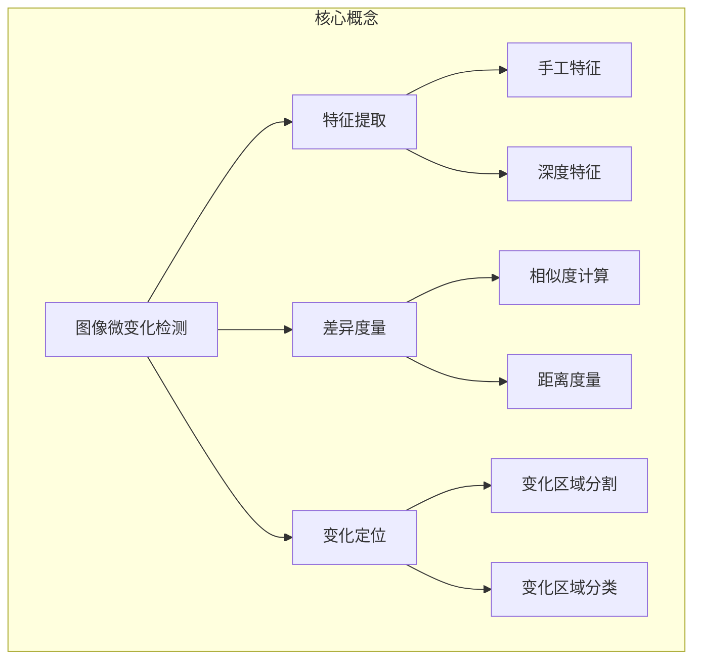
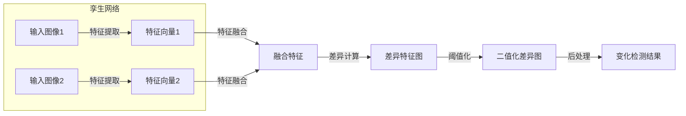

以下是题为《基于深度学习的图像微变化检测算法研究》的技术博客正文:

# 基于深度学习的图像微变化检测算法研究

## 1. 背景介绍

### 1.1 问题的由来

在现代社会中,图像数据的采集和处理已经成为许多领域的关键环节。从遥感卫星图像到医学影像,从安防监控到机器视觉检测,图像分析技术的重要性不言而喻。然而,在诸多图像处理任务中,微小变化的检测一直是一个巨大的挑战。

所谓微变化,是指在两幅看似相同的图像之间存在细微的差异。这种差异可能源于物体的位移、形变、出现或消失等,但由于变化的幅度极小,使得人眼很难直接识别。传统的基于手工特征的图像处理方法,由于特征提取的有限性,难以有效检测这种微小变化。因此,如何设计出能够精确检测和定位图像微变化的算法,成为了当前图像处理领域的一个重要研究课题。

### 1.2 研究现状

近年来,随着深度学习技术在计算机视觉领域的迅猛发展,研究人员开始尝试将深度神经网络应用于图像微变化检测任务。相比传统方法,基于深度学习的方法能够自动学习图像的高层次特征表示,从而更好地捕捉图像中的细微差异。

目前,已经提出了多种基于深度学习的图像微变化检测算法,主要可分为以下几类:

1. 基于自编码器的方法
2. 基于生成对抗网络的方法 
3. 基于孪生网络的方法
4. 基于注意力机制的方法

这些方法各有优缺点,在不同场景下表现也不尽相同。尽管取得了一定进展,但仍然面临诸多挑战,如对复杂背景的鲁棒性、对大尺度变化的适应性、检测精度与速度的平衡等。

### 1.3 研究意义  

图像微变化检测技术在诸多领域都有着广泛的应用前景:

- 遥感领域:用于监测环境变化、灾害评估等
- 医学影像:辅助疾病诊断、治疗效果评估
- 视频监控:移动目标检测、安防预警等
- 工业检测:产品质量检查、缺陷检测等
- 科学实验:实验现象观测、数据分析等

能够准确高效地检测图像微变化,不仅可以提高上述应用领域的工作效率,更重要的是,它有助于发现一些人眼难以觉察的细微变化,从而为决策提供更加全面准确的信息支持。

因此,发展出性能优异的图像微变化检测算法,对于提高相关领域的工作效率、降低人力成本、支持科学决策等方面,都具有重要的理论意义和应用价值。

### 1.4 本文结构

本文将围绕基于深度学习的图像微变化检测算法展开讨论。第2部分介绍相关的核心概念;第3部分详细阐述算法的原理和具体步骤;第4部分构建数学模型并推导公式;第5部分给出实际代码实现;第6部分分析算法的应用场景;第7部分推荐相关工具和资源;第8部分总结研究成果并展望未来;第9部分列出常见问题解答。

## 2. 核心概念与联系

图像微变化检测是指在两幅相似图像之间检测出细微的差异,包括三个关键步骤:特征提取、差异度量和变化定位。

1. **特征提取**旨在从原始图像中提取出有意义的特征,可分为手工特征(如SIFT、HOG等)和深度特征(CNN自动学习)两大类。
2. **差异度量**则是计算两幅图像特征之间的相似度或距离,常用方法有相关系数、欧氏距离等。 
3. **变化定位**根据差异度量的结果,对图像中的变化区域进行分割和分类。

这三个步骤相互关联、环环相扣。特征提取直接影响差异度量的准确性,而差异度量的结果又决定了变化定位的效果。传统方法主要依赖手工设计的低级特征,而深度学习则能自动学习高层次的语义特征表示,有望更好地解决图像微变化检测的挑战。

## 3. 核心算法原理与具体操作步骤

本节将详细介绍一种基于深度孪生卷积网络的图像微变化检测算法的原理和具体实现步骤。

### 3.1 算法原理概述  

该算法的核心思想是:训练一个深度孪生卷积网络,使其能够从输入的图像对中学习出高质量的特征表示,并在特征空间中对图像对进行对比,从而精确地检测和定位图像微变化区域。

算法的总体流程如下:

1. 输入成对的图像经过孪生卷积网络进行特征提取,得到两个特征向量
2. 将两个特征向量进行融合,计算出它们的差异特征图
3. 对差异特征图进行阈值化,得到二值化的差异图
4. 在差异图上进行后处理(如去噪、区域合并等),最终输出变化检测结果

该算法的优势在于:

- 端到端的网络结构,无需手工设计特征
- 孪生网络结构可最大化保留输入图像的差异信息
- 差异特征图直观反映了图像的变化区域
- 可根据任务需求,灵活设计网络结构和损失函数

### 3.2 算法步骤详解

1. **数据预处理**
   
   - 图像配准:确保输入的图像对已经对准,尺寸相同
   - 数据增强:对输入图像进行随机翻转、旋转等增强,提高模型泛化能力

2. **网络结构**

   孪生网络由两个相同结构的子网络组成,每个子网络都是一个卷积神经网络,用于从输入图像中提取特征。
   
   常用的网络结构有VGG、ResNet等,也可根据任务需求自行设计。子网络的输出是一个特征向量。

3. **特征融合**

   将两个子网络的输出特征向量进行融合,得到融合特征$\mathbf{f}$。融合方式有:
   
   - 相减:$\mathbf{f} = |\mathbf{f}_1 - \mathbf{f}_2|$
   - 相乘:$\mathbf{f} = \mathbf{f}_1 \odot \mathbf{f}_2$
   - 拼接:$\mathbf{f} = [\mathbf{f}_1, \mathbf{f}_2]$

4. **差异计算**

   将融合特征$\mathbf{f}$输入到一个解码器网络中,解码器通过一系列上采样和卷积操作,生成与输入图像尺寸相同的差异特征图$\mathbf{D}$。

   差异特征图$\mathbf{D}$中的每个像素值反映了对应位置的变化程度。

5. **阈值化**

   对差异特征图$\mathbf{D}$进行阈值化处理,得到二值化的差异图$\mathbf{B}$:

   $$\mathbf{B}(i,j) = \begin{cases} 
   1 & \text{if } \mathbf{D}(i,j) > \tau\\
   0 & \text{otherwise}
   \end{cases}$$

   其中$\tau$为预先设定的阈值。

6. **后处理**

   对二值化差异图$\mathbf{B}$进行形态学操作(如开运算、闭运算等),去除噪声、填补空洞,并进行连通区域分析,最终输出变化检测的结果。

### 3.3 算法优缺点

**优点**:

- 端到端的网络结构,无需手工设计特征
- 孪生网络可最大化保留图像差异信息
- 差异特征图直观反映变化区域
- 可根据需求设计网络结构和损失函数

**缺点**:

- 需要大量标注数据进行监督训练
- 对大尺度变化的适应性有限  
- 对复杂背景场景的鲁棒性不足
- 训练收敛较慢,需要大量计算资源

### 3.4 算法应用领域

基于深度孪生网络的图像微变化检测算法具有广阔的应用前景:

- 遥感领域:监测环境变化、评估灾害影响
- 医学影像:病灶检测、治疗效果评估
- 视频监控:移动目标检测、入侵检测
- 工业检测:产品质量检查、缺陷检测  
- 科学实验:实验现象观测、数据分析
- 文物保护:文物变化监测、损坏评估

## 4. 数学模型和公式详细讲解举例说明  

在上一节介绍的算法中,我们使用了深度卷积神经网络来提取图像特征,并通过特征融合和差异计算得到差异特征图。本节将构建该算法的数学模型,并详细推导相关公式。

### 4.1 数学模型构建

假设输入的图像对为$I_1$和$I_2$,孪生网络的两个子网络为$\phi_1$和$\phi_2$,它们的权重参数分别为$\theta_1$和$\theta_2$。子网络的输出特征向量为:

$$\mathbf{f}_1 = \phi_1(I_1; \theta_1), \quad \mathbf{f}_2 = \phi_2(I_2; \theta_2)$$

我们将两个特征向量进行融合,得到融合特征$\mathbf{f}$:

$$\mathbf{f} = \psi(\mathbf{f}_1, \mathbf{f}_2)$$

其中$\psi$为特征融合函数,可以是相减、相乘或拼接等操作。

然后,将融合特征$\mathbf{f}$输入到解码器网络$\varphi$中,得到差异特征图$\mathbf{D}$:

$$\mathbf{D} = \varphi(\mathbf{f}; \omega)$$

其中$\omega$为解码器网络的权重参数。

对差异特征图$\mathbf{D}$进行阈值化处理,得到二值化的差异图$\mathbf{B}$:

$$\mathbf{B}(i,j) = \begin{cases}
1 & \text{if } \mathbf{D}(i,j) > \tau\\
0 & \text{otherwise}
\end{cases}$$

其中$\tau$为预先设定的阈值。

最后,对二值化差异图$\mathbf{B}$进行后处理,得到最终的变化检测结果$\mathbf{R}$:

$$\mathbf{R} = \gamma(\mathbf{B})$$

其中$\gamma$代表一系列后处理操作,如形态学处理、连通区域分析等。

### 4.2 公式推导过程  

在训练阶段,我们需要为整个网络定义一个损失函数,以最小化模型的输出与真实标注之间的差异。

假设训练数据集为$\{(I_1^{(n)}, I_2^{(n)}, M^{(n)})\}_{n=1}^N$,其中$I_1^{(n)}$和$I_2^{(n)}$为成对的输入图像,$M^{(n)}$为对应的变化掩码标注。

我们可以将二值化差异图$\mathbf{B}$与真实掩码$M$进行比较,计算像素级别的二值交叉熵损失:

$$\mathcal{L}_\text{pixel} = -\frac{1}{HW} \sum_{i=1