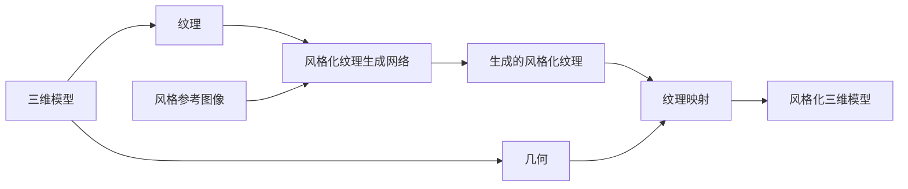

# 基于生成对抗网络的三维建模纹理风格化迁移技术

关键词：生成对抗网络、三维建模、纹理迁移、风格化、深度学习

## 1. 背景介绍
### 1.1 问题的由来
在计算机图形学和计算机视觉领域,三维模型的纹理生成和风格化一直是一个具有挑战性的研究课题。传统的纹理映射技术通常需要耗费大量的人力和时间,难以自动化生成逼真且具有艺术风格的纹理。近年来,随着深度学习技术的飞速发展,尤其是生成对抗网络(GAN)的出现,为三维模型纹理风格化迁移提供了新的思路和方法。

### 1.2 研究现状
目前,国内外学者已经开展了一系列针对三维模型纹理风格化迁移的研究。比较具有代表性的工作包括:

- Gatys等人提出了一种基于卷积神经网络(CNN)的纹理合成方法,通过匹配CNN特征的统计信息实现纹理风格迁移[1]。
- Johnson等人提出了一种快速风格迁移网络,通过预训练的方式加速风格迁移过程[2]。
- Isola等人提出了Pix2Pix框架,利用条件GAN实现图像到图像的转换,可用于纹理转换任务[3]。
- Wang等人提出了Multimodal Transfer GAN,实现了多模态数据(如几何、纹理)之间的风格迁移[4]。

虽然已有工作取得了一定进展,但在三维模型纹理风格化迁移方面仍面临诸多挑战,如纹理生成的真实性、稳定性、控制性等。

### 1.3 研究意义
三维模型纹理风格化迁移技术具有广泛的应用前景,主要体现在以下几个方面:

1. 自动化内容创作:可大幅提高三维艺术设计和游戏开发的效率,降低内容生产成本。
2. 虚拟现实与增强现实:逼真的纹理渲染可提升VR/AR场景的沉浸感和真实感。 
3. 数字孪生:高保真的三维模型纹理对于构建数字孪生系统至关重要。
4. 文化遗产保护:通过风格化手段,可为文物古迹等文化遗产创建数字化的艺术化展示。

因此,深入研究三维模型纹理风格化迁移技术,对于推动计算机图形学和相关产业发展具有重要意义。

### 1.4 本文结构
本文将重点介绍一种基于生成对抗网络的三维建模纹理风格化迁移技术。全文结构安排如下:

- 第2部分介绍相关核心概念;
- 第3部分详细阐述所提出的算法原理和操作步骤;
- 第4部分建立数学模型并推导相关公式;
- 第5部分给出算法的代码实现和结果展示;
- 第6部分讨论该技术的实际应用场景;
- 第7部分推荐相关工具和学习资源;
- 第8部分总结全文,并展望未来研究方向。

## 2. 核心概念与联系
在阐述算法原理之前,有必要对几个核心概念进行必要的说明。

**生成对抗网络(GAN)**:由Goodfellow等人于2014年提出,是一种强大的生成模型[5]。其核心思想是让两个神经网络(生成器和判别器)互相博弈,最终使生成器能够生成以假乱真的样本。GAN在图像生成、风格迁移等领域取得了广泛成功。

**三维模型**:是物体的数字化表示,一般由几何形状和纹理两大要素构成。几何形状决定了模型的空间结构,纹理则赋予模型丰富的视觉外观。

**纹理映射**:将二维纹理图像映射到三维模型表面,使其呈现出真实的材质感。传统纹理映射需要美术设计师进行手工绘制,费时费力。

**风格迁移**:将一幅图像的艺术风格迁移到另一幅图像,使其在保持内容的同时呈现出特定的视觉风格。基于深度学习的风格迁移能够自动化这一过程。

在三维纹理风格化中,我们的目标是利用GAN实现从原始模型到风格化模型的自动转换。具体而言,就是训练一个生成网络,使其能够根据原始纹理生成具有特定艺术风格(如油画、水彩)的新纹理,并将生成的纹理映射回三维模型。同时,引入判别网络对生成纹理的真实性进行评估,并指导生成网络进行优化。

下图展示了本文算法的总体框架:

## 3. 核心算法原理 & 具体操作步骤
### 3.1 算法原理概述
本文提出的基于GAN的三维纹理风格化迁移算法,其核心是设计并训练一个条件生成对抗网络。该网络由生成器和判别器两部分组成,其中:

- **生成器**:以原始纹理和风格参考图像为输入,生成具有艺术风格的新纹理。采用U-Net结构,在编码和解码过程中引入跳跃连接,以保留纹理的细节信息。
- **判别器**:判断输入的纹理是真实样本还是生成样本。采用PatchGAN结构,在局部小块上进行真假判别,以提高纹理细节的真实性。

通过生成器和判别器的对抗训练,使得生成器能够生成以假乱真、具有艺术风格的纹理图像。将生成的风格化纹理映射到三维模型上,即可得到具有特定风格的三维模型。

### 3.2 算法步骤详解
算法的具体步骤如下:

**Step1. 数据准备**
- 收集原始的三维模型及其纹理图像,构建数据集A。
- 收集不同艺术风格(如油画、水彩)的图像,构建风格数据集B。
- 对数据集进行预处理,包括尺寸归一化、数据增强等。

**Step2. 网络设计**
- 设计生成器G的网络结构。以U-Net为基础,在编码器和解码器之间添加跳跃连接。编码器通过卷积和下采样提取纹理特征,解码器通过反卷积和上采样恢复纹理细节。
- 设计判别器D的网络结构。采用PatchGAN结构,在局部小块上进行真假判别。判别器通过卷积层提取纹理特征,并输出真假概率。

**Step3. 损失函数定义**
- 定义生成器的损失函数,包括重构损失和对抗损失两部分。重构损失衡量生成纹理与原始纹理的像素级差异,对抗损失则促使生成纹理在判别器看来更加真实。
- 定义判别器的损失函数,即二元交叉熵损失。判别器的目标是将真实纹理判为真,将生成纹理判为假。

**Step4. 模型训练**
- 初始化生成器和判别器的网络参数。
- 设定训练超参数,如学习率、批量大小、训练轮数等。
- 对生成器和判别器进行交替训练。每轮训练中,先固定生成器更新判别器,再固定判别器更新生成器,使双方不断博弈优化。
- 定期保存模型检查点,以便后续使用。

**Step5. 风格化纹理生成与映射**
- 利用训练好的生成器,根据原始纹理和风格参考图像生成风格化纹理。
- 将生成的风格化纹理映射到原始的三维模型上,得到风格化的三维模型。
- 对生成结果进行定性和定量评估,如用户调查、相似度度量等。

**Step6. 迭代优化**
- 根据评估结果,分析算法的局限性和改进方向。
- 调整网络结构、损失函数、训练策略等,以进一步提升风格化效果。
- 重复Step4-Step6,直至达到预期的风格化质量。

### 3.3 算法优缺点
所提出的基于GAN的三维纹理风格化迁移算法具有以下优点:

- 自动化程度高,无需手工绘制风格化纹理,节省人力成本。
- 生成效果逼真,能够同时保留纹理细节和艺术风格。
- 通用性强,适用于不同类型的三维模型和艺术风格。
- 可控性好,通过调节风格参考图像,可灵活控制风格化效果。

同时,该算法也存在一些局限性:

- 对训练数据的质量和数量要求较高,需要大规模、高质量的纹理和风格图像。
- 训练过程计算复杂度高,对硬件设备和时间成本有较高要求。
- 生成结果的稳定性有待提高,可能出现模式崩塌、伪影等问题。
- 对极端风格化效果(如抽象画风格)的表现力有限。

### 3.4 算法应用领域
基于GAN的三维纹理风格化迁移算法可应用于以下领域:

1. 游戏和电影行业:快速生成具有艺术风格的游戏场景和电影资产,提升视觉表现力。
2. 工业设计:为产品设计提供多样化的纹理选择,提高设计效率和质量。
3. 虚拟现实:生成逼真的风格化纹理,营造沉浸感更强的虚拟环境。
4. 文化创意:为文创产品(如纪念品、手办)赋予独特的艺术风格,提升文化附加值。

## 4. 数学模型和公式 & 详细讲解 & 举例说明
### 4.1 数学模型构建
我们将三维纹理风格化问题建模为一个条件生成对抗网络。给定原始纹理图像 $x$ 和风格参考图像 $s$,目标是生成风格化纹理 $\hat{x}=G(x,s)$,使其在保留 $x$ 内容的同时呈现出 $s$ 的艺术风格。

形式化地,我们的目标是学习一个生成器 $G$ 和一个判别器 $D$,使得:

$$
\min_G \max_D \mathcal{L}(G, D) = \mathbb{E}_{x,s}[\log D(x, s)] + \mathbb{E}_{x,s}[\log (1 - D(G(x, s), s))]
$$

其中, $\mathcal{L}$ 为对抗损失函数, $\mathbb{E}$ 为期望。生成器 $G$ 试图最小化该目标函数,而判别器 $D$ 试图最大化它。

### 4.2 公式推导过程
**生成器损失**

生成器的损失函数包括两部分:重构损失 $\mathcal{L}_{rec}$ 和对抗损失 $\mathcal{L}_{adv}$。

重构损失衡量生成纹理与原始纹理在像素级别的差异,采用L1范数:

$$
\mathcal{L}_{rec} = \mathbb{E}_{x,s}[||G(x, s) - x||_1]
$$

对抗损失则鼓励生成器生成更加逼真的纹理,采用二元交叉熵:

$$
\mathcal{L}_{adv} = \mathbb{E}_{x,s}[-\log D(G(x, s), s)]
$$

生成器的总损失为两部分之和:

$$
\mathcal{L}_G = \lambda_{rec} \mathcal{L}_{rec} + \lambda_{adv} \mathcal{L}_{adv}
$$

其中 $\lambda_{rec}$ 和 $\lambda_{adv}$ 为平衡两种损失的权重系数。

**判别器损失**

判别器的损失函数为二元交叉熵损失:

$$
\mathcal{L}_D = -\mathbb{E}_{x,s}[\log D(x, s)] - \mathbb{E}_{x,s}[\log (1 - D(G(x, s), s))]
$$

判别器的目标是将真实纹理 $x$ 判为1,将生成纹理 $G(x,s)$