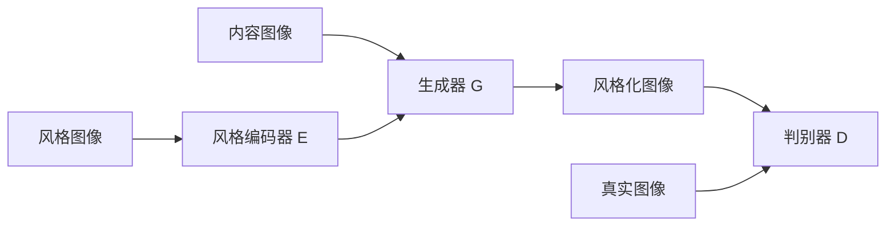

# 基于生成对抗网络的多风格图像转换模型研究

关键词：生成对抗网络, 图像转换, 多风格迁移, 深度学习, 计算机视觉

## 1. 背景介绍
### 1.1 问题的由来
随着深度学习技术的快速发展,计算机视觉领域取得了巨大的突破和进展。其中,图像风格转换是一个非常有趣而又富有挑战性的任务,它旨在将一幅图像的风格迁移到另一幅图像上,同时保留原图像的内容。这种技术可以让我们在保留图像内容的同时,赋予其全新的艺术风格,为图像处理和计算机视觉应用带来了广阔的前景。

### 1.2 研究现状
目前,图像风格转换主要有两大类方法:基于纹理合成的方法和基于神经网络的方法。基于纹理合成的方法通过匹配源图像和目标风格图像的纹理特征,合成风格化后的图像。而基于神经网络的方法则利用卷积神经网络提取图像的内容和风格特征,通过优化网络参数使生成图像同时匹配内容图像和风格图像。

其中,基于生成对抗网络(GAN)的图像风格转换方法因其出色的生成效果和灵活性而备受关注。GAN 由生成器和判别器两个子网络组成,生成器负责生成风格化图像,判别器负责判断生成图像是否逼真。通过两个网络的对抗学习,可以生成高质量的风格转换图像。

### 1.3 研究意义
尽管现有的 GAN 图像风格转换方法取得了不错的效果,但仍然存在一些局限性:

1. 大多数方法只能在两个固定风格间进行转换,缺乏灵活性。
2. 现有方法生成的图像质量和分辨率有待进一步提高。 
3. 风格转换过程缺乏可控性,无法根据用户意图调整风格程度。
4. 对于复杂场景图像的风格转换效果有待改进。

因此,本文旨在探索一种基于 GAN 的多风格图像转换模型,提出改进方案来解决上述问题,以期获得更加灵活、高质量、可控的图像风格转换效果,推动该领域的进一步发展。

### 1.4 本文结构
本文后续章节安排如下:
- 第2部分介绍图像风格转换和生成对抗网络的核心概念与二者之间的联系。
- 第3部分重点阐述本文提出的多风格图像转换模型的核心算法原理与具体操作步骤。
- 第4部分给出算法所涉及的数学模型和关键公式,并结合实例进行详细讲解。
- 第5部分提供项目实践的代码实例,并对关键部分进行解释说明。  
- 第6部分分析模型的实际应用场景,并对其未来应用前景进行展望。
- 第7部分推荐图像风格转换方向的学习资源、开发工具和相关论文。
- 第8部分对全文工作进行总结,分析该领域未来的发展趋势与面临的挑战。
- 第9部分的附录中整理了一些常见问题与解答,以便读者参考。

## 2. 核心概念与联系
在探讨多风格图像转换模型之前,我们有必要先了解几个核心概念:

**图像风格转换**是指在保持图像内容不变的情况下,将一种图像的风格特征迁移到另一幅图像上的过程。其目标是生成一幅新图像,使其拥有与内容图像相似的几何结构,同时具备风格图像的纹理、色彩等视觉特征。

**生成对抗网络(GAN)**是一种深度学习模型,由生成器(Generator)和判别器(Discriminator)组成。生成器负责生成逼真的图像,判别器负责判断输入图像是真实样本还是生成样本。两个网络在训练过程中互相博弈,最终使生成器能够生成以假乱真的图像。

GAN 非常适合用于图像风格转换任务,原因如下:
1. GAN 生成器可以学习到丰富的图像表示,从而生成高质量的风格化图像。 
2. GAN 判别器可以指导生成器生成更逼真的风格转换结果。
3. GAN 允许端到端的训练,避免了手工设计损失函数的繁琐。
4. GAN 具有一定的可控性,可以通过调节输入的随机噪声来影响生成结果。

因此,GAN 为图像风格转换任务提供了一个强大的工具。我们可以设计并训练 GAN 模型,使其同时匹配内容图像的几何结构和风格图像的视觉特征,从而实现高质量的风格迁移。下面将具体阐述本文提出的多风格图像转换模型。

## 3. 核心算法原理 & 具体操作步骤
### 3.1 算法原理概述
本文提出了一种基于条件 GAN 的多风格图像转换模型,命名为 MS-GAN(Multi-Style GAN)。与现有方法相比,该模型的主要特点包括:

1. 引入风格编码器对任意风格图像进行编码,生成风格向量表示,赋予模型处理多种风格的能力。
2. 在生成器中加入 AdaIN(自适应实例归一化)层,使用风格向量调制生成器特征,从而控制生成图像的风格。
3. 判别器采用多尺度结构,在不同尺度上判断生成图像的真实性,提高生成质量。
4. 损失函数中引入内容损失、风格损失和对抗损失,以保证生成图像兼顾内容、风格和真实性。

模型的总体架构如下图所示:

### 3.2 算法步骤详解
MS-GAN 的训练过程分为以下几个步骤:

**步骤1:** 风格编码器 E 将风格图像 Is 映射为风格向量 Zs,即 Zs=E(Is)。

**步骤2:** 生成器 G 以内容图像 Ic 和风格向量 Zs 为输入,生成风格化图像 Ig,即 Ig=G(Ic,Zs)。其中,风格向量 Zs 通过 AdaIN 层调制生成器的特征图。

**步骤3:** 判别器 D 在多个尺度上判断生成图像 Ig 和真实图像 Ir 的真实性,得到对抗损失 Ladv。

**步骤4:** 计算内容损失 Lc 和风格损失 Ls。内容损失衡量生成图像 Ig 与内容图像 Ic 在 VGG 网络特征空间的差异;风格损失衡量 Ig 与风格图像 Is 在 Gram 矩阵空间的差异。

**步骤5:** 联合优化生成器 G、风格编码器 E 和判别器 D 的参数,最小化总损失:

$$L = λ_c L_c + λ_s L_s + λ_{adv} L_{adv}$$

其中 λc、λs 和 λadv 为平衡因子。

**步骤6:** 重复步骤1-5,直到模型收敛。测试时,对于给定的内容图像 Ic 和风格图像 Is,直接生成风格化图像 Ig=G(Ic,E(Is))。

### 3.3 算法优缺点
MS-GAN 算法的优点如下:
1. 支持多风格转换,适用范围更广。
2. 通过风格编码器和 AdaIN,风格表达更加灵活可控。
3. 多尺度判别器提高了生成图像的质量和细节。
4. 端到端训练,避免了复杂的人工设计。

但该算法也存在一些局限性:
1. 模型结构相对复杂,训练时间较长。
2. 合成图像的分辨率受限于显存大小,生成高分辨率图像仍有难度。
3. 对于过于抽象或复杂的风格,转换效果可能不够理想。

### 3.4 算法应用领域
MS-GAN 算法可以应用于以下领域:

1. 艺术创作:将普通照片转换为各种艺术风格的图像,如油画、水彩画等。
2. 游戏设计:为游戏场景或角色快速生成不同风格的贴图。
3. 虚拟试妆:将用户照片与不同妆容风格图像融合,实现虚拟试妆效果。
4. 图像增强:通过风格转换丰富图像数据集,提高模型的泛化能力。
5. 电影特效:实现实景图像与概念设计图的风格融合,简化特效制作流程。

## 4. 数学模型和公式 & 详细讲解 & 举例说明
### 4.1 数学模型构建
MS-GAN 中的关键是风格编码器 E 和生成器 G。对于风格编码器 E,我们使用卷积神经网络将风格图像 Is 映射为风格向量 Zs:

$$Z_s = E(I_s) = f_{E}(I_s;θ_E)$$

其中 θE 为 E 的参数。

生成器 G 以内容图像 Ic 和风格向量 Zs 为输入,通过 AdaIN 层调制特征,生成风格化图像 Ig:

$$I_g = G(I_c,Z_s) = f_G(I_c,Z_s;θ_G)$$

其中 θG 为 G 的参数。AdaIN 层的操作如下:

$$AdaIN(x,y) = σ(y)(\frac{x-μ(x)}{σ(x)}) + μ(y)$$

其中 x 为生成器特征,y 为风格向量,μ(·) 和 σ(·) 分别表示均值和标准差。

判别器 D 在多个尺度 {1,2,...,K} 上判断图像的真实性:

$$D_k(I) = f_{D_k}(I;θ_{D_k}), k=1,2,...,K$$

其中 θDk 为第 k 个尺度的判别器参数。

### 4.2 公式推导过程
模型的总损失由内容损失 Lc、风格损失 Ls 和对抗损失 Ladv 三部分组成。

内容损失 Lc 衡量生成图像 Ig 与内容图像 Ic 在 VGG 网络特征空间的 L2 距离:

$$L_c = \frac{1}{CHW}\sum_{l=1}^L||ϕ^l(I_g) - ϕ^l(I_c)||_2^2$$

其中 ϕl(·) 表示 VGG 网络第 l 层特征,C、H、W 为特征图的通道数、高度和宽度。

风格损失 Ls 衡量生成图像 Ig 与风格图像 Is 在 Gram 矩阵空间的 L2 距离:

$$L_s = \sum_{l=1}^L||G^l(I_g) - G^l(I_s)||_F^2$$

其中 Gl(·) 表示第 l 层特征的 Gram 矩阵,||·||F 为矩阵的 Frobenius 范数。

对抗损失 Ladv 采用 WGAN-GP 的形式:

$$L_{adv} = \sum_{k=1}^K[D_k(I_r) - D_k(I_g) + λ_{gp}(||\nabla_{\hat{I}} D_k(\hat{I})||_2-1)^2]$$

其中 Ir 为真实图像,Ig 为生成图像,Iˆ 为真实图像和生成图像之间的插值,λgp 为梯度惩罚系数。

最终,我们联合优化生成器 G、风格编码器 E 和判别器 D 的参数 θG、θE 和 {θDk}Kk=1,最小化总损失:

$$\min_{θ_G,θ_E} \max_{θ_{D_k}} L = λ_c L_c + λ_s L_s + λ_{adv} L_{adv}$$

### 4.3 案例分析与讲解
下面以一个具体的图像风格转换案例来说明 MS-GAN 的工作过程。

假设我们要将一张普通的风景照片转换为梵高星空风格。首先,我们准备好风景内容图像 Ic 和梵