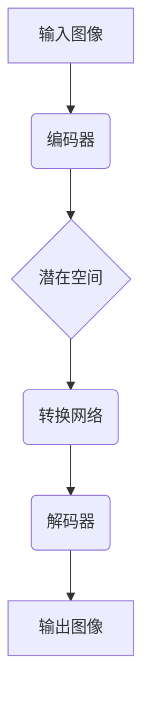

# 基于生成对抗网络的精细化图像内容编辑与风格迁移

## 1. 背景介绍

### 1.1 问题的由来

在数字时代,图像处理和编辑技术已经成为人工智能领域的一个重要研究方向。传统的图像编辑方法通常需要人工逐像素进行修改,操作繁琐且效率低下。随着深度学习技术的发展,基于生成对抗网络(Generative Adversarial Networks, GAN)的图像生成和编辑方法逐渐成为研究热点。

生成对抗网络是一种无监督学习算法,由生成网络和判别网络组成。生成网络负责从随机噪声中生成逼真的图像,而判别网络则判断生成的图像是真是假。两个网络相互对抗,最终达到生成网络生成的图像无法被判别网络识别的状态。由于GAN能够学习数据分布,因此可以用于图像生成、编辑和风格迁移等任务。

### 1.2 研究现状

近年来,基于GAN的图像内容编辑和风格迁移技术取得了长足进展。研究人员提出了多种创新模型,如条件GAN、循环GAN、注意力GAN等,显著提高了图像编辑和风格迁移的质量和灵活性。

然而,现有方法仍然存在一些不足,例如:

1. 编辑细节不够精细,难以实现像素级别的精确控制。
2. 风格迁移效果不够自然,存在artifact和模糊现象。
3. 缺乏对语义信息的利用,编辑和风格迁移的控制性不足。

为了解决这些问题,研究人员正在探索新的网络架构和训练策略,以期获得更精细、更自然、更可控的图像编辑和风格迁移效果。

### 1.3 研究意义

精细化图像内容编辑和风格迁移技术具有广阔的应用前景,包括:

1. 图像编辑和修复:可用于去除图像中的不需要的物体、修复损坏的图像等。
2. 图像增强:通过风格迁移赋予图像新的艺术风格,提高图像的视觉吸引力。
3. 虚拟现实和增强现实:可用于实时编辑和渲染虚拟场景,提升沉浸感。
4. 医学影像处理:有助于医学图像的分割、增强和修复。
5. 视频编辑:实现对视频中物体和场景的精细化编辑。

本文将深入探讨基于GAN的精细化图像内容编辑和风格迁移技术,介绍其核心概念、算法原理、数学模型、实践案例和应用场景,为读者提供全面的理解和实践指导。

### 1.4 本文结构

本文的结构安排如下:

1. 背景介绍:阐述问题由来、研究现状和意义。
2. 核心概念与联系:介绍GAN、图像编辑和风格迁移的核心概念及其关联。
3. 核心算法原理与具体操作步骤:深入解析算法原理和实现细节。
4. 数学模型和公式详细讲解与案例分析:建立数学模型,推导公式并结合案例进行讲解。
5. 项目实践:代码实例和详细解释说明:提供开发环境搭建、源代码实现、代码解读和运行结果展示。
6. 实际应用场景:介绍技术在不同领域的应用场景和未来展望。
7. 工具和资源推荐:推荐学习资源、开发工具、相关论文和其他资源。
8. 总结:未来发展趋势与挑战:总结研究成果,展望未来发展趋势并分析面临的挑战。
9. 附录:常见问题与解答:解答常见问题,增进读者理解。

## 2. 核心概念与联系

在深入探讨算法原理和实现细节之前,我们先介绍几个核心概念及其联系。

### 2.1 生成对抗网络(GAN)

生成对抗网络(Generative Adversarial Networks, GAN)是一种基于深度学习的无监督学习算法,由两个网络组成:生成网络(Generator)和判别网络(Discriminator)。

**生成网络**的目标是从随机噪声中生成逼真的数据样本(如图像),使其无法被判别网络识别为"假"样本。**判别网络**则旨在区分生成网络生成的"假"样本和真实数据样本。两个网络相互对抗,最终达到生成网络生成的样本无法被判别网络识别的状态,此时生成网络就学会了真实数据的分布。

GAN的训练过程可以看作是一个极小化极大博弈问题,生成网络和判别网络分别极小化和极大化它们各自的损失函数。当两个网络达到纳什均衡时,生成网络就能够生成与真实数据分布一致的样本。

GAN的核心思想是通过对抗训练,学习数据的真实分布,因此可以应用于图像生成、编辑和风格迁移等任务。

### 2.2 图像内容编辑

图像内容编辑是指在保留图像主要语义内容的同时,对图像中的某些区域进行修改或替换。常见的编辑操作包括去除、添加、修改物体以及调整物体的位置和大小等。

基于GAN的图像内容编辑方法通常采用编码器-解码器架构,将图像编码为潜在空间表示,然后在潜在空间中进行编辑操作,最后将编辑后的潜在表示解码为编辑后的图像。编辑操作可以通过手动干预或学习到的语义向量来实现。

### 2.3 图像风格迁移

图像风格迁移是指将一种艺术风格迁移到另一幅图像上,使得输出图像保留了原始图像的内容,同时获得了新的艺术风格。常见的风格包括油画、素描、漫画等。

基于GAN的图像风格迁移方法一般采用编码器-解码器-转换网络的架构。编码器将内容图像和风格图像编码为内容特征和风格特征,转换网络将内容特征和风格特征融合,生成融合特征,最后由解码器从融合特征生成风格迁移后的图像。

### 2.4 GAN在图像编辑和风格迁移中的作用

GAN在图像编辑和风格迁移任务中发挥着关键作用:

1. **生成高质量图像**:GAN能够学习数据分布,生成逼真的图像,为图像编辑和风格迁移提供高质量的输出。
2. **提供无监督学习能力**:GAN属于无监督学习范畴,不需要大量标注数据,可以从未标注的图像数据中学习特征表示。
3. **增强编辑和风格迁移的可控性**:通过对潜在空间表示或语义向量的控制,可以实现对图像内容和风格的精细编辑。
4. **端到端训练**:GAN允许将编码器、解码器和转换网络进行端到端的联合训练,提高模型的性能。

综上所述,GAN为图像内容编辑和风格迁移任务提供了强大的生成能力和灵活的控制手段,是实现精细化编辑和自然风格迁移的关键技术。

## 3. 核心算法原理与具体操作步骤

在本节中,我们将深入探讨基于GAN的精细化图像内容编辑和风格迁移算法的核心原理和具体实现步骤。

### 3.1 算法原理概述

基于GAN的精细化图像内容编辑和风格迁移算法通常采用编码器-解码器-转换网络的架构,如下图所示:

1. **编码器(Encoder)**将输入图像编码为潜在空间表示,捕获图像的语义和结构信息。
2. **潜在空间(Latent Space)**是一个低维的向量空间,图像的语义和结构信息被压缩编码在这个空间中。
3. **转换网络(Transformer)**在潜在空间中对图像的表示进行编辑或风格迁移操作,生成新的潜在表示。
4. **解码器(Decoder)**将编辑或风格迁移后的潜在表示解码为最终的输出图像。

该架构的关键在于转换网络,它决定了编辑和风格迁移的效果。不同的转换网络可以实现不同的编辑操作(如去除、添加、修改物体)或风格迁移效果(如油画、素描等)。

此外,注意力机制(Attention Mechanism)在该架构中也发挥着重要作用。通过注意力机制,模型可以自适应地关注图像中的不同区域,实现更精细和可控的编辑和风格迁移效果。

### 3.2 算法步骤详解

现在,我们详细介绍基于GAN的精细化图像内容编辑和风格迁移算法的具体实现步骤。

#### 3.2.1 数据预处理

1. 收集并准备训练数据集,包括内容图像和风格参考图像(如果进行风格迁移)。
2. 对图像进行归一化和数据增强(如随机裁剪、翻转等)操作,以增加数据多样性。

#### 3.2.2 网络架构设计

1. 设计编码器网络,通常采用卷积神经网络(CNN)或Vision Transformer等架构,将输入图像编码为潜在空间表示。
2. 设计转换网络,根据任务目标(编辑或风格迁移)选择合适的网络结构,如注意力机制、自适应实例归一化层等。
3. 设计解码器网络,通常采用转置卷积或上采样操作,将潜在表示解码为输出图像。
4. 设计判别器网络(可选),用于辅助训练生成器,提高输出图像的质量和真实性。

#### 3.2.3 损失函数设计

1. 设计重建损失(Reconstruction Loss),衡量输出图像与原始图像之间的差异,常用的损失函数包括L1损失、L2损失等。
2. 设计对抗损失(Adversarial Loss),用于生成器和判别器的对抗训练,常用的对抗损失包括最小二乘损失、Wasserstein损失等。
3. 设计感知损失(Perceptual Loss,可选),利用预训练的CNN网络提取特征,衡量输出图像与原始图像在感知上的差异。
4. 设计风格损失(Style Loss,用于风格迁移),衡量输出图像与风格参考图像之间风格特征的差异,常用的风格损失基于Gram矩阵计算。
5. 根据任务目标,将上述损失函数进行加权组合,得到最终的总损失函数。

#### 3.2.4 模型训练

1. 初始化编码器、转换网络、解码器和判别器(如果使用)的网络参数。
2. 构建训练数据加载器,将数据分批次加载到模型中。
3. 定义优化器,如Adam或SGD,并设置合适的学习率。
4. 在训练循环中,执行以下步骤:
   a. 从数据加载器获取一批次数据。
   b. 通过编码器将输入图像编码为潜在表示。
   c. 在潜在空间中进行编辑或风格迁移操作,得到新的潜在表示。
   d. 通过解码器将新的潜在表示解码为输出图像。
   e. 计算总损失函数,包括重建损失、对抗损失、感知损失和风格损失(如果适用)。
   f. 基于总损失函数,通过反向传播更新编码器、转换网络、解码器和判别器的参数。
5. 重复训练循环,直到模型收敛或达到预设的epoch数。

#### 3.2.5 模型评估和应用

1. 在测试数据集上评估模型的性能,计算定量指标(如PSNR、SSIM等)和定性指标(如视觉效果)。
2. 将训练好的模型应用于实际的图像编辑和风格迁移任务,输入原始图像和编辑或风格参考,获得输出结果。
3. 根据需要,可以进一步优化模型,如通过微调或集成其他技术(如注意力机制、自适应归一化等)来提高性能。

### 3.3