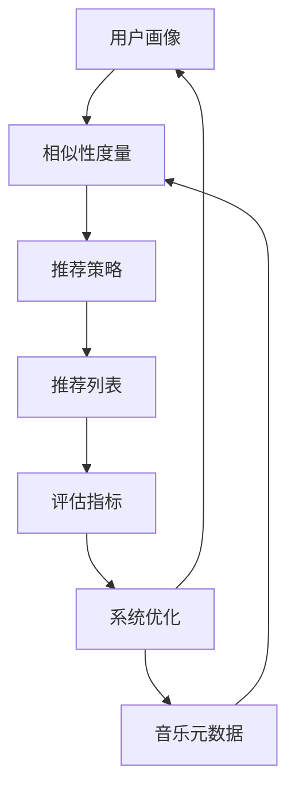

# 基于用户的音乐推荐平台

## 1. 背景介绍

### 1.1 问题的由来

在当今时代,音乐无疑已经成为人们生活中不可或缺的一部分。随着互联网技术和流媒体服务的不断发展,音乐的获取和分享变得前所未有的便捷。然而,海量的音乐资源也给用户带来了新的挑战——如何从大量音乐作品中发现自己真正喜欢的音乐?传统的音乐发现方式,如依赖电台推荐、朋友分享等,已经难以满足用户的个性化需求。

因此,构建一个高效、准确的音乐推荐系统,为用户提供个性化的音乐推荐服务,成为了当前音乐行业亟待解决的重要问题。一个优秀的音乐推荐系统不仅能够帮助用户发现新的音乐风格和艺术家,还能够增强用户的音乐体验,提高音乐平台的用户粘性和商业价值。

### 1.2 研究现状

音乐推荐系统的研究一直是信息检索和推荐系统领域的热点话题。目前,主要的音乐推荐算法可以分为三大类:基于内容的推荐(Content-based)、协同过滤推荐(Collaborative Filtering)和混合推荐(Hybrid)。

基于内容的推荐算法通过分析音乐作品的内容特征(如作曲家、流派、节奏等)来推荐相似的音乐作品。这种方法的优点是能够发现用户可能喜欢但尚未接触过的新音乐,但缺点是难以解决"冷启动"问题(对于新用户或新音乐作品缺乏足够的数据)。

协同过滤推荐算法则是基于用户之间的相似性,为目标用户推荐与其他相似用户喜欢的音乐作品。这种方法能够较好地解决"冷启动"问题,但存在"数据稀疏"(用户评分数据较少)和"灰羊"(用户兴趣独特)等挑战。

混合推荐算法则是将上述两种方法结合,试图利用各自的优势,提高推荐的准确性和多样性。

### 1.3 研究意义

构建一个高效、准确的音乐推荐系统,不仅能够为用户提供个性化的音乐体验,还能为音乐行业带来巨大的商业价值。一个优秀的推荐系统可以:

1. 增强用户体验,提高用户粘性
2. 发现潜在的音乐偏好,促进音乐多样性
3. 为音乐创作者提供更广阔的曝光机会
4. 为音乐平台带来更多的收益和竞争优势

因此,研究和开发高质量的音乐推荐算法和系统,对于音乐行业的可持续发展至关重要。

### 1.4 本文结构  

本文将围绕基于用户的音乐推荐平台这一主题,从理论和实践两个层面进行深入探讨。

理论层面,我们将介绍音乐推荐系统的核心概念、算法原理和数学模型,并对其进行详细的解释和案例分析。

实践层面,我们将基于实际项目,提供完整的代码实现和运行结果展示,帮助读者更好地理解和掌握音乐推荐系统的开发过程。

此外,本文还将探讨音乐推荐系统的实际应用场景、未来发展趋势和面临的挑战,并推荐相关的学习资源和开发工具。

最后,我们将总结本文的主要内容,并对音乐推荐系统的研究前景进行展望。

## 2. 核心概念与联系

在深入探讨音乐推荐算法之前,我们需要先了解一些核心概念及其相互关系。

### 2.1 用户画像(User Profile)

用户画像是描述用户特征和偏好的数据集合,通常包括以下几个方面:

- 人口统计学信息(如年龄、性别、地理位置等)
- 音乐偏好(如喜欢的流派、艺术家、曲风等)
- 历史行为数据(如播放记录、评分记录等)

构建准确的用户画像是实现个性化推荐的基础。

### 2.2 音乐元数据(Music Metadata)

音乐元数据是描述音乐作品本身特征的结构化信息,包括:

- 编目数据(如艺术家、专辑、流派、发行年份等)
- 内容特征(如节奏、调性、情感等)

丰富的音乐元数据有助于更精准地匹配用户偏好。

### 2.3 相似性度量(Similarity Measure)

相似性度量是衡量两个对象相似程度的函数或算法,在音乐推荐系统中常用于:

- 计算用户之间的相似性(用于协同过滤推荐)
- 计算音乐作品之间的相似性(用于基于内容的推荐)

常见的相似性度量方法包括欧几里得距离、余弦相似度、皮尔逊相关系数等。

### 2.4 推荐策略(Recommendation Strategy)

推荐策略指的是根据用户画像、音乐元数据和相似性度量,生成推荐列表的具体算法逻辑。主要包括:

- 基于内容推荐
- 协同过滤推荐
- 混合推荐

不同的推荐策略具有不同的优缺点,需要根据具体场景进行权衡选择。

### 2.5 评估指标(Evaluation Metrics)

为了评估推荐系统的效果,我们需要一些量化的评估指标,常见的包括:

- 准确率(Accuracy)
- 覆盖率(Coverage)
- 多样性(Diversity)
- 新颖性(Novelty)
- 健壮性(Robustness)

合理选择和权衡这些指标,对于构建高质量的推荐系统至关重要。

### 2.6 核心概念关系

上述核心概念相互关联、环环相扣,共同构建了音乐推荐系统的理论基础。准确的用户画像和丰富的音乐元数据为相似性计算提供数据支持;相似性度量则为推荐策略生成准确的推荐列表;评估指标则用于反馈优化整个系统。

## 3. 核心算法原理 & 具体操作步骤

### 3.1 算法原理概述

音乐推荐系统的核心算法主要包括基于内容推荐算法和协同过滤推荐算法两大类。

#### 3.1.1 基于内容推荐算法

基于内容推荐算法的核心思想是:分析用户过去喜欢的音乐作品,发现其内容特征,然后推荐具有相似内容特征的新音乐作品。

该算法的一般流程如下:

1. 从用户历史行为数据中提取用户偏好
2. 计算音乐作品之间的内容相似度
3. 为用户推荐与其偏好相似的音乐作品

常见的基于内容推荐算法包括TF-IDF(词频-逆文档频率)、主题模型(如LDA)等。

#### 3.1.2 协同过滤推荐算法  

协同过滤推荐算法的核心思想是:找到与目标用户有相似兴趣爱好的其他用户,然后推荐这些相似用户喜欢的音乐作品。

该算法的一般流程如下:

1. 计算用户之间的相似度
2. 找到与目标用户最相似的邻居用户
3. 推荐这些邻居用户喜欢但目标用户尚未听过的音乐作品

常见的协同过滤算法包括基于用户的协同过滤(User-based CF)、基于物品的协同过滤(Item-based CF)、基于模型的协同过滤(Model-based CF,如矩阵分解)等。

### 3.2 算法步骤详解

接下来,我们将详细介绍基于用户的协同过滤算法(User-based CF)的具体实现步骤。

#### 3.2.1 数据预处理

1. 收集用户评分数据,构建用户-音乐评分矩阵
2. 处理缺失值(如用均值/中值/0等填充)
3. 对评分数据进行归一化处理(如归一到[0,1]区间)

#### 3.2.2 计算用户相似度

1. 选择相似度度量方法(如皮尔逊相关系数、余弦相似度等)
2. 计算每对用户之间的相似度,构建用户相似度矩阵

#### 3.2.3 生成推荐列表

1. 对目标用户,找到与其最相似的K个邻居用户
2. 从这K个邻居用户中,选取目标用户尚未听过的音乐作品
3. 对这些音乐作品进行打分预测,根据预测分值排序
4. 返回前N个最高分的音乐作品作为推荐列表

其中,打分预测可以使用加权求和的方式:

$$
\hat{r}_{u,i} = \overline{r}_u + \frac{\sum\limits_{v \in N(u)} \text{sim}(u, v) \times (r_{v,i} - \overline{r}_v)}{\sum\limits_{v \in N(u)} |\text{sim}(u, v)|}
$$

其中:
- $\hat{r}_{u,i}$ 表示对用户u对音乐作品i的预测评分
- $\overline{r}_u$ 表示用户u的平均评分
- $N(u)$ 表示用户u的邻居集合
- $\text{sim}(u, v)$ 表示用户u和v的相似度
- $r_{v,i}$ 表示用户v对音乐作品i的实际评分
- $\overline{r}_v$ 表示用户v的平均评分

#### 3.2.4 算法优化

为了提高算法的准确性和健壮性,我们可以进行以下优化:

1. 相似度计算优化(如引入反馈循环、时间衰减等)
2. 邻居选择优化(如引入相似度阈值、调整K值等)
3. 评分预测优化(如引入基线预测、协同过滤矩阵分解等)
4. 冷启动问题优化(如结合基于内容推荐、利用社交网络信息等)

### 3.3 算法优缺点

#### 3.3.1 优点

1. 可解释性强,推荐结果具有一定的解释逻辑
2. 可利用用户之间的偏好关联,发现隐藏的相似兴趣
3. 可较好地解决"冷启动"问题

#### 3.3.2 缺点  

1. 存在数据稀疏问题,用户评分数据往往较少
2. 对于具有独特兴趣爱好的"灰羊"用户,推荐效果较差
3. 计算复杂度较高,需要计算所有用户对之间的相似度

### 3.4 算法应用领域

基于用户的协同过滤算法不仅可应用于音乐推荐领域,还可应用于其他推荐场景,如:

- 电影/视频推荐
- 新闻/资讯推荐  
- 电子商务产品推荐
- 社交网络好友推荐
- 等等

只要存在用户对项目的评分或反馈数据,就可以尝试应用该算法。

## 4. 数学模型和公式 & 详细讲解 & 举例说明

### 4.1 数学模型构建

在构建音乐推荐系统的数学模型时,我们通常需要考虑以下几个主要因素:

1. 用户(Users)
2. 音乐作品(Items)
3. 用户对音乐作品的评分或反馈(Ratings)

我们可以将这些因素抽象为一个三元组 $(u, i, r)$,其中:

- $u \in U$ 表示用户集合中的一个用户
- $i \in I$ 表示音乐作品集合中的一个作品
- $r \in R$ 表示用户u对作品i的评分或反馈

基于这个三元组,我们可以构建一个用户-音乐评分矩阵 $R$:

$$
R = 
\begin{bmatrix}
r_{1,1} & r_{1,2} & \cdots & r_{1,n} 