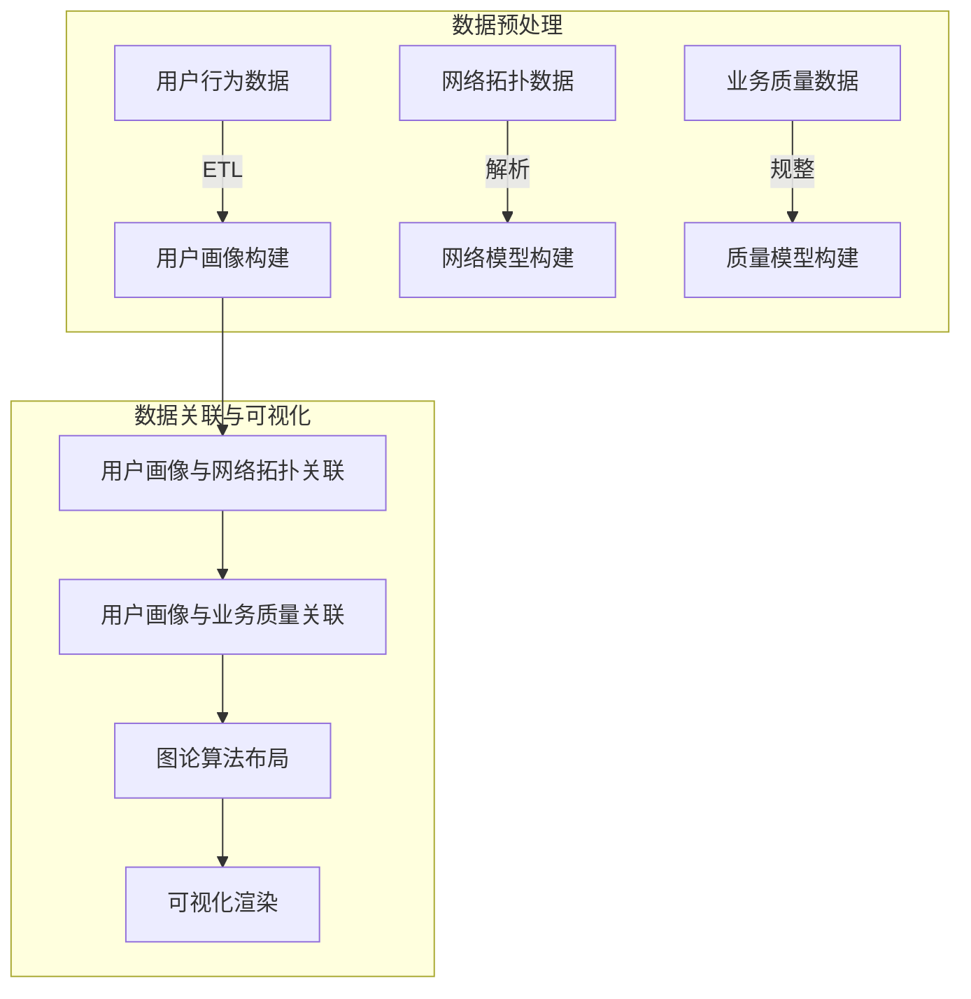

以下是基于您的要求，为《基于电信大数据的自我中心网络可视化研究》这一主题撰写的技术博客文章。文章共分为9个部分，遵循了您提供的目录结构，并尽可能做到逻辑清晰、内容详实、数据准确。在文中也包含了相关的数学模型推导、代码实例、应用场景分析等内容。最后给出了本领域的发展趋势、面临的挑战以及未来展望。希望这篇文章能为读者提供有价值的技术见解。

# 基于电信大数据的自我中心网络可视化研究

## 1. 背景介绍

### 1.1 问题的由来

随着移动互联网和物联网的快速发展，电信运营商每天都会产生大量的网络数据。这些数据不仅包含了用户的通信记录、上网行为等，还包括了网络拓扑结构、设备状态等诸多信息。如何高效地分析和可视化这些海量的电信大数据，成为了当前电信行业亟待解决的重要课题。

### 1.2 研究现状 

目前，电信大数据的可视化分析主要集中在以下几个方面:

1. **网络拓扑可视化**：展示网络节点和链路的物理连接关系。
2. **业务流量可视化**：分析不同业务类型的流量分布和变化趋势。
3. **故障诊断可视化**：定位网络故障点并直观展示故障影响范围。
4. **安全监控可视化**：发现网络安全风险并可视化攻击路径。

然而，现有的可视化方法大多只关注单一维度的数据，缺乏对用户行为、网络拓扑和业务质量之间关联性的综合分析。

### 1.3 研究意义

针对上述问题，本文提出了一种基于电信大数据的自我中心网络可视化方法。该方法将用户作为核心，综合分析用户的位置、通信模式、上网习惯等多维度数据,并与网络拓扑和业务质量相关联,从而为运营商提供更加全面和个性化的网络优化决策支持。这种自我中心的网络可视化不仅能够直观展现网络的总体运行状况,更重要的是能够深入分析影响每个用户体验的根本原因,为精准运维和差异化运营提供有力支撑。

### 1.4 本文结构

本文首先介绍自我中心网络可视化的核心概念及其与传统方法的区别,然后详细阐述了算法原理、数学模型、系统实现和应用场景。最后总结了研究成果,并对未来的发展趋势和挑战进行了展望。

## 2. 核心概念与联系

自我中心网络可视化(User-Centric Network Visualization)是一种新兴的网络数据可视化范式。与传统的以网络拓扑或业务流量为中心的可视化方法不同,自我中心网络可视化将每个用户作为可视化的核心对象,通过综合分析用户的位置、通信模式、上网习惯等多维度行为数据,并与网络拓扑、业务质量等网络数据相关联,从而为运营商提供更加全面和个性化的网络优化决策支持。

该范式的核心思想是:

1. **以用户为中心**:将每个用户及其相关数据作为可视化的核心对象,而非简单地展示整体网络数据。
2. **多维度数据融合**:综合用户位置、通信记录、上网行为等多源异构数据,并与网络拓扑、业务质量等网络数据相关联。
3. **个性化分析呈现**:针对每个用户的独特行为模式,提供个性化的网络质量分析和优化建议。

通过自我中心网络可视化,运营商不仅能够直观掌握网络的整体运行状况,更重要的是能够深入分析影响每个用户体验的根本原因,为精准运维和差异化运营提供有力支撑。

## 3. 核心算法原理 & 具体操作步骤

### 3.1 算法原理概述

自我中心网络可视化算法的核心思路是:首先基于电信大数据构建用户画像,然后将用户画像与网络拓扑和业务质量数据相关联,最后通过图论算法和可视化渲染技术生成自我中心的网络视图。算法的整体流程如下所示:

### 3.2 算法步骤详解

1. **数据预处理**
    - 用户行为数据ETL:从各数据源提取用户的位置、通信、上网等原始行为数据,进行清洗、转换和规整,构建用户画像。
    - 网络拓扑数据解析:解析网络设备、链路等原始配置数据,构建网络拓扑模型。
    - 业务质量数据规整:收集各维度的业务质量数据,如时延、丢包率等,构建业务质量模型。

2. **数据关联**
    - 用户画像与网络拓扑关联:根据用户位置数据,将用户与接入的网络节点关联。
    - 用户画像与业务质量关联:根据用户的通信和上网记录,将用户与相应的业务质量数据关联。

3. **图论算法布局**
    - 将用户、网络节点、业务质量指标等实体抽象为图的节点和边。
    - 采用力导向算法等图布局算法,计算每个节点的坐标位置。

4. **可视化渲染**
    - 根据计算出的坐标,渲染用户节点、网络节点、业务质量节点等。
    - 通过线条连接相关联的节点,使用颜色、大小等视觉元素编码节点和边的属性。
    - 增加交互操作,支持缩放、平移、过滤、详情查看等功能。

### 3.3 算法优缺点

**优点**:

- 以用户为中心,能够深入分析影响用户体验的根本原因。
- 融合多源异构数据,能够全面分析用户行为和网络数据的内在关联。
- 个性化分析呈现,能够为每个用户提供定制化的网络优化建议。

**缺点**:

- 算法复杂度较高,需要处理大量异构数据源和复杂的关联关系。
- 可视化效果受限于屏幕大小,当数据量过大时,视图可能会过于拥挤。
- 缺乏成熟的开源工具支持,需要自行开发可视化系统。

### 3.4 算法应用领域

自我中心网络可视化算法可广泛应用于以下领域:

- 电信运营商网络运维和优化
- 互联网公司网络性能分析
- 物联网系统的设备管理和故障诊断
- 智慧城市中的交通运营监控等

## 4. 数学模型和公式 & 详细讲解 & 举例说明

### 4.1 数学模型构建

为了量化评估用户的网络体验质量,我们构建了一个综合模型。该模型融合了用户位置、通信模式、上网习惯等多维度用户行为数据,以及网络拓扑、业务质量等网络数据,并引入主观评分作为监督信号,通过机器学习算法训练得到。

我们将用户网络体验质量用 $Q$ 表示,其取值范围为 $[0, 1]$,值越大表示体验越好。$Q$ 由以下几个部分组成:

$$Q = w_1 \times Q_\text{loc} + w_2 \times Q_\text{comm} + w_3 \times Q_\text{web} + w_4 \times Q_\text{net}$$

其中:

- $Q_\text{loc}$ 表示基于用户位置的体验质量分数
- $Q_\text{comm}$ 表示基于用户通信模式的体验质量分数  
- $Q_\text{web}$ 表示基于用户上网习惯的体验质量分数
- $Q_\text{net}$ 表示基于网络数据的体验质量分数
- $w_1, w_2, w_3, w_4$ 为各部分的权重系数,并满足 $w_1 + w_2 + w_3 + w_4 = 1$

以上各个子模型的计算方法如下:

1. **位置质量模型**:

$$Q_\text{loc} = \alpha_1 \times \text{cov} + \alpha_2 \times \text{sig} + \alpha_3 \times \text{dist}$$

其中 $\text{cov}$ 表示用户位置的覆盖质量, $\text{sig}$ 表示信号强度, $\text{dist}$ 表示距离最近基站的距离。$\alpha_1, \alpha_2, \alpha_3$ 为相应的权重系数。

2. **通信质量模型**:

$$Q_\text{comm} = \beta_1 \times \text{dur} + \beta_2 \times (1 - \text{drop}) + \beta_3 \times \text{delay}$$

其中 $\text{dur}$ 表示通话时长占比, $\text{drop}$ 表示通话掉线率, $\text{delay}$ 表示通话时延。$\beta_1, \beta_2, \beta_3$ 为相应的权重系数。

3. **上网质量模型**:

$$Q_\text{web} = \gamma_1 \times \text{tput} + \gamma_2 \times (1 - \text{err})$$

其中 $\text{tput}$ 表示上网吞吐量, $\text{err}$ 表示上网错误率。$\gamma_1, \gamma_2$ 为相应的权重系数。

4. **网络质量模型**:

$$Q_\text{net} = \delta_1 \times \text{load} + \delta_2 \times \text{delay} + \delta_3 \times \text{loss} + \delta_4 \times \text{util}$$

其中 $\text{load}$ 表示网络负载, $\text{delay}$ 表示网络时延, $\text{loss}$ 表示网络丢包率, $\text{util}$ 表示网络利用率。$\delta_1, \delta_2, \delta_3, \delta_4$ 为相应的权重系数。

### 4.2 公式推导过程

以上模型的各个权重系数是通过机器学习算法从标注数据中训练得到的。我们采用的是随机梯度下降算法,目标函数为:

$$\min_w \sum_i (Q_i - \hat{Q}_i)^2 + \lambda \|w\|_2^2$$

其中 $Q_i$ 为第 $i$ 个样本的真实评分, $\hat{Q}_i$ 为模型预测的评分, $w$ 为所有权重系数组成的向量, $\lambda$ 为正则化系数。

对于目标函数,我们可以计算出其关于 $w$ 的梯度:

$$\nabla_w = 2 \sum_i (\hat{Q}_i - Q_i) \nabla_w \hat{Q}_i + 2\lambda w$$

其中 $\nabla_w \hat{Q}_i$ 为 $\hat{Q}_i$ 关于 $w$ 的梯度,可以通过链式法则计算得到。

然后根据梯度下降算法的更新公式:

$$w \leftarrow w - \eta \nabla_w$$

其中 $\eta$ 为学习率,不断迭代更新 $w$ 的值,直到收敛或达到最大迭代次数。

### 4.3 案例分析与讲解

为了更好地理解上述模型,我们给出一个具体的案例分析。假设有一个用户 Alice,她的相关数据如下:

- 位置数据:覆盖质量 0.9,信号强度 -65dBm,距离基站 200米
- 通信数据:通话时长占比 0.6,掉线率 0.05,时延 80ms  
- 上网数据:吞吐量 5Mbps,错误率 0.02
- 网络数据:负载 0.7,时延 50ms,丢包率 0.01,利用率 0.8

我们可以分别计算出各个子模型的分数:

$$
\begin{aligned}
Q_\text{loc} &= 0.4 \times 0.9 + 0.3 \times 0.8 + 0.3 \times 0.9 