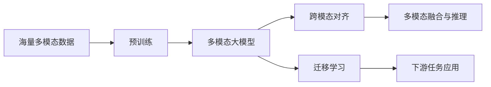

# 多模态大模型：技术原理与实战 OpenAI成功的因素

关键词：多模态大模型、深度学习、预训练、迁移学习、OpenAI、GPT、DALL-E、Whisper、人工智能

## 1. 背景介绍
### 1.1 问题的由来
随着人工智能技术的飞速发展,多模态大模型已成为当前学术界和工业界的研究热点。多模态大模型能够同时处理文本、图像、音频等不同模态的数据,实现跨模态的信息理解和生成。这为构建更加智能、通用的人工智能系统奠定了基础。而OpenAI作为该领域的先驱,其发布的GPT、DALL-E、Whisper等多模态大模型更是引领了这一研究方向。
### 1.2 研究现状 
目前,谷歌、微软、Meta等科技巨头以及众多高校和研究机构都在多模态大模型领域开展研究。一些代表性的工作包括:
- GPT-3: OpenAI开发的大规模语言模型,具有强大的自然语言理解和生成能力
- DALL-E: OpenAI发布的文本到图像生成模型,可根据文本描述生成逼真的图像
- Flamingo: DeepMind提出的视觉语言模型,在图像问答等任务上取得了突破
- OFA: 清华大学等提出的多模态大模型,实现了跨模态的统一建模和学习

这些研究工作极大地推动了多模态大模型技术的发展和应用。

### 1.3 研究意义
多模态大模型的研究具有重要意义:

1. 促进人工智能走向通用智能。多模态大模型能够处理不同形式的信息,这是迈向通用人工智能的关键一步。
2. 拓展人工智能应用场景。多模态技术使得人工智能系统能理解图像、语音等非结构化数据,极大拓宽了其应用范围。
3. 解决传统人工智能的局限性。以往的人工智能系统往往只能处理单一模态,而多模态方法打破了这一限制。
4. 洞察人类智能的奥秘。多模态大模型模拟了人类的认知过程,有助于从计算的角度理解人类智能。

### 1.4 本文结构
本文将围绕以下内容展开:

- 第2部分介绍多模态大模型的核心概念与内在联系
- 第3部分阐述多模态大模型的核心算法原理与具体操作步骤
- 第4部分建立多模态大模型的数学模型,并结合案例进行公式推导和详细讲解
- 第5部分通过代码实例,对多模态大模型的实现进行详细说明
- 第6部分分析多模态大模型的实际应用场景和未来应用前景
- 第7部分推荐多模态大模型领域的学习资源、开发工具和相关文献
- 第8部分总结全文,展望多模态大模型技术的未来发展趋势与面临的挑战
- 第9部分列举多模态大模型研究中的常见问题,并给出解答

## 2. 核心概念与联系

在探讨多模态大模型的技术原理之前,我们有必要厘清其中的一些核心概念:

- 多模态学习:能够处理和关联来自多种通信渠道和信息源的数据,并从中提取有意义的模式和见解的机器学习范式。
- 大模型:参数量极大(数亿到数千亿)的深度神经网络模型,通过海量数据训练而成,具有强大的表示和泛化能力。
- 预训练:在大规模无标注数据上进行自监督学习,让模型掌握数据的一般性特征和规律。这是构建大模型的关键。  
- 迁移学习:将预训练模型应用到下游任务中,通过微调或提示学习等方式实现模型能力的迁移。
- 跨模态对齐:将不同模态的表示映射到一个共同的语义空间,以实现模态间的信息融合和交互。

下图展示了这些概念之间的内在联系:

可以看出,多模态大模型以海量数据为基础,通过预训练掌握了丰富的先验知识。在此基础上,跨模态对齐技术将不同模态数据的表示对齐到一个共享的语义空间,使得多模态信息能够无缝融合。同时,迁移学习则将大模型的能力迁移到各类下游任务中,赋能具体的应用场景。

## 3. 核心算法原理 & 具体操作步骤
### 3.1 算法原理概述
多模态大模型的核心算法可以概括为:基于Transformer的自监督预训练+跨模态对齐+迁移学习。具体而言:

1. 基于Transformer构建大规模神经网络作为骨干模型
2. 在大规模多模态语料上开展自监督预训练,让模型学习不同模态数据的一般性特征
3. 引入跨模态对齐目标,使不同模态特征在语义层面对齐
4. 在下游任务上微调预训练模型,或利用提示学习等方法实现迁移

### 3.2 算法步骤详解

1. Transformer骨干网络:
   - 使用多层Transformer编码器或解码器堆叠而成
   - 引入模态特定的Embedding层将不同模态数据映射为统一的向量表示
   - 采用自注意力机制建模序列内和序列间的依赖关系

2. 自监督预训练:
   - 掩码语言建模(MLM):随机掩盖文本序列的部分Token,让模型预测被掩盖的内容
   - 图像重建:将图像切块,随机掩盖部分块,让模型恢复原始图像
   - 视频预测:让模型预测视频中被掩盖的帧或片段
   - 语音识别:将语音切片,让模型预测对应的文本内容

3. 跨模态对齐:
   - 对比学习:最大化不同模态特征在语义层面的一致性,最小化负样本的相似度
   - 知识蒸馏:用教师模型指导学生模型,将不同模态数据的知识迁移到统一的语义空间
   - 对偶学习:同时优化从模态A到B和从B到A的映射,实现模态间的双向对齐

4. 迁移学习:  
   - 微调:在下游任务的标注数据上对预训练模型进行微调,使其适应具体任务
   - 提示学习:设计适当的输入提示,引导预训练模型生成所需的结果,而无需微调模型参数
   - 零样本学习:直接将预训练模型应用于新任务,无需任何训练样本

### 3.3 算法优缺点

优点:
- 通过预训练获得强大的特征提取和表示能力,减少对标注数据的依赖
- 跨模态对齐使得模型能够建立起不同模态信息间的联系,实现多模态融合
- 迁移学习使得模型能够快速适应新任务,具有很好的泛化能力

缺点:  
- 对计算资源要求高,训练成本大
- 模型体积庞大,推理速度慢,不易部署
- 需要海量数据进行预训练,数据质量要求高
- 跨模态对齐可能引入噪声,影响模型性能

### 3.4 算法应用领域

多模态大模型可应用于以下领域:

- 智能问答:根据图像、视频等多模态信息回答用户问题
- 跨模态检索:根据一种模态的查询(如文本)检索另一种模态的内容(如图像) 
- 内容生成:根据文本描述生成图像,或根据图像生成文本描述
- 机器翻译:实现语音到语音、语音到文本、文本到手语等多模态翻译
- 医学诊断:融合医学影像、病历、基因组学等多模态数据,辅助疾病诊断

## 4. 数学模型和公式 & 详细讲解 & 举例说明
### 4.1 数学模型构建
我们以跨模态对比学习为例,构建多模态大模型的数学模型。

设有两种模态的数据$x_1$和$x_2$,它们在语义层面是一致的(如同一个概念的文本描述和图像)。我们希望学习两个编码器$f_1$和$f_2$,将$x_1$和$x_2$映射到同一个语义空间,使得$f_1(x_1)$和$f_2(x_2)$在该空间中最大化它们的相似度。

形式化地,我们优化以下对比学习损失函数:

$$
\mathcal{L}=-\log \frac{\exp \left(\operatorname{sim}\left(f_{1}\left(x_{1}\right), f_{2}\left(x_{2}\right)\right) / \tau\right)}{\sum_{x_{2}^{\prime} \in X_{2}} \exp \left(\operatorname{sim}\left(f_{1}\left(x_{1}\right), f_{2}\left(x_{2}^{\prime}\right)\right) / \tau\right)}
$$

其中$\operatorname{sim}$表示相似度度量(如点积或余弦相似度),$\tau$是温度超参数,$X_2$表示模态2的数据集。直观地,该损失函数鼓励$f_1(x_1)$与$f_2(x_2)$的相似度尽可能大,而与其他无关样本$f_2(x_2')$的相似度尽可能小。

### 4.2 公式推导过程

对于一个正样本对$(x_1,x_2)$,我们希望最小化其负对数似然:

$$
\begin{aligned}
\mathcal{L} &=-\log p\left(x_{2} \mid x_{1}\right) \\
&=-\log \frac{\exp \left(\operatorname{sim}\left(f_{1}\left(x_{1}\right), f_{2}\left(x_{2}\right)\right) / \tau\right)}{\sum_{x_{2}^{\prime} \in X_{2}} \exp \left(\operatorname{sim}\left(f_{1}\left(x_{1}\right), f_{2}\left(x_{2}^{\prime}\right)\right) / \tau\right)}
\end{aligned}
$$

直观上,该公式可以理解为:给定$x_1$,我们希望正样本$x_2$的概率最大,而其他负样本$x_2'$的概率最小。

假设相似度度量为点积,即$\operatorname{sim}(u,v)=u^\top v$,则损失函数可进一步写作:

$$
\mathcal{L}=-\log \frac{\exp \left(f_{1}\left(x_{1}\right)^\top f_{2}\left(x_{2}\right) / \tau\right)}{\sum_{x_{2}^{\prime} \in X_{2}} \exp \left(f_{1}\left(x_{1}\right)^\top f_{2}\left(x_{2}^{\prime}\right) / \tau\right)}
$$

通过最小化该损失函数,我们可以学习到两个编码器$f_1$和$f_2$,使得它们将语义一致的$x_1$和$x_2$映射到相似的表示,而将语义不一致的样本映射到相异的表示。

### 4.3 案例分析与讲解

我们以图像-文本对比学习为例进行说明。给定一个图像$x_1$和与之匹配的文本描述$x_2$,我们通过卷积神经网络$f_1$将图像编码为向量,通过Transformer$f_2$将文本编码为向量。然后,我们计算两个向量的点积作为它们的相似度:

$$\operatorname{sim}(f_1(x_1), f_2(x_2)) = f_1(x_1)^\top f_2(x_2)$$

接着,我们从数据集中随机采样一批负样本$\{x_{2,1}',\cdots,x_{2,K}'\}$,它们与$x_1$在语义上不匹配。我们计算这些负样本与$x_1$的相似度,并将它们与正样本的相似度一起代入损失函数:

$$
\mathcal{L}=-\log \frac{\exp \left(f_{1}\left(x_{1}\right)^\top f_{2}\left(x_{2}\right) / \tau\right)}{\exp \left(f_{1}\left(x_{1}\right)^\top f_{2}\left(x_{2}\right) / \tau\right) + \sum_{i=1}^K \exp \left(f_{1}\left(x_{1}\right)^\top f_{