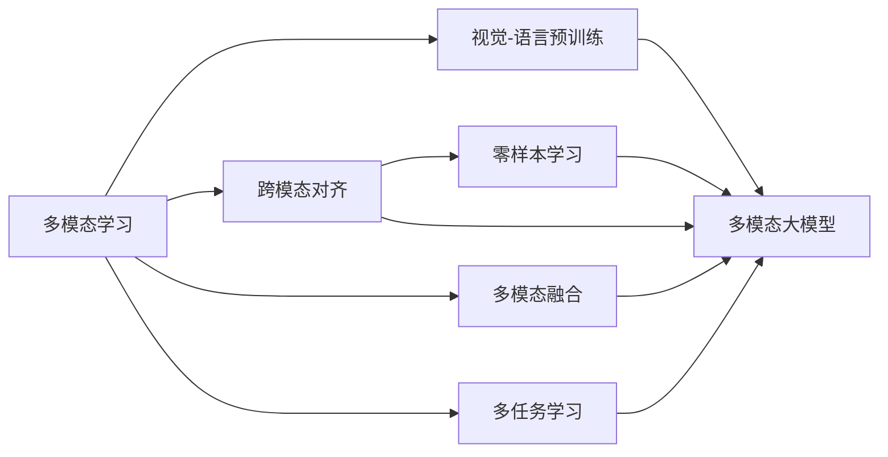

# 多模态大模型：技术原理与实战 多模态大模型的部署

关键词：多模态大模型, 视觉语言预训练, 跨模态对齐, 零样本学习, 多模态融合, 多任务学习

## 1. 背景介绍

### 1.1  问题的由来

随着人工智能技术的飞速发展,单模态的语言模型和视觉模型已经取得了令人瞩目的成就。然而,现实世界中的信息往往是多模态的,包含文本、图像、视频、音频等不同形式。如何将这些异构的多模态数据有效地融合,构建更加通用和强大的人工智能系统,成为了当前学术界和工业界的研究热点。多模态大模型正是在这一背景下应运而生,旨在打破不同模态之间的壁垒,实现跨模态的信息理解和生成。

### 1.2  研究现状

近年来,多模态大模型取得了长足的进展。一方面,研究者们提出了多种视觉-语言预训练方法,如ViLBERT、LXMERT、UNITER等,通过在大规模多模态数据上进行预训练,使模型能够同时理解视觉和语言信息。另一方面,跨模态对齐技术如对比语言-图像预训练(CLIP)、视觉-语言导航(VLN)等,使得模型能够建立起不同模态之间的连接。此外,多模态融合方法如多模态Transformer、多模态注意力机制等,进一步增强了模型处理多模态信息的能力。

### 1.3  研究意义 

多模态大模型的研究具有重要的理论和实践意义。从理论上讲,它有助于我们深入理解人类的多模态感知和认知机制,探索人工智能系统的构建原理。从实践上讲,多模态大模型在智能问答、视觉对话、图像描述、视频理解等诸多任务中展现出了巨大的应用潜力,有望推动智能助手、智能搜索、无人驾驶、医疗诊断等领域的技术革新。

### 1.4  本文结构

本文将围绕多模态大模型的技术原理与实战展开深入探讨。第2节介绍多模态大模型的核心概念与关联；第3节阐述多模态大模型的核心算法原理与具体操作步骤；第4节给出相关的数学模型和公式,并结合实例进行详细讲解；第5节通过代码实例,演示多模态大模型的实现细节；第6节分析多模态大模型的实际应用场景；第7节推荐相关的工具和学习资源；第8节总结全文,展望多模态大模型的未来发展趋势与挑战；第9节列举常见问题与解答。

## 2. 核心概念与联系

多模态大模型涉及一系列核心概念,它们相互关联,共同构成了多模态大模型的理论基础。

- 多模态学习：研究如何处理和融合来自多个信息源(模态)的数据,如文本、图像、音频、视频等,以完成预测、决策等任务。多模态学习是多模态大模型的理论基础。

- 视觉-语言预训练：通过在大规模图文对数据上进行预训练,使模型能够同时理解图像和文本信息,建立起视觉-语言的联系。视觉-语言预训练是构建多模态大模型的关键步骤。

- 跨模态对齐：旨在学习不同模态(如图像和文本)之间的对应关系,使它们在公共语义空间中对齐。跨模态对齐使得多模态大模型能够灵活地在不同模态之间进行信息转换。

- 多模态融合：将来自不同模态的信息进行有效整合,以获得更全面、更准确的理解。常见的融合方式包括早期融合、晚期融合和混合融合。

- 多任务学习：同时学习多个相关任务,通过共享知识来提高模型的泛化能力。在多模态大模型中,多任务学习有助于提升模型在不同任务上的表现。

- 零样本学习：模型能够理解和处理未在训练集中出现过的概念或实例。多模态大模型通过跨模态对齐,具备了一定的零样本学习能力。

下图展示了多模态大模型的核心概念及其联系:

## 3. 核心算法原理 & 具体操作步骤

### 3.1  算法原理概述

多模态大模型的核心算法主要包括视觉-语言预训练、跨模态对齐和多模态融合。

视觉-语言预训练通过自监督学习,在大规模图文对数据上训练模型,使其能够同时理解图像和文本信息。常见的预训练任务包括掩码语言建模(MLM)、图像-文本匹配(ITM)、图像-文本对齐(ITA)等。

跨模态对齐旨在学习不同模态之间的对应关系,常见的方法包括对比语言-图像预训练(CLIP)、视觉-语言导航(VLN)等。CLIP通过最大化图像和对应文本的余弦相似度,使得图像和文本在公共语义空间中对齐。VLN则通过引导智能体在虚拟环境中导航,建立视觉-语言-动作之间的联系。

多模态融合用于整合不同模态的信息,常见的方法包括多模态Transformer、多模态注意力机制等。多模态Transformer在自注意力机制的基础上,引入了跨模态注意力,使得模型能够捕捉不同模态之间的交互。多模态注意力机制则通过加权融合不同模态的特征,自适应地调整不同模态的重要性。

### 3.2  算法步骤详解

以视觉-语言预训练为例,详细介绍多模态大模型的训练步骤:

1. 数据准备：收集大规模的图文对数据,如COCO、Visual Genome等数据集。对图像和文本进行预处理,如图像缩放、文本分词等。

2. 模型构建：设计多模态大模型的架构,如基于Transformer的编码器-解码器结构。初始化模型参数。

3. 预训练任务定义：选择合适的预训练任务,如MLM、ITM、ITA等。根据任务的特点,设计相应的损失函数。

4. 训练过程：将图像和文本输入模型,计算预训练任务的损失函数。使用优化算法(如Adam)更新模型参数,迭代训练直到模型收敛。

5. 微调与评估：在下游任务(如视觉问答、图像描述等)上微调预训练好的模型。使用相应的评估指标(如准确率、BLEU等)评估模型性能。

跨模态对齐和多模态融合的步骤与之类似,主要区别在于模型架构和损失函数的设计。

### 3.3  算法优缺点

多模态大模型的优点包括：
- 能够有效利用大规模多模态数据,学习丰富的视觉-语言表征。
- 通过跨模态对齐,建立起不同模态之间的连接,具备一定的零样本学习能力。
- 多任务学习有助于提升模型的泛化能力,在多个任务上取得优异表现。

多模态大模型的缺点包括：
- 训练成本高,需要大规模的计算资源和数据支持。
- 模型复杂度高,解释性和可控性相对较差。
- 对数据质量和数据分布敏感,容易受到偏见和噪声的影响。

### 3.4  算法应用领域

多模态大模型在诸多领域展现出广阔的应用前景,包括：
- 智能问答：回答图像相关的问题,如"图中有几个人？"、"图中的人在做什么？"等。
- 视觉对话：根据图像和对话历史,生成恰当的回复,实现多轮图像问答。
- 图像描述：根据图像内容,生成自然、连贯的文本描述。
- 视频理解：分析视频内容,进行动作识别、事件检测、视频问答等。
- 机器翻译：将图像作为辅助信息,提升多语言翻译的质量。
- 跨模态检索：根据文本查找相关的图像,或根据图像查找相关的文本。

## 4. 数学模型和公式 & 详细讲解 & 举例说明

### 4.1  数学模型构建

以视觉-语言预训练中的图像-文本匹配(ITM)任务为例,说明如何构建多模态大模型的数学模型。

假设图像编码为$v\in \mathbb{R}^{d_v}$,文本编码为$t\in \mathbb{R}^{d_t}$,其中$d_v$和$d_t$分别为图像和文本的特征维度。我们希望学习一个匹配函数$f(v,t)$,用于判断图像$v$和文本$t$是否匹配。

一种常见的做法是将图像和文本映射到同一语义空间,然后计算它们的相似度。设计两个映射函数$\phi_v:\mathbb{R}^{d_v}\to\mathbb{R}^d$和$\phi_t:\mathbb{R}^{d_t}\to\mathbb{R}^d$,分别将图像和文本映射到$d$维公共语义空间。匹配函数可定义为:

$$
f(v,t)=\phi_v(v)^T\phi_t(t)
$$

直观地,$f(v,t)$表示图像$v$和文本$t$在公共语义空间中的内积相似度。$f(v,t)$越大,说明图像和文本越匹配。

### 4.2  公式推导过程

为了学习匹配函数$f(v,t)$,我们需要设计合适的损失函数。一种常用的损失函数是对比损失(Contrastive Loss):

$$
\mathcal{L}=-\mathbb{E}_{(v,t)\sim \mathcal{D}}\left[\log\frac{\exp(f(v,t))}{\exp(f(v,t))+\sum_{t'\sim \mathcal{D}}\exp(f(v,t'))}\right]
$$

其中,$\mathcal{D}$表示图文对数据的分布,$(v,t)$为正样本对,$(v,t')$为负样本对。对比损失鼓励正样本对的相似度高于负样本对。

假设$\phi_v$和$\phi_t$为线性映射,即$\phi_v(v)=W_vv$,$\phi_t(t)=W_tt$,其中$W_v\in\mathbb{R}^{d\times d_v}$,$W_t\in\mathbb{R}^{d\times d_t}$为待学习的参数矩阵。将其代入匹配函数和损失函数,并利用链式法则和梯度下降法,即可推导出$W_v$和$W_t$的更新公式:

$$
W_v\leftarrow W_v-\eta\frac{\partial\mathcal{L}}{\partial W_v},\quad 
W_t\leftarrow W_t-\eta\frac{\partial\mathcal{L}}{\partial W_t}
$$

其中,$\eta$为学习率。重复迭代上述更新过程,直到损失函数收敛,即可得到匹配函数$f(v,t)$的参数。

### 4.3  案例分析与讲解

以图像描述任务为例,说明如何应用学习好的匹配函数$f(v,t)$。

给定一张图像$v$,我们希望生成与之匹配的文本描述$\hat{t}$。一种思路是从候选文本集合$\mathcal{T}$中选取与图像最匹配的文本:

$$
\hat{t}=\arg\max_{t\in\mathcal{T}}f(v,t)
$$

直观地,我们计算图像$v$与每个候选文本$t$的匹配度$f(v,t)$,选择匹配度最高的文本作为图像的描述。

举个具体的例子,假设给定一张狗的图像$v$,候选文本集合为:
- $t_1$: A dog is running on the grass.
- $t_2$: A cat is sitting on the sofa.
- $t_3$: A bird is flying in the sky.

计算匹配函数$f(v,t_1)$,$f(v,t_2)$,$f(v,t_3)$,假