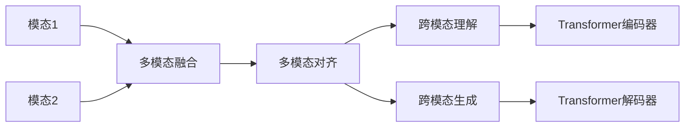

# 多模态大模型：技术原理与实战 多模态大模型的部署

关键词：多模态大模型、跨模态融合、Transformer、CLIP、DALL-E、Stable Diffusion、部署优化

## 1. 背景介绍

### 1.1 问题的由来

随着人工智能技术的飞速发展，单一模态的模型已经无法满足日益复杂的应用需求。图像、文本、语音等不同模态的数据蕴含着丰富的信息，如何有效地整合和利用这些多模态数据，成为了AI领域的重要课题。多模态大模型应运而生，通过学习和融合不同模态的特征表示，实现了跨模态的理解和生成能力，为人工智能的应用开辟了新的空间。

### 1.2 研究现状

目前，多模态大模型已经在学术界和工业界得到了广泛的关注和研究。从早期的多模态融合模型，如多模态Transformer[1]、ViLBERT[2]等，到近期大火的CLIP[3]、DALL-E[4]、Stable Diffusion[5]等，多模态大模型的性能和应用领域不断突破。这些模型在图文匹配、图像生成、视觉问答等任务上取得了显著的效果，展现出了多模态学习的巨大潜力。

### 1.3 研究意义

多模态大模型的研究具有重要的理论和实践意义。从理论上看，多模态学习有助于揭示不同模态数据之间的内在联系，加深对人类认知机制的理解。从实践上看，多模态大模型可以应用于各种场景，如智能搜索、内容创作、医疗诊断、智能教育等，极大地提升人机交互的体验和效率。因此，深入探索多模态大模型的技术原理和实战部署，对于推动人工智能的发展和应用具有重要意义。

### 1.4 本文结构

本文将围绕多模态大模型的技术原理和实战部署展开详细讨论。第2节介绍多模态大模型的核心概念和模态间的关联。第3节重点阐述多模态大模型的核心算法原理和具体操作步骤。第4节深入分析多模态大模型所涉及的数学模型和公式，并给出详细的推导和举例说明。第5节通过具体的代码实例，演示多模态大模型的实现和部署流程。第6节探讨多模态大模型在实际场景中的应用案例和未来展望。第7节推荐相关的学习资源、开发工具和文献资料。第8节总结全文，并对多模态大模型的未来发展趋势和挑战进行展望。

## 2. 核心概念与联系

多模态大模型的核心在于实现不同模态数据的有效融合和表示学习。其中涉及的几个关键概念包括：

- **模态(Modality)**：指数据的不同形式和来源，如图像、文本、语音等。每种模态都有其独特的特征表示和处理方式。
- **跨模态(Cross-modal)**：指不同模态数据之间的关联和交互。多模态模型需要建立模态间的语义对齐和信息传递，实现跨模态的理解和生成。
- **多模态融合(Multimodal Fusion)**：指将多个模态的特征表示进行整合，形成一个联合的多模态表示。常见的融合方式有早期融合、晚期融合和混合融合等。
- **多模态对齐(Multimodal Alignment)**：指在语义层面上建立不同模态数据之间的对应关系，使它们在共同的语义空间中对齐。对齐的目的是实现模态间的信息交互和传递。
- **Transformer**：一种基于自注意力机制的神经网络架构，在多模态大模型中扮演着重要的角色。Transformer可以捕捉模态内和模态间的长距离依赖，实现高效的特征表示学习。

下图展示了多模态大模型的核心概念和它们之间的关系：

从图中可以看出，多模态大模型首先对不同模态的数据进行特征提取和融合，然后通过对齐的方式在语义层面上建立模态间的联系。基于对齐的多模态表示，模型可以实现跨模态的理解和生成任务。其中，Transformer编码器和解码器分别负责多模态特征的编码和解码，是模型的核心组件。

## 3. 核心算法原理 & 具体操作步骤

### 3.1 算法原理概述

多模态大模型的核心算法主要基于Transformer架构和跨模态对比学习。Transformer通过自注意力机制和前馈神经网络，实现了高效的序列建模和特征表示学习。在多模态场景下，Transformer被扩展为多模态Transformer，可以同时处理不同模态的输入，并建立模态间的交互。

跨模态对比学习是另一个重要的算法原理。它通过最大化不同模态数据在共同语义空间中的相似性，实现模态间的对齐和关联。常见的跨模态对比学习方法包括对比语言-图像预训练(CLIP)、对比语言-视频预训练(CLVP)等。

### 3.2 算法步骤详解

以CLIP模型为例，其训练过程可以分为以下几个步骤：

1. **数据准备**：收集大规模的图像-文本对数据，并进行预处理和数据增强。
2. **特征提取**：使用预训练的CNN网络(如ResNet)对图像进行特征提取，得到图像特征向量；使用预训练的文本编码器(如BERT)对文本进行编码，得到文本特征向量。
3. **跨模态对比学习**：对于每个图像-文本对，计算它们在共同语义空间中的相似度分数。然后通过最小化负对的相似度和最大化正对的相似度，构建对比损失函数。
4. **模型优化**：使用梯度下降算法对模型参数进行优化，最小化对比损失函数。在训练过程中，还可以加入正则化技术，如权重衰减、dropout等，以提高模型的泛化能力。
5. **推理与应用**：训练完成后，可以使用学习到的图像编码器和文本编码器，对新的图像和文本进行特征提取和相似度计算，实现跨模态检索、匹配等任务。

### 3.3 算法优缺点

多模态大模型的优点包括：
- 能够有效融合不同模态的信息，实现跨模态的理解和生成。
- 通过对比学习，可以在无监督或弱监督的情况下学习到鲁棒的多模态表示。
- 基于Transformer的架构，具有强大的建模能力和可扩展性。

同时，多模态大模型也存在一些局限性：
- 训练需要大规模的多模态数据，对计算资源和存储空间要求较高。
- 模态间的对齐和融合仍然是一个挑战，需要设计更加精细的融合机制。
- 跨模态生成的质量和多样性有待进一步提升。

### 3.4 算法应用领域

多模态大模型在许多领域都有广泛的应用，包括：
- 跨模态检索：根据文本描述检索相关的图像或视频，或根据图像查找相关的文本。
- 图像/视频字幕生成：自动为图像或视频生成自然语言描述。
- 视觉问答：根据图像和问题，生成自然语言答案。
- 多模态内容创作：根据文本提示生成相关的图像、音频、视频等。
- 多模态情感分析：综合分析文本、图像、语音等模态的情感倾向。

## 4. 数学模型和公式 & 详细讲解 & 举例说明

### 4.1 数学模型构建

多模态大模型的数学模型通常基于对比学习和交叉熵损失函数。以CLIP模型为例，其目标是最大化图像-文本对的相似度，同时最小化负样本对的相似度。

令$I$表示图像，$T$表示文本，$f(I)$和$g(T)$分别表示图像编码器和文本编码器的输出。则图像-文本对的相似度可以定义为：

$$
s(I,T) = \frac{f(I)^T g(T)}{\|f(I)\| \|g(T)\|}
$$

其中，$\|\cdot\|$表示向量的L2范数，用于对特征向量进行归一化。

### 4.2 公式推导过程

对于一个批次的$N$个图像-文本对$(I_i,T_i)$，我们希望最大化正对的相似度，同时最小化负对的相似度。因此，可以构建如下的对比损失函数：

$$
L = -\frac{1}{N} \sum_{i=1}^N \log \frac{\exp(s(I_i,T_i)/\tau)}{\sum_{j=1}^N \exp(s(I_i,T_j)/\tau)}
$$

其中，$\tau$是一个温度超参数，用于控制相似度分布的平滑度。

这个损失函数可以理解为一个交叉熵损失，其中正样本对的相似度作为真实标签，负样本对的相似度作为预测标签。通过最小化这个损失函数，模型可以学习到图像和文本在共同语义空间中的对齐表示。

### 4.3 案例分析与讲解

举一个具体的例子，假设我们有以下三个图像-文本对：

- 图像1：一只可爱的小猫，文本1：A cute kitten
- 图像2：一辆红色的跑车，文本2：A red sports car
- 图像3：一座古老的城堡，文本3：An ancient castle

在训练过程中，我们希望最大化正对的相似度，即(图像1,文本1)、(图像2,文本2)、(图像3,文本3)的相似度，同时最小化负对的相似度，如(图像1,文本2)、(图像2,文本3)等。

通过不断迭代优化，模型将学习到图像和文本在语义空间中的对齐表示。例如，图像1和文本1都会被映射到表示"可爱的小动物"的语义向量，图像2和文本2都会被映射到表示"红色跑车"的语义向量，以此类推。

### 4.4 常见问题解答

**Q1: 对比损失函数中的温度参数有什么作用？**

A1: 温度参数$\tau$控制着相似度分布的平滑度。较高的温度会使得分布更加平滑，较低的温度会使得分布更加尖锐。通过调节温度参数，可以平衡正负样本对的相似度差异，影响模型的收敛速度和泛化能力。

**Q2: 除了交叉熵损失，还有哪些常用的损失函数？**

A2: 除了交叉熵损失，常见的损失函数还有均方误差损失(MSE)、铰链损失(Hinge Loss)、三元组损失(Triplet Loss)等。不同的损失函数适用于不同的任务和数据特点，选择合适的损失函数对于模型的性能至关重要。

**Q3: 多模态大模型的收敛速度如何？**

A3: 多模态大模型通常需要大规模的数据和较长的训练时间才能收敛。这是由于模态间的差异性和数据的复杂性所致。为了加速收敛，可以采用一些优化技巧，如学习率调度、梯度裁剪、权重初始化等。同时，使用更大的批次大小和更多的计算资源也可以提高训练效率。

## 5. 项目实践：代码实例和详细解释说明

### 5.1 开发环境搭建

首先，我们需要搭建一个适合多模态大模型开发的环境。以下是一些常用的工具和库：

- Python 3.x：主要的开发语言
- PyTorch：深度学习框架，提供了灵活的模型构建和训练功能
- Transformers：Hugging Face开发的Transformer工具库，包含了多种预训练模型和实用函数
- CLIP：OpenAI开发的对比语言-图像预训练模型，可以用于多模态特征提取和对齐
- Pillow：图像处理库，用于读取和预处理图像数据
- NLTK：自然语言处理工具包，用于