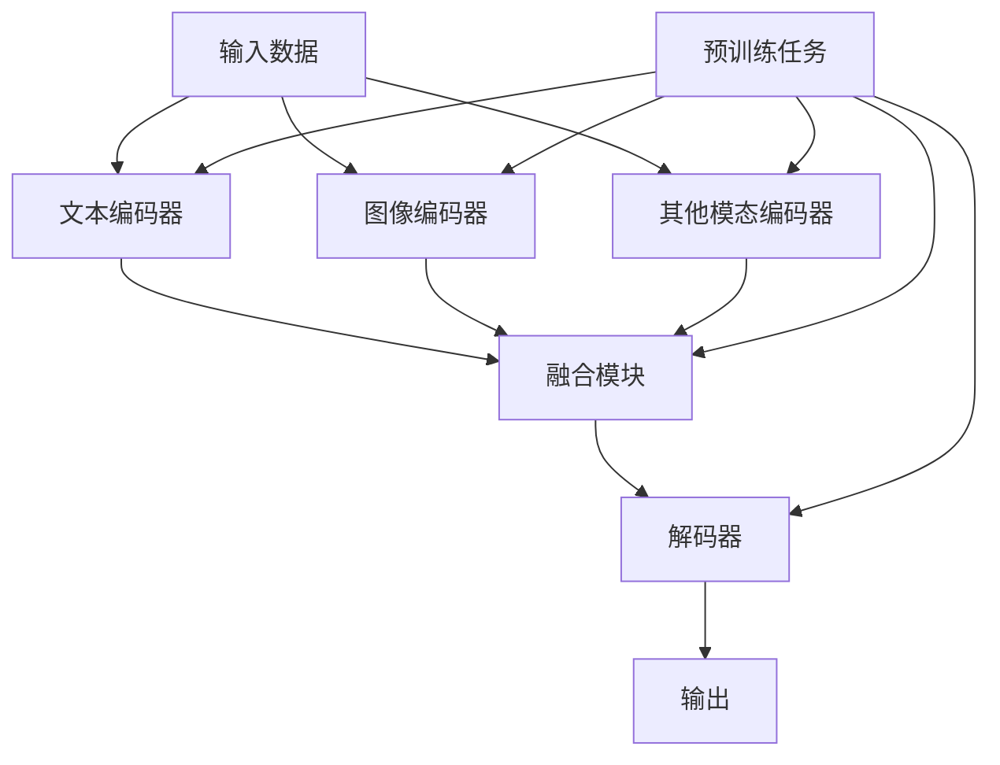

# 多模态大模型：技术原理与实战 如何提高多轮对话能力

## 1. 背景介绍

### 1.1 问题的由来

随着人工智能技术的快速发展，大型语言模型在自然语言处理领域取得了令人瞩目的成就。然而,传统的语言模型主要关注单一模态(如文本)的处理,而现实世界中的信息通常是多模态的,包括文本、图像、视频等多种形式。因此,如何有效地融合多模态信息,并在此基础上构建强大的多模态大模型,成为了当前人工智能领域的一个重要研究方向。

多模态大模型不仅需要处理单一模态信息,还需要学习不同模态之间的关联性,从而更好地理解和表示复杂的多模态数据。这对于提高模型在多轮对话、多模态问答、多模态内容生成等任务中的性能至关重要。

### 1.2 研究现状

近年来,研究人员提出了多种多模态大模型架构,如视觉语言模型(VLM)、视觉语音模型(VQM)等。这些模型通过预训练的方式,在大规模多模态数据集上学习模态间的联系,取得了不错的效果。

然而,现有的多模态大模型仍然存在一些挑战和局限性:

1. **模态融合**:如何有效地融合不同模态的信息,并捕捉它们之间的内在关联,是一个亟待解决的问题。
2. **长期依赖建模**:在多轮对话等任务中,模型需要能够捕捉长期上下文依赖关系,但现有模型在这方面表现有限。
3. **可解释性**:大型神经网络模型通常被视为"黑箱",缺乏可解释性,这限制了它们在一些关键领域(如医疗)的应用。
4. **效率与可扩展性**:训练和部署大型多模态模型需要大量的计算资源,如何提高效率并实现可扩展性是一个挑战。

### 1.3 研究意义

构建强大的多模态大模型,不仅能够推动人工智能技术在多模态信息处理方面的发展,还可以为众多实际应用场景带来巨大的价值:

1. **提升人机交互体验**:多模态大模型能够更好地理解和生成多模态内容,从而提升人机交互的自然性和流畅性。
2. **促进多领域应用创新**:多模态大模型可以应用于教育、医疗、零售、娱乐等多个领域,推动这些领域的创新发展。
3. **加强人工智能系统的可解释性**:通过研究多模态大模型的内在机制,有望提高人工智能系统的可解释性,增强人们对这些系统的信任。
4. **推动人工智能理论发展**:多模态大模型的研究将促进人工智能理论的发展,如多模态表示学习、跨模态知识迁移等。

### 1.4 本文结构

本文将全面介绍多模态大模型的技术原理与实战应用。首先阐述多模态大模型的核心概念和基本架构,然后深入探讨其核心算法原理和数学模型,并通过具体的代码实例和案例分析,展示如何在实践中应用和优化多模态大模型。最后,本文将总结多模态大模型的发展趋势和面临的挑战,为读者提供全面的技术视角和实践指导。

## 2. 核心概念与联系

多模态大模型是一种能够同时处理多种模态(如文本、图像、视频等)输入的大型神经网络模型。它的核心思想是通过预训练的方式,在大规模多模态数据集上学习不同模态之间的关联性,从而获得强大的多模态表示能力。

多模态大模型通常由以下几个关键组件组成:

1. **编码器(Encoder)**:用于将不同模态的输入数据编码为对应的向量表示。常用的编码器包括文本编码器(如BERT)、图像编码器(如VGG、ResNet)等。

2. **融合模块(Fusion Module)**:将不同模态的编码向量融合成统一的多模态表示。常用的融合方法包括简单拼接、注意力融合、交互融合等。

3. **解码器(Decoder)**:根据融合后的多模态表示,生成目标输出。解码器的具体形式取决于任务类型,如对于生成任务可以使用Transformer解码器。

4. **预训练任务(Pretraining Tasks)**:在大规模多模态数据集上进行预训练,学习模态间的关联性。常用的预训练任务包括掩码语言模型(Masked Language Modeling)、图像文本对比(Image-Text Contrastive)等。

5. **微调(Fine-tuning)**:在特定下游任务上对预训练模型进行微调,进一步提高模型在该任务上的性能。

多模态大模型的核心优势在于能够利用不同模态之间的关联性,提高模型对复杂多模态数据的理解和表示能力。这对于提高模型在多轮对话、多模态问答、多模态内容生成等任务中的性能至关重要。

下面是多模态大模型的基本架构示意图:

## 3. 核心算法原理 & 具体操作步骤

### 3.1 算法原理概述

多模态大模型的核心算法原理可以概括为以下几个关键步骤:

1. **模态编码**:将不同模态的输入数据编码为对应的向量表示。常用的编码器包括BERT用于文本编码、ResNet用于图像编码等。

2. **模态融合**:将不同模态的编码向量融合成统一的多模态表示。常见的融合方法包括简单拼接、注意力融合、交互融合等。

3. **预训练**:在大规模多模态数据集上进行预训练,学习不同模态之间的关联性。常用的预训练任务包括掩码语言模型(MLM)、图像文本对比(Image-Text Contrastive)等。

4. **微调**:在特定下游任务上对预训练模型进行微调,进一步提高模型在该任务上的性能。

5. **生成输出**:根据融合后的多模态表示,使用解码器(如Transformer解码器)生成目标输出,如对话回复、问答结果或多模态内容。

在实际应用中,上述步骤通常会根据具体任务和模型架构进行适当调整和优化。下面将对核心算法步骤进行更详细的介绍和分析。

### 3.2 算法步骤详解

#### 3.2.1 模态编码

模态编码的目标是将不同模态的输入数据映射到相同的向量空间,以便后续进行融合和建模。常用的编码器包括:

- **文本编码器**:通常使用预训练的语言模型(如BERT、RoBERTa等)对文本输入进行编码。
- **图像编码器**:常用的图像编码器包括VGG、ResNet、ViT等卷积神经网络和Transformer模型。
- **视频编码器**:可以使用3D卷积神经网络(如C3D、I3D)或基于Transformer的模型(如VideoBERT)对视频进行编码。
- **音频编码器**:常用的音频编码器包括基于CNN和RNN的模型,如VGGish、AmbertWave等。

编码器的选择取决于输入模态的类型和任务需求。在实践中,通常会对编码器进行预训练,以获得更好的初始化权重和模态特征表示。

#### 3.2.2 模态融合

模态融合是将不同模态的编码向量融合成统一的多模态表示的过程,是多模态大模型的核心部分。常见的融合方法包括:

1. **简单拼接(Concatenation)**:将不同模态的编码向量直接拼接成一个长向量。这种方法简单直接,但无法捕捉模态间的交互关系。

2. **注意力融合(Attention Fusion)**:使用注意力机制动态地对不同模态的编码向量进行加权融合。这种方法可以自适应地捕捉不同模态之间的相关性。

3. **交互融合(Interactive Fusion)**:在融合之前,先通过交互层(如全连接层或卷积层)对不同模态的编码向量进行非线性转换,以增强模态间的交互作用。

4. **层次融合(Hierarchical Fusion)**:在不同层次上进行模态融合,如低层次融合捕捉低级特征,高层次融合捕捉高级语义信息。

5. **动态融合(Dynamic Fusion)**:根据输入数据的特征动态地调整融合策略,以适应不同的情况。

模态融合策略的选择取决于任务需求、模型架构和计算资源等因素。在实践中,通常需要进行大量实验来寻找最优的融合方式。

#### 3.2.3 预训练

预训练是多模态大模型获得强大能力的关键步骤。在预训练阶段,模型会在大规模多模态数据集上进行训练,学习不同模态之间的关联性。常用的预训练任务包括:

1. **掩码语言模型(Masked Language Modeling, MLM)**:在文本输入中随机掩码部分词元,要求模型根据上下文和其他模态信息预测被掩码的词元。

2. **图像文本对比(Image-Text Contrastive)**:给定一个图像-文本对,要求模型判断它们是否匹配,从而学习图像和文本之间的语义对应关系。

3. **视频文本对比(Video-Text Contrastive)**:类似于图像文本对比,但使用视频和文本作为输入。

4. **多模态生成(Multimodal Generation)**:根据多模态输入(如图像+文本)生成目标输出(如描述或标题)。

5. **多模态问答(Multimodal Question Answering)**:根据多模态上下文(如图像+文本)回答相关问题。

预训练任务的设计需要考虑模型架构、输入模态类型和下游任务需求。通过预训练,模型可以学习到模态间的关联性,为后续的微调和下游任务奠定基础。

#### 3.2.4 微调

微调是在特定下游任务上对预训练模型进行进一步训练的过程,以提高模型在该任务上的性能。常见的微调策略包括:

1. **全模型微调**:对整个预训练模型(包括编码器、融合模块和解码器)进行端到端的微调。

2. **部分微调**:只对模型的某些部分(如解码器)进行微调,其他部分保持冻结状态。

3. **分阶段微调**:先对模型的某些部分进行微调,然后逐步解冻和微调其他部分。

4. **混合精度训练**:利用混合精度(如FP16或BF16)进行训练,以提高计算效率和内存利用率。

5. **数据增强**:通过数据增强技术(如翻译、裁剪、旋转等)扩充训练数据,提高模型的泛化能力。

微调策略的选择取决于下游任务的特点、可用计算资源和模型大小等因素。在实践中,通常需要进行大量实验来寻找最优的微调方式。

### 3.3 算法优缺点

#### 优点

1. **强大的多模态表示能力**:通过预训练和模态融合,多模态大模型能够有效地捕捉和表示不同模态之间的关联性,从而更好地理解和生成复杂的多模态数据。

2. **泛化能力强**:由于在大规模多模态数据集上进行预训练,多模态大模型具有良好的泛化能力,可以应用于各种下游任务和领域。

3. **端到端训练**:多模态大模型通常采用端到端的训练方式,无需手工特征工程,简化了模型开发流程。

4. **可解释性**:通过分析模型内部的注意力机制和模态交互,可以提高多模态大模型的可解释性。

#### 缺点

1. **计算资源需求高**:训练和部署大型多模态模型需要大量的计算资源,包括GPU、内存和存储空间。

2