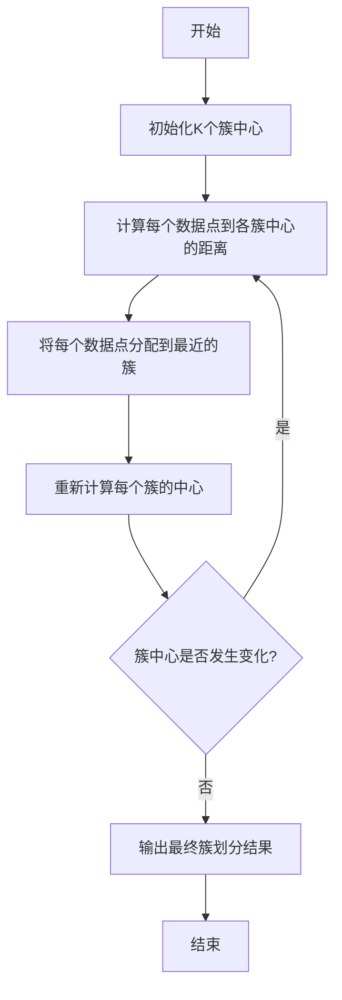

以下是标题为《大数据分析 原理与代码实例讲解》的技术博客文章正文内容：

# 大数据分析 原理与代码实例讲解

## 1. 背景介绍

### 1.1 问题的由来

在当今时代，数据正以前所未有的速度和规模增长。无论是个人、企业还是政府机构，都在产生大量结构化和非结构化数据。这些海量数据蕴藏着宝贵的信息和见解,但同时也带来了数据处理和分析的巨大挑战。传统的数据处理方法已经无法满足当前的需求,因此出现了大数据分析技术。

### 1.2 研究现状  

大数据分析技术已经成为各行业的热门话题,吸引了众多研究人员和企业的关注。目前,已经出现了多种大数据分析框架和工具,如Apache Hadoop、Apache Spark、Apache Flink等。这些框架和工具使得大规模数据的存储、处理和分析成为可能。同时,机器学习和深度学习等人工智能技术也被广泛应用于大数据分析中,以发现数据中隐藏的模式和洞见。

### 1.3 研究意义

大数据分析技术的发展对于各行业都具有重大意义。它可以帮助企业从海量数据中提取有价值的信息,优化业务流程、改善决策、发现新的商机。在科学研究领域,大数据分析也扮演着越来越重要的角色,如基因组学、天文学、气候研究等。此外,大数据分析还可以应用于社会治理、公共安全等领域,为政府决策提供数据支持。

### 1.4 本文结构

本文将全面介绍大数据分析的核心概念、算法原理、数学模型、实际应用场景以及相关工具和资源。我们将从理论和实践两个层面进行深入探讨,旨在为读者提供全面而系统的大数据分析知识。

## 2. 核心概念与联系

在深入探讨大数据分析的具体技术之前,我们需要先了解一些核心概念及其相互关系。以下是大数据分析领域的几个关键概念:

1. **大数据(Big Data)**: 指无法使用传统数据库软件工具在合理时间内捕获、管理和处理的数据集合。大数据具有4V特征:Volume(大量)、Velocity(高速)、Variety(多样)和Veracity(价值密度低)。

2. **数据挖掘(Data Mining)**: 从大量数据中自动发现有价值的信息和知识的过程。它包括数据预处理、模型构建、模型评估和部署等步骤。

3. **机器学习(Machine Learning)**: 一种使计算机能够从数据中自动学习和改进的算法和技术。它是大数据分析的核心技术之一,可用于分类、聚类、回归等任务。

4. **深度学习(Deep Learning)**: 机器学习的一个子领域,它基于人工神经网络,通过多层非线性变换来学习数据的层次表示。深度学习在图像识别、自然语言处理等领域表现出色。

5. **分布式计算(Distributed Computing)**: 将一个大型计算任务分解为多个小任务,并在多台计算机上并行执行,从而提高计算效率的技术。它是大数据分析的关键支撑技术。

6. **数据可视化(Data Visualization)**: 将数据以图形或图像的形式呈现出来,以便人类更容易理解和发现数据中的模式和趋势。

这些概念相互关联、相互作用,共同构建了大数据分析的理论和技术体系。下面我们将进一步探讨大数据分析的核心算法原理和数学模型。

## 3. 核心算法原理 & 具体操作步骤

### 3.1 算法原理概述

大数据分析涉及多种算法,包括机器学习算法、数据挖掘算法、图算法等。这些算法的原理各不相同,但都旨在从海量数据中发现有价值的模式和知识。以下是几种核心算法的简要概述:

1. **K-Means聚类算法**: 一种无监督学习算法,用于将数据划分为K个簇,使得簇内数据点相似度高,簇间相似度低。它通过迭代优化来找到最优的簇中心。

2. **决策树算法**: 一种有监督学习算法,根据特征构建决策树模型,用于分类或回归任务。它具有可解释性强、计算高效等优点。

3. **支持向量机(SVM)**: 一种有监督学习算法,通过构建最大边界超平面将数据分为两类。它适用于线性和非线性分类问题。

4. **PageRank算法**: 一种用于计算网页重要性的链路分析算法,是谷歌搜索引擎的核心算法之一。它基于网页之间的链接结构进行计算。

5. **MapReduce算法**: 一种分布式计算模型,用于在大规模数据集上并行执行计算。它将计算过程分为Map和Reduce两个阶段,简化了并行编程。

6. **梯度下降算法**: 一种优化算法,通过沿着目标函数的负梯度方向更新参数,从而找到函数的最小值。它广泛应用于机器学习和深度学习中。

这些算法只是大数据分析中的一小部分,还有许多其他算法同样重要。下面我们将详细介绍其中一种算法的原理和具体操作步骤。

### 3.2 算法步骤详解

以K-Means聚类算法为例,我们将详细解释其工作原理和具体实现步骤。K-Means算法的目标是将n个数据点划分为K个簇,使得簇内数据点相似度高,簇间相似度低。算法步骤如下:

1. **初始化K个簇中心**:随机选择K个数据点作为初始簇中心。

2. **计算每个数据点到各簇中心的距离**:通常使用欧几里得距离或其他距离度量来计算。

3. **将每个数据点分配到最近的簇**:对于每个数据点,计算它到K个簇中心的距离,将其分配到距离最近的那个簇。

4. **重新计算每个簇的中心**:对于每个簇,计算所有数据点的均值作为新的簇中心。

5. **检查簇中心是否发生变化**:如果所有簇中心都未发生变化,则算法收敛,输出最终簇划分结果;否则,返回步骤2,重复迭代。

K-Means算法的优点是简单、高效,适用于大规模数据集。但它也存在一些缺陷,如对初始簇中心的选择敏感、对异常值敏感、无法很好处理非凸形状的簇等。因此,在实际应用中,需要结合具体问题选择合适的聚类算法。

### 3.3 算法优缺点

K-Means聚类算法具有以下优点:

1. **简单高效**:算法原理简单,计算复杂度较低,可以快速处理大规模数据集。

2. **易于实现**:算法步骤明确,易于用编程语言实现。

3. **可解释性强**:聚类结果直观,簇中心可以表示每个簇的特征。

4. **无需事先标记数据**:属于无监督学习算法,不需要事先标记数据。

但K-Means算法也存在一些缺点:

1. **对初始簇中心敏感**:不同的初始簇中心可能导致不同的聚类结果。

2. **对异常值敏感**:存在异常值时,簇中心可能会发生偏移。

3. **簇数K需要事先指定**:K的选择会影响聚类效果,但没有统一的标准。

4. **无法处理非凸形状簇**:K-Means假设簇是凸形状,对非凸簇效果不佳。

5. **缺乏层次结构**:K-Means只能得到平面的簇划分,无法反映数据的层次结构。

因此,在实际应用中,需要根据具体问题选择合适的聚类算法,或者结合其他技术来弥补K-Means的不足。

### 3.4 算法应用领域

K-Means聚类算法广泛应用于多个领域,包括但不限于:

1. **客户细分(Customer Segmentation)**: 根据客户特征将其划分为不同的群组,用于营销策略制定和个性化服务。

2. **图像分割(Image Segmentation)**: 将图像像素点根据颜色或纹理特征划分为不同的簇,用于图像处理和计算机视觉任务。

3. **异常检测(Anomaly Detection)**: 将正常数据点聚类,将远离任何簇的点视为异常值,用于系统监控和欺诈检测。

4. **推荐系统(Recommendation Systems)**: 根据用户特征和行为习惯将用户聚类,为不同簇提供个性化推荐。

5. **基因表达分析(Gene Expression Analysis)**: 将基因表达数据聚类,发现具有相似表达模式的基因组,用于生物信息学研究。

6. **文本挖掘(Text Mining)**: 将文本文档根据关键词或主题聚类,用于信息检索和自然语言处理任务。

总的来说,K-Means聚类算法适用于需要对大规模数据进行无监督划分的场景,可以发现数据中隐藏的模式和结构。

## 4. 数学模型和公式 & 详细讲解 & 举例说明

### 4.1 数学模型构建

在介绍具体公式之前,我们先构建K-Means聚类的数学模型。假设有n个数据点$\{x_1, x_2, \dots, x_n\}$,需要将它们划分为K个簇$\{C_1, C_2, \dots, C_K\}$。我们定义簇内平方和作为目标函数:

$$J = \sum_{i=1}^K \sum_{x \in C_i} \|x - \mu_i\|^2$$

其中$\mu_i$表示簇$C_i$的中心,即所有属于该簇的数据点的均值。目标是找到K个簇中心$\{\mu_1, \mu_2, \dots, \mu_K\}$,使目标函数J最小化。这相当于最小化所有数据点到其所属簇中心的平方距离之和。

### 4.2 公式推导过程

为了求解上述优化问题,我们可以使用期望最大化(Expectation-Maximization, EM)算法。EM算法是一种迭代算法,包含两个步骤:E步骤和M步骤。

在E步骤中,我们计算每个数据点$x_i$属于簇$C_k$的后验概率:

$$\gamma_{ik} = P(z_i = k | x_i) = \frac{\pi_k N(x_i | \mu_k, \Sigma_k)}{\sum_{j=1}^K \pi_j N(x_i | \mu_j, \Sigma_j)}$$

其中$z_i$是隐变量,表示数据点$x_i$的簇标签;$\pi_k$是簇$C_k$的先验概率;$N(x_i | \mu_k, \Sigma_k)$是$x_i$在簇$C_k$的高斯分布密度。

在M步骤中,我们根据E步骤计算的后验概率,更新簇中心$\mu_k$和协方差矩阵$\Sigma_k$:

$$\mu_k = \frac{1}{N_k} \sum_{i=1}^n \gamma_{ik} x_i$$

$$\Sigma_k = \frac{1}{N_k} \sum_{i=1}^n \gamma_{ik} (x_i - \mu_k)(x_i - \mu_k)^T$$

$$N_k = \sum_{i=1}^n \gamma_{ik}$$

其中$N_k$是簇$C_k$的有效数据点数。

EM算法通过迭代E步骤和M步骤,不断更新后验概率和簇参数,直到收敛或达到最大迭代次数。最终,我们可以得到K个簇的中心$\{\mu_1, \mu_2, \dots, \mu_K\}$,并将每个数据点分配到最