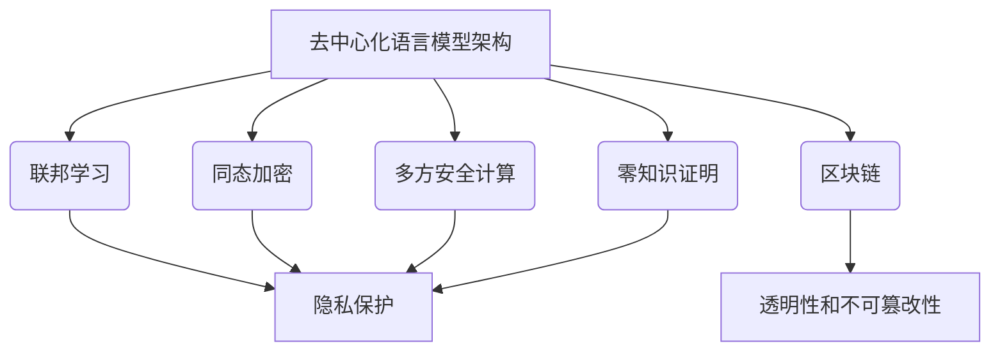

以下是根据您的要求撰写的技术博客文章正文内容：

# 大规模语言模型从理论到实践 去中心化架构

## 1. 背景介绍

### 1.1 问题的由来

随着人工智能和自然语言处理技术的快速发展,大规模语言模型已成为当前研究的热点领域。传统的集中式语言模型架构面临着可扩展性、隐私和安全性等诸多挑战。为了解决这些问题,去中心化的语言模型架构应运而生,旨在提供更高效、更安全和更具隐私保护的解决方案。

### 1.2 研究现状  

目前,已有多个研究团队在探索去中心化语言模型的理论和实践。例如,OpenAI提出了基于联邦学习的PALM模型,而谷歌则在探索基于区块链的分布式语言模型。虽然取得了一些进展,但去中心化语言模型仍处于起步阶段,存在诸多理论和技术上的挑战亟待解决。

### 1.3 研究意义

去中心化语言模型架构有望彻底改变当前人工智能系统的格局,为解决数据隐私、模型公平性和系统可靠性等问题提供全新的解决方案。同时,它也将推动人工智能系统向更加开放、透明和民主化的方向发展,促进人工智能技术的可持续发展。

### 1.4 本文结构

本文将从理论和实践两个层面全面探讨去中心化语言模型的架构。首先介绍核心概念和算法原理,阐述数学模型和公式推导过程。接下来通过代码实例和应用场景说明实践中的关键技术。最后总结未来发展趋势并指出面临的主要挑战。

## 2. 核心概念与联系

去中心化语言模型架构的核心概念包括:

1. **联邦学习(Federated Learning)**: 一种分布式机器学习范式,允许多个客户端在不共享原始数据的情况下共同训练模型。
2. **同态加密(Homomorphic Encryption)**: 一种允许在加密数据上直接进行计算的加密技术,能够保护模型训练过程中的数据隐私。
3. **区块链(Blockchain)**: 一种分布式账本技术,可确保模型更新和数据交换的透明性和不可篡改性。
4. **多方安全计算(Secure Multi-Party Computation)**: 一种密码学技术,允许多方在不泄露各自的私有输入数据的情况下共同计算函数。
5. **零知识证明(Zero-Knowledge Proof)**: 一种密码学协议,可在不泄露任何敏感信息的情况下,证明某个陈述对于验证者是正确的。

这些概念相互关联,共同构建了去中心化语言模型的理论基础。联邦学习和同态加密解决了隐私保护问题,区块链确保了系统的透明度和不可篡改性,而多方安全计算和零知识证明则提供了更高层次的隐私保护。

## 3. 核心算法原理 & 具体操作步骤

### 3.1 算法原理概述

去中心化语言模型架构的核心算法原理是基于联邦学习的算法。联邦学习允许多个参与方在不共享原始数据的情况下共同训练一个全局模型。每个参与方首先在本地数据上训练一个局部模型,然后将模型更新(如梯度)上传到一个协调服务器。协调服务器汇总所有参与方的模型更新,并计算出一个新的全局模型,再将其分发回各个参与方。这个过程在多轮迭代后,全局模型将收敛到一个在所有参与方数据上表现良好的模型。

此外,为了保护参与方的隐私,模型更新会先使用同态加密或安全多方计算等加密,只有在协调服务器汇总后才能解密获得新的全局模型。区块链则用于记录每一轮的模型更新,确保系统的透明度和防篡改性。

### 3.2 算法步骤详解

1. **初始化**: 协调服务器初始化一个随机的全局模型,并将其分发给所有参与方。
2. **本地训练**: 每个参与方在自己的本地数据上训练模型,得到一个局部模型更新(如梯度)。
3. **加密上传**: 参与方使用同态加密或安全多方计算对局部模型更新进行加密,并上传到协调服务器。
4. **模型聚合**: 协调服务器收集所有加密的局部模型更新,并对它们进行聚合(如联邦平均),得到一个新的全局模型更新。
5. **解密更新**: 协调服务器解密全局模型更新,获得新的全局模型。
6. **全局模型分发**: 新的全局模型被分发回所有参与方。
7. **迭代训练**: 重复步骤2-6,直到模型收敛或达到预设的迭代次数。

此外,整个过程会在区块链上记录,以确保透明度和防篡改性。

### 3.3 算法优缺点

**优点**:
- 保护数据隐私,参与方无需共享原始数据
- 提高模型的公平性和包容性
- 具有良好的系统透明度和防篡改性
- 模型训练过程具有一定的容错能力

**缺点**:
- 通信开销较大,需要频繁在参与方和协调服务器之间传输数据
- 加解密操作会带来一定的计算开销
- 需要参与方之间的协作,存在潜在的Byzantine故障风险
- 隐私保护程度取决于加密算法的强度

### 3.4 算法应用领域

去中心化语言模型架构可广泛应用于以下领域:

- 医疗健康领域,保护患者隐私数据
- 金融领域,确保交易数据的安全性
- 政府机构,提高数据共享的透明度
- 跨境合作,促进不同国家之间的数据交换
- 任何涉及敏感数据的领域

## 4. 数学模型和公式 & 详细讲解 & 举例说明

### 4.1 数学模型构建

我们将语言模型训练过程建模为一个优化问题,目标是最小化一个损失函数 $\mathcal{L}$ 关于模型参数 $\theta$ 的期望:

$$\min_{\theta} \mathbb{E}_{(x, y) \sim p_{\text{data}}}\left[\mathcal{L}(x, y ; \theta)\right]$$

其中 $(x, y)$ 是训练数据的样本对,服从某个未知的数据分布 $p_{\text{data}}$。

在传统的集中式训练中,我们可以直接在整个训练数据集上优化上述目标函数。但在去中心化的场景下,训练数据被分散在 $K$ 个参与方,第 $k$ 个参与方持有一个本地数据集 $\mathcal{D}_k$,其中 $\bigcup_{k=1}^K \mathcal{D}_k = \mathcal{D}$。我们的目标是在不共享原始数据的情况下,在所有参与方的数据上训练一个全局最优模型。

为此,我们将优化目标分解为参与方的本地目标和一个全局目标:

$$\begin{aligned}
\min_{\theta_k} F_k(\theta_k) &= \mathbb{E}_{(x, y) \sim p_k}\left[\mathcal{L}(x, y ; \theta_k)\right] &\qquad &\text{(本地目标)} \\
\min_{\theta} F(\theta) &= \sum_{k=1}^K \frac{n_k}{n} F_k(\theta) &\qquad &\text{(全局目标)}
\end{aligned}$$

其中 $p_k$ 是第 $k$ 个参与方的本地数据分布, $n_k$ 是其本地数据集的大小, $n = \sum_{k=1}^K n_k$ 是整个训练数据集的大小。全局目标 $F(\theta)$ 是参与方本地目标的加权平均,权重由各自的数据集大小决定。

在联邦学习算法中,我们通过交替优化每个参与方的本地目标和全局目标,来求解这个分布式优化问题。

### 4.2 公式推导过程  

我们将在参与方和协调服务器之间交换模型参数的更新,而不是原始数据或模型参数本身。具体来说,在第 $t$ 轮迭代中:

1. 协调服务器将当前的全局模型参数 $\theta^{(t)}$ 分发给所有参与方。
2. 每个参与方 $k$ 在本地数据 $\mathcal{D}_k$ 上优化本地目标 $F_k$,得到本地模型更新 $\Delta\theta_k^{(t)}$:

$$\Delta\theta_k^{(t)} = \theta_k^{(t)} - \theta^{(t)}$$

其中 $\theta_k^{(t)}$ 是通过在 $\theta^{(t)}$ 的基础上优化 $F_k$ 得到的新模型参数。

3. 参与方使用加密技术(如同态加密或安全多方计算)对本地模型更新 $\Delta\theta_k^{(t)}$ 进行加密,并将加密后的更新上传到协调服务器。
4. 协调服务器收集所有加密的本地模型更新,并对它们进行加权平均,得到一个新的全局模型更新 $\Delta\theta^{(t)}$:

$$\Delta\theta^{(t)} = \sum_{k=1}^K \frac{n_k}{n} \Delta\theta_k^{(t)}$$

5. 协调服务器解密全局模型更新 $\Delta\theta^{(t)}$,并更新全局模型参数:

$$\theta^{(t+1)} = \theta^{(t)} + \eta_t \Delta\theta^{(t)}$$

其中 $\eta_t$ 是学习率。

6. 重复步骤1-5,直到模型收敛或达到预设的最大迭代次数。

通过这种方式,我们可以在不共享原始数据的情况下,协作地训练出一个在所有参与方数据上表现良好的全局模型。

### 4.3 案例分析与讲解

为了更好地理解上述算法,我们以一个文本分类任务为例进行说明。假设有三个医院 $A$、$B$ 和 $C$,每个医院都持有一部分患者的电子病历数据。由于隐私保护的原因,医院之间不能直接共享这些数据。但是,它们希望在所有数据上训练一个文本分类模型,以自动识别病历中的症状和疾病。

在传统的集中式方法中,所有医院需要将数据上传到一个中心服务器,由服务器在汇总的数据上训练模型。这种方法存在数据隐私泄露的风险,也可能由于某些医院的数据缺失而导致模型的公平性受损。

相比之下,采用去中心化的联邦学习算法,每个医院可以在本地数据上训练一个局部模型,只需要将模型更新(如梯度)上传到一个协调服务器。协调服务器汇总所有医院的模型更新,计算出一个新的全局模型,并将其分发回各个医院。通过多轮迭代,最终的全局模型将在所有医院的数据上达到最优。

在实际操作中,为了进一步保护隐私,医院可以使用同态加密或安全多方计算对模型更新进行加密,确保即使协调服务器被攻破,也无法获取任何原始数据。同时,整个训练过程将在区块链上记录,保证系统的透明度和防篡改性。

通过这种去中心化的方式,我们不仅可以训练出一个在所有医院数据上表现良好的文本分类模型,而且还能最大程度地保护患者隐私,提高模型的公平性和可解释性。

### 4.4 常见问题解答

**Q: 联邦学习算法需要多少轮迭代才能收敛?**

A: 这取决于数据分布、模型复杂度和优化算法等多个因素。通常来说,越均匀的数据分布和越简单的模型,所需的迭代次数就越少。在一些实践中,算