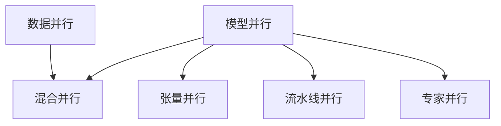

# 大规模语言模型从理论到实践 模型并行

关键词：大规模语言模型、模型并行、分布式训练、数据并行、张量并行、流水线并行、混合并行、Megatron-LM、GPT-3、BERT、Transformer

## 1. 背景介绍
### 1.1 问题的由来
近年来,随着深度学习的快速发展,自然语言处理(NLP)领域取得了巨大的进步。尤其是以Transformer为代表的大规模预训练语言模型,如BERT、GPT等,在多个NLP任务上取得了SOTA的性能,展现出了强大的语言理解和生成能力。然而,随着模型规模的不断增大,训练这些大规模语言模型所需的计算资源也呈指数级增长。单个GPU已经无法满足训练需求,因此如何高效地在多个GPU乃至多个机器上并行训练大规模语言模型,成为了一个亟待解决的问题。

### 1.2 研究现状
目前,业界主要采用数据并行(Data Parallelism,DP)和模型并行(Model Parallelism,MP)两种方式来实现大规模语言模型的分布式训练。数据并行通过将训练数据分割到多个设备上,每个设备保存一份完整的模型参数,各自独立计算梯度,然后通过梯度聚合更新模型参数。而模型并行则是将模型切分到多个设备上,每个设备只保存部分模型参数,设备间需要频繁通信以完成前向和反向传播。

一些代表性的工作包括:
- Megatron-LM[1]提出了一种基于张量切分的模型并行方法,可以将Transformer模型并行到多达512个GPU上。 
- DeepSpeed[2]和FairScale[3]实现了混合并行训练,可以灵活配置数据并行与模型并行的划分。
- Google的Switch Transformer[4]提出了一种新的MoE(Mixture-of-Expert)架构,并引入了专家并行的概念。

总的来说,大规模语言模型的分布式训练仍面临诸多挑战,如如何设计高效的并行策略、如何优化设备间通信、如何均衡负载等。这些都是目前研究的热点问题。

### 1.3 研究意义
研究大规模语言模型的分布式训练,具有重要的理论和实践意义:
1. 从理论上探索如何将模型训练过程并行化,有助于加深我们对神经网络训练本质的认识,推动机器学习的发展。
2. 在实践中,只有解决了大规模语言模型的训练问题,才能真正发挥其在智能对话、知识问答、机器翻译等领域的应用潜力,造福人类社会。
3. 分布式训练的优化技术,如通信优化、负载均衡等,对于加速其他大规模机器学习任务(如计算机视觉)的训练也有重要的借鉴意义。

### 1.4 本文结构
本文将全面介绍大规模语言模型分布式训练的理论与实践。第2节介绍相关的核心概念。第3节重点介绍三种典型的模型并行范式:张量并行、流水线并行和专家并行,并分析其原理和特点。第4节从理论出发,系统阐述模型并行训练的数学原理。第5节给出一个基于Megatron-LM的张量并行的代码实例。第6节讨论模型并行在实际应用中的一些问题。第7节总结推荐一些学习资源和工具。第8节对全文进行总结,并展望未来的研究方向。

## 2. 核心概念与联系
在介绍模型并行之前,我们先明确一些相关的核心概念:
- 数据并行(Data Parallelism):将数据划分到多个设备,每个设备保存一份完整的模型参数,独立计算梯度,然后聚合梯度更新模型。一般通过AllReduce通信原语实现。
- 模型并行(Model Parallelism):将模型划分到多个设备,每个设备只保存部分模型参数。前向和反向传播需要设备间通信。一般通过Send/Recv通信原语实现。
- 张量并行(Tensor Parallelism):一种细粒度的模型并行,以张量为单位将模型切分(如矩阵乘法),充分利用矩阵乘法的并行性。
- 流水线并行(Pipeline Parallelism):一种粗粒度的模型并行,将模型按层切分,形成一个流水线。不同的mini-batch可以在流水线的不同阶段并行处理。
- 专家并行(Expert Parallelism):一种新的并行范式,将模型划分为多个子网络(专家),每个专家在不同设备上,根据输入数据自适应选择专家来处理。
- 混合并行(Hybrid Parallelism):一种多粒度的并行方式,综合利用数据并行、张量并行和流水线并行,兼顾通信效率和并行度。

这些并行范式并不是互斥的,实际应用中往往会综合利用,形成混合并行。它们的关系可以用下图表示:

## 3. 核心算法原理 & 具体操作步骤
### 3.1 算法原理概述
下面我们重点介绍三种典型的模型并行方法:张量并行、流水线并行和专家并行。它们在原理和实现上各有特点。

#### 张量并行
张量并行是一种细粒度的模型并行方式,以张量运算(如矩阵乘法)为并行粒度将模型切分到多个设备。以最常见的矩阵乘法 $\mathbf{Y} = \mathbf{XA}$ 为例,假设矩阵 $\mathbf{X}$ 形状为 $(b, m)$,矩阵 $\mathbf{A}$ 形状为 $(m,n)$,输出 $\mathbf{Y}$ 形状为 $(b,n)$,其中 $b$ 为batch size。在模型并行度为 $p$ 的情况下,可以将矩阵 $\mathbf{A}$ 按列切分为 $p$ 个大小为 $(m, n/p)$ 的子矩阵 $\mathbf{A}_1, \mathbf{A}_2, ..., \mathbf{A}_p$,分别放置在 $p$ 个设备上。前向传播时,输入 $\mathbf{X}$ 被广播到所有设备,每个设备计算 $\mathbf{Y}_i = \mathbf{XA}_i$,然后通过AllGather通信原语收集结果,拼接得到完整的输出 $\mathbf{Y}$。反向传播时,梯度 $\partial \mathbf{Y}$ 被广播到所有设备,每个设备计算 $\partial \mathbf{A}_i = \mathbf{X}^T(\partial \mathbf{Y}_i)$,其中 $\partial \mathbf{Y}_i$ 为 $\partial \mathbf{Y}$ 对应于 $\mathbf{A}_i$ 的梯度分片。

#### 流水线并行
流水线并行是一种粗粒度的模型并行方式,以网络层为并行粒度将模型切分。设网络有 $L$ 层,模型并行度为 $p$,每个设备分配大约 $L/p$ 层。前向传播时,每个设备依次计算自己负责的层,然后将中间结果传递给下一个设备,形成一个流水线。反向传播时,每个设备从下一个设备接收梯度,计算自己负责层的梯度,然后将梯度回传给上一个设备。流水线并行的关键是如何调度前向和反向传播的微批次(micro-batch),使得流水线达到饱和,提高设备利用率。一般采用交错调度方式,即前向传播开始新的微批次的同时,反向传播在计算上一个微批次的梯度。

#### 专家并行
专家并行是一种新的并行范式,将模型划分为多个子网络(专家),每个专家在不同设备上,根据输入数据自适应选择一个专家来处理。专家并行一般在MoE层实现。设MoE层有 $n$ 个专家,模型并行度为 $p$,每个设备分配 $n/p$ 个专家。前向传播时,根据输入数据计算每个专家的权重,然后选择 Top-k 个专家来处理,每个专家分别前向传播,然后将结果加权求和。反向传播时,根据 Top-k 个专家的权重对梯度进行加权,然后每个专家分别反向传播。专家并行的关键是设计高效的专家选择算法和负载均衡策略。

### 3.2 算法步骤详解
下面以张量并行为例,详细介绍其算法步骤。考虑最简单的两层MLP网络:
$$\mathbf{y} = \mathbf{W}_2(\mathbf{W}_1 \mathbf{x})$$
其中 $\mathbf{x} \in \mathbb{R}^{b \times d}$ 为输入,形状为 $(b,d)$,$\mathbf{W}_1 \in \mathbb{R}^{d \times h}$ 和 $\mathbf{W}_2 \in \mathbb{R}^{h \times o}$ 分别为第一层和第二层的权重矩阵,形状分别为 $(d,h)$ 和 $(h,o)$,$\mathbf{y} \in \mathbb{R}^{b \times o}$ 为输出,形状为 $(b,o)$。设模型并行度为2,即有两个设备。

**前向传播步骤:**
1. 将 $\mathbf{W}_1$ 按列切分为 $\mathbf{W}_{1,1}$ 和 $\mathbf{W}_{1,2}$ 两个子矩阵,形状均为 $(d, h/2)$,分别放置在两个设备上。同理,将 $\mathbf{W}_2$ 切分为 $\mathbf{W}_{2,1}$ 和 $\mathbf{W}_{2,2}$,形状均为 $(h/2, o)$。 
2. 将输入 $\mathbf{x}$ 广播到两个设备。
3. 在设备1上计算 $\mathbf{a}_1 = \mathbf{x} \mathbf{W}_{1,1}$,在设备2上计算 $\mathbf{a}_2 = \mathbf{x} \mathbf{W}_{1,2}$。
4. 通过AllGather通信,在两个设备上收集 $\mathbf{a}_1$ 和 $\mathbf{a}_2$,拼接得到 $\mathbf{a} = [\mathbf{a}_1, \mathbf{a}_2]$。
5. 在设备1上计算 $\mathbf{y}_1 = \mathbf{a} \mathbf{W}_{2,1}$,在设备2上计算 $\mathbf{y}_2 = \mathbf{a} \mathbf{W}_{2,2}$。
6. 通过AllGather通信,在两个设备上收集 $\mathbf{y}_1$ 和 $\mathbf{y}_2$,拼接得到输出 $\mathbf{y} = [\mathbf{y}_1, \mathbf{y}_2]$。

**反向传播步骤:**
1. 将梯度 $\partial \mathbf{y}$ 切分为 $\partial \mathbf{y}_1$ 和 $\partial \mathbf{y}_2$,分别放置在两个设备上。
2. 在设备1上计算 $\partial \mathbf{W}_{2,1} = \mathbf{a}^T (\partial \mathbf{y}_1)$,在设备2上计算 $\partial \mathbf{W}_{2,2} = \mathbf{a}^T (\partial \mathbf{y}_2)$。
3. 在设备1上计算 $\partial \mathbf{a}_1 = (\partial \mathbf{y}_1) \mathbf{W}_{2,1}^T$,在设备2上计算 $\partial \mathbf{a}_2 = (\partial \mathbf{y}_2) \mathbf{W}_{2,2}^T$。
4. 通过AllReduce通信,在两个设备上聚合 $\partial \mathbf{a}_1$ 和 $\partial \mathbf{a}_2$,得到 $\partial \mathbf{a}$。
5. 在设备1上计算 $\partial \mathbf{W}_{1,1} = \mathbf{x}^T (\partial \mathbf{a})$,在设备2上计算 $\partial \mathbf{W}_{1,2} = \mathbf{x}^T (\partial \mathbf{a})$。
6. 在设备1上计算 $\