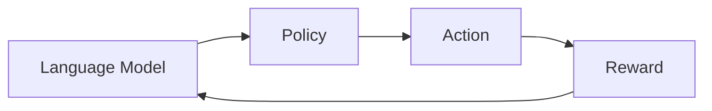

# 大规模语言模型从理论到实践 策略梯度

作者：禅与计算机程序设计艺术 / Zen and the Art of Computer Programming 

## 1. 背景介绍
### 1.1 问题的由来
近年来,随着深度学习技术的快速发展,自然语言处理(NLP)领域取得了巨大的进步。大规模语言模型如GPT、BERT等的出现,使得NLP系统在机器翻译、问答、文本生成等任务上达到了前所未有的性能。然而,训练这些大规模语言模型需要海量的语料数据和计算资源,且面临着训练不稳定、难以收敛等问题。如何高效地训练大规模语言模型,成为了NLP领域亟待解决的难题。

### 1.2 研究现状
目前,训练大规模语言模型主要采用的是基于最大似然估计(MLE)的方法,即最大化语言模型在训练数据上的似然概率。但是,这种方法存在一些固有的缺陷:
1. 训练目标与测试目标不一致。MLE只关注单个词的概率,而忽略了整个句子的质量。 
2. 曝光偏差(Exposure Bias)问题。训练时模型只看到真实的数据,而测试时却需要依据自己的输出采样,导致训练和测试数据分布不一致。
3. loss不可导致的问题。许多NLP任务的评价指标(如BLEU)是不可导的,无法直接作为loss去优化。

为了解决这些问题,研究者们提出了不同的改进方法,如Scheduled Sampling、Professor Forcing等。近年来,强化学习(RL)在序列生成任务中得到了广泛的应用,为训练大规模语言模型提供了新的思路。将RL应用到NLP领域最具代表性的工作是Ranzato等人提出的Sequence Level Training,他们利用REINFORCE算法优化序列生成模型,取得了不错的效果。此后,各种基于策略梯度的算法被提出,如Actor-Critic、PPO、TRPO等,极大地推动了语言模型的发展。

### 1.3 研究意义
语言模型作为NLP的基础,其性能的提升将极大地促进NLP技术的发展,扩展其应用场景。研究高效的语言模型训练算法,对于推动NLP的进步具有重要的意义:
1. 提高语言模型的性能,使其能够更好地理解和生成自然语言,为下游NLP任务提供更加优质的服务。
2. 加速语言模型的训练过程,降低训练成本,使得更多的研究者和开发者能够参与其中。
3. 探索将RL应用到NLP领域的可能性,为RL和NLP两个方向的结合提供新的思路。

### 1.4 本文结构
本文将全面介绍如何利用策略梯度算法训练大规模语言模型。第2节介绍语言模型和策略梯度的核心概念。第3节详细阐述策略梯度算法的原理和训练步骤。第4节给出策略梯度的数学模型和公式推导。第5节通过代码实例演示如何用PyTorch实现一个基于策略梯度的语言模型。第6节讨论策略梯度在语言模型中的实际应用场景。第7节推荐相关的学习资源和开发工具。第8节总结全文,讨论策略梯度的未来发展趋势和挑战。

## 2. 核心概念与联系

在讨论如何将策略梯度应用于语言模型之前,我们需要先明确几个核心概念:

**语言模型(Language Model)**: 语言模型是一种对语言进行建模的方法,旨在学习语言的统计规律和模式。给定一个词序列,语言模型可以估计该序列出现的概率。常见的语言模型有n-gram、RNN、Transformer等。语言模型是NLP的基础,在机器翻译、问答、文本生成等任务中得到广泛应用。

**策略(Policy)**: 在强化学习中,策略定义为智能体(agent)与环境交互时采取行动(action)的原则。对于语言模型来说,策略就是根据当前的状态(state,即之前生成的词),选择下一个词的概率分布。我们的目标是学习一个最优策略,使得语言模型生成的文本具有高质量。

**策略梯度(Policy Gradient)**: 策略梯度是一类强化学习算法,通过参数化的策略函数(如神经网络)直接对策略的参数进行优化,使得期望回报最大化。与价值函数方法相比,策略梯度具有更好的收敛性和稳定性。REINFORCE是最经典的策略梯度算法,后续的一系列算法如Actor-Critic、PPO、TRPO都是基于策略梯度的改进。

**奖励(Reward)**: 奖励是衡量智能体行为好坏的指标,引导智能体学习最优策略。在语言模型中,我们需要设计一个奖励函数,用于评估生成文本的质量。奖励函数可以是基于词的概率、句子的流畅度、与目标的相似度等。设计合理的奖励函数是应用策略梯度的关键。

了解了以上核心概念后,我们可以将它们联系起来:
- 语言模型定义了策略函数,即根据当前状态生成下一个词的概率分布。
- 策略梯度算法学习语言模型的参数,优化策略函数,最大化期望奖励。
- 奖励函数为语言模型的训练提供引导,使其朝着生成高质量文本的方向优化。

下图展示了语言模型、策略、奖励三者之间的关系:

## 3. 核心算法原理 & 具体操作步骤
### 3.1  算法原理概述
策略梯度的核心思想是:通过调整策略函数的参数,使得产生高奖励的动作概率增大,产生低奖励的动作概率减小,从而最大化期望奖励。具体来说,假设策略函数为$\pi_\theta(a|s)$,表示在状态s下采取动作a的概率,其中$\theta$为策略函数的参数。我们的目标是最大化期望奖励:
$$J(\theta)=\mathbb{E}_{\tau\sim\pi_\theta}[R(\tau)]=\sum_\tau P(\tau|\theta)R(\tau)$$
其中,$\tau$表示一个完整的轨迹(trajectory),即状态-动作序列$\{s_1,a_1,s_2,a_2,...,s_T,a_T\}$。$P(\tau|\theta)$是轨迹$\tau$出现的概率,由策略函数$\pi_\theta$决定。$R(\tau)$表示轨迹$\tau$的累积奖励。

根据期望的定义,我们可以将$J(\theta)$写成:
$$J(\theta)=\sum_\tau \left(\prod_{t=1}^T \pi_\theta(a_t|s_t)\right) \left(\sum_{t=1}^T r_t\right)$$

对$J(\theta)$求梯度,得到策略梯度定理(Policy Gradient Theorem):
$$\nabla_\theta J(\theta)=\mathbb{E}_{\tau\sim\pi_\theta}[\sum_{t=1}^T \nabla_\theta \log\pi_\theta(a_t|s_t)R(\tau)]$$

这个式子给出了优化策略函数的方向:增大高奖励动作的概率,减小低奖励动作的概率,与直觉相符。

### 3.2  算法步骤详解
基于上述策略梯度定理,我们可以将策略梯度算法应用到语言模型的训练中,具体步骤如下:

1. 初始化语言模型的参数$\theta$,这里我们使用Transformer作为语言模型的架构。

2. 重复以下步骤,直到收敛:
   
   a. 根据当前的策略函数$\pi_\theta$,生成一批文本序列$\{x^{(1)},x^{(2)},...,x^{(N)}\}$。
   
   b. 对每个生成的序列$x^{(i)}$,计算其奖励值$R(x^{(i)})$。奖励函数可以是BLEU、Rouge等评价指标。
   
   c. 对每个词$x_t^{(i)}$,计算其对数概率$\log\pi_\theta(x_t^{(i)}|x_{1:t-1}^{(i)})$。
   
   d. 根据策略梯度定理,计算梯度:
      $$\nabla_\theta J(\theta) \approx \frac{1}{N}\sum_{i=1}^N \sum_{t=1}^T \nabla_\theta \log\pi_\theta(x_t^{(i)}|x_{1:t-1}^{(i)})R(x^{(i)})$$
   
   e. 用Adam等优化器更新参数$\theta$。

3. 在测试集上评估模型的性能,计算BLEU、Rouge等指标。

### 3.3  算法优缺点
策略梯度算法相比MLE训练,主要有以下优点:
- 可以直接优化评价指标,缓解训练目标与测试目标不一致的问题。
- 通过探索不同的采样序列,缓解曝光偏差问题。
- 可以应用于任意的评价指标,包括不可导的指标。

但是,策略梯度算法也存在一些缺点:
- 方差大,训练不稳定,需要较大的样本量。
- 奖励函数的设计需要领域知识,对奖励函数敏感。
- 训练速度慢,难以应用于大规模语言模型。

### 3.4  算法应用领域
基于策略梯度的语言模型训练算法已经在多个NLP任务中得到应用,并取得了不错的效果,主要包括:
- 机器翻译:利用策略梯度优化BLEU等评价指标,提高翻译质量。
- 文本摘要:利用策略梯度优化Rouge等评价指标,生成更加流畅、连贯的摘要。
- 对话生成:利用策略梯度优化人工评价指标,生成更加自然、合理的对话响应。
- 写作辅助:利用策略梯度优化可读性、连贯性等指标,辅助人类写作。

除了语言模型,策略梯度算法在其他序列生成任务中也有广泛的应用,如图像描述、视频描述、语音识别等。

## 4. 数学模型和公式 & 详细讲解 & 举例说明
### 4.1  数学模型构建
我们考虑一个序列生成问题,目标是根据前缀$x_{1:t-1}$生成下一个词$x_t$。假设词表大小为$V$,序列长度为$T$。我们用一个基于Transformer的语言模型$\pi_\theta(x_t|x_{1:t-1})$来参数化策略函数,表示在给定前缀$x_{1:t-1}$的情况下生成词$x_t$的概率。语言模型可以表示为:
$$\pi_\theta(x_t|x_{1:t-1}) = \text{softmax}(f_\theta(x_{1:t-1}))$$
其中,$f_\theta$表示Transformer的前向计算。

我们的目标是最大化期望奖励:
$$J(\theta)=\mathbb{E}_{x_{1:T}\sim\pi_\theta}[R(x_{1:T})]=\sum_{x_{1:T}} P(x_{1:T}|\theta)R(x_{1:T})$$
其中,$R(x_{1:T})$表示序列$x_{1:T}$的奖励,可以是BLEU、Rouge等评价指标。

### 4.2  公式推导过程
根据期望的定义,我们可以将$J(\theta)$写成:
$$J(\theta)=\sum_{x_{1:T}} \left(\prod_{t=1}^T \pi_\theta(x_t|x_{1:t-1})\right) R(x_{1:T})$$

对$J(\theta)$求梯度,利用对数微分法则$\nabla_\theta \log f(x)=\frac{\nabla_\theta f(x)}{f(x)}$,可得:
$$
\begin{aligned}
\nabla_\theta J(\theta) &= \nabla_\theta \sum_{x_{1:T}} \left(\prod_{t=1}^T \pi_\theta(x_t|x_{1:t-1})\right) R(x_{1:T}) \\
&= \sum_{x_{1:T}} \nabla_\theta \left(\prod_{t=1}^T \pi_\theta(x_t|x_{1:t-1})\right) R(x_{1:T}) \\
&= \sum_{x_{1:T}} \left(\prod_{t=1}^T \pi_\theta(x_t|x_{1:t-1})\right)