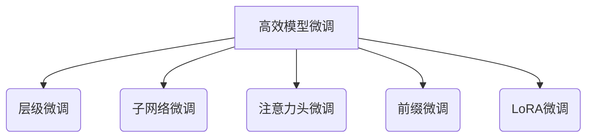

# 大规模语言模型从理论到实践 高效模型微调

## 1. 背景介绍

### 1.1 问题的由来

随着人工智能技术的不断发展,大规模语言模型在自然语言处理(NLP)领域取得了令人瞩目的成就。然而,训练这些庞大的模型需要消耗大量的计算资源,并且需要海量的文本数据进行预训练。此外,通用的预训练模型在特定任务和领域上的性能往往不尽如人意,需要进行进一步的微调(fine-tuning)来适应特定场景。

### 1.2 研究现状

目前,主流的模型微调方法通常采用全模型微调(Full Model Fine-tuning)的策略,即在预训练模型的基础上,使用特定任务的数据对整个模型进行端到端的微调。虽然这种方法简单直接,但存在以下几个主要缺陷:

1. **计算资源消耗大**:需要对整个大规模模型进行微调,导致计算开销巨大,对硬件资源要求高。
2. **数据需求量大**:全模型微调通常需要大量的任务相关数据,否则容易出现过拟合问题。
3. **微调效率低下**:由于模型参数众多,需要大量迭代才能收敛,微调过程缓慢。
4. **任务迁移能力差**:微调后的模型针对特定任务进行了过度拟合,难以泛化到其他相关任务。

### 1.3 研究意义

为了解决上述问题,研究人员提出了多种高效的模型微调方法,旨在降低计算资源消耗、减少数据需求量、提高微调效率并增强任务迁移能力。本文将系统介绍这些高效模型微调方法的理论基础、核心算法、数学模型以及实际应用,为读者提供全面的理解和实践指导。

### 1.4 本文结构

本文将从以下几个方面深入探讨高效模型微调:

1. **核心概念与联系**:介绍高效模型微调的核心思想,并阐述其与传统微调方法的关系。
2. **核心算法原理与具体操作步骤**:详细解释高效微调算法的原理,并给出具体的操作步骤。
3. **数学模型和公式详细讲解与案例分析**:建立数学模型,推导公式,并通过案例分析加深理解。
4. **项目实践:代码实例和详细解释**:提供完整的代码实现,并对关键部分进行解读和分析。
5. **实际应用场景**:介绍高效微调在自然语言处理等领域的实际应用案例。
6. **工具和资源推荐**:推荐相关的学习资源、开发工具和论文等资源。
7. **总结:未来发展趋势与挑战**:总结研究成果,展望未来发展方向,并分析面临的挑战。
8. **附录:常见问题与解答**:解答高效模型微调中的常见问题和困惑。

## 2. 核心概念与联系

高效模型微调(Efficient Fine-tuning)的核心思想是在预训练模型的基础上,只对与任务相关的部分模型参数进行微调,而保留大部分预训练参数不变。这种策略可以大幅减少需要微调的参数数量,从而降低计算资源消耗、减少数据需求量并提高微调效率。

根据微调的granularity(粒度),高效模型微调可分为以下几种主要方法:

1. **层级微调(Layer-wise Fine-tuning)**:只对模型的部分层(层范围可自定义)进行微调,其余层保持不变。
2. **子网络微调(Subnetwork Fine-tuning)**:从预训练模型中挑选出一个子网络(子集合),只对子网络中的参数进行微调。
3. **注意力头微调(Attention Head Fine-tuning)**:仅微调Transformer模型中的注意力头(Attention Head)参数。
4. **前缀微调(Prefix-tuning)**:在模型输入端添加一组可训练的前缀(Prefix)参数,只微调这些前缀参数。
5. **LoRA微调(LoRA Fine-tuning)**:在每层参数基础上添加一个可训练的低秩矩阵,只微调这些低秩矩阵。

上述方法相比全模型微调,可以极大地减少需要微调的参数数量,从而降低计算开销和数据需求。同时,由于保留了大部分预训练参数,这些方法往往能够更好地利用预训练模型的知识,提高任务迁移能力。

不同的高效微调方法在计算效率、数据需求、任务迁移能力等方面存在权衡,需要根据具体场景进行选择和配置。下面将详细介绍这些方法的算法原理、数学模型、实现细节以及应用案例。

## 3. 核心算法原理 & 具体操作步骤

### 3.1 算法原理概述

高效模型微调算法的核心原理是在预训练模型的基础上,只对与任务相关的部分模型参数进行微调,而保留大部分预训练参数不变。这种策略可以极大地减少需要微调的参数数量,从而降低计算资源消耗、减少数据需求量并提高微调效率。

不同的高效微调算法采用了不同的参数选择策略,用于确定需要微调的参数子集。下面将分别介绍几种主要算法的原理:

1. **层级微调(Layer-wise Fine-tuning)**:
   - 原理:只对模型的部分层(层范围可自定义)进行微调,其余层保持不变。
   - 思路:模型的不同层捕获了不同级别的语义信息,对于特定任务而言,只有部分层是相关的,因此只需要微调这些相关层即可。

2. **子网络微调(Subnetwork Fine-tuning)**:
   - 原理:从预训练模型中挑选出一个子网络(子集合),只对子网络中的参数进行微调。
   - 思路:通过某种策略(如门控机制、掩码等)从预训练模型中筛选出与任务相关的参数子集,只微调这些参数。

3. **注意力头微调(Attention Head Fine-tuning)**:
   - 原理:仅微调Transformer模型中的注意力头(Attention Head)参数。
   - 思路:注意力头负责捕获输入序列中的长程依赖关系,对于大多数任务而言,注意力头参数是最关键的。

4. **前缀微调(Prefix-tuning)**:
   - 原理:在模型输入端添加一组可训练的前缀(Prefix)参数,只微调这些前缀参数。
   - 思路:前缀参数可以看作是对输入的一种条件编码,通过学习前缀参数,模型可以适应特定任务。

5. **LoRA微调(LoRA Fine-tuning)**:
   - 原理:在每层参数基础上添加一个可训练的低秩矩阵,只微调这些低秩矩阵。
   - 思路:低秩矩阵可以有效地捕获参数的重要方向,从而实现高效的知识蒸馏和微调。

上述算法通过不同的参数选择策略,实现了只微调与任务相关的参数子集,从而达到高效微调的目的。下面将详细介绍这些算法的具体操作步骤。

### 3.2 算法步骤详解

#### 3.2.1 层级微调(Layer-wise Fine-tuning)

1. 确定需要微调的层范围,可以是模型的前几层、后几层或任意连续的层组合。
2. 将预训练模型的其他层参数冻结,只保留需要微调层的参数可训练。
3. 使用任务相关数据对可训练层参数进行微调,优化目标函数(如交叉熵损失)。
4. 在微调过程中,冻结层的参数保持不变,只有可训练层的参数在更新。

#### 3.2.2 子网络微调(Subnetwork Fine-tuning)

1. 使用某种策略(如门控机制、掩码等)从预训练模型中筛选出与任务相关的参数子集。
2. 将筛选出的参数子集设置为可训练,其余参数冻结。
3. 使用任务相关数据对可训练参数子集进行微调,优化目标函数。
4. 在微调过程中,冻结参数保持不变,只有可训练参数子集在更新。

#### 3.2.3 注意力头微调(Attention Head Fine-tuning)

1. 识别出Transformer模型中的注意力头(Attention Head)参数。
2. 将注意力头参数设置为可训练,其余参数冻结。
3. 使用任务相关数据对注意力头参数进行微调,优化目标函数。
4. 在微调过程中,冻结参数保持不变,只有注意力头参数在更新。

#### 3.2.4 前缀微调(Prefix-tuning)

1. 为模型输入添加一组可训练的前缀(Prefix)参数,前缀长度可配置。
2. 将前缀参数设置为可训练,预训练模型参数冻结。
3. 使用任务相关数据对前缀参数进行微调,优化目标函数。
4. 在微调过程中,预训练模型参数保持不变,只有前缀参数在更新。

#### 3.2.5 LoRA微调(LoRA Fine-tuning)

1. 为每层参数矩阵添加一个可训练的低秩矩阵,低秩矩阵的秩可配置。
2. 将低秩矩阵设置为可训练,预训练模型参数冻结。
3. 使用任务相关数据对低秩矩阵进行微调,优化目标函数。
4. 在微调过程中,预训练模型参数保持不变,只有低秩矩阵在更新。

上述算法步骤展示了如何在预训练模型的基础上,只微调与任务相关的参数子集,从而实现高效的模型微调。需要注意的是,不同算法在具体实现细节上可能会有所不同,还需要根据实际情况进行调整和优化。

### 3.3 算法优缺点

高效模型微调算法相比传统的全模型微调,具有以下优点:

1. **计算资源消耗低**:只需要微调参数的一个子集,大幅减少了计算开销。
2. **数据需求量小**:由于参数数量减少,所需的训练数据量也相应减少。
3. **微调效率高**:参数数量减少后,模型收敛速度加快,微调过程更加高效。
4. **任务迁移能力强**:保留了大部分预训练参数,有利于知识迁移和泛化。

然而,这些算法也存在一些潜在的缺点和挑战:

1. **参数选择策略**:不同算法需要设计合理的参数选择策略,以确保选择出与任务相关的参数子集。
2. **超参数调优**:算法通常引入了新的超参数(如层范围、低秩矩阵秩等),需要进行调优。
3. **性能下降风险**:如果选择的参数子集不够合理,可能会导致性能下降。
4. **并行化困难**:由于参数子集的不同,模型并行化训练会变得更加复杂。

因此,在实际应用中,需要根据具体任务和场景,权衡算法的优缺点,选择合适的高效微调方法,并进行充分的调优和实验,以获得最佳性能。

### 3.4 算法应用领域

高效模型微调算法广泛应用于自然语言处理(NLP)领域的各种任务,如文本分类、机器翻译、问答系统、对话系统等。由于这些任务通常需要对大规模语言模型进行微调,因此高效微调算法可以带来显著的计算资源节省和效率提升。

除了NLP领域,高效微调算法也可以应用于计算机视觉(CV)、语音识别、推荐系统等其他领域,只要存在需要对大型预训练模型进行微调的场景。

在实际应用中,不同的高效微调算法可能更适合特定的任务或模型架构。例如,对于Transformer模型,注意力头微调和前缀微调可能更加高效;而对于卷积神经网络(CNN),层级微调和子网络微调可能更合适。因此,