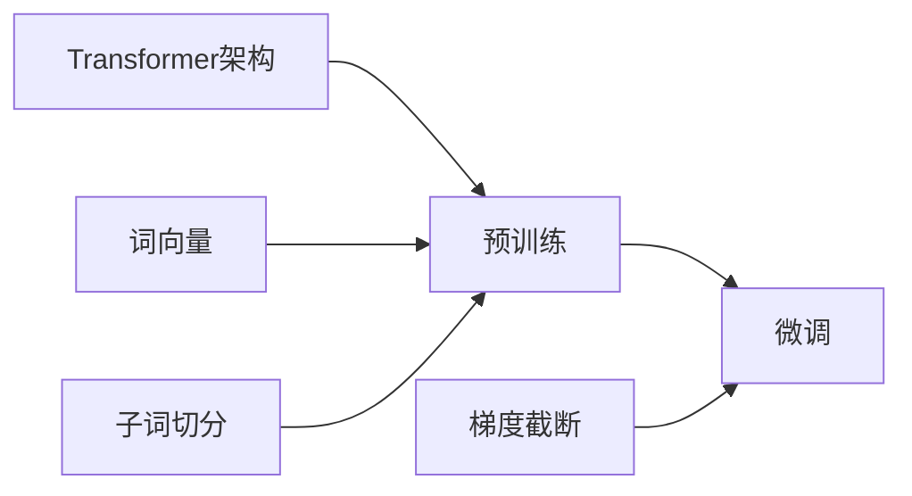

# 大语言模型原理与工程实践：大语言模型训练优化秘籍

## 1. 背景介绍
### 1.1 问题的由来
近年来，随着深度学习技术的飞速发展，大语言模型(Large Language Model, LLM)在自然语言处理(Natural Language Processing, NLP)领域取得了突破性的进展。LLM通过在海量文本数据上进行无监督预训练，可以学习到丰富的语言知识和语义表示，并在下游任务中取得了优异的表现，如机器翻译、问答系统、文本摘要等。然而，训练一个高质量的LLM仍然面临着诸多挑战，如计算资源消耗巨大、训练时间漫长、模型泛化能力有限等。因此，如何高效地训练出性能优越的LLM，成为了学术界和工业界共同关注的热点问题。

### 1.2 研究现状 
目前，学术界已经提出了多种LLM的训练方法和优化技术。比如，GPT系列模型[1]采用了Transformer架构和自回归语言建模的范式，在多个NLP任务上取得了SOTA的结果；BERT[2]引入了Masked Language Model和Next Sentence Prediction两个预训练任务，极大地提升了模型对语言的理解能力；XLNet[3]提出了排列语言建模(Permutation Language Modeling)的思想，避免了BERT中的预测歧义问题。此外，还有许多工作致力于改进LLM的训练效率，如Megatron-LM[4]利用模型并行和数据并行相结合的分布式训练策略，成功训练出了拥有8.3B参数的GPT模型；DeepSpeed[5]则专注于优化大模型训练的计算和存储效率，可以在单机多卡环境下高效地训练百亿级别的语言模型。

### 1.3 研究意义
LLM蕴含着巨大的应用潜力，有望在智能对话、知识问答、机器创作等领域发挥重要作用，推动人工智能技术的进一步发展。但是，训练LLM所需的算力和时间成本极高，对于许多中小型企业和研究机构而言是一个巨大的挑战。因此，探索LLM训练的优化方法，提高训练效率和模型性能，对于降低LLM的应用门槛、促进其规模化应用具有重要意义。同时，对LLM的内在机理和行为特性进行系统研究，也有助于我们更好地理解和把控这一强大的语言智能工具，推动自然语言理解和认知智能的进一步发展。

### 1.4 本文结构
本文将重点探讨LLM训练优化的原理和实践。第2节介绍LLM相关的核心概念；第3节阐述LLM训练的核心算法原理和具体步骤；第4节给出LLM训练优化涉及的关键数学模型和公式推导；第5节通过代码实例演示LLM训练的工程实现；第6节讨论LLM的实际应用场景；第7节推荐LLM相关的学习资源和开发工具；第8节总结全文并展望LLM的未来发展方向；第9节附录了一些常见问题解答。

## 2. 核心概念与联系

在讨论LLM训练优化之前，我们首先需要了解几个核心概念：

- **语言模型(Language Model)**：语言模型是一种对语言进行建模的方法，旨在学习语言的统计规律和生成模式。给定一段文本序列，语言模型可以计算该序列出现的概率。常见的语言模型有n-gram模型、RNN语言模型和Transformer语言模型等。

- **预训练(Pre-training)**：预训练是指在大规模无标注语料上对模型进行自监督学习，使其学习到语言的通用表示。预训练一般采用特定的训练目标，如自回归语言建模、去噪自编码、对比学习等。预训练得到的模型可以作为下游任务的特征提取器或参数初始化，显著提升任务性能。

- **微调(Fine-tuning)**：微调是指在预训练的基础上，利用任务特定的标注数据对模型进行进一步训练，使其适应具体的应用场景。微调一般只需训练较少的参数，且训练样本数量要求不高，可以快速实现特定功能。

- **Transformer**：Transformer[6]是一种基于自注意力机制(Self-Attention)的神经网络架构，广泛应用于NLP任务。与传统的RNN/CNN不同，Transformer可以并行计算序列中不同位置之间的依赖关系，因此训练速度更快、长程建模能力更强。现有的主流LLM如GPT、BERT、XLNet等都是基于Transformer架构构建的。

- **词向量(Word Embedding)**：词向量是一种将词映射为连续实值向量的方法，可以表示词的语义信息。训练LLM时，我们一般先将文本输入转化为词向量，再输入到神经网络中。词向量可以通过随机初始化学习得到，也可以利用预训练词向量如Word2Vec[7]、GloVe[8]等进行初始化。

- **子词切分(Subword Tokenization)**：子词切分是一种将词进一步切分为更小粒度单元的方法，可以缓解词汇表过大带来的维度灾难问题。常见的子词切分算法有Byte Pair Encoding(BPE)[9]、WordPiece[10]、Unigram Language Model[11]等。大多数LLM在预处理阶段都会用到子词切分。

- **梯度截断(Gradient Clipping)**：梯度截断是一种防止梯度爆炸的技术，在训练LLM时经常使用。其核心思想是限制反向传播的梯度L2范数，当梯度超过给定阈值时，就按比例缩放梯度。梯度截断可以提高训练稳定性，加速收敛速度。

理解了上述核心概念，我们就可以更好地掌握LLM训练优化的原理和实践。这些概念之间也存在着紧密的联系：Transformer是构建LLM的核心架构，词向量和子词切分是文本输入的预处理方法，预训练使LLM学习到通用语言知识，微调使LLM适应特定任务，梯度截断是训练过程中的优化技巧。它们共同构成了LLM训练的完整流程和技术体系。

## 3. 核心算法原理 & 具体操作步骤
### 3.1 算法原理概述
LLM的训练一般分为两个阶段：预训练和微调。预训练阶段的目标是让模型学习到语言的通用表示，捕捉词汇、句法、语义等不同层次的语言知识。常见的预训练方法包括：

- **自回归语言建模(Auto-Regressive Language Modeling, AR)**：给定前面的词，预测下一个词。代表模型有GPT系列。
- **自编码语言建模(Auto-Encoding Language Modeling, AE)**：随机Mask掉一些词，然后预测被Mask掉的词。代表模型有BERT。
- **排列语言建模(Permutation Language Modeling, PLM)**：随机打乱句子中词的顺序，然后预测原始的词序。代表模型有XLNet。

微调阶段则是在预训练模型的基础上，利用任务特定的标注数据对模型进行进一步训练，使其适应具体的应用场景。微调一般只需训练较少的参数，且训练样本数量要求不高，可以快速实现特定功能。

无论是预训练还是微调，LLM的训练都是一个参数优化的过程。给定一批训练样本，我们首先定义一个损失函数来度量模型的预测结果与真实标签之间的差异，然后利用梯度下降等优化算法来最小化损失函数，迭代更新模型参数，提高模型的预测性能。

### 3.2 算法步骤详解
下面我们以自回归语言建模为例，详细介绍LLM训练的具体步骤。

**Step 1: 数据准备**
- 收集大规模无标注文本语料，如维基百科、新闻语料、书籍语料等。
- 对文本进行清洗和预处理，如去除HTML标签、特殊字符、重复内容等。
- 利用子词切分算法(如BPE)对文本进行切分，得到子词序列。
- 将子词序列转化为词表索引序列，构建训练样本。

**Step 2: 模型构建**
- 定义Transformer的编码器和解码器结构，如层数、隐藏层维度、注意力头数等。
- 根据词表大小定义Embedding层和最后的输出层。
- 初始化模型参数，如Xavier初始化、Normal初始化等。

**Step 3: 损失函数定义**
- 定义交叉熵损失函数，度量模型预测分布与真实分布之间的差异。
- 设置Label Smoothing、Focal Loss等技巧，提高训练稳定性和泛化性能。

**Step 4: 优化算法选择**
- 选择合适的优化算法，如Adam、AdamW、Adafactor等。
- 设置学习率调度策略，如Warmup、Linear Decay、Cosine Annealing等。
- 设置梯度裁剪阈值，防止梯度爆炸。

**Step 5: 模型训练**
- 将训练样本划分为若干个Batch，每个Batch包含固定数量的样本。
- 对每个Batch进行前向传播和反向传播，计算损失函数和梯度。
- 利用优化算法更新模型参数，如权重和偏置。
- 重复上述过程，直到模型收敛或达到预设的训练轮数。

**Step 6: 模型评估**
- 在验证集上评估模型性能，如Perplexity、BLEU、ROUGE等指标。
- 进行超参数调优，如调整Batch Size、学习率、Dropout比例等。
- 选择性能最优的模型进行后续的微调或推理。

### 3.3 算法优缺点
自回归语言建模的优点包括：
- 可以显式地建模文本生成过程，适合文本生成类任务。
- 训练过程简单，易于实现和调试。
- 模型推理速度快，可以实现实时交互。

缺点包括：
- 难以捕捉双向上下文信息，语义理解能力有限。
- 生成多样性不足，容易陷入局部最优。
- 推理时存在曝光偏差(Exposure Bias)问题，导致生成质量下降。

### 3.4 算法应用领域
自回归语言建模在以下领域有广泛应用：
- 对话生成：如智能客服、聊天机器人等。
- 文本续写：如小说、新闻、诗歌等的创作辅助。
- 机器翻译：如英译中、中译英等。
- 文本摘要：如新闻摘要、论文摘要等。
- 语言理解：如完形填空、句子排序等。

## 4. 数学模型和公式 & 详细讲解 & 举例说明
### 4.1 数学模型构建
我们以自回归语言建模为例，介绍LLM训练中涉及的关键数学模型。

给定一个由$n$个词组成的文本序列$\mathbf{x}=(x_1,x_2,...,x_n)$，自回归语言建模的目标是最大化该序列出现的概率$P(\mathbf{x})$。根据概率论的链式法则，我们有：

$$
P(\mathbf{x})=\prod_{t=1}^n P(x_t|x_{<t})
$$

其中$x_{<t}$表示$x_t$之前的所有词。换句话说，我们可以将序列出现的概率分解为一系列条件概率的乘积，每一项都是在给定之前词的情况下，当前词出现的概率。

在Transformer中，我们利用神经网络来建模这些条件概率分布。设$\mathbf{h}_t$为$t$时刻Transformer的隐藏状态，$\mathbf{W}_e$为词嵌入矩阵，$\mathbf{W}_o$为输出层矩阵，则Transformer的前向计算过程可以表示为：

$$
\begin{aligned}
\mathbf{e}_t &= \mathbf{W}_e x_t \\
\mathbf{h}_t &= \text{Transformer}(\mathbf{e}_{≤t}) \\
P(x_{t+1}|x_{≤t}) &= \text{softmax}(\math