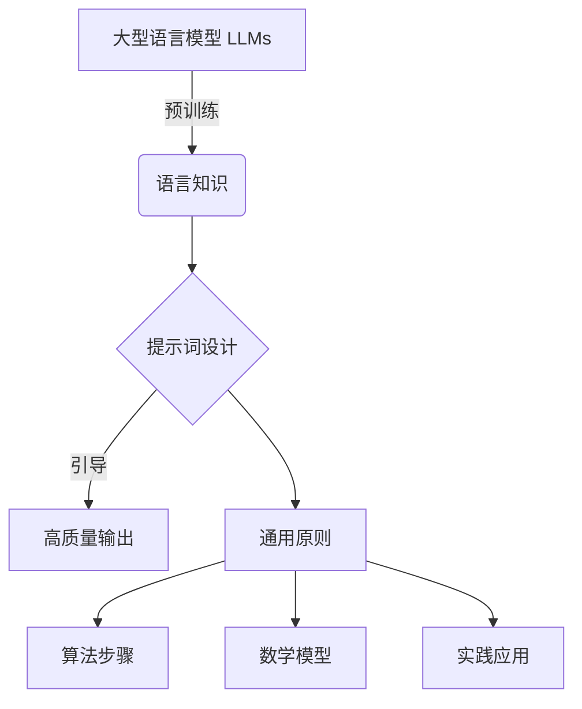
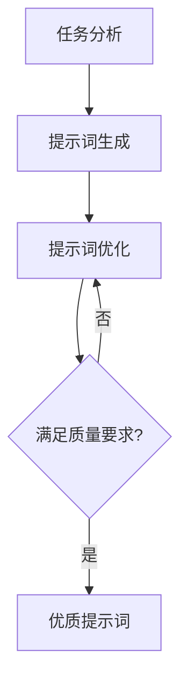

以下是根据您的要求撰写的技术博客文章正文内容：

# 大语言模型原理与工程实践：提示词设计的通用原则

## 1. 背景介绍

### 1.1 问题的由来

在过去几年中,大型语言模型(Large Language Models, LLMs)取得了令人瞩目的进展,展现出惊人的语言生成能力。这些模型通过在海量文本数据上进行预训练,学习了丰富的语言知识,可以生成看似人类水平的自然语言输出。

然而,虽然 LLMs 拥有强大的语言生成能力,但如何高效利用这种能力来解决实际问题仍然是一个挑战。直接将 LLMs 作为语言生成模型使用,其输出往往缺乏针对性和可控性,难以满足特定任务需求。为了更好地利用 LLMs 的潜力,提示词(Prompts)设计成为了一个关键环节。

### 1.2 研究现状

提示词是指输入给语言模型的指令性文本,用于引导模型生成所需的输出。通过精心设计提示词,我们可以更好地控制模型的输出,使其符合特定任务的要求。目前,提示词设计主要依赖于人工经验和大量的试错,缺乏系统的理论指导。

一些研究者已经开始探索提示词设计的原则和方法,但大多数工作都集中在特定任务或领域,缺乏通用性。此外,由于 LLMs 的复杂性,提示词设计往往需要大量的人力和计算资源,效率低下。

### 1.3 研究意义

设计高质量的提示词对于充分发挥 LLMs 的潜力至关重要。通过提高提示词的质量,我们可以获得更加准确、相关和可控的模型输出,从而更好地应对各种实际应用场景。

发现提示词设计的通用原则,不仅可以提高开发效率,降低人力和计算成本,而且还有助于我们更深入地理解 LLMs 的内在机制,为进一步优化和发展大型语言模型提供理论基础。

### 1.4 本文结构

本文将系统地探讨提示词设计的通用原则,包括以下几个方面:

1. 介绍提示词设计的背景和重要性
2. 阐述提示词设计的核心概念和原理
3. 详细讲解提示词设计的算法步骤和方法
4. 构建提示词设计的数学模型,并给出公式推导和案例分析
5. 提供提示词设计的代码实现和运行示例
6. 讨论提示词设计在实际应用中的场景和挑战
7. 推荐相关工具、资源和未来发展方向

通过本文的介绍,读者将能够全面掌握提示词设计的通用原则,并将这些原则应用于实际的 LLMs 开发和应用中。

## 2. 核心概念与联系

在探讨提示词设计的通用原则之前,我们需要先了解一些核心概念及其相互关系。

如上图所示,大型语言模型(LLMs)通过在海量文本数据上进行预训练,获得了丰富的语言知识。然而,要充分利用这些知识并将其应用于实际任务中,我们需要设计高质量的提示词来引导模型生成所需的输出。

提示词设计的通用原则是指一系列可供参考和遵循的准则,它们涵盖了算法步骤、数学模型以及实践应用等多个方面。掌握这些通用原则,可以帮助我们更高效、更有针对性地设计出优质的提示词,从而获得更好的模型输出。

接下来,我们将逐一探讨提示词设计的通用原则中的每一个组成部分。

## 3. 核心算法原理 & 具体操作步骤

### 3.1 算法原理概述

提示词设计的核心算法原理可以概括为以下三个主要步骤:

1. **任务分析**: 首先需要对目标任务进行深入分析,明确任务的目标、约束条件和评估标准。这为后续的提示词设计奠定基础。

2. **提示词生成**: 根据任务分析的结果,生成初始的提示词。这可以通过人工编写或自动生成等多种方式实现。

3. **提示词优化**: 对初始的提示词进行迭代优化,直到满足预期的输出质量。优化过程可以基于人工评估或自动评估,并结合各种优化策略。

上图展示了提示词设计算法的整体流程。通过不断迭代优化,我们可以逐步提高提示词的质量,从而获得更好的模型输出。

### 3.2 算法步骤详解

接下来,我们将详细介绍提示词设计算法的每一个步骤。

#### 3.2.1 任务分析

任务分析是提示词设计的基础,它包括以下几个关键步骤:

1. **明确任务目标**。例如,对于文本分类任务,目标可能是准确地将文本分配到预定义的类别中。

2. **确定约束条件**。包括输入数据的格式、输出的要求、计算资源限制等。

3. **制定评估标准**。根据任务目标和约束条件,选择合适的评估指标,如准确率、召回率、F1分数等。

4. **收集和准备数据**。为任务分析和后续的提示词优化过程准备必要的数据集。

通过全面的任务分析,我们可以更好地理解任务的本质,为提示词设计奠定坚实的基础。

#### 3.2.2 提示词生成

在完成任务分析后,我们需要生成初始的提示词。这可以通过以下几种方式实现:

1. **人工编写**。由人工专家根据任务需求和领域知识手动编写提示词。这种方式灵活性强,但效率较低。

2. **自动生成**。利用各种自动生成技术,如模板匹配、规则生成、小样本学习等,自动生成初始的提示词。

3. **混合方式**。结合人工编写和自动生成,先由人工编写种子提示词,再通过自动生成技术进行扩展和优化。

无论采用哪种方式,生成的初始提示词都应该尽可能覆盖任务的各个方面,为后续的优化过程提供良好的起点。

#### 3.2.3 提示词优化

提示词优化是提示词设计算法的核心部分,旨在不断提高提示词的质量,使模型输出满足预期要求。优化过程通常包括以下几个关键步骤:

1. **评估提示词质量**。使用预定义的评估标准,对当前提示词生成的模型输出进行评估。

2. **选择优化策略**。根据评估结果,选择合适的优化策略,如修改提示词结构、调整关键词权重、引入示例等。

3. **生成新的提示词**。基于选定的优化策略,生成新的提示词版本。

4. **迭代优化**。重复执行评估和优化步骤,直到满足预期的输出质量要求。

在优化过程中,我们可以结合人工评估和自动评估,充分利用人工专家的经验和自动化技术的高效性。同时,也需要权衡计算资源的消耗,在质量和效率之间寻求平衡。

### 3.3 算法优缺点

提示词设计算法具有以下优缺点:

**优点**:

1. **通用性强**。该算法可以应用于各种任务和领域,具有很好的通用性。

2. **可解释性高**。算法的每一步骤都有明确的目的和原理,有利于理解和解释模型的行为。

3. **可控性好**。通过精心设计提示词,我们可以更好地控制模型的输出,满足特定任务需求。

4. **灵活性高**。算法中的各个步骤都可以根据实际情况进行调整和优化,具有很强的灵活性。

**缺点**:

1. **效率较低**。提示词的生成和优化过程往往需要大量的人力和计算资源,效率不高。

2. **质量依赖初始提示词**。初始提示词的质量直接影响了后续优化的效果,需要投入较多的人力和时间。

3. **评估标准限制**。现有的评估标准可能无法完全捕捉输出质量的所有方面,导致优化过程偏离预期目标。

4. **领域知识依赖**。对于特定领域的任务,算法的效果可能受到领域知识的限制。

总的来说,提示词设计算法为我们提供了一种系统的方法来生成和优化高质量的提示词,但也存在一些需要进一步改进的地方。

### 3.4 算法应用领域

提示词设计算法可以广泛应用于各种基于大型语言模型的任务和场景,包括但不限于:

1. **自然语言处理任务**,如文本分类、情感分析、机器翻译、问答系统等。

2. **内容生成**,如新闻撰写、故事创作、广告文案生成等。

3. **对话系统**,如聊天机器人、虚拟助手等。

4. **代码生成**,利用提示词引导模型生成特定功能的代码。

5. **知识提取**,从大量文本中提取结构化的知识和信息。

6. **教育和培训**,设计提示词来辅助教学和培训过程。

7. **科研领域**,利用提示词探索语言模型的能力和局限性,推动相关理论和方法的发展。

总的来说,只要涉及利用大型语言模型生成特定输出的场景,提示词设计算法都可以发挥作用,为我们提供有力的支持和指导。

## 4. 数学模型和公式 & 详细讲解 & 举例说明

### 4.1 数学模型构建

为了更好地理解和优化提示词设计过程,我们可以构建一个数学模型来描述和量化这一过程。我们将提示词设计问题建模为一个优化问题,目标是找到一个最优的提示词,使得模型输出与预期输出之间的差异最小。

设 $P$ 为提示词,表示为一个向量:

$$P = (p_1, p_2, \dots, p_n)$$

其中,每个 $p_i$ 表示提示词中的一个词或短语。

设 $M$ 为语言模型,它将提示词 $P$ 作为输入,生成相应的输出 $O$:

$$O = M(P)$$

我们定义一个损失函数 $L$,用于量化模型输出 $O$ 与预期输出 $Y$ 之间的差异:

$$L(O, Y) = d(O, Y)$$

其中,函数 $d$ 可以是任何合适的距离或相似度度量,如交叉熵、编辑距离等。

我们的目标是找到一个最优的提示词 $P^*$,使得损失函数 $L$ 最小化:

$$P^* = \arg\min_P L(M(P), Y)$$

这个优化问题可以通过各种优化算法来求解,如梯度下降、进化算法等。在优化过程中,我们可以利用一些先验知识或约束条件来加速收敛,提高优化效率。

### 4.2 公式推导过程

接下来,我们将推导出一种基于梯度下降的优化方法,用于求解上述优化问题。

首先,我们定义一个可微的损失函数 $L$,如交叉熵损失:

$$L(O, Y) = -\sum_{i=1}^{m} y_i \log o_i$$

其中,$Y = (y_1, y_2, \dots, y_m)$ 是一个一热编码的向量,表示预期输出,而 $O = (o_1, o_2, \dots, o_m)$ 是模型输出的概率分布。

我们的目标是找到一个最优的提示词 $P^*$,使得损失函数 $L(M(P