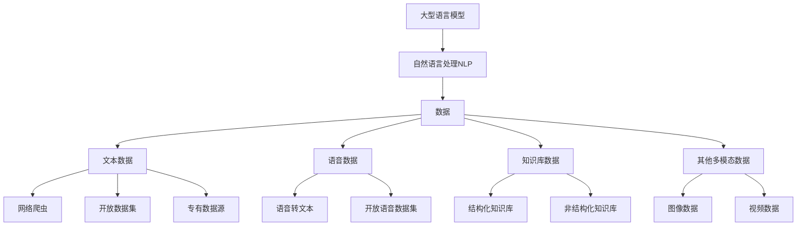

非常感谢您提供了这个有趣而富有洞见的主题。以下是关于"大语言模型原理与工程实践：数据的常见类别及其来源"的详细技术博文。

# 大语言模型原理与工程实践：数据的常见类别及其来源

## 1. 背景介绍

### 1.1 问题的由来

在当今的人工智能时代,大型语言模型已成为各大科技公司和研究机构的核心关注点。这些模型被广泛应用于自然语言处理(NLP)任务,如机器翻译、文本摘要、问答系统等。然而,训练一个高质量的大型语言模型需要大量高质量的训练数据,这对于数据收集、处理和管理带来了巨大挑战。

### 1.2 研究现状

目前,已有多个知名的大型语言模型问世,如GPT-3、BERT、XLNet等。这些模型在各自的应用领域取得了卓越的成绩。但是,训练数据的质量和多样性仍然是制约模型性能的关键因素之一。研究人员一直在探索更好的数据采集、清洗和标注方法,以提高模型的泛化能力和鲁棒性。

### 1.3 研究意义

深入研究大型语言模型所需的数据类别及其来源,对于构建高质量的语言模型至关重要。通过全面了解不同类型数据的特点、优缺点和获取渠道,我们可以更好地设计数据采集策略,优化训练数据集的构成,从而提高模型的性能和泛化能力。此外,研究数据来源还有助于解决隐私、版权等潜在法律和伦理问题。

### 1.4 本文结构

本文将首先介绍大型语言模型中常见的数据类别,包括文本数据、语音数据、知识库数据等。然后,我们将探讨每种数据类别的具体来源,包括网络爬虫、开放数据集、专有数据源等。接下来,文章将重点阐述核心算法原理、数学模型、项目实践等内容。最后,我们将总结未来发展趋势和面临的挑战。

## 2. 核心概念与联系

在探讨数据类别及来源之前,我们需要先了解一些核心概念及其相互关系。



如上图所示,大型语言模型是自然语言处理(NLP)领域的核心技术之一。训练这些模型需要大量高质量的数据,主要包括文本数据、语音数据、知识库数据和其他多模态数据(如图像、视频等)。每种数据类别都有其特点和获取渠道。

## 3. 核心算法原理 & 具体操作步骤

### 3.1 算法原理概述

大型语言模型通常采用自注意力机制(Self-Attention)和Transformer架构,能够有效捕捉长距离依赖关系,提高语义理解能力。这些模型使用无监督或半监督的方式进行预训练,在大规模语料库上学习通用的语言表示。预训练后的模型可以通过微调(Fine-tuning)等方式,应用于特定的自然语言处理任务。

### 3.2 算法步骤详解 

1. **数据采集**:从各种来源收集原始数据,包括网络爬虫、开放数据集、专有数据源等。

2. **数据清洗**:对原始数据进行预处理,去除噪声、错误和重复数据。

3. **数据标注**:对部分数据进行人工标注,为有监督学习任务做准备。

4. **数据划分**:将数据划分为训练集、验证集和测试集。

5. **模型预训练**:在大规模语料库上使用无监督或半监督方法进行预训练,获得通用语言表示。

6. **微调**:根据具体的NLP任务,使用有标注数据对预训练模型进行微调。

7. **模型评估**:在测试集上评估微调后模型的性能。

8. **模型部署**:将训练好的模型部署到生产环境中,用于实际应用。

### 3.3 算法优缺点

**优点**:

- 预训练机制可以有效利用大规模无标注数据,提高模型的泛化能力。
- 自注意力机制能够捕捉长距离依赖关系,提高语义理解能力。
- 通过微调可以快速适应新的NLP任务,减少从头训练的时间和计算成本。

**缺点**:

- 训练大型语言模型需要大量计算资源,对硬件要求较高。
- 存在一定的数据质量和隐私问题,需要进行审查和处理。
- 模型可解释性较差,内部机理较为黑盒。

### 3.4 算法应用领域

大型语言模型已被广泛应用于多个NLP领域,包括但不限于:

- 机器翻译
- 文本摘要
- 问答系统
- 文本生成
- 情感分析
- 实体识别和关系抽取
- 等等

## 4. 数学模型和公式 & 详细讲解 & 举例说明

### 4.1 数学模型构建

大型语言模型通常采用自注意力机制和Transformer编码器-解码器架构。其中,自注意力机制是模型的核心,用于捕捉输入序列中的长距离依赖关系。

自注意力机制的数学表示如下:

$$
\mathrm{Attention}(Q, K, V) = \mathrm{softmax}\left(\frac{QK^T}{\sqrt{d_k}}\right)V
$$

其中:

- $Q$是查询(Query)向量
- $K$是键(Key)向量
- $V$是值(Value)向量
- $d_k$是缩放因子,用于防止点积过大导致的梯度消失问题

自注意力机制通过计算查询向量与所有键向量的点积,得到一组注意力权重。然后,将注意力权重与值向量相乘,得到加权和表示。

### 4.2 公式推导过程

我们来推导一下自注意力机制的具体计算过程。

假设输入序列为$X = (x_1, x_2, \ldots, x_n)$,我们首先将其映射到查询、键和值向量:

$$
\begin{aligned}
Q &= X W^Q \\
K &= X W^K \\
V &= X W^V
\end{aligned}
$$

其中,$W^Q$、$W^K$和$W^V$分别是查询、键和值的线性映射矩阵。

接下来,我们计算查询向量与所有键向量的点积,得到注意力分数矩阵$S$:

$$
S = \frac{QK^T}{\sqrt{d_k}}
$$

然后,对注意力分数矩阵$S$进行行级softmax操作,得到注意力权重矩阵$A$:

$$
A = \mathrm{softmax}(S)
$$

最后,将注意力权重矩阵$A$与值向量$V$相乘,得到自注意力表示$Z$:

$$
Z = AV
$$

$Z$即为输入序列$X$的自注意力表示,它捕捉了序列中的长距离依赖关系。

### 4.3 案例分析与讲解

让我们通过一个具体的例子来理解自注意力机制。假设我们有一个英文句子"The dog chased the cat"。我们将每个单词表示为一个one-hot向量,并将其映射到查询、键和值向量。

```python
import numpy as np

# 输入序列
sentence = "The dog chased the cat".split()
n = len(sentence)

# One-hot编码
vocab = set(sentence)
word2idx = {word: i for i, word in enumerate(vocab)}
vectors = np.eye(len(vocab))

# 查询、键和值向量
Q = vectors[[word2idx[w] for w in sentence]]
K = Q
V = Q

# 计算注意力分数矩阵
d_k = Q.shape[-1]
scores = np.matmul(Q, K.transpose()) / np.sqrt(d_k)

# 计算注意力权重矩阵
weights = np.exp(scores) / np.sum(np.exp(scores), axis=-1, keepdims=True)

# 计算自注意力表示
Z = np.matmul(weights, V)
```

在这个例子中,我们可以看到"the"这个单词与"cat"有较高的注意力权重,因为它们之间存在长距离依赖关系。自注意力机制能够有效捕捉到这种依赖,从而提高了语义理解能力。

### 4.4 常见问题解答

**Q1:为什么需要缩放因子$\sqrt{d_k}$?**

A:缩放因子$\sqrt{d_k}$是为了防止点积过大导致的梯度消失或爆炸问题。当向量维度$d_k$较大时,点积的值会变得很大或很小,softmax函数会变得很陡峭,导致梯度计算不稳定。引入$\sqrt{d_k}$可以有效缓解这个问题。

**Q2:自注意力机制与传统的注意力机制有什么区别?**

A:传统的注意力机制通常需要一个外部的上下文向量,用于计算注意力权重。而自注意力机制只依赖于输入序列本身,不需要额外的上下文信息。这使得自注意力机制更加通用和灵活。

**Q3:自注意力机制是否能捕捉长距离依赖关系?**

A:是的,自注意力机制通过计算每个位置与所有其他位置的注意力权重,能够有效捕捉长距离依赖关系。这是传统的循环神经网络(RNN)所缺乏的能力,也是自注意力机制的一大优势。

## 5. 项目实践:代码实例和详细解释说明

### 5.1 开发环境搭建

在开始编写代码之前,我们需要先搭建开发环境。以下是一些常用的Python库和版本:

- Python 3.7+
- PyTorch 1.9+
- Transformers 4.17+
- Datasets 1.18+

你可以使用conda或pip来安装这些库。

```bash
# 使用conda创建新环境
conda create -n nlp python=3.8
conda activate nlp

# 安装PyTorch
conda install pytorch=1.9.0 cudatoolkit=11.1 -c pytorch

# 安装其他库
pip install transformers datasets
```

### 5.2 源代码详细实现

以下是一个使用HuggingFace Transformers库进行BERT微调的示例代码:

```python
from transformers import BertTokenizer, BertForSequenceClassification
from transformers import TrainingArguments, Trainer
from datasets import load_dataset

# 加载数据集
dataset = load_dataset("imdb")

# 数据预处理
tokenizer = BertTokenizer.from_pretrained("bert-base-uncased")

def preprocess(examples):
    return tokenizer(examples["text"], truncation=True, padding="max_length", max_length=512)

encoded_dataset = dataset.map(preprocess, batched=True)

# 模型初始化
model = BertForSequenceClassification.from_pretrained("bert-base-uncased", num_labels=2)

# 训练配置
args = TrainingArguments(
    output_dir="./results",
    evaluation_strategy="epoch",
    learning_rate=2e-5,
    per_device_train_batch_size=16,
    per_device_eval_batch_size=16,
    num_train_epochs=3,
    weight_decay=0.01,
)

# 训练
trainer = Trainer(
    model=model,
    args=args,
    train_dataset=encoded_dataset["train"],
    eval_dataset=encoded_dataset["test"],
    tokenizer=tokenizer,
)
trainer.train()
```

这段代码使用IMDB电影评论数据集进行情感分类任务。首先,我们加载数据集并使用BERT tokenizer对文本进行编码。然后,我们初始化BERT模型并设置训练参数。最后,我们使用Trainer API进行模型训练和评估。

### 5.3 代码解读与分析

1. **数据加载**:我们使用HuggingFace Datasets库加载IMDB数据集。

2. **数据预处理**:我们定义了一个`preprocess`函数,使用BERT tokenizer对文本进行编码。这包括词元化(tokenization)、截断(truncation)和填充(padding)等操作。

3. **模型初始化**