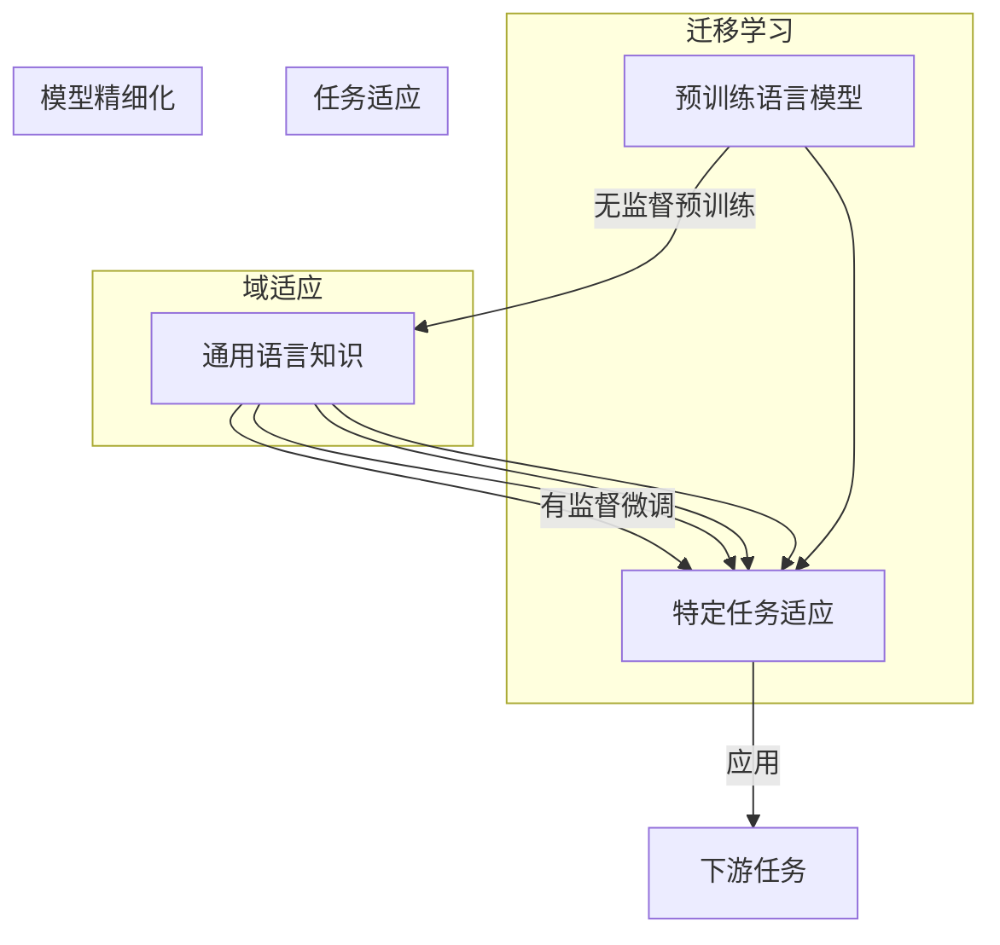

以下是技术博客文章的正文内容：

# 大语言模型原理与工程实践：有监督微调的作用与意义

## 1. 背景介绍

### 1.1 问题的由来

近年来,大型语言模型(Large Language Models, LLMs)在自然语言处理(NLP)领域取得了令人瞩目的成就。从GPT-3到ChatGPT,这些模型展现出惊人的语言生成能力,可以生成看似人类写作的高质量文本。然而,尽管取得了这些成就,但是直接使用预训练的大型语言模型在实际应用中仍然存在一些挑战。

预训练的大型语言模型通常是在大规模无监督语料库上进行训练的,旨在捕获通用的语言模式。但是,在特定的下游任务中,这些模型可能无法完全满足应用需求。例如,在一个特定的领域或任务中,模型可能会生成不准确、不相关或不合适的输出。

为了解决这个问题,研究人员提出了一种称为"有监督微调"(Supervised Fine-tuning)的技术。有监督微调是指在预训练的大型语言模型的基础上,使用标注的任务数据进行进一步的训练,以使模型更好地适应特定的下游任务。这种方法已被证明可以显著提高语言模型在特定任务上的性能。

### 1.2 研究现状

目前,有监督微调已成为调整和优化大型语言模型以适应特定任务的标准方法。许多研究工作都集中在探索有监督微调的不同方面,包括微调策略、数据选择、模型架构调整等。

一些研究着眼于优化微调过程,例如探索不同的学习率调度策略、正则化技术和训练数据采样方法。另一些研究则关注模型架构的调整,如添加任务特定的模块或注意力机制,以提高模型在特定任务上的表现。

此外,研究人员还在探索有监督微调在不同领域和任务中的应用,如文本生成、机器翻译、问答系统等。通过针对性的微调,大型语言模型可以更好地适应各种特定场景的需求。

### 1.3 研究意义

有监督微调对于充分发挥大型语言模型的潜力至关重要。通过微调,我们可以将通用的语言模型转化为专门针对特定任务的模型,从而提高模型在该任务上的性能和适用性。这对于实际应用场景至关重要,因为每个应用场景都有其独特的需求和约束条件。

此外,有监督微调也为语言模型的可解释性和可控性提供了一种途径。通过分析微调过程中模型参数的变化,我们可以更好地理解模型是如何适应特定任务的,从而提高模型的透明度和可解释性。

因此,深入研究有监督微调的原理和方法,对于充分发挥大型语言模型的潜力、提高模型的性能和可解释性都具有重要意义。

### 1.4 本文结构

本文将全面探讨大型语言模型有监督微调的原理和实践。具体来说,文章将包括以下几个部分:

1. **核心概念与联系**:介绍有监督微调的核心概念,并阐述其与预训练语言模型、迁移学习等概念的关系。

2. **核心算法原理与具体操作步骤**:详细解释有监督微调的算法原理,包括微调过程的数学模型和具体操作步骤。

3. **数学模型和公式详细讲解与举例说明**:深入探讨有监督微调中涉及的数学模型和公式,并通过具体案例进行讲解和说明。

4. **项目实践:代码实例和详细解释说明**:提供有监督微调的代码实例,并对关键代码进行详细解释和分析。

5. **实际应用场景**:介绍有监督微调在文本生成、机器翻译、问答系统等实际应用场景中的应用。

6. **工具和资源推荐**:推荐有关有监督微调的学习资源、开发工具和相关论文等。

7. **总结:未来发展趋势与挑战**:总结有监督微调的研究成果,并展望其未来发展趋势和面临的挑战。

8. **附录:常见问题与解答**:解答有关有监督微调的常见问题。

通过全面探讨有监督微调的原理和实践,本文旨在为读者提供深入的理解和实用的指导,帮助他们更好地利用大型语言模型解决实际问题。

## 2. 核心概念与联系

有监督微调(Supervised Fine-tuning)是一种在预训练的大型语言模型基础上进行进一步训练的技术,旨在使模型更好地适应特定的下游任务。它与以下几个核心概念密切相关:

1. **预训练语言模型(Pre-trained Language Model, PLM)**:预训练语言模型是指在大规模无监督语料库上训练的语言模型,旨在捕获通用的语言模式。常见的预训练语言模型包括BERT、GPT、T5等。这些模型通常具有强大的语言理解和生成能力,但在特定任务上的表现可能不尽如人意。

2. **迁移学习(Transfer Learning)**:迁移学习是指将在一个领域或任务中学习到的知识应用到另一个领域或任务上。有监督微调实际上是一种迁移学习的形式,它利用了预训练语言模型在大规模语料库上学习到的通用语言知识,并将其迁移到特定的下游任务中。

3. **域适应(Domain Adaptation)**:域适应是指将模型从一个领域(源域)迁移到另一个领域(目标域)的过程。有监督微调可以被视为一种域适应技术,它将预训练语言模型从通用领域适应到特定任务领域。

4. **任务适应(Task Adaptation)**:任务适应是指将模型从一个任务(源任务)迁移到另一个任务(目标任务)的过程。有监督微调正是通过在特定任务的标注数据上进行训练,使预训练语言模型适应目标任务的需求。

5. **模型精细化(Model Fine-tuning)**:模型精细化是指在预训练模型的基础上进行进一步训练,以使模型更好地适应特定任务或领域。有监督微调是模型精细化的一种形式,它利用标注的任务数据对预训练语言模型进行精细化训练。

总的来说,有监督微调是一种将预训练语言模型的通用语言知识迁移和适应到特定任务的技术,它融合了迁移学习、域适应、任务适应和模型精细化等概念。通过有监督微调,我们可以充分利用预训练语言模型的强大能力,并使其更好地服务于特定的应用场景。

## 3. 核心算法原理 & 具体操作步骤

### 3.1 算法原理概述

有监督微调的核心思想是在预训练的大型语言模型基础上,利用标注的任务数据进行进一步的训练,以使模型更好地适应特定的下游任务。这个过程可以被视为一种迁移学习或域适应的形式,将预训练模型从通用领域迁移到特定任务领域。

从算法原理上来看,有监督微调可以被看作是一种梯度下降优化过程。我们首先定义一个针对特定任务的损失函数(Loss Function),该损失函数衡量了模型在任务数据上的预测与真实标签之间的差距。然后,我们通过反向传播算法计算模型参数相对于损失函数的梯度,并使用优化算法(如Adam或SGD)沿着梯度的反方向更新模型参数,从而最小化损失函数,使模型在任务数据上的预测能力得到提高。

需要注意的是,在有监督微调过程中,我们通常只对预训练语言模型的部分参数进行更新,而保留大部分参数不变。这是因为预训练语言模型已经在大规模语料库上学习到了丰富的语言知识,我们希望保留这些有价值的知识,只对与特定任务相关的参数进行微调。这种策略被称为"部分微调"(Partial Fine-tuning),它可以防止过度微调(Overfitting)的发生,并保持模型在通用语言任务上的性能。

### 3.2 算法步骤详解

有监督微调的具体步骤如下:

1. **准备任务数据**:首先,我们需要准备用于微调的任务数据集。这个数据集应该是针对特定下游任务的,并且包含输入数据和对应的标签。例如,对于文本分类任务,数据集应该包含文本样本及其对应的类别标签。

2. **数据预处理**:根据预训练语言模型的输入要求,对任务数据进行必要的预处理,如分词、填充、编码等操作。这一步骤确保任务数据可以被模型正确地接受和处理。

3. **定义损失函数**:根据任务的性质,定义一个合适的损失函数。常见的损失函数包括交叉熵损失(Cross-Entropy Loss)、均方误差(Mean Squared Error)等。损失函数用于衡量模型预测与真实标签之间的差距。

4. **初始化模型**:加载预训练的语言模型,并根据需要对其进行必要的修改和调整,如添加任务特定的输出层等。

5. **设置微调超参数**:设置微调过程中的超参数,如学习率、批量大小、epochs数量等。合理的超参数设置对模型性能有重要影响。

6. **微调训练**:使用任务数据和定义的损失函数,对预训练语言模型进行微调训练。在每个训练epoch中,我们计算模型在任务数据上的预测与真实标签之间的损失,并通过反向传播算法计算模型参数相对于损失函数的梯度。然后,使用优化算法(如Adam或SGD)沿着梯度的反方向更新模型参数,以最小化损失函数。

7. **模型评估**:在训练过程中,定期在验证集或测试集上评估模型的性能,以监控模型是否过拟合(Overfitting)。可以使用适当的评估指标,如准确率、F1分数等。

8. **模型保存**:训练完成后,保存微调后的模型权重,以便将来使用。

9. **模型部署**:将微调后的模型部署到实际的应用场景中,用于解决特定的下游任务。

需要注意的是,上述步骤并非一成不变,根据具体任务和模型架构的不同,可能需要进行适当的调整和修改。此外,在微调过程中,还可以采用一些优化策略,如学习率调度、正则化技术、数据增强等,以进一步提高模型性能。

### 3.3 算法优缺点

有监督微调作为一种调整和优化大型语言模型的技术,具有以下优缺点:

**优点**:

1. **提高模型性能**:通过在特定任务数据上进行微调训练,可以显著提高预训练语言模型在该任务上的性能,使其更好地适应任务需求。

2. **知识迁移**:有监督微调利用了预训练语言模型在大规模语料库上学习到的丰富语言知识,并将这些知识迁移到特定任务中,从而提高了模型的泛化能力。

3. **高效训练**:相比从头训练一个新模型,有监督微调只需要对预训练模型进行少量参数更新,因此训练成本和时间要低得多。

4. **灵活适应**:有监督微调可以灵活地适应不同的任务和领域,只需要准备相应的任务数据进行微调即可。

**缺点**:

1. **数据依赖**:有监督微调的性能高度依赖于任务数据的质量和数量。如果任务数据不足或质量较差,微调后的模型性能可能无法达到理想水平。

2. **任务偏差**:由于微调过程是在特定任务数据上进行的,因