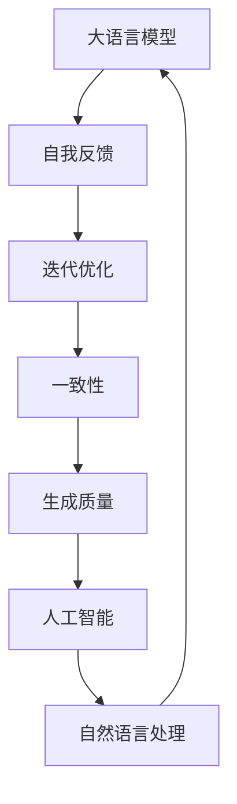

好的,我会严格按照您提供的约束条件和文章结构模板,尽最大努力撰写这篇高质量的技术博客文章。以下是正文部分:

# 大语言模型原理基础与前沿 基于自我反馈进行迭代优化

## 1. 背景介绍

### 1.1 问题的由来

在自然语言处理(NLP)领域,大型语言模型凭借其强大的表现能力,正在推动着人工智能技术的飞速发展。作为深度学习时代的重要成果,大语言模型能够从海量文本数据中学习语义和上下文信息,并生成看似人类水平的自然语言输出。

然而,训练出高质量的大语言模型并非易事。传统的监督学习方法需要大量人工标注的数据集,成本高昂且效率低下。同时,模型在训练过程中也可能受到偏置和噪声的影响,导致生成的文本存在不一致、矛盾等问题。

为了解决这些挑战,研究人员提出了基于自我反馈(Self-Feedback)的迭代优化方法,旨在不断改进大语言模型的性能和输出质量。这种方法利用模型自身生成的文本作为新的训练数据,通过不断迭代优化,逐步纠正模型的偏差并提高其生成能力。

### 1.2 研究现状

目前,基于自我反馈的迭代优化方法已经在多个领域取得了令人瞩目的成绩。例如,OpenAI的GPT-3模型通过自我反馈训练,显著提升了其在各种任务上的表现。Google的PaLM模型也采用了类似的技术,实现了更加一致和有凝聚力的文本生成。

然而,这一领域仍然存在诸多挑战和未解决的问题。例如,如何设计高效的自我反馈机制?如何避免模型在迭代过程中偏离预期轨迹?如何评估和控制生成文本的质量和一致性?这些问题都需要进一步的研究和探索。

### 1.3 研究意义

基于自我反馈的迭代优化方法对于提高大语言模型的性能和质量具有重要意义。通过这种方法,我们可以:

1. 减少对人工标注数据的依赖,降低训练成本。
2. 持续优化模型,纠正偏差并提高一致性。
3. 探索新的训练范式,推动大语言模型技术的发展。
4. 为各种自然语言处理任务提供更强大的模型支持。

因此,深入研究这一领域不仅具有理论价值,也将为实际应用带来巨大的实践意义。

### 1.4 本文结构

本文将全面介绍基于自我反馈的大语言模型迭代优化方法。我们将从核心概念和算法原理出发,详细阐述数学模型和公式推导,并通过实际代码实例展示具体的实现过程。同时,我们还将探讨该方法在不同应用场景中的实践,分享相关工具和学习资源,并对未来发展趋势和挑战进行前瞻性分析。

## 2. 核心概念与联系

基于自我反馈的大语言模型迭代优化涉及多个核心概念,它们相互关联,共同构建了这一创新方法的理论基础。让我们逐一探讨这些概念及其内在联系。

1. **大语言模型(Large Language Model, LLM)**: 指通过深度学习技术从大规模文本数据中学习语义和上下文信息的神经网络模型。这些模型能够生成看似人类水平的自然语言输出,在NLP任务中表现出色。

2. **自我反馈(Self-Feedback)**: 一种训练范式,将模型生成的文本作为新的训练数据,反馈回模型进行进一步优化。这种方法可以减少对人工标注数据的依赖,降低训练成本。

3. **迭代优化(Iterative Optimization)**: 通过不断地将模型输出反馈回训练过程,逐步纠正模型的偏差并提高其生成能力。这是一种持续优化的过程,可以不断提升模型的性能和质量。

4. **一致性(Consistency)**: 指模型生成的文本在语义、逻辑和风格上的一致性和连贯性。基于自我反馈的方法旨在提高模型输出的一致性,避免矛盾和不连贯的情况发生。

5. **生成质量(Generation Quality)**: 评估模型生成文本的质量,包括语法正确性、语义合理性、信息丰富性等多个方面。迭代优化的目标之一就是不断提高生成质量。

6. **人工智能(Artificial Intelligence, AI)**: 这项创新方法属于人工智能领域,旨在赋予计算机系统更强大的语言理解和生成能力,模拟和超越人类智能。

7. **自然语言处理(Natural Language Processing, NLP)**: 作为AI的一个重要分支,NLP研究如何让计算机系统理解和生成人类语言。大语言模型及其优化方法是NLP领域的核心技术之一。

这些核心概念相互关联、环环相扣,共同构建了基于自我反馈的大语言模型迭代优化方法的理论框架。掌握这些概念有助于我们深入理解该方法的原理和意义。

## 3. 核心算法原理与具体操作步骤

### 3.1 算法原理概述

基于自我反馈的大语言模型迭代优化算法的核心思想是:利用模型自身生成的文本作为新的训练数据,通过不断迭代优化,逐步纠正模型的偏差并提高其生成能力。

该算法的工作流程可以概括为以下几个主要步骤:

1. **初始训练**: 使用传统的监督学习方法,在人工标注的数据集上对大语言模型进行初始训练,获得初始模型。

2. **文本生成**: 使用初始模型生成一批文本样本。

3. **样本过滤**: 通过人工或自动化方法,对生成的文本样本进行质量评估和过滤,保留高质量的样本。

4. **数据增强**: 将过滤后的高质量样本与原始训练数据集合并,构建新的扩充数据集。

5. **模型微调**: 在扩充数据集上对模型进行进一步训练(微调),获得优化后的新模型。

6. **迭代循环**: 将新模型作为下一轮迭代的初始模型,重复上述步骤,不断优化模型性能。

通过这种自我反馈的迭代过程,模型可以逐步纠正自身的偏差和错误,提高生成文本的质量和一致性。同时,这种方法也避免了对大量人工标注数据的依赖,降低了训练成本。

### 3.2 算法步骤详解

现在,让我们更加细致地剖析该算法的具体操作步骤:

1. **初始训练**:
   - 准备人工标注的训练数据集 $D_{train}$
   - 使用监督学习方法(如掩码语言模型等)在 $D_{train}$ 上训练初始大语言模型 $M_0$

2. **文本生成**:
   - 使用 $M_0$ 生成一批文本样本 $S_0 = \{s_1, s_2, \dots, s_n\}$
   - 可以通过提示(Prompts)或其他方式控制生成样本的主题、风格等

3. **样本过滤**:
   - 定义文本质量评估函数 $Q(s)$,用于评估样本 $s$ 的质量分数
   - 对于每个样本 $s_i \in S_0$,计算 $Q(s_i)$
   - 设置质量阈值 $\theta$,保留满足 $Q(s_i) \geq \theta$ 的高质量样本,构建过滤后的样本集 $S_0^{filtered}$

4. **数据增强**:
   - 将过滤后的高质量样本集 $S_0^{filtered}$ 与原始训练数据集 $D_{train}$ 合并
   - 构建新的扩充数据集 $D_{aug} = D_{train} \cup S_0^{filtered}$

5. **模型微调**:
   - 在扩充数据集 $D_{aug}$ 上对初始模型 $M_0$ 进行进一步训练(微调)
   - 获得优化后的新模型 $M_1$

6. **迭代循环**:
   - 将 $M_1$ 作为下一轮迭代的初始模型
   - 重复步骤2-5,获得 $M_2, M_3, \dots, M_n$
   - 直到模型性能满足预期或达到迭代次数上限

需要注意的是,在实际操作中,还需要对算法的各个组成部分(如文本生成策略、质量评估函数、训练超参数等)进行精心设计和调优,以确保整个过程的高效性和有效性。

### 3.3 算法优缺点

基于自我反馈的大语言模型迭代优化算法具有以下优点:

1. **减少人工标注成本**: 通过利用模型自身生成的文本作为新的训练数据,可以大幅减少对人工标注数据的依赖,降低训练成本。

2. **持续优化模型性能**: 迭代优化过程可以不断纠正模型的偏差和错误,提高生成文本的质量和一致性,持续优化模型性能。

3. **灵活性和可扩展性**: 该算法可以与各种大语言模型架构和训练策略相结合,具有良好的灵活性和可扩展性。

4. **探索新的训练范式**: 自我反馈机制为大语言模型训练提供了一种全新的范式,有助于推动该领域的创新发展。

然而,这种方法也存在一些潜在的缺点和挑战:

1. **质量评估困难**: 如何准确评估生成文本的质量是一个棘手的问题,需要设计合理的评估指标和方法。

2. **偏差放大风险**: 在迭代过程中,如果质量评估存在偏差,模型可能会放大这种偏差,导致生成质量下降。

3. **计算资源需求高**: 每轮迭代都需要在扩充数据集上重新训练模型,对计算资源的需求较高。

4. **参数调优复杂性**: 算法涉及多个组成部分,如何合理设置各种超参数和策略需要大量的实验和调优工作。

5. **一致性和多样性权衡**: 在追求生成文本一致性的同时,也需要保持适当的多样性,避免过度单一。

因此,在实际应用中,需要权衡算法的优缺点,并针对具体场景和需求进行合理的设计和调整。

### 3.4 算法应用领域

基于自我反馈的大语言模型迭代优化算法可以广泛应用于自然语言处理的各个领域,为多种任务提供强大的模型支持。以下是一些典型的应用场景:

1. **文本生成**: 包括新闻撰写、故事创作、对话系统、广告文案等,算法可以生成高质量、一致性强的自然语言文本。

2. **机器翻译**: 通过迭代优化,可以提高机器翻译模型的翻译质量和一致性,更好地捕捉语义和语境信息。

3. **问答系统**: 算法可用于训练具有强大理解和推理能力的问答模型,提供更加准确和连贯的答复。

4. **文本摘要**: 生成高质量、信息丰富的文本摘要,捕捉文本的核心内容和要点。

5. **情感分析**: 通过迭代优化,可以提高情感分析模型对于情感倾向和强度的识别准确性。

6. **主题建模**: 算法可用于发现文本中的潜在主题,并生成与主题相关的高质量文本。

7. **语音识别**: 通过自我反馈训练,可以提高语音识别模型的准确性和鲁棒性。

8. **数据增强**: 算法生成的高质量文本可用于扩充训练数据集,提高其他NLP模型的性能。

总的来说,基于自我反馈的迭代优化算法为各种自然语言处理任务提供了一种