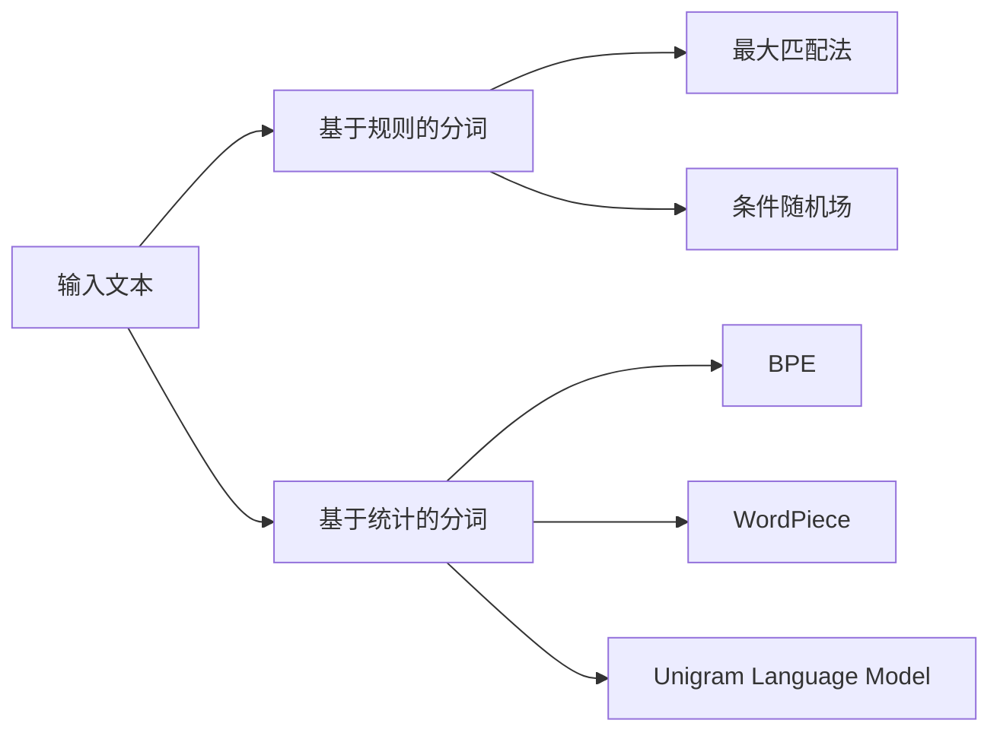

# 大语言模型原理基础与前沿 字符分词

关键词：大语言模型、分词、字符编码、Transformer、BERT、GPT、Tokenization

## 1. 背景介绍
### 1.1 问题的由来
随着人工智能和自然语言处理技术的飞速发展,大语言模型(Large Language Model, LLM)已经成为当前最前沿、最热门的研究方向之一。大语言模型能够从海量文本数据中学习语言的内在规律和语义表示,具备强大的语言理解和生成能力。而要训练出高质量的大语言模型,首要步骤就是对文本进行适当的预处理和分词。字符分词作为文本预处理的关键环节,直接影响着后续模型的性能表现。

### 1.2 研究现状
目前主流的大语言模型如BERT、GPT系列等,大多采用Byte Pair Encoding (BPE)、WordPiece、SentencePiece等基于统计的分词方法。这些方法能够有效平衡词汇表大小和未登录词(Out-of-Vocabulary, OOV)问题,在多个任务上取得了不错的效果。但它们仍然存在一些局限性,比如无法很好地处理一些低频词和领域词汇。此外,预训练阶段和下游任务阶段的分词粒度不一致,也会导致信息丢失。因此,研究更加高效、精准的分词方法,对于提升大语言模型的性能至关重要。

### 1.3 研究意义 
字符分词是大语言模型的基础,直接关系到模型能否充分学习和理解语言知识。探索新的分词方法,构建更优的词表,能够提高模型对文本语义的把握能力。此外,统一预训练和微调阶段的分词方式,减少信息损失,对于提升下游任务的表现也有积极作用。因此,深入研究字符分词技术,对于推动大语言模型的进一步发展具有重要意义。

### 1.4 本文结构
本文将围绕大语言模型中的字符分词展开深入探讨。第2部分介绍字符分词的核心概念和常见方法。第3部分重点阐述主流分词算法的原理和步骤。第4部分给出相关的数学模型和公式推导。第5部分提供代码实例和详细解释。第6部分分析字符分词在实际场景中的应用。第7部分推荐相关工具和学习资源。第8部分总结全文,并展望未来的发展趋势与挑战。第9部分列出常见问题解答。

## 2. 核心概念与联系
在大语言模型中,字符分词(Character Tokenization)指的是将输入文本划分为一系列字符片段(Token)的过程。通过这些字符片段,模型能够更好地理解和生成自然语言。常见的分词单元有字符(Character)、子词(Subword)、词(Word)、短语(Phrase)等。

分词的目的主要有两个:一是控制词汇表的大小,二是缓解OOV问题。词汇表过大会增加模型参数量,影响训练和推理效率;词汇表过小又会导致大量OOV,影响模型性能。因此,需要在两者间权衡,选择合适的分词粒度。

常见的分词方法可分为基于规则(Rule-based)和基于统计(Statistical-based)两大类。基于规则的方法依赖预先定义的规则,代表性的有最大匹配法、条件随机场等。基于统计的方法通过数据驱动,自动构建词表,代表性的有BPE、Unigram Language Model等。目前主流的大语言模型如BERT、GPT等大多采用基于统计的分词方法。

分词结果的好坏直接影响着语言模型的性能。一个理想的分词方法应该具备以下特点:
1. 词汇表适中,在效率和性能间取得平衡
2. 能够有效处理未登录词
3. 分词粒度与下游任务需求相匹配
4. 能够很好地保留语义信息

下图展示了几种常见分词方法的异同:



## 3. 核心算法原理 & 具体操作步骤
### 3.1 算法原理概述
本节重点介绍主流的基于统计的分词算法,包括Byte Pair Encoding (BPE)、WordPiece、Unigram Language Model等。这些算法的核心思想是通过统计频率,自底向上地合并字符,构建一个平衡词汇表大小和覆盖率的最优子词表。

### 3.2 算法步骤详解
以BPE算法为例,其主要步骤如下:

1. 将单词拆分为字符序列,计算每个字符对的出现频率 
2. 选择出现频率最高的字符对,合并为一个新的子词
3. 更新词汇表和字符对频率
4. 重复步骤2-3,直到达到预设的词汇表大小或没有新的子词可合并
5. 利用学习到的子词表对单词进行编码

WordPiece和Unigram LM的思路与BPE类似,区别在于WordPiece引入了语言模型和损失函数,Unigram LM则使用了更加复杂的概率模型。

### 3.3 算法优缺点
基于统计的分词算法的优点在于:
1. 自动构建词表,不依赖人工规则
2. 能够灵活控制词汇表大小
3. 在OOV问题上表现出色

但它们也存在一些局限:
1. 对低频词和领域词汇的处理有待加强  
2. 预训练和微调阶段的分词粒度可能不一致
3. 字符片段的语义完整性有时难以保证

### 3.4 算法应用领域
基于统计的分词算法在各类大语言模型中得到了广泛应用,对提升模型在机器翻译、文本分类、阅读理解、对话生成等任务上的表现发挥了重要作用。一些代表性的模型如BERT、GPT、XLNet、RoBERTa等都使用了这一类分词方法。

## 4. 数学模型和公式 & 详细讲解 & 举例说明
### 4.1 数学模型构建
以Unigram Language Model分词为例,我们来推导其数学模型。设文本语料库为$\mathcal{D}$,包含$n$个字符$x_1, x_2, \cdots, x_n$。语言模型的目标是最大化如下似然概率:

$$\mathcal{L}=\prod_{i=1}^n P(x_i|x_1,\cdots,x_{i-1})$$

Unigram LM做了一阶马尔可夫假设,即当前字符只与前一个字符相关:

$$P(x_i|x_1,\cdots,x_{i-1}) \approx P(x_i|x_{i-1})$$

设词表为$\mathcal{V}$,包含$m$个子词$w_1,w_2,\cdots,w_m$。每个子词$w_j$的出现概率为$p(w_j)$,满足$\sum_{j=1}^m p(w_j)=1$。将单词$s$分词为$s=w_{j_1}w_{j_2}\cdots w_{j_l}$,其概率为:

$$P(s)=\prod_{k=1}^l p(w_{j_k}) $$

目标是最大化整个语料库$\mathcal{D}$的似然概率:

$$\mathcal{L}(\mathcal{D})=\prod_{s \in \mathcal{D}} P(s)$$

等价于最小化负对数似然:

$$-\log \mathcal{L}(\mathcal{D})=-\sum_{s \in \mathcal{D}} \log P(s)=-\sum_{s \in \mathcal{D}} \sum_{k=1}^l \log p(w_{j_k})$$

### 4.2 公式推导过程
求解上述优化问题,需要满足两个约束条件:

$$\sum_{j=1}^m p(w_j)=1$$
$$p(w_j) \geq 0, \forall j=1,2,\cdots,m$$

引入拉格朗日乘子$\lambda$,构建拉格朗日函数:

$$\mathcal{L}(p,\lambda)=-\sum_{s \in \mathcal{D}} \sum_{k=1}^l \log p(w_{j_k})+\lambda(\sum_{j=1}^m p(w_j)-1)$$

对$p(w_j)$求偏导并令其为0:

$$\frac{\partial \mathcal{L}}{\partial p(w_j)}=-\frac{c(w_j)}{p(w_j)}+\lambda=0$$

其中$c(w_j)$为子词$w_j$在语料库$\mathcal{D}$中出现的次数。解得:

$$p(w_j)=\frac{c(w_j)}{\lambda}$$

将其代入约束条件$\sum_{j=1}^m p(w_j)=1$,得到:

$$\sum_{j=1}^m \frac{c(w_j)}{\lambda}=1$$

解得$\lambda=\sum_{j=1}^m c(w_j)$,即语料库总字数。代回可得子词$w_j$的最优概率估计为:

$$p(w_j)=\frac{c(w_j)}{\sum_{j=1}^m c(w_j)}$$

这就是Unigram LM的核心公式,通过最大化似然概率得到了子词的最优概率分布。

### 4.3 案例分析与讲解
我们以一个简单的例子来说明Unigram LM的分词过程。假设语料库为:

```
I have an apple
I have an orange
```

初始时,词表包含7个字符:
```
V={I,  , h, a, v, e, n}
```
对应的频次为:
```
c(I)=2, c( )=8, c(h)=2, c(a)=4, c(v)=2, c(e)=2, c(n)=2
```
根据公式,可以计算每个字符的概率:
```
p(I)=2/22, p( )=8/22, p(h)=2/22, p(a)=4/22, p(v)=2/22, p(e)=2/22, p(n)=2/22
```

然后,选择出现频率最高的字符对进行合并,比如`an`合并为一个新的子词`an`:
```
V={I,  , h, a, v, e, n, an}
```
重新计算每个子词的概率:
```
p(I)=2/20, p( )=8/20, p(h)=2/20, p(a)=2/20, p(v)=2/20, p(e)=2/20, p(n)=0/20, p(an)=2/20
```
不断重复合并过程,直到达到预设的词表大小或无法继续合并。最终可能得到如下的子词表:
```
V={I, have, an, apple, orange}
```
利用该子词表对句子`I have an apple`进行分词:
```
I have an apple → I_ have_ an_ apple
```
其中`_`表示子词之间的分隔符。

### 4.4 常见问题解答
Q: Unigram LM和BPE的区别是什么?
A: 二者的基本思路类似,都是通过自底向上的合并构建子词表。主要区别在于Unigram LM引入了概率语言模型,通过最大化语料库似然概率来学习子词的最优概率分布,而BPE仅基于词频启发式地选择子词。

Q: 子词的颗粒度对模型性能有何影响?
A: 子词颗粒度控制着词汇表的大小和覆盖率,是影响模型性能的关键因素。颗粒度越小(如字符级),词汇表越小,模型参数越少,但OOV问题越严重,对低频词和词缀的建模能力越弱。颗粒度越大(如词级),词汇表越大,OOV问题缓解,但模型参数量增加,训练和推理开销加大。因此需要权衡,选择合适的颗粒度。

Q: 预训练和微调阶段的分词差异会带来什么问题?
A: 预训练阶段的分词粒度通常比微调阶段更细,这可能导致微调时的信息损失和不一致性。比如预训练时将`loved`分为`lov`和`ed`,但微调时作为整词处理,这种不一致可能影响模型性能。因此,统一两个阶段的分词方式或采用整词微调(whole word masking)等策略很有必要。

## 5. 项目实践：代码实例和详细解释说明
### 5.