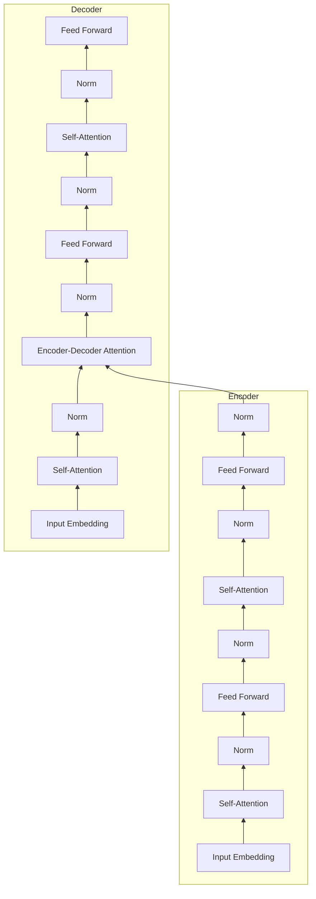

# 大语言模型原理基础与前沿 挑战与机遇

关键词：大语言模型、Transformer、预训练、微调、零样本学习、多模态、知识蒸馏、模型压缩、可解释性、长文本生成

## 1. 背景介绍
### 1.1 问题的由来
近年来,随着深度学习技术的飞速发展,自然语言处理(NLP)领域取得了突破性的进展。其中,大语言模型(Large Language Models, LLMs)作为 NLP 领域的重要里程碑,引起了学术界和工业界的广泛关注。大语言模型通过在海量文本数据上进行预训练,可以学习到丰富的语言知识和通用语言表征,并可以通过简单的微调或提示学习,快速适应下游的各种 NLP 任务,展现出强大的语言理解和生成能力。

### 1.2 研究现状
目前,业界主流的大语言模型主要包括 GPT 系列[1]、BERT 系列[2]、XLNet[3]、RoBERTa[4] 等。这些模型在多个 NLP 任务上取得了 SOTA 的性能,如文本分类、序列标注、问答、摘要、机器翻译等。同时,大语言模型在垂直领域也得到了广泛应用,如医疗、金融、法律等。随着计算力的提升和训练数据的扩充,大语言模型的参数量级不断增长,从百亿级别发展到千亿级别,模型性能也在不断刷新记录。

### 1.3 研究意义 
大语言模型的研究对于推动 NLP 技术发展和拓展应用领域具有重要意义。首先,大语言模型为 NLP 下游任务提供了更加强大的语言理解能力和先验知识,有助于提升任务性能。其次,大语言模型实现了语言知识的迁移和复用,大大降低了针对特定任务进行模型训练的成本。此外,大语言模型为探索更加通用和鲁棒的 NLP 系统提供了新的思路。

### 1.4 本文结构
本文将全面介绍大语言模型的原理基础与前沿进展。第2部分介绍大语言模型的核心概念。第3部分重点讲解 Transformer 等主流模型的网络结构和预训练方法。第4部分系统阐述大语言模型涉及的关键技术和数学原理。第5部分通过实践案例演示如何利用大语言模型进行迁移学习。第6部分总结大语言模型的主要应用场景。第7部分梳理相关的学习资源和开发工具。第8部分展望大语言模型的未来发展方向和面临的挑战。

## 2. 核心概念与联系
- 大语言模型:指参数量级在亿级以上,并在大规模语料上预训练得到的语言模型。
- 预训练(Pre-training):利用无监督或自监督的方式,在大规模通用语料上训练语言模型,学习通用语言知识和表征的过程。
- 微调(Fine-tuning):在特定任务的标注数据上,以较小的学习率在预训练模型的基础上进行训练,使其适应下游任务的过程。
- 迁移学习(Transfer Learning):将预训练语言模型学到的知识迁移到下游任务中,提升样本效率和泛化性能的方法。
- 自注意力机制(Self-attention):一种捕捉序列内部长距离依赖的注意力机制,是 Transformer 等模型的核心组件。
- Transformer:基于自注意力机制的序列到序列模型,摒弃了循环神经网络,是主流大语言模型的基础架构。

大语言模型的训练通常分为两个阶段:无监督预训练和有监督微调。预训练阶段在大规模语料上学习通用语言知识,微调阶段在特定任务数据上进一步优化模型。基于 Transformer 的预训练语言模型是当前大语言模型的主流范式。下图展示了 Transformer 的网络结构,包括编码器和解码器,大量使用了自注意力机制和前馈神经网络:

## 3. 核心算法原理 & 具体操作步骤
### 3.1 算法原理概述
大语言模型的核心是基于 Transformer 的预训练语言模型。Transformer 采用了编码器-解码器架构,利用自注意力机制建模序列内部的依赖关系。预训练阶段通过掩码语言模型(Masked Language Model, MLM)和 Next Sentence Prediction(NSP)等任务,让模型学习词语和句子级别的语言表征。微调阶段则在下游任务的标注数据上对模型进行训练,使其适应特定任务。

### 3.2 算法步骤详解
1. 模型初始化:随机初始化 Transformer 的参数或加载预训练权重。
2. 预训练数据准备:构建大规模无标注语料,进行 tokenization、采样、批处理等预处理。
3. 预训练任务定义:常见的预训练任务包括 MLM(随机掩码词语并预测)、NSP(预测两个句子是否相邻)、Permutation Language Model(PLM,学习句子的顺序信息)等。
4. 预训练过程:
    - 前向传播:将输入语料编码为词嵌入表征,通过 Transformer 的多层自注意力和前馈网络生成隐层状态。
    - 损失计算:基于预训练任务对生成的隐层状态计算损失,如 MLM 的交叉熵损失等。
    - 反向传播:计算损失对模型参数的梯度,利用优化器更新模型参数。
    - 迭代上述步骤,直到模型收敛或达到预设的训练轮数。
5. 微调过程:
    - 下游任务数据准备:构建任务的标注数据集,进行必要的预处理。
    - 模型结构调整:根据任务需求,在预训练模型的基础上添加任务特定的输出层,如分类、序列标注等。
    - 损失函数定义:选择适合下游任务的损失函数,如交叉熵、CRF 损失等。
    - 微调训练:在下游任务数据上进行训练,通常使用较小的学习率和较少的训练轮数。
    - 模型评估:在任务的验证集或测试集上评估微调后的模型性能。

### 3.3 算法优缺点
优点:
- 通过预训练学习通用语言知识,可以显著提升下游任务的性能。
- 实现了语言知识的迁移和复用,降低了训练成本。
- Transformer 结构并行度高,适合 GPU 加速训练。

缺点:
- 预训练需要大规模语料和算力,对计算资源要求高。
- 模型参数量巨大,推理速度较慢,部署成本高。
- 模型可解释性差,容易产生偏见和安全隐患。

### 3.4 算法应用领域
大语言模型已在多个 NLP 任务上取得了 SOTA 的性能,主要应用领域包括:
- 文本分类:如情感分析、新闻分类、意图识别等。
- 序列标注:如命名实体识别、词性标注、语义角色标注等。
- 问答:如阅读理解、开放域问答等。
- 文本生成:如摘要、对话、写作等。
- 机器翻译:提升翻译质量和效率。

## 4. 数学模型和公式 & 详细讲解 & 举例说明
### 4.1 数学模型构建
大语言模型的数学基础是 Transformer 网络。Transformer 的核心是自注意力机制(Self-attention),通过计算序列内部的注意力分布,捕捉词语之间的依赖关系。假设输入序列为 $\mathbf{X}=(\mathbf{x}_1,\mathbf{x}_2,\cdots,\mathbf{x}_n)$,自注意力的计算过程如下:

1. 将输入 $\mathbf{x}_i$ 通过三个线性变换得到查询向量 $\mathbf{q}_i$、键向量 $\mathbf{k}_i$ 和值向量 $\mathbf{v}_i$:

$$
\mathbf{q}_i = \mathbf{W}^Q\mathbf{x}_i, \quad
\mathbf{k}_i = \mathbf{W}^K\mathbf{x}_i, \quad
\mathbf{v}_i = \mathbf{W}^V\mathbf{x}_i
$$

其中 $\mathbf{W}^Q, \mathbf{W}^K, \mathbf{W}^V$ 是可学习的参数矩阵。

2. 计算查询 $\mathbf{q}_i$ 与所有键 $\mathbf{k}_j$ 的相似度得到注意力分布 $\alpha_{ij}$:

$$
\alpha_{ij} = \frac{\exp(\mathbf{q}_i^\top\mathbf{k}_j/\sqrt{d})}{\sum_{j=1}^n \exp(\mathbf{q}_i^\top\mathbf{k}_j/\sqrt{d})}
$$

其中 $d$ 是查询和键向量的维度,作为缩放因子。

3. 将注意力分布 $\alpha_{ij}$ 与值向量 $\mathbf{v}_j$ 加权求和,得到输出表征 $\mathbf{z}_i$:

$$
\mathbf{z}_i = \sum_{j=1}^n \alpha_{ij}\mathbf{v}_j
$$

通过自注意力机制,序列的每个位置都能够与其他位置建立全局依赖关系。Transformer 通过堆叠多个自注意力层和前馈网络,构建了深层的编码器-解码器结构。

### 4.2 公式推导过程
下面以 Masked Language Model(MLM) 预训练任务为例,推导其损失函数的表达式。MLM 通过随机掩码输入序列中的部分词语,预测被掩码词语的概率分布。设输入序列经过掩码处理后为 $\tilde{\mathbf{X}}=(\tilde{\mathbf{x}}_1,\tilde{\mathbf{x}}_2,\cdots,\tilde{\mathbf{x}}_n)$,被掩码位置的索引集合为 $\mathcal{M}$。MLM 的目标是最大化被掩码位置的词语概率:

$$
\mathcal{L}_{\text{MLM}} = -\sum_{i\in\mathcal{M}} \log P(\mathbf{x}_i|\tilde{\mathbf{X}})
$$

其中 $P(\mathbf{x}_i|\tilde{\mathbf{X}})$ 表示在给定掩码输入 $\tilde{\mathbf{X}}$ 的条件下,第 $i$ 个位置词语为 $\mathbf{x}_i$ 的概率。通过 Transformer 编码器可以得到掩码位置的隐层表征 $\mathbf{h}_i$,再通过 Softmax 层计算条件概率:

$$
P(\mathbf{x}_i|\tilde{\mathbf{X}}) = \frac{\exp(\mathbf{w}_{\mathbf{x}_i}^\top\mathbf{h}_i)}{\sum_{\mathbf{x}\in\mathcal{V}} \exp(\mathbf{w}_{\mathbf{x}}^\top\mathbf{h}_i)}
$$

其中 $\mathcal{V}$ 表示词表, $\mathbf{w}_{\mathbf{x}}$ 是词 $\mathbf{x}$ 对应的 Softmax 参数向量。将上式代入 MLM 损失可得:

$$
\mathcal{L}_{\text{MLM}} = -\sum_{i\in\mathcal{M}} \left(\mathbf{w}_{\mathbf{x}_i}^\top\mathbf{h}_i - \log\sum_{\mathbf{x}\in\mathcal{V}} \exp(\mathbf{w}_{\mathbf{x}}^\top\mathbf{h}_i)\right)
$$

最小化上述损失函数