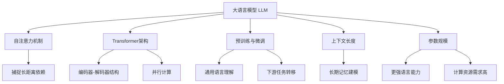

以下是根据您的要求撰写的文章正文内容：

# 大语言模型原理基础与前沿 更长的上下文

## 1. 背景介绍

### 1.1 问题的由来

在自然语言处理(NLP)领域,传统的语言模型通常基于n-gram或神经网络,捕捉语言的局部特征和短期依赖关系。然而,人类语言理解和生成往往需要长期记忆和全局上下文信息。大型语言模型(Large Language Model, LLM)应运而生,旨在通过增大模型规模和改进训练方法来学习更长的上下文依赖。

### 1.2 研究现状  

早期的LLM模型如GPT、BERT等取得了一些进展,但仍存在局限性。近年来,随着算力和数据的不断增长,出现了GPT-3、PaLM、ChatGPT等更大更强的LLM模型,展现出令人惊叹的语言理解和生成能力。这些模型不仅在下游NLP任务中表现优异,更能生成高质量、多样化、上下文一致的长文本。

### 1.3 研究意义

LLM技术的突破为人工智能系统赋予了更强的语言理解和交互能力,有望实现人机自然对话,推动智能助手、问答系统、自动写作等应用程序的发展。同时,LLM也面临着一些挑战,如数据质量、隐私安全、公平性等,需要进一步研究和完善。

### 1.4 本文结构

本文将全面介绍LLM的基础原理、核心算法、数学模型、实践案例和应用场景,并对未来发展趋势和挑战进行展望和探讨。

## 2. 核心概念与联系



大语言模型(LLM)是一种基于深度学习的自然语言处理模型,旨在学习和建模长期上下文依赖关系,从而提高语言理解和生成能力。LLM的核心概念包括:

1. **自注意力机制(Self-Attention)**: 通过计算输入序列中每个元素与其他元素的相关性,捕捉长距离依赖关系。
2. **Transformer架构**: 基于自注意力机制构建的编码器-解码器模型,支持高效的并行计算。
3. **预训练与微调(Pre-training & Fine-tuning)**: 在大规模语料库上进行无监督预训练,获得通用语言理解能力;然后在特定任务上进行有监督微调,实现知识转移。
4. **上下文长度(Context Length)**: LLM能够处理更长的输入序列,捕捉长期上下文依赖。
5. **参数规模(Parameter Scale)**: 通过增大模型规模(参数数量),赋予LLM更强的语言理解和生成能力,但也带来更高的计算资源需求。

## 3. 核心算法原理 & 具体操作步骤  

### 3.1 算法原理概述

LLM的核心算法是**Transformer**,它基于**自注意力(Self-Attention)机制**和**位置编码(Positional Encoding)**来建模输入序列的上下文信息。自注意力机制通过计算每个输入元素与其他元素的相关性得分,从而捕捉长距离依赖关系。位置编码则将位置信息注入到输入序列中,使模型能够学习序列的顺序信息。

Transformer的核心思想是完全依赖自注意力机制,抛弃了传统的循环神经网络(RNN)和卷积神经网络(CNN)结构,从而实现了高效的并行计算。它由编码器(Encoder)和解码器(Decoder)两部分组成,分别用于输入序列的编码和输出序列的生成。

### 3.2 算法步骤详解

1. **输入embedding**: 将输入序列的每个元素(如单词或子词)映射为一个固定长度的向量表示。
2. **位置编码**: 为每个位置生成一个位置编码向量,并将其加到对应位置的输入embedding上,注入位置信息。
3. **多头自注意力**: 在编码器和解码器的每一层中,计算输入序列中每个元素与其他元素的注意力得分,捕捉长距离依赖关系。
4. **前馈神经网络**: 对自注意力的输出进行非线性变换,提取更高层次的特征表示。
5. **编码器**: 由多个相同的编码器层组成,对输入序列进行编码,生成上下文表示。
6. **解码器**: 由多个相同的解码器层组成,在每一步时刻,根据输入序列的上下文表示和已生成的输出序列,预测下一个元素。
7. **输出生成**: 对解码器的输出进行线性变换和softmax操作,生成每个位置的输出概率分布,从中采样或取最大值作为输出元素。

### 3.3 算法优缺点

**优点**:
- 能够有效捕捉长距离依赖关系,建模长期上下文信息。
- 支持高效的并行计算,加速训练和推理过程。
- 具有强大的泛化能力,可以在大规模语料库上预训练,并转移到下游任务。

**缺点**:
- 计算复杂度较高,需要大量计算资源,尤其是对于长序列输入。
- 对训练数据的质量和多样性有较高要求,存在潜在的偏差和安全隐患。
- 缺乏显式的语法和语义建模,难以解释模型的内部工作机制。

### 3.4 算法应用领域

Transformer和自注意力机制不仅广泛应用于自然语言处理领域,如机器翻译、文本生成、问答系统等,还被成功应用到了计算机视觉、语音识别、蛋白质结构预测等其他领域,展现出强大的建模能力和泛化性。

## 4. 数学模型和公式 & 详细讲解 & 举例说明

### 4.1 数学模型构建

自注意力机制是Transformer的核心,它通过计算查询(Query)、键(Key)和值(Value)之间的相似性得分,捕捉输入序列中元素之间的依赖关系。具体来说,给定一个长度为n的输入序列$\boldsymbol{X} = (x_1, x_2, \dots, x_n)$,我们将其映射为查询$\boldsymbol{Q}$、键$\boldsymbol{K}$和值$\boldsymbol{V}$矩阵:

$$\boldsymbol{Q} = \boldsymbol{X}\boldsymbol{W}^Q,\quad \boldsymbol{K} = \boldsymbol{X}\boldsymbol{W}^K,\quad \boldsymbol{V} = \boldsymbol{X}\boldsymbol{W}^V$$

其中$\boldsymbol{W}^Q$、$\boldsymbol{W}^K$和$\boldsymbol{W}^V$是可学习的权重矩阵。

### 4.2 公式推导过程

接下来,我们计算查询$\boldsymbol{Q}$与键$\boldsymbol{K}$的缩放点积注意力得分:

$$\text{Attention}(\boldsymbol{Q}, \boldsymbol{K}, \boldsymbol{V}) = \text{softmax}\left(\frac{\boldsymbol{Q}\boldsymbol{K}^\top}{\sqrt{d_k}}\right)\boldsymbol{V}$$

其中$d_k$是键的维度,用于缩放点积,避免过大的值导致softmax函数饱和。注意力得分反映了每个值向量对应的查询元素的重要性。

多头自注意力(Multi-Head Attention)机制则是将多个注意力头的输出进行拼接,捕捉不同的依赖关系:

$$\begin{aligned}
\text{MultiHead}(\boldsymbol{Q}, \boldsymbol{K}, \boldsymbol{V}) &= \text{Concat}(\text{head}_1, \dots, \text{head}_h)\boldsymbol{W}^O\\
\text{where}\quad \text{head}_i &= \text{Attention}(\boldsymbol{Q}\boldsymbol{W}_i^Q, \boldsymbol{K}\boldsymbol{W}_i^K, \boldsymbol{V}\boldsymbol{W}_i^V)
\end{aligned}$$

$\boldsymbol{W}_i^Q$、$\boldsymbol{W}_i^K$、$\boldsymbol{W}_i^V$和$\boldsymbol{W}^O$是可学习的线性变换。

### 4.3 案例分析与讲解

考虑一个机器翻译的例子,输入序列为"Je ne parle pas français"(我不会说法语),目标是将其翻译成英语。我们使用一个具有6个注意力头的Transformer模型,embedding维度为512,前馈网络隐藏层维度为2048。

在编码器的自注意力层中,模型会计算每个单词与其他单词的相关性得分,捕捉上下文依赖关系。例如,模型可能会发现"ne"和"pas"这两个词的关系很紧密,用于表示否定语义。

在解码器的第一步,查询向量对应于开始标记"<sos>"。通过与编码器输出的注意力得分,解码器可以关注与输入序列相关的重要信息,并预测第一个输出单词"I"。

在后续的解码步骤中,查询向量由前一步的embedding和解码器状态组成。模型将关注输入序列的不同部分,生成"do"、"not"、"speak"、"French"等单词,最终输出完整的翻译"I do not speak French"。

通过上述自注意力机制和编码器-解码器架构,Transformer能够有效地捕捉长距离依赖关系,并根据全局上下文生成高质量的输出序列。

### 4.4 常见问题解答

**Q: 为什么需要位置编码?**
A: 由于自注意力机制是无序的,无法区分序列中元素的位置信息。位置编码通过将位置信息注入到输入embedding中,使模型能够学习序列的顺序和位置依赖关系。

**Q: 多头注意力的作用是什么?**
A: 单个注意力头只能捕捉一种依赖关系,多头注意力通过多个独立的注意力头,能够从不同的子空间捕捉不同的依赖关系,提高了模型的表示能力。

**Q: 为什么需要缩放点积注意力?**
A: 如果不进行缩放,当维度较大时,点积的值会变得过大或过小,导致softmax函数饱和,梯度消失或爆炸。缩放操作可以避免这个问题,使注意力得分更加稳定。

## 5. 项目实践:代码实例和详细解释说明

### 5.1 开发环境搭建

我们使用PyTorch深度学习框架实现Transformer模型,并基于HuggingFace的Transformers库进行开发。首先需要安装相关依赖库:

```bash
pip install torch transformers
```

### 5.2 源代码详细实现

以下是一个简化版的Transformer模型实现,包括编码器和解码器的核心组件:

```python
import torch
import torch.nn as nn
from transformers import BertConfig, BertModel

class TransformerEncoder(nn.Module):
    def __init__(self, config):
        super().__init__()
        self.bert = BertModel(config)

    def forward(self, input_ids, attention_mask):
        outputs = self.bert(input_ids, attention_mask=attention_mask)
        sequence_output = outputs.last_hidden_state
        return sequence_output

class TransformerDecoder(nn.Module):
    def __init__(self, config, output_vocab_size):
        super().__init__()
        self.bert = BertModel(config)
        self.lm_head = nn.Linear(config.hidden_size, output_vocab_size, bias=False)

    def forward(self, input_ids, attention_mask, encoder_hidden_states):
        outputs = self.bert(input_ids, attention_mask=attention_mask, encoder_hidden_states=encoder_hidden_states)
        sequence_output = outputs.last_hidden_state
        lm_logits = self.lm_head(sequence_output)
        return lm_logits

class Transformer(nn.Module):
    def __init__(self, encoder_config, decoder_config, output_vocab_size):
        super().__init__()
        self.encoder = TransformerEncoder(encoder_config)
        self.decoder = TransformerDecoder(decoder_config