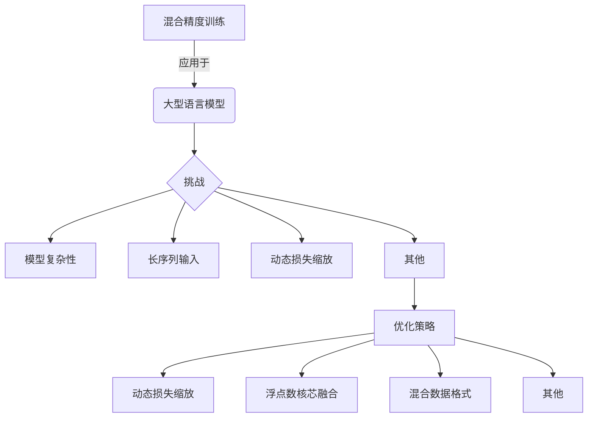

以下是对《大语言模型原理基础与前沿 混合精度》这一主题的深入探讨和分析:

# 大语言模型原理基础与前沿 混合精度

## 1. 背景介绍

### 1.1 问题的由来

随着人工智能和深度学习技术的不断发展,大型语言模型已经成为自然语言处理领域的关键技术之一。这些模型通过在大量文本数据上进行预训练,能够捕捉到丰富的语言知识和语义信息,从而在下游任务中表现出卓越的性能。然而,训练这些庞大的模型需要消耗大量的计算资源,包括GPU/TPU等昂贵的硬件设备,以及海量的数据和算力。

为了在保持模型性能的同时降低训练和推理的计算开销,混合精度训练(Mixed Precision Training)作为一种有效的优化策略应运而生。通过将传统的32位浮点数(FP32)精度降低到16位浮点数(FP16)或更低的精度,可以显著减少模型参数和中间激活值所需的内存占用,从而加速计算过程并降低能耗。

### 1.2 研究现状

目前,混合精度训练已经被广泛应用于各种深度学习任务中,包括计算机视觉、自然语言处理等领域。主流的深度学习框架如TensorFlow、PyTorch等都提供了混合精度训练的支持。然而,在大型语言模型的训练过程中,由于模型结构的复杂性和参数量的庞大,直接应用混合精度训练可能会导致数值不稳定和性能下降等问题。

为了解决这一挑战,研究人员提出了多种优化策略,如动态损失缩放、浮点数核芯融合等技术,旨在提高混合精度训练在大型语言模型中的适用性和效率。此外,一些新兴的硬件加速器,如谷歌的TPU和英伟达的Tensor Core等,也为混合精度训练提供了硬件级别的支持和优化。

### 1.3 研究意义

混合精度训练对于降低大型语言模型的训练和推理成本具有重要意义。通过有效利用混合精度训练,我们可以在保持模型性能的同时,显著减少所需的计算资源,从而使得训练和部署这些庞大模型变得更加经济和高效。这不仅有利于推动自然语言处理技术在工业界的广泛应用,也有助于促进学术界对更大规模语言模型的探索和研究。

此外,混合精度训练在节约能源和减少碳足迹方面也具有重要意义。由于深度学习模型的训练过程通常需要消耗大量能源,降低计算开销不仅可以节省成本,也有助于实现可持续发展和环境保护的目标。

### 1.4 本文结构

本文将全面探讨大型语言模型中混合精度训练的原理、方法和实践。我们将首先介绍混合精度训练的基本概念和原理,然后深入探讨在大型语言模型中应用混合精度训练所面临的挑战和优化策略。接下来,我们将详细阐述核心算法原理、数学模型和公式推导,并通过实际案例进行说明和分析。

此外,我们还将提供一个完整的项目实践,包括开发环境搭建、源代码实现和运行结果展示,以帮助读者更好地理解和掌握混合精度训练在大型语言模型中的应用。最后,我们将总结未来的发展趋势和面临的挑战,并推荐相关的工具、资源和学习材料。

## 2. 核心概念与联系

混合精度训练(Mixed Precision Training)是一种在深度学习模型训练和推理过程中,利用不同精度(如FP32、FP16等)表示权重、激活值和梯度的优化策略。它的核心思想是将计算密集型的操作(如矩阵乘法)使用较低精度(如FP16)进行加速,而对于精度敏感的操作(如权重更新)则使用较高精度(如FP32)来保证数值稳定性和收敛性。

混合精度训练与大型语言模型密切相关,因为训练这些庞大的模型通常需要消耗大量的计算资源。通过应用混合精度训练,我们可以显著减少模型参数和中间激活值所需的内存占用,从而加速计算过程并降低能耗。

然而,在大型语言模型中应用混合精度训练面临着一些独特的挑战,例如:

1. **模型复杂性**: 大型语言模型通常具有复杂的结构和参数量庞大,这可能会导致数值不稳定和性能下降等问题。
2. **长序列输入**: 语言模型通常需要处理长序列的输入数据,这可能会增加数值溢出或下溢的风险。
3. **动态损失缩放**: 为了防止数值下溢,需要采用动态损失缩放等技术来自动调整梯度的范围。

为了解决这些挑战,研究人员提出了多种优化策略,例如:

- **动态损失缩放**: 通过动态调整梯度的缩放因子,来防止数值下溢和保持数值稳定性。
- **浮点数核芯融合**: 利用硬件加速器(如Tensor Core)对低精度计算进行优化,提高计算效率。
- **混合数据格式**: 在不同的计算阶段使用不同的数据格式(如FP16、INT8等),以平衡计算效率和数值精度。

通过上述优化策略,我们可以更好地应用混合精度训练于大型语言模型,从而实现高效的训练和推理过程。

## 3. 核心算法原理 & 具体操作步骤

### 3.1 算法原理概述

混合精度训练的核心原理是在深度学习模型的训练和推理过程中,利用不同精度(如FP32、FP16等)表示权重、激活值和梯度,从而降低计算开销和内存占用。具体来说,它包括以下几个关键步骤:

1. **数据格式转换**: 将模型的权重和输入数据从FP32格式转换为FP16格式,以减少内存占用。
2. **前向传播**: 使用FP16精度进行前向传播计算,包括卷积、矩阵乘法等操作,以加速计算过程。
3. **损失计算**: 将前向传播的输出转换回FP32格式,以计算损失函数和梯度。
4. **反向传播**: 使用FP16精度进行反向传播计算,包括梯度计算和权重更新等操作。
5. **权重更新**: 将计算出的梯度转换回FP32格式,并使用FP32精度更新模型权重,以保证数值稳定性。

在上述过程中,动态损失缩放是一种关键的优化策略,用于防止数值下溢和保持数值稳定性。它通过动态调整梯度的缩放因子,来确保梯度值保持在一个合理的范围内,从而避免数值下溢或溢出的问题。

此外,一些硬件加速器(如Tensor Core)也提供了对低精度计算的优化支持,可以进一步提高混合精度训练的计算效率。

### 3.2 算法步骤详解

下面我们将详细解释混合精度训练在大型语言模型中的具体实现步骤:

1. **初始化**: 首先需要初始化模型权重、优化器和其他相关参数。此时,模型权重通常使用FP32格式进行初始化。

2. **数据格式转换**: 将输入数据(如文本序列)从FP32格式转换为FP16格式,以减少内存占用。同时,也需要将模型权重从FP32转换为FP16格式。

3. **前向传播**:
   - 使用FP16精度进行前向传播计算,包括embedding查找、注意力计算、前馈网络等操作。
   - 对于一些精度敏感的操作(如LayerNorm),可以使用FP32精度进行计算。

4. **损失计算**:
   - 将前向传播的输出转换回FP32格式。
   - 使用FP32精度计算损失函数(如交叉熵损失)和梯度。

5. **反向传播**:
   - 将梯度从FP32格式转换为FP16格式。
   - 使用FP16精度进行反向传播计算,包括梯度计算和权重更新等操作。
   - 应用动态损失缩放策略,动态调整梯度的缩放因子,以防止数值下溢或溢出。

6. **权重更新**:
   - 将计算出的FP16格式梯度转换回FP32格式。
   - 使用FP32精度更新模型权重,以保证数值稳定性。

7. **重复训练**:
   - 重复上述步骤,直到模型收敛或达到预设的训练轮次。

在上述过程中,动态损失缩放策略扮演着关键的角色。它通过动态调整梯度的缩放因子,来确保梯度值保持在一个合理的范围内,从而避免数值下溢或溢出的问题。具体来说,它包括以下步骤:

1. 初始化缩放因子为一个较小的值(如2^16)。
2. 在每个训练步骤中,检查梯度是否发生了溢出或下溢。
3. 如果发生溢出,则将缩放因子减小(如除以2)。
4. 如果发生下溢,则将缩放因子增大(如乘以2)。
5. 使用缩放后的梯度进行权重更新。

通过动态调整缩放因子,我们可以有效地防止数值不稳定的问题,同时保持混合精度训练的计算效率。

### 3.3 算法优缺点

混合精度训练在大型语言模型中应用具有以下优点:

1. **降低内存占用**: 通过将权重和激活值从FP32格式转换为FP16格式,可以显著减少模型的内存占用,从而支持更大规模的模型训练。

2. **加速计算**: 利用FP16精度进行大部分计算操作(如矩阵乘法、卷积等),可以显著加速计算过程,提高训练和推理的效率。

3. **节省能耗**: 由于计算量的减少,混合精度训练可以降低能源消耗,从而减少碳足迹,实现更加环保的模型训练和部署。

4. **硬件加速支持**: 一些新兴的硬件加速器(如Tensor Core)提供了对低精度计算的优化支持,进一步提高了混合精度训练的效率。

然而,混合精度训练也存在一些潜在的缺点和挑战:

1. **数值不稳定性**: 由于使用了较低的精度,可能会导致数值不稳定的问题,如梯度爆炸或消失等,从而影响模型的收敛性和性能。

2. **精度损失**: 虽然FP16精度通常足以满足大部分应用场景的要求,但在某些精度敏感的任务中,可能会导致性能下降。

3. **硬件兼容性**: 不是所有的硬件平台都支持混合精度计算,这可能会限制混合精度训练的应用范围。

4. **代码复杂性**: 实现混合精度训练通常需要修改现有的深度学习框架代码,增加了开发和维护的复杂性。

5. **调试困难**: 由于涉及不同精度之间的转换,调试混合精度训练代码可能会比传统代码更加困难。

总的来说,混合精度训练为大型语言模型的高效训练和推理提供了一种有效的优化策略。但是,在实际应用中,我们需要权衡其优缺点,并采取适当的措施来确保数值稳定性和模型性能。

### 3.4 算法应用领域

混合精度训练最初被广泛应用于计算机视觉领域,如图像分类、目标检测和语义分割等任务。随着技术的不断发展,它也逐