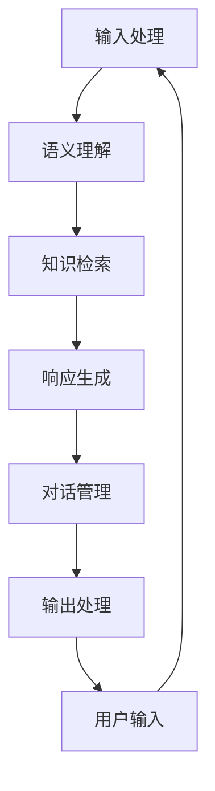

# 大语言模型应用指南：Assistants API整体执行过程

## 1. 背景介绍

### 1.1 问题的由来

在当今的数字时代,人工智能(AI)已经渗透到我们生活的方方面面。大型语言模型(Large Language Models, LLMs)作为AI的一个重要分支,正在推动着自然语言处理(NLP)技术的飞速发展。LLMs可以理解和生成人类语言,为各种应用程序提供强大的语言理解和生成能力。

随着LLMs的不断进化,它们的应用场景也在不断扩展。近年来,一种新兴的应用模式——Assistants API开始崭露头角。Assistants API是一种基于LLMs的API服务,它能够以自然语言的形式与用户进行交互,为用户提供个性化的问答、任务辅助等服务。这种新型API服务的出现,为开发人员提供了一种全新的方式来构建智能应用程序。

然而,Assistants API的整体执行过程涉及多个复杂的技术环节,对开发人员来说仍然存在一定的学习曲线。如何有效地利用这一新兴技术,成为了当前亟需解决的问题。

### 1.2 研究现状

目前,已有一些公司和组织开始探索和推广Assistants API的应用,如OpenAI的GPT-3 API、Anthropic的Claude API等。这些API服务基于大型语言模型,能够为开发者提供强大的自然语言交互能力。

同时,一些研究机构也在积极研究Assistants API的核心技术,如语义理解、知识库构建、对话管理等,以期提高API的性能和可用性。不过,由于这项技术还处于相对初级阶段,现有的研究成果和应用案例仍然有限。

### 1.3 研究意义

Assistants API代表了人工智能与自然语言交互的未来发展方向。深入探讨这一技术的整体执行过程,对于推动其在实际应用中的落地和发展具有重要意义。

本文将全面解析Assistants API的核心概念、算法原理、数学模型、代码实现等关键环节,为开发者提供一个完整的技术指南。同时,本文还将探讨Assistants API的实际应用场景、发展趋势和面临的挑战,以期为读者提供更广阔的视野和思路。

### 1.4 本文结构

本文共分为9个部分:

1. 背景介绍
2. 核心概念与联系
3. 核心算法原理与具体操作步骤
4. 数学模型和公式详细讲解与举例说明
5. 项目实践:代码实例和详细解释说明
6. 实际应用场景
7. 工具和资源推荐
8. 总结:未来发展趋势与挑战
9. 附录:常见问题与解答

## 2. 核心概念与联系

在深入探讨Assistants API的细节之前,我们有必要先了解一些核心概念及其相互关系。

### 2.1 大型语言模型(LLMs)

大型语言模型(Large Language Models, LLMs)是一种基于深度学习的自然语言处理模型。它们通过在大量文本数据上进行训练,学习理解和生成人类语言。LLMs可以捕捉语言的复杂模式和语义关系,从而实现各种NLP任务,如文本生成、问答、机器翻译等。

一些著名的LLMs包括GPT-3、PaLM、ChatGPT等。它们的出现大大推动了自然语言处理技术的发展,为构建智能语言应用程序提供了强大的基础。

### 2.2 Assistants API

Assistants API是一种基于LLMs的API服务,它能够以自然语言的形式与用户进行交互,为用户提供个性化的问答、任务辅助等服务。

Assistants API的核心是一个经过fine-tuning的大型语言模型,它被训练成能够像人类一样进行对话和任务执行。用户可以通过API向语言模型发送自然语言查询或指令,模型会生成相应的自然语言响应,从而实现人机交互。

### 2.3 语义理解

语义理解是指计算机系统能够准确理解自然语言的含义。这是Assistants API能够提供高质量交互体验的关键。

语义理解涉及多个技术环节,包括词法分析、句法分析、词义消歧、命名实体识别、关系提取等。通过这些技术,计算机可以从自然语言输入中提取出关键信息、上下文语境、语义关系等,从而更好地理解用户的意图。

### 2.4 知识库

知识库是Assistants API的重要组成部分。它存储了大量的结构化和非结构化知识,为语言模型提供了丰富的背景知识。

知识库中的知识可以来自多个渠道,如网络百科、专业文献、常识知识库等。通过将这些知识注入到语言模型中,可以增强模型的理解和推理能力,从而提高API的响应质量。

### 2.5 对话管理

对话管理是Assistants API中用于控制对话流程的模块。它负责跟踪对话的上下文信息、管理对话状态、确定下一步的响应策略等。

有效的对话管理可以确保API与用户之间的交互是连贯、相关和有意义的。它还可以帮助API更好地理解用户的意图,并提供更准确和友好的响应。

### 2.6 人机交互界面

人机交互界面是Assistants API与用户进行交互的入口。它可以采用多种形式,如文本输入框、语音接口、聊天机器人等。

一个良好设计的人机交互界面,不仅能够提高用户体验,还能够促进API与用户之间的高效沟通,从而发挥出Assistants API的最大潜力。

上述核心概念相互关联、相互作用,共同构建了Assistants API的整体技术架构。下一部分,我们将深入探讨API的核心算法原理。

## 3. 核心算法原理与具体操作步骤

### 3.1 算法原理概述

Assistants API的核心算法原理可以概括为以下几个关键步骤:

1. **输入处理**: 将用户的自然语言输入(如文本、语音等)转换为机器可以理解的表示形式。
2. **语义理解**: 利用NLP技术(如词法分析、句法分析、词义消歧等)对输入进行语义分析,提取出关键信息和用户意图。
3. **知识检索**: 根据语义理解的结果,从知识库中检索相关的知识。
4. **响应生成**: 将语义理解的结果和检索到的知识输入到语言模型中,生成自然语言响应。
5. **对话管理**: 根据对话历史和当前状态,决定下一步的响应策略。
6. **输出处理**: 将生成的自然语言响应转换为适当的输出形式(如文本、语音等),并呈现给用户。

这个过程是一个循环的流程,每一次用户的新输入都会重新触发该流程。通过不断迭代,Assistants API可以与用户进行自然、流畅的对话交互。

### 3.2 算法步骤详解

接下来,我们将对上述算法的每个步骤进行更详细的解释。

#### 3.2.1 输入处理

输入处理是Assistants API处理流程的第一步。在这一步骤中,系统需要将用户的自然语言输入(如文本、语音等)转换为机器可以理解的表示形式。

对于文本输入,通常会进行如下处理:

1. **标记化(Tokenization)**: 将输入文本按照一定规则(如空格、标点符号等)分割成一个个单词或词元(token)序列。
2. **词嵌入(Word Embedding)**: 将每个单词或词元映射到一个固定长度的密集向量表示,以捕捉单词的语义信息。

对于语音输入,则需要先进行语音识别,将语音信号转录为文本,然后再进行上述文本处理步骤。

输入处理的目的是将原始的自然语言输入转换为语言模型可以理解的数值表示,为后续的语义理解和响应生成奠定基础。

#### 3.2.2 语义理解

语义理解是Assistants API中最为关键的一个环节。在这一步骤中,系统需要利用NLP技术对输入进行深入的语义分析,从而准确理解用户的意图和需求。

语义理解通常包括以下几个子任务:

1. **词法分析**: 将输入文本按照一定规则(如空格、标点符号等)分割成一个个单词或词元序列。
2. **句法分析**: 分析句子的语法结构,确定单词之间的关系(如主语、宾语等)。
3. **词义消歧**: 根据上下文,确定每个词的确切含义。
4. **命名实体识别**: 识别出输入文本中的人名、地名、组织机构名等实体。
5. **关系提取**: 从输入文本中提取出实体之间的关系(如人与组织的雇佣关系等)。
6. **意图识别**: 根据上述分析结果,判断用户的查询意图(如问答、任务执行等)。

通过这些子任务,Assistants API可以深入理解用户输入的语义信息,为后续的知识检索和响应生成奠定基础。

#### 3.2.3 知识检索

知识检索是指根据语义理解的结果,从知识库中检索相关的知识。这一步骤对于Assistants API能够提供准确、信息丰富的响应至关重要。

知识检索通常包括以下几个步骤:

1. **查询构建**: 根据语义理解的结果,构建查询向量或查询语句,用于检索相关知识。
2. **相似性计算**: 计算查询向量与知识库中每个知识条目的相似度,或者使用查询语句搜索知识库。
3. **排序和过滤**: 根据相似度或其他指标(如置信度、新鲜度等)对检索结果进行排序和过滤,选择最相关的知识条目。
4. **知识融合**: 将检索到的多个知识条目进行融合,形成一个连贯、丰富的知识表示。

在知识检索过程中,可以利用各种技术手段,如向量相似性计算、语义匹配、知识图谱查询等,以提高检索的准确性和效率。

#### 3.2.4 响应生成

响应生成是Assistants API的核心功能,它将语义理解的结果和检索到的知识输入到语言模型中,生成自然语言响应。

响应生成通常包括以下几个步骤:

1. **上下文构建**: 将用户的查询、语义理解结果、检索到的知识等信息组合成一个上下文向量或序列,作为语言模型的输入。
2. **语言模型推理**: 将上下文输入到语言模型中,模型会基于训练数据中学习到的语言模式,生成一个自然语言响应序列。
3. **响应后处理**: 对生成的响应进行后处理,如去除不当内容、格式化、添加多模态输出(如图像、表格等)等。
4. **响应评估**: 评估生成响应的质量,如流畅性、相关性、信息丰富度等,以确保响应的质量。

在响应生成过程中,可以应用各种技术手段来提高响应质量,如上下文注意力机制、知识增强、响应重排序等。同时,也需要注意避免生成有偏见、不当或不安全的内容。

#### 3.2.5 对话管理

对话管理是Assistants API中用于控制对话流程的模块。它负责跟踪对话的上下文信息、管理对话状态、确定下一步的响应策略等。

对话管理通常包括以下几个步骤:

1. **上下文跟踪**: 跟踪对话的历史上下文,包括之前的查询、响应、相关知识等信息。
2. **状态管理**: 维护对话的当前状态,如任务进度、已获取的信息等。
3. **策略选择**: 根据当前状态和上下文,选择合适的响应策略,如继续对话、请求clarification、执行任务等。
4. **策略执行**: 执行选定的响应策略,可能需要与