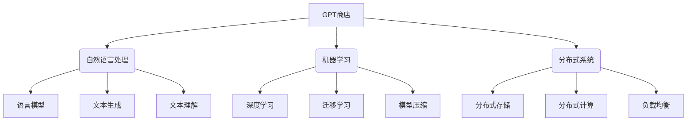

# 大语言模型应用指南：GPTs与GPT商店

## 1. 背景介绍

### 1.1 问题的由来

在过去几年中,大型语言模型(Large Language Models, LLMs)凭借其惊人的性能在自然语言处理(NLP)领域掀起了一股热潮。其中,OpenAI推出的GPT(Generative Pre-trained Transformer)系列模型无疑是最具代表性的LLM。GPT不仅在各种NLP任务上表现出色,更令人惊叹的是它展现出了一定的"通用智能"能力,可以在没有太多特定领域数据的情况下,通过少量示例就能解决新的任务。

这种"通用智能"让GPT被认为是通向人工通用智能(Artificial General Intelligence, AGI)的一个重要里程碑。然而,GPT的强大能力也引发了人们对其安全性和可控性的担忧。一方面,GPT在生成文本时可能会产生有害、不当或不实的内容;另一方面,训练GPT需要消耗大量的计算资源,这对于普通开发者来说是一个沉重的负担。

### 1.2 研究现状

为了解决上述问题,研究人员提出了GPT商店(GPT Store)的概念。GPT商店是一个集中式的GPT模型库,用户可以根据需求从中选择和部署合适的GPT模型,而无需自行训练模型。与此同时,GPT商店还可以对模型进行审查、过滤和优化,以确保其安全性和可控性。

目前,已有一些GPT商店解决方案问世,如OpenAI的InstructGPT、Anthropic的ConstitutionalAI、Google的PaLM等。这些解决方案通过引入人类反馈、设置约束条件等手段,试图使GPT模型更加可控和安全。然而,GPT商店的概念仍处于起步阶段,在模型选择、部署、优化等方面还有很多值得探讨的问题。

### 1.3 研究意义

GPT商店的研究不仅有助于我们更好地理解和控制大型语言模型,还可以推动GPT在各个领域的应用。一个成熟的GPT商店将极大降低GPT模型的使用门槛,让更多开发者能够享受GPT带来的红利。同时,GPT商店也为GPT模型的商业化提供了一个有力支撑。

此外,GPT商店的发展也将推动LLM相关技术的进步,如模型压缩、知识注入、人机交互等,为未来的AGI奠定基础。因此,GPT商店的研究具有重要的理论意义和应用价值。

### 1.4 本文结构

本文将全面介绍GPT商店的相关知识。第2节将阐述GPT商店的核心概念和与其他技术的联系;第3节将详细解释GPT商店的核心算法原理和具体操作步骤;第4节将构建GPT商店的数学模型,并对相关公式进行推导和案例分析;第5节将通过代码实例演示如何开发和使用GPT商店;第6节将列举GPT商店的实际应用场景;第7节将推荐一些GPT商店相关的工具和资源;第8节将总结GPT商店的发展趋势和面临的挑战;第9节将回答一些常见问题。

## 2. 核心概念与联系

GPT商店是一个集中式的大型语言模型库,用户可以从中选择、部署和优化所需的GPT模型。它涉及了多个领域的知识,包括自然语言处理、机器学习、分布式系统等。



GPT商店与自然语言处理(NLP)领域紧密相关。NLP提供了训练和评估语言模型的方法,如序列到序列模型、注意力机制等;同时NLP也为GPT商店提供了应用场景,如文本生成、文本理解等任务。

GPT商店离不开机器学习技术的支持。深度学习是训练大型语言模型的主要手段;迁移学习能够帮助GPT商店快速适应新的任务;模型压缩则可以减小模型的存储和计算开销。

由于GPT模型通常体积庞大,需要大量计算资源,因此GPT商店需要借助分布式系统技术。分布式存储可以高效存放海量模型;分布式计算能够加速模型的训练和推理过程;负载均衡则能够平衡用户请求,提高系统的可用性。

总的来说,GPT商店是一个跨领域的复杂系统,需要融合多方面的技术才能高效运转。

## 3. 核心算法原理与具体操作步骤

### 3.1 算法原理概述

GPT商店的核心算法可以概括为三个步骤:模型选择、模型优化和模型部署。

1. **模型选择**:根据用户的需求从GPT模型库中选择合适的基础模型。这一步需要考虑模型的大小、领域、性能等多个因素。

2. **模型优化**:对选定的基础模型进行优化,以满足特定任务的要求。优化方法包括微调(Fine-tuning)、提示学习(Prompt Learning)、模型剪枝(Model Pruning)等。

3. **模型部署**:将优化后的模型部署到生产环境中,以服务于下游应用。这一步需要考虑模型的并行化、在线服务等问题。

### 3.2 算法步骤详解

1. **模型选择算法**

    模型选择算法的主要任务是从GPT模型库中挑选出最合适的基础模型。这通常需要建立一个模型元数据库,存储每个模型的元信息,如模型大小、领域、指标等。根据用户的需求,算法会检索元数据库,并基于多个条件(如模型大小在一定范围、覆盖特定领域、满足性能下限等)筛选出候选模型集合。然后,算法会对候选模型进行打分和排序,最终选出得分最高的模型作为基础模型。

    ```mermaid
    graph TD
        A[用户需求] -->B(模型元数据库)
        B --> C{模型筛选}
        C -->|满足条件| D[候选模型集合]
        D --> E[模型评分]
        E --> F[排序]
        F --> G[选出基础模型]
    ```

2. **模型优化算法**

    模型优化算法的目标是使基础模型更好地适应特定的任务。主要的优化方法有以下三种:

    - **微调(Fine-tuning)**: 在基础模型的基础上,利用任务数据继续训练模型的部分参数,使其收敛到特定任务上。微调算法需要设计合理的训练策略,如确定需要微调的参数、设置学习率等超参数。

    - **提示学习(Prompt Learning)**: 通过构造特定格式的提示,引导语言模型生成所需的输出。提示学习算法的关键是设计高质量的提示模板,并根据任务数据优化提示。

    - **模型剪枪(Model Pruning)**: 通过剪枝技术压缩模型,以减小模型的存储和计算开销。剪枪算法需要确定剪枝策略(如按权重剪枝、按滤波器剪枝等)和剪枝比例,在降低模型复杂度的同时尽量保留性能。

    ```mermaid
    graph TD
        A[基础模型] --> B{优化方法选择}
        B -->|微调| C[微调算法]
        B -->|提示学习| D[提示学习算法]
        B -->|模型剪枝| E[模型剪枝算法]
        C --> F[优化后模型]
        D --> F
        E --> F
    ```

3. **模型部署算法**

    模型部署算法的任务是将优化后的模型高效地部署到生产环境中,以服务下游应用。主要包括以下几个步骤:

    - **模型并行化**: 由于GPT模型通常体积庞大,需要将模型分割到多个计算节点上,并采用模型并行或数据并行等策略进行并行计算。

    - **在线服务**: 将并行化后的模型封装为在线服务,通过RESTful API或RPC等方式对外提供服务。

    - **负载均衡**: 在有大量用户请求时,需要进行负载均衡,将请求合理分配到多个模型实例上,以提高系统的吞吐量和可用性。

    - **模型更新**: 当有新版本的模型时,需要能够无缝更新模型,在不中断服务的情况下完成模型的替换。

    ```mermaid
    graph TD
        A[优化后模型] --> B[模型并行化]
        B --> C[在线服务封装]
        C --> D{负载均衡}
        D -->|有新模型| E[模型更新]
        D -->|无新模型| F[服务下游应用]
    ```

### 3.3 算法优缺点

上述GPT商店核心算法具有以下优缺点:

**优点**:

1. 模块化设计,算法流程清晰。
2. 覆盖了GPT商店的全部核心功能,包括模型选择、优化和部署。
3. 具有一定的通用性,可以适应不同的GPT模型和任务需求。
4. 支持多种优化方法,如微调、提示学习、模型剪枝等。
5. 支持模型并行化和在线服务,以应对大规模场景。

**缺点**:

1. 算法复杂度较高,实现难度较大。
2. 需要大量的算力和存储资源支持。
3. 缺乏自动化的超参数调优机制。
4. 安全性和隐私保护方面还有待加强。
5. 在某些特殊场景下可能需要专门的算法支持。

### 3.4 算法应用领域

GPT商店的核心算法可以广泛应用于以下领域:

- **自然语言处理**: 文本生成、机器翻译、问答系统、情感分析等任务。
- **智能写作**: 辅助创作、自动摘要、文本续写等应用。
- **知识图谱**: 知识抽取、知识推理、知识问答等场景。
- **对话系统**: 任务型对话、开放域对话等人机交互系统。
- **内容审核**: 不当内容检测、版权保护、信息安全等领域。
- **教育**: 个性化教学、智能辅导、自动阅卷等应用。
- **医疗**: 病历分析、辅助诊断、医疗对话等场景。
- **金融**: 智能投顾、风控审核、舆情监控等领域。

总的来说,只要是与自然语言相关的领域,都可以从GPT商店的算法中获益。

## 4. 数学模型和公式详细讲解与举例说明

### 4.1 数学模型构建

GPT商店的核心是基于Transformer的自回归语言模型,可以表示为:

$$p(x) = \prod_{t=1}^{T}p(x_t|x_{<t})$$

其中$x$是目标序列,$x_t$是序列的第$t$个token,$x_{<t}$表示序列前$t-1$个token。模型的目标是最大化序列的条件概率$p(x)$。

为了捕获长程依赖关系,Transformer引入了Self-Attention机制,公式如下:

$$\mathrm{Attention}(Q, K, V) = \mathrm{softmax}(\frac{QK^T}{\sqrt{d_k}})V$$

其中$Q$、$K$、$V$分别表示Query、Key和Value,都是由输入序列的嵌入经过线性投影得到的。$d_k$是缩放因子,用于防止点积的值过大导致梯度消失。Attention的输出是Value的加权和,权重由Query和Key的相关性决定。

### 4.2 公式推导过程

我们来推导一下Self-Attention的具体计算过程。假设输入序列$X$的长度为$n$,词嵌入维度为$d_\text{model}$,则$Q$、$K$、$V$的形状均为$(n, d_\text{model})$。首先计算$Q$与$K^T$的点积:

$$QK^T = \begin{bmatrix}
q_1k_1^T & q_1k_2^T & \cdots & q_1k_n^T\\
q_2k_1^T & q_2k_2^