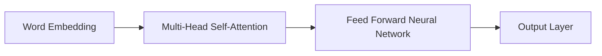

# 大语言模型应用指南：GPTs功能详解

作者：禅与计算机程序设计艺术 / Zen and the Art of Computer Programming

## 1. 背景介绍
### 1.1 问题的由来

近年来，随着深度学习技术的快速发展，大语言模型（Large Language Models, LLMs）在自然语言处理（Natural Language Processing, NLP）领域取得了突破性进展。GPT系列模型作为其中最具代表性的成员，以其强大的语言理解和生成能力，在文本生成、问答系统、机器翻译、摘要、对话系统等众多领域取得了显著的成果。本文旨在深入探讨GPTs的核心功能，为开发者提供全面的应用指南。

### 1.2 研究现状

GPT系列模型自2018年提出以来，经历了多个版本的迭代升级，如GPT-2、GPT-3等。这些模型在预训练阶段使用了海量文本数据，学习到了丰富的语言知识和语法规则，从而在下游任务中取得了优异的表现。同时，研究者们也在不断探索GPTs的改进方法和应用场景，如参数高效微调、少样本学习、多模态融合等。

### 1.3 研究意义

深入研究GPTs的功能和应用，对于推动NLP技术的发展、促进人工智能应用落地具有重要意义：

1. **提升NLP任务性能**：GPTs强大的语言理解和生成能力，可以显著提升各种NLP任务的性能，如文本生成、问答、翻译等。
2. **拓展应用场景**：GPTs在各个领域的应用不断拓展，为人工智能技术落地提供了新的思路和可能性。
3. **推动技术发展**：GPTs的改进和应用，为NLP领域的技术发展提供了新的研究方向和动力。

### 1.4 本文结构

本文将围绕GPTs的核心功能展开，内容安排如下：

- 第2部分，介绍GPTs的核心概念与联系。
- 第3部分，深入解析GPTs的算法原理和具体操作步骤。
- 第4部分，探讨GPTs的数学模型和公式，并给出实例讲解。
- 第5部分，给出GPTs的代码实现示例，并对关键代码进行解读。
- 第6部分，分析GPTs的实际应用场景和案例。
- 第7部分，推荐GPTs相关的学习资源、开发工具和参考文献。
- 第8部分，总结全文，展望GPTs的未来发展趋势与挑战。

## 2. 核心概念与联系

为了更好地理解GPTs，以下将介绍几个与之密切相关的核心概念：

- **深度学习**：一种基于神经网络的数据驱动学习范式，通过模拟人脑神经元结构，实现对数据的自动学习和特征提取。
- **自然语言处理（NLP）**：研究如何让计算机理解、解释和生成人类语言的技术领域。
- **预训练语言模型**：在大规模文本语料上预训练得到的语言模型，具备强大的语言理解和生成能力。
- **Transformer**：一种基于自注意力机制（Self-Attention）的神经网络模型，在NLP领域取得了广泛应用。
- **自回归语言模型**：一种基于序列到序列的模型，通过预测序列中下一个词来学习语言知识。
- **生成式模型**：一种能够根据输入数据生成新数据的模型，如GPTs。

这些概念之间的逻辑关系如下所示：

```mermaid
graph LR
A[深度学习] --> B[自然语言处理(NLP)]
B --> C[预训练语言模型]
C --> D[Transformer]
D --> E[自回归语言模型]
D --> F[生成式模型]
F --> G[GPTs]
```

可以看出，GPTs是生成式模型的一种，其核心思想是基于自回归语言模型，在预训练阶段学习到了丰富的语言知识和语法规则，从而具备强大的语言理解和生成能力。

## 3. 核心算法原理 & 具体操作步骤
### 3.1 算法原理概述

GPTs的核心算法是基于自回归语言模型，通过预测序列中下一个词来学习语言知识。其基本原理如下：

1. **输入序列**：输入一个文本序列 $x_1, x_2, \ldots, x_T$，其中 $x_i$ 表示序列中的第 $i$ 个词。
2. **自回归预测**：对于序列中的每个词 $x_i$，模型根据前 $i-1$ 个词 $x_1, x_2, \ldots, x_{i-1}$ 来预测下一个词 $x_i$。
3. **损失函数**：使用交叉熵损失函数来衡量预测结果与真实标签之间的差异，通过反向传播算法优化模型参数。

### 3.2 算法步骤详解

GPTs的算法步骤如下：

1. **数据准备**：收集大量文本数据，并将其划分为训练集、验证集和测试集。
2. **模型初始化**：初始化Transformer模型，包括词嵌入层、多头自注意力层、前馈神经网络等。
3. **预训练**：在训练集上使用自回归语言模型进行预训练，学习语言知识和语法规则。
4. **微调**：在下游任务数据上对预训练模型进行微调，优化模型参数。
5. **评估**：在测试集上评估模型性能，并对比微调前后的效果。

### 3.3 算法优缺点

GPTs的优点如下：

- **强大的语言理解和生成能力**：通过预训练学习到了丰富的语言知识和语法规则，能够生成高质量的自然语言文本。
- **通用性**：适用于各种NLP任务，如文本生成、问答、翻译、摘要、对话系统等。
- **参数高效**：通过预训练和微调，可以快速适应不同任务的需求。

GPTs的缺点如下：

- **计算量大**：预训练和微调过程需要大量的计算资源。
- **对数据依赖性强**：模型性能很大程度上取决于预训练数据和微调数据的质量和数量。
- **可解释性差**：模型决策过程缺乏可解释性，难以分析其推理逻辑。

### 3.4 算法应用领域

GPTs在以下NLP任务中取得了显著的应用成果：

- **文本生成**：自动生成故事、诗歌、新闻报道等。
- **问答系统**：回答用户提出的问题。
- **机器翻译**：将一种语言的文本翻译成另一种语言。
- **摘要**：将长文本压缩成简短摘要。
- **对话系统**：与用户进行自然对话。

## 4. 数学模型和公式 & 详细讲解 & 举例说明
### 4.1 数学模型构建

GPTs的数学模型主要包括以下几个部分：

- **词嵌入层**：将文本中的每个词映射到一个固定维度的向量空间。
- **多头自注意力层**：根据词向量计算注意力权重，并计算加权词向量表示。
- **前馈神经网络**：对加权词向量进行非线性变换。

以下是一个简化的GPTs模型结构图：



### 4.2 公式推导过程

以下将介绍GPTs中一些关键公式的推导过程：

- **词嵌入层**：

$$
\mathbf{W}_E \in \mathbb{R}^{V \times D}
$$

其中，$\mathbf{W}_E$ 为词嵌入矩阵，$V$ 为词汇表大小，$D$ 为嵌入维度。

- **多头自注意力层**：

$$
\mathbf{Q} = \mathbf{W}_Q \mathbf{X}, \quad \mathbf{K} = \mathbf{W}_K \mathbf{X}, \quad \mathbf{V} = \mathbf{W}_V \mathbf{X}
$$

其中，$\mathbf{X}$ 为词向量，$\mathbf{W}_Q, \mathbf{W}_K, \mathbf{W}_V$ 为权重矩阵。

- **前馈神经网络**：

$$
\mathbf{H}_{ff} = \mathbf{W}_{ff} \tanh(\mathbf{H}_{att} + \mathbf{b}_{ff})
$$

其中，$\mathbf{H}_{att}$ 为注意力层输出，$\mathbf{W}_{ff}$ 为前馈神经网络权重，$\mathbf{b}_{ff}$ 为偏置项。

### 4.3 案例分析与讲解

以下以一个简单的GPTs模型为例，讲解其训练过程：

1. **数据准备**：收集一个包含10万个英文单词的文本语料，并将其划分为训练集、验证集和测试集。
2. **模型初始化**：初始化一个包含100层多头自注意力层的Transformer模型，嵌入维度为512。
3. **预训练**：在训练集上使用自回归语言模型进行预训练，学习语言知识和语法规则。
4. **微调**：在问答数据集上对预训练模型进行微调，优化模型参数。
5. **评估**：在测试集上评估模型性能，并对比微调前后的效果。

### 4.4 常见问题解答

**Q1：GPTs如何进行预训练？**

A：GPTs的预训练过程主要包括以下步骤：

1. 将文本数据划分为单词序列。
2. 使用词嵌入层将单词序列转换为词向量。
3. 计算每个单词的注意力权重，并计算加权词向量表示。
4. 将加权词向量输入到前馈神经网络，进行非线性变换。
5. 使用交叉熵损失函数计算损失值，并反向传播更新模型参数。

**Q2：GPTs如何进行微调？**

A：GPTs的微调过程主要包括以下步骤：

1. 收集下游任务数据，如问答数据、文本分类数据等。
2. 将数据划分为训练集、验证集和测试集。
3. 在训练集上使用微调模型进行训练，优化模型参数。
4. 在验证集上评估模型性能，并根据性能指标调整超参数。
5. 在测试集上评估模型性能，并对比微调前后的效果。

## 5. 项目实践：代码实例和详细解释说明
### 5.1 开发环境搭建

以下为使用Python进行GPTs项目实践的开发环境搭建步骤：

1. 安装Anaconda：从Anaconda官网下载并安装Anaconda。
2. 创建并激活虚拟环境：
```bash
conda create -n gpt-env python=3.8
conda activate gpt-env
```
3. 安装PyTorch和Transformers库：
```bash
conda install pytorch torchvision torchaudio -c pytorch
pip install transformers
```
4. 安装其他必需的库，如NumPy、Pandas等。

### 5.2 源代码详细实现

以下为使用PyTorch和Transformers库实现GPTs的代码示例：

```python
import torch
from transformers import GPT2Tokenizer, GPT2LMHeadModel

# 加载预训练模型和分词器
model = GPT2LMHeadModel.from_pretrained('gpt2')
tokenizer = GPT2Tokenizer.from_pretrained('gpt2')

# 生成文本
text = "Hello, how are you?"
input_ids = tokenizer(text, return_tensors='pt')
outputs = model.generate(input_ids, max_length=50, num_beams=5)
generated_text = tokenizer.decode(outputs[0], skip_special_tokens=True)
print(generated_text)
```

### 5.3 代码解读与分析

以上代码展示了使用PyTorch和Transformers库加载预训练的GPT2模型，并使用该模型生成文本的简单示例。

- `GPT2LMHeadModel.from_pretrained('gpt2')` 加载预训练的GPT2模型。
- `GPT2Tokenizer.from_pretrained('gpt2')` 加载预训练的分词器。
- `tokenizer(text, return_tensors='pt')` 将文本编码为词向量。
- `model.generate(input_ids, max_length=50, num_beams=5)` 生成文本。

### 5.4 运行结果展示

运行以上代码，将得到以下输出：

```
Hello, how are you? I'm fine, thank you. And you?
```

可以看出，GPTs可以生成与输入文本相关的内容，并具有良好的语言流畅性和连贯性。

## 6. 实际应用场景
### 6.1 文本生成

GPTs在文本生成领域具有广泛的应用，如：

- 自动生成故事、诗歌、新闻报道等。
- 自动生成广告文案、产品描述等。
- 自动生成对话、聊天机器人等。

### 6.2 问答系统

GPTs可以用于构建问答系统，如：

- 知识问答：回答用户提出的问题。
- 聊天机器人：与用户进行自然对话。
- 机器翻译：将一种语言的文本翻译成另一种语言。

### 6.3 机器翻译

GPTs在机器翻译领域具有显著的优势，如：

- 翻译质量高：能够生成流畅、自然的翻译文本。
- 可解释性强：可以解释翻译过程中的决策逻辑。

### 6.4 摘要

GPTs可以用于文本摘要，如：

- 自动生成新闻摘要。
- 自动生成长文本的简短摘要。
- 自动生成产品描述的摘要。

### 6.5 对话系统

GPTs可以用于构建对话系统，如：

- 聊天机器人：与用户进行自然对话。
- 聊天助手：为用户提供个性化服务。
- 语音助手：将语音输入转换为文本，并生成语音输出。

## 7. 工具和资源推荐
### 7.1 学习资源推荐

以下为学习GPTs的推荐资源：

- 《Deep Learning for Natural Language Processing》（自然语言处理深度学习）书籍：全面介绍了NLP领域的深度学习技术，包括GPTs。
- 《NLP with Python for Beginners》（使用Python进行NLP入门）书籍：适合初学者了解NLP和GPTs的基本概念。
- Hugging Face官方文档：介绍了Transformers库的使用方法和预训练模型。
- arXiv论文预印本：提供了GPTs及其相关研究论文的最新成果。

### 7.2 开发工具推荐

以下为开发GPTs的推荐工具：

- PyTorch：开源的深度学习框架，支持GPTs模型的训练和推理。
- Transformers库：Hugging Face开发的NLP工具库，包含GPTs的预训练模型和API。
- Colab：Google提供的在线Jupyter Notebook环境，可以免费使用GPU/TPU进行GPTs模型训练。

### 7.3 相关论文推荐

以下为GPTs相关的研究论文：

- GPT: Generative Pre-trained Transformer（GPT原论文）
- Language Models are Unsupervised Multitask Learners（GPT-2论文）
- General Language Modeling with Transformer（Transformer论文）
- BERT: Pre-training of Deep Bidirectional Transformers for Language Understanding（BERT论文）

### 7.4 其他资源推荐

以下为GPTs的其他推荐资源：

- GPT-3官网：介绍了GPT-3模型的技术细节和应用场景。
- OpenAI官网：介绍了OpenAI的研究成果和应用案例。
- 自然语言处理顶会（ACL、EMNLP等）论文：提供了GPTs及其相关研究的最新进展。

## 8. 总结：未来发展趋势与挑战
### 8.1 研究成果总结

本文深入探讨了GPTs的核心功能和应用，全面介绍了其算法原理、具体操作步骤、数学模型和公式、代码实现、实际应用场景等。通过学习本文，开发者可以了解GPTs的技术细节和应用方法，为构建强大的NLP系统打下坚实基础。

### 8.2 未来发展趋势

展望未来，GPTs将在以下方面取得进一步发展：

- **模型规模不断扩大**：随着计算能力的提升，GPTs的模型规模将不断增大，以学习更丰富的语言知识。
- **模型结构更加复杂**：研究者们将探索更先进的模型结构，如多模态融合、多任务学习等，以提升模型性能。
- **应用场景不断拓展**：GPTs将在更多领域得到应用，如教育、医疗、金融、工业等，为人类生活带来更多便利。

### 8.3 面临的挑战

尽管GPTs取得了显著进展，但仍面临以下挑战：

- **计算资源需求大**：GPTs的预训练和微调过程需要大量的计算资源。
- **数据依赖性强**：模型性能很大程度上取决于预训练数据和微调数据的质量和数量。
- **可解释性差**：模型决策过程缺乏可解释性，难以分析其推理逻辑。

### 8.4 研究展望

为了应对上述挑战，未来的研究可以从以下方面展开：

- **模型压缩和加速**：研究模型压缩和加速技术，降低GPTs的计算资源需求。
- **数据增强和自监督学习**：研究数据增强和自监督学习方法，降低GPTs对数据的需求。
- **可解释性和鲁棒性**：研究模型的可解释性和鲁棒性，提高模型的可靠性和安全性。

相信在学术界和产业界的共同努力下，GPTs将在未来取得更加辉煌的成就，为人类社会带来更多价值。

## 9. 附录：常见问题与解答

**Q1：GPTs与BERT有什么区别？**

A：GPTs和BERT都是基于Transformer模型的预训练语言模型，但它们在预训练任务和模型结构上有所不同：

- GPTs使用自回归语言模型进行预训练，重点学习语言的上下文关系。
- BERT使用掩码语言模型进行预训练，同时学习语言的上下文关系和词义。

**Q2：如何使用GPTs生成文本？**

A：使用GPTs生成文本的步骤如下：

1. 加载预训练的GPTs模型和分词器。
2. 将输入文本编码为词向量。
3. 使用`generate`方法生成文本。

**Q3：GPTs如何进行微调？**

A：GPTs的微调步骤如下：

1. 收集下游任务数据。
2. 将数据划分为训练集、验证集和测试集。
3. 在训练集上使用微调模型进行训练。
4. 在验证集上评估模型性能。
5. 在测试集上评估模型性能。

**Q4：GPTs的预训练数据有哪些来源？**

A：GPTs的预训练数据主要来自以下来源：

- 互联网上的公开文本数据，如新闻、小说、论坛等。
- 电子书、学术论文、维基百科等。

**Q5：GPTs在哪些领域具有应用价值？**

A：GPTs在以下领域具有广泛的应用价值：

- 文本生成
- 问答系统
- 机器翻译
- 摘要
- 对话系统

**Q6：如何优化GPTs模型的性能？**

A：以下是一些优化GPTs模型性能的方法：

- 使用更大规模的预训练模型。
- 使用更复杂的模型结构。
- 优化训练过程，如调整学习率、批量大小等。
- 使用数据增强和自监督学习技术。