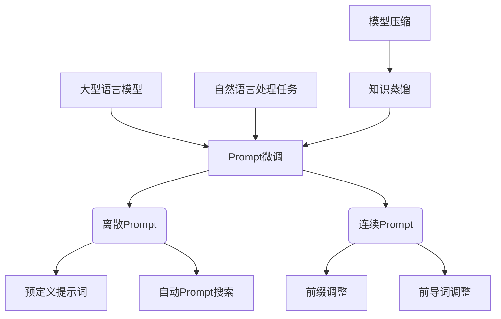

# 大语言模型应用指南：Prompt高效微调

## 1. 背景介绍

### 1.1 问题的由来

在过去几年中,大型语言模型(Large Language Models, LLMs)在自然语言处理(NLP)领域取得了令人瞩目的进展。这些模型通过在大规模语料库上进行预训练,学习了丰富的语言知识和上下文信息,从而在广泛的自然语言任务中表现出色,如机器翻译、问答系统、文本生成等。然而,尽管预训练模型具有强大的能力,但直接将其应用于特定任务时,通常需要对模型进行进一步的微调(fine-tuning),以使其更好地适应任务的特定需求和数据分布。

传统的微调方法是在目标任务的数据集上对整个模型进行端到端的微调,这种方式虽然有效,但存在一些不足之处。首先,由于需要对整个模型进行训练,计算成本和资源需求都很高,尤其是对于大型模型。其次,端到端微调可能会导致模型"遗忘"预训练阶段学习到的一般语言知识,从而影响模型在其他任务上的泛化能力。此外,为每个新任务重新微调整个模型也缺乏灵活性和可扩展性。

### 1.2 研究现状

为了解决上述问题,研究人员提出了一种新的微调范式,即Prompt微调(Prompt-tuning)。Prompt微调的核心思想是,通过设计合适的Prompt(提示词),将目标任务的输入数据映射到模型的预训练空间,从而利用预训练模型的知识来解决新任务,而无需对整个模型进行微调。这种方法的优势在于,它只需要微调一小部分可训练参数(即Prompt参数),从而大大降低了计算成本,同时也保留了模型的大部分预训练知识,有助于提高泛化性能。

Prompt微调方法主要分为两大类:离散Prompt和连续Prompt。离散Prompt通过在输入序列前添加一些特定的文本标记(如"翻译:"、"总结:"等),将任务映射到预训练模型所熟悉的格式。而连续Prompt则是将Prompt表示为一组可训练的连续向量(通常被称为前缀或前导词),这些向量在微调过程中会被优化,以最佳地捕获任务的语义信息。

虽然Prompt微调取得了令人鼓舞的成果,但它仍然面临一些挑战和局限性。例如,如何高效地设计Prompt以最大限度地利用预训练模型的知识?如何处理不同任务之间的Prompt冲突?如何扩展Prompt微调以支持更复杂的任务和模型?等等。这些问题都需要进一步的研究和探索。

### 1.3 研究意义

Prompt微调作为一种新兴的微调范式,具有重要的理论意义和应用价值。从理论层面上讲,它为我们提供了一种新的视角来理解和利用大型语言模型的能力,有助于揭示模型内部的语义表示和知识组织方式。同时,Prompt微调也为模型压缩、知识蒸馏等技术提供了新的思路和方法。

从应用层面来看,Prompt微调的低计算成本和高灵活性,使其在实际应用中具有广阔的前景。它可以被应用于各种自然语言处理任务,如文本分类、机器翻译、问答系统等,并有望在工业界得到广泛部署。此外,Prompt微调还可以用于指导大型语言模型生成更加符合人类期望的输出,从而促进人工智能系统的可解释性和可控性。

### 1.4 本文结构

本文将全面介绍Prompt微调的相关理论和实践。我们将从Prompt微调的基本概念和原理出发,详细阐述离散Prompt和连续Prompt的设计方法,并探讨如何将它们应用于不同的NLP任务。接下来,我们将深入分析Prompt微调的核心算法,包括优化目标、训练策略等,并介绍一些最新的研究进展和改进方法。

此外,我们还将提供一个端到端的项目实践案例,包括代码实现、实验结果和性能分析,以帮助读者更好地掌握Prompt微调的实际应用。最后,我们将总结Prompt微调的未来发展趋势和面临的挑战,并给出一些建议和资源,供读者进一步学习和研究。

## 2. 核心概念与联系

Prompt微调是一种新兴的大型语言模型微调范式,旨在通过设计合适的Prompt(提示词)将目标任务映射到模型的预训练空间,从而利用预训练知识解决新任务,而无需对整个模型进行微调。它主要包括两种形式:离散Prompt和连续Prompt。

离散Prompt通过在输入序列前添加一些特定的文本标记(如"翻译:"、"总结:"等),将任务映射到预训练模型所熟悉的格式。这种方法的优点是直观易懂,但缺点是需要手动设计合适的提示词,并且提示词的选择会影响模型的性能。离散Prompt可以进一步分为预定义提示词和自动Prompt搜索两种方式。

连续Prompt则是将Prompt表示为一组可训练的连续向量(通常被称为前缀或前导词),这些向量在微调过程中会被优化,以最佳地捕获任务的语义信息。连续Prompt的优点是更加灵活和自动化,但缺点是需要额外的参数和训练开销。连续Prompt也可以分为前缀调整和前导词调整两种形式。

Prompt微调的核心思想是利用大型语言模型在大规模语料库上预训练获得的丰富语言知识,并通过设计合适的Prompt将目标任务映射到模型的预训练空间,从而避免了对整个模型进行昂贵的端到端微调。这种方法不仅计算成本低,而且还能保留模型的大部分预训练知识,有助于提高模型的泛化能力。

Prompt微调可以应用于广泛的自然语言处理任务,如文本分类、机器翻译、问答系统等,并有望在工业界得到广泛部署。同时,Prompt微调也为模型压缩、知识蒸馏等技术提供了新的思路和方法,有助于提高模型的效率和可解释性。

## 3. 核心算法原理 & 具体操作步骤

### 3.1 算法原理概述

Prompt微调算法的核心思想是,通过设计合适的Prompt(提示词),将目标任务的输入数据映射到大型语言模型的预训练空间,从而利用预训练模型的知识来解决新任务,而无需对整个模型进行昂贵的端到端微调。

具体来说,Prompt微调算法包括以下几个关键步骤:

1. **Prompt设计**: 根据目标任务的特点,设计合适的Prompt,将任务映射到预训练模型所熟悉的格式。这可以是离散的文本提示词,也可以是连续的向量表示。

2. **Prompt参数初始化**: 对于离散Prompt,通常不需要初始化参数;对于连续Prompt,需要初始化Prompt向量的参数,通常采用随机初始化或基于预训练模型的初始化策略。

3. **输入构建**: 将原始输入数据与设计的Prompt结合,构建新的输入序列,输入到预训练模型中。

4. **Prompt微调**: 在目标任务的训练数据上,微调Prompt参数(对于离散Prompt,是提示词的选择;对于连续Prompt,是Prompt向量的值),使得模型在该任务上的性能最优。

5. **模型推理**: 使用微调后的Prompt,将新的输入数据输入到预训练模型中,获取模型的输出作为任务的预测结果。

通过这种方式,Prompt微调算法只需要微调少量的Prompt参数,而不需要对整个预训练模型进行微调,从而大大降低了计算成本。同时,由于保留了模型的大部分预训练参数,Prompt微调也有助于提高模型的泛化能力和知识迁移能力。

### 3.2 算法步骤详解

#### 3.2.1 Prompt设计

Prompt设计是Prompt微调算法的关键步骤之一,直接影响着模型在目标任务上的性能。根据Prompt的表示形式,可以分为离散Prompt和连续Prompt两种设计方式。

**离散Prompt设计**

离散Prompt通过在输入序列前添加一些特定的文本标记(如"翻译:"、"总结:"等),将任务映射到预训练模型所熟悉的格式。离散Prompt的设计通常需要人工干预,根据任务的特点和预训练模型的知识,选择合适的提示词。例如,对于文本分类任务,可以使用"这段文本的主题是:"作为提示词;对于机器翻译任务,可以使用"将以下内容翻译成目标语言:"作为提示词。

离散Prompt的优点是直观易懂,但缺点是需要手动设计合适的提示词,并且提示词的选择会影响模型的性能。为了解决这个问题,研究人员提出了自动Prompt搜索的方法,通过搜索算法或机器学习技术自动生成最优的提示词。

**连续Prompt设计**

连续Prompt则是将Prompt表示为一组可训练的连续向量(通常被称为前缀或前导词),这些向量在微调过程中会被优化,以最佳地捕获任务的语义信息。连续Prompt的设计通常采用以下两种形式:

1. **前缀调整(Prefix-tuning)**: 在输入序列的开头添加一个可训练的前缀向量序列,作为Prompt。这种方式的优点是可以直接插入到预训练模型的输入中,但缺点是前缀长度的选择会影响性能。

2. **前导词调整(Prompting-tuning)**: 在预训练模型的嵌入层之前添加一个可训练的前导词向量,作为Prompt。这种方式的优点是参数量少,但缺点是需要修改预训练模型的结构。

连续Prompt的优点是更加灵活和自动化,但缺点是需要额外的参数和训练开销。通常,连续Prompt的初始化策略对模型的性能也有一定影响,常见的初始化方法包括随机初始化、基于预训练模型的初始化等。

#### 3.2.2 Prompt参数初始化

对于离散Prompt,通常不需要初始化参数,因为提示词是预定义的文本标记。但对于连续Prompt,需要初始化Prompt向量的参数,以便后续的微调过程。

常见的连续Prompt参数初始化策略包括:

1. **随机初始化**: 从一个标准正态分布或均匀分布中随机采样初始化Prompt向量的值。这种方式简单直接,但可能导致子优化问题。

2. **基于预训练模型的初始化**: 利用预训练模型的参数或输出,为Prompt向量初始化一个相对合理的起始值。例如,可以使用预训练模型对一些标记输入序列的输出作为Prompt向量的初始值。这种方式可以提供一个相对更好的初始点,但需要额外的计算开销。

3. **基于任务的初始化**: 根据目标任务的特点,设计一些启发式规则或策略,为Prompt向量初始化一个与任务相关的起始值。例如,对于文本分类任务,可以使用类别名称的嵌入向量作为Prompt向量的初始值。这种方式需要一定的领域知识和经验,但可能会获得更好的初始点。

初始化策略的选择会影响Prompt微调的收敛速度和最终性能,因此需要根据具体任务和模型进行调优和选择。

#### 3.2.3 输入构建

在设计好Prompt并初始化参数后,下一步是将原始输入数据与Prompt结合,构建新的输入序列,输入到预训练模型中。

对于离散Prompt,输入构建的过程相对简单,只需将提示词与原始输入文本拼接即可。例如,对于文本分类任务,