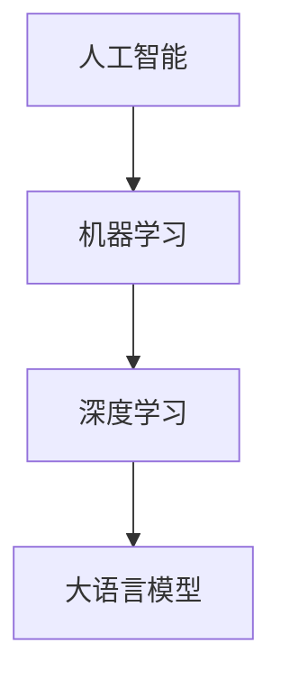

# 大语言模型应用指南：从人工智能的起源到大语言模型

关键词：人工智能、大语言模型、自然语言处理、深度学习、Transformer、GPT、BERT、知识图谱、对话系统

## 1. 背景介绍
### 1.1 问题的由来
人工智能(Artificial Intelligence, AI)自1956年达特茅斯会议提出以来，已经走过了60多年的发展历程。从早期的符号主义和连接主义，到21世纪以来的深度学习，AI技术不断突破，应用日益广泛。其中，自然语言处理(Natural Language Processing, NLP)作为AI的一个重要分支，旨在让计算机能够理解、生成和处理人类语言。而近年来兴起的大语言模型(Large Language Model, LLM)，更是将NLP推向了新的高度，为实现通用人工智能(Artificial General Intelligence, AGI)带来了曙光。

### 1.2 研究现状
大语言模型源于2017年Google推出的Transformer架构[1]。Transformer采用了自注意力机制(Self-Attention)，能够并行计算，大幅提升了模型训练效率。此后，OpenAI基于Transformer推出了GPT系列模型[2]，实现了高质量的文本生成。2018年，Google发布了BERT模型[3]，引入了掩码语言模型(Masked Language Model)和句子连贯性判别(Next Sentence Prediction)两个预训练任务，在多项NLP任务上取得了当时最好的效果。

随后，各大科技公司和研究机构纷纷开展大语言模型的研究，推出了XLNet[4]、RoBERTa[5]、ALBERT[6]、T5[7]等模型，不断刷新NLP基准的记录。同时，大语言模型的规模也在持续增长，从BERT的1.1亿参数，到GPT-3的1750亿参数[8]，再到最新的Switch Transformer拥有1.6万亿参数[9]，计算力的进步使得大语言模型能够从海量文本数据中学习知识，具备了强大的语言理解和生成能力。

### 1.3 研究意义
大语言模型的出现，标志着NLP进入了"预训练+微调"的新范式。通过在大规模无标注语料上进行自监督预训练，大语言模型能够学习到语言的通用表示，再结合少量标注数据进行特定任务的微调，就可以在下游任务上取得优异的表现，避免了从零开始训练模型的巨大开销。同时，大语言模型所蕴含的海量知识，使其在知识问答、对话生成、文本分类等应用场景展现出了巨大的潜力，有望成为未来AI系统的基础设施。

### 1.4 本文结构
本文将从以下几个方面介绍大语言模型的相关知识：

- 第2部分介绍大语言模型涉及的核心概念，以及它们之间的联系。  
- 第3部分重点讲解Transformer、BERT等大语言模型的核心算法原理和具体操作步骤。
- 第4部分系统阐述大语言模型相关的数学模型和公式，并给出详细的推导过程和案例分析。
- 第5部分通过代码实例，演示如何利用现有的开源框架实现大语言模型，并对代码进行解读。
- 第6部分讨论大语言模型在智能问答、机器翻译、文本生成等领域的实际应用，展望其未来发展前景。
- 第7部分推荐大语言模型相关的学习资源、开发工具和重要文献。
- 第8部分总结全文，分析大语言模型未来的发展趋势和面临的挑战。
- 第9部分的附录中列举了一些常见问题，并给出了详细的解答。

## 2. 核心概念与联系

在介绍大语言模型的核心概念之前，我们先回顾一下人工智能、机器学习和深度学习的关系：

人工智能是一个涵盖范围很广的概念，它研究如何让机器模拟人类的智能行为。机器学习是实现人工智能的一种方法，通过学习算法，让机器从数据中自动提取模式和规律。深度学习则是机器学习的一个分支，利用多层神经网络对数据进行建模，能够学习到更加抽象和复杂的特征表示。大语言模型是深度学习在自然语言处理领域的重要应用，通过海量文本数据的预训练，掌握了语言的统计规律和语义知识。

接下来，我们详细解释一下与大语言模型相关的几个核心概念：

（1）自然语言处理（NLP）
自然语言处理是人工智能的一个重要分支，旨在让计算机能够理解、生成和处理人类语言。NLP涉及的任务包括词法分析、句法分析、语义分析、篇章分析、信息抽取、机器翻译、文本分类、情感分析、问答系统等。传统的NLP方法主要基于规则和统计模型，而深度学习的兴起，尤其是预训练语言模型的出现，极大地推动了NLP技术的发展。

（2）语言模型（Language Model）
语言模型是一种对语言进行建模的方法，用于计算一个句子或词序列的概率。给定一个词序列 $w_1, w_2, \cdots, w_n$，语言模型的目标是估计这个序列的概率 $P(w_1, w_2, \cdots, w_n)$。根据概率论的链式法则，这个概率可以分解为：

$$
P(w_1, w_2, \cdots, w_n) = P(w_1) \cdot P(w_2|w_1) \cdot P(w_3|w_1,w_2) \cdots P(w_n|w_1,\cdots,w_{n-1})
$$

其中，$P(w_i|w_1,\cdots,w_{i-1})$ 表示在已知前 $i-1$ 个词的情况下，第 $i$ 个词为 $w_i$ 的条件概率。语言模型可以用于预测下一个最可能出现的词，生成连贯的文本，以及计算一个句子是否合乎语法和语义。

（3）预训练语言模型（Pre-trained Language Model）
预训练语言模型是指先在大规模无标注语料上进行自监督预训练，学习语言的通用表示，再在特定任务的标注数据上进行微调的语言模型。预训练阶段通常采用自回归语言模型或自编码语言模型，前者是根据前面的词预测下一个词，后者是根据上下文预测被掩码的词。预训练使得模型能够从海量文本中学习词汇、句法、语义等多层次的语言知识，再通过微调迁移到下游任务，大幅提升了模型的性能，是当前NLP领域的主流范式。

（4）Transformer 
Transformer是一种基于自注意力机制的神经网络架构，由Vaswani等人在2017年提出[1]。与此前的循环神经网络（RNN）和卷积神经网络（CNN）不同，Transformer完全依靠注意力机制来捕捉序列的依赖关系，不仅计算效率更高，而且能够更好地处理长距离的依赖。Transformer的核心是自注意力层和前馈神经网络层，通过堆叠多个这样的层，再配合位置编码，就可以建模任意长度的序列。Transformer最初用于机器翻译任务，但其强大的特征提取能力很快被发现，成为后来各种预训练语言模型的基础架构。

（5）BERT（Bidirectional Encoder Representations from Transformers）
BERT是Google在2018年提出的一个里程碑式的预训练语言模型[3]，它创新性地引入了掩码语言模型（Masked Language Model, MLM）和句子连贯性判别（Next Sentence Prediction, NSP）两个预训练任务，让模型能够融合双向的上下文信息。MLM是指随机掩盖一部分词，让模型根据上下文去预测这些被掩盖的词；NSP是指判断两个句子在原文中是否相邻，这有助于捕捉句子间的逻辑关系。BERT在多项NLP任务上取得了突破性的进展，奠定了预训练语言模型的主导地位。

（6）GPT（Generative Pre-trained Transformer）
GPT系列模型是OpenAI开发的一个重要的预训练语言模型，第一代GPT发布于2018年[2]。与BERT的双向建模不同，GPT采用了单向的自回归语言模型，通过从左到右地预测下一个词来学习语言的表示。GPT在文本生成、对话系统等任务上展现出了强大的能力，尤其是最新的GPT-3，拥有1750亿个参数，可以在少样本的情况下完成各种NLP任务，接近人类的表现[8]。GPT系列模型的成功，展示了语言模型规模的重要性，以及自回归建模在文本生成中的优势。

（7）知识图谱（Knowledge Graph）
知识图谱是一种结构化的知识库，用节点表示实体，用边表示实体间的关系，形成一张庞大的语义网络。知识图谱能够以更加结构化和语义化的方式组织知识，便于机器理解和推理。当前主流的知识图谱包括Freebase、DBpedia、YAGO等。将知识图谱与大语言模型相结合，能够让模型更好地掌握常识性知识和领域知识，增强语言理解和生成的能力。一些研究尝试将知识图谱编码到语言模型中[10]，或者利用语言模型从文本中抽取知识图谱[11]，都取得了不错的效果。

（8）对话系统（Dialogue System）
对话系统是人工智能的一个重要应用，旨在让机器能够与人自然地对话，完成问答、任务指派、情感交流等目的。传统的对话系统通常采用管道式的架构，包括自然语言理解、对话管理、自然语言生成等模块，每个模块需要单独训练。而端到端的对话系统则利用深度学习，特别是预训练语言模型，将各个模块整合到一个统一的框架中，大幅简化了系统的设计和实现。GPT、DialoGPT[12]等大语言模型在对话生成任务上取得了令人瞩目的成绩，使得开放域对话系统成为可能。同时，知识驱动的对话系统也是一个重要的研究方向，旨在赋予对话系统一定的背景知识，提高对话的连贯性和信息量。

通过上面的介绍，我们可以看到，大语言模型与自然语言处理、语言模型、Transformer、BERT、GPT、知识图谱、对话系统等概念都有着密切的联系。大语言模型是深度学习和NLP结合的产物，以 Transformer 为基础架构，通过自监督预训练学习语言的通用表示。BERT 和 GPT 是两个代表性的大语言模型，分别采用了双向和单向的建模方式，在多个NLP任务上取得了瞩目的成绩。知识图谱作为结构化的知识库，可以与大语言模型互补，增强其知识理解和应用的能力。对话系统是大语言模型的一个重要应用场景，端到端的模型和知识驱动是当前的两个主要发展方向。

## 3. 核心算法原理 & 具体操作步骤
### 3.1 算法原理概述
大语言模型的核心是利用深度神经网络，从大规模文本语料中学习语言的统计规律和语义表示。这里我们重点介绍Transformer、BERT和GPT三个里程碑式的模型。

（1）Transformer
Transformer[1]的核心思想是利用自注意力机制来建模序列内和序列间的依赖关系。与传统的RNN和CNN不同，Transformer不依赖时间步或位置的先后顺序，而是通过注意力权重来动态地聚合上下文信息。具体来说，Transformer包含编码器和解码器两部分，每一部分都是由若干个相同的层堆叠而成。每一层包含两个子层：多头自注意力层和前馈神经网络层。

- 多头自注意力层：将输入序列的每个位置映射为查询（Query）、键（Key）、值（Value）三个向量，然后通过计算查询向量与所有键向量的相似度，得到注意力权重，再用权重对值向量进行加权求和，得到该位置的输出向量。多头机制是指