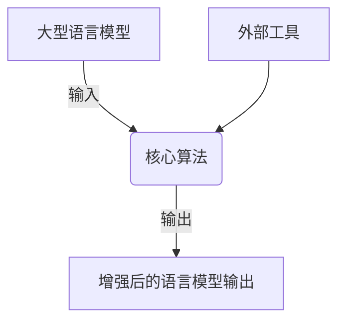

# 大语言模型应用指南：外部工具

## 1. 背景介绍

### 1.1 问题的由来

随着人工智能和深度学习技术的不断发展,大型语言模型(Large Language Models, LLMs)已经成为自然语言处理(NLP)领域的主导力量。这些模型通过在海量文本数据上进行预训练,展现出了令人惊叹的语言理解和生成能力。然而,尽管取得了巨大的进步,但大型语言模型仍然存在一些局限性和挑战。

其中一个主要挑战是,这些模型仅依赖于其训练数据中包含的知识,无法直接访问最新的外部信息源。这意味着,当面对动态变化的现实世界时,它们可能会产生过时或不准确的输出。此外,由于训练数据的有限性,大型语言模型在某些特定领域的知识覆盖面可能不够全面。

### 1.2 研究现状

为了克服上述局限性,研究人员提出了将大型语言模型与外部工具相结合的方法。这种方法旨在利用外部工具提供的最新信息和专业知识,来增强语言模型的能力和输出质量。目前,已经有一些初步的研究探索了将语言模型与搜索引擎、知识库、计算工具等外部资源相结合的可能性。

然而,现有研究大多集中于特定任务或领域,缺乏一个系统性的框架来指导如何有效地将外部工具与大型语言模型相结合。此外,不同类型的外部工具在集成过程中面临着不同的挑战,需要采取相应的策略和方法。

### 1.3 研究意义

将大型语言模型与外部工具相结合,可以显著提高模型的性能和适用范围。通过利用外部工具提供的最新信息和专业知识,语言模型可以产生更加准确、相关和富有见解的输出。这对于许多实际应用场景都是至关重要的,例如问答系统、内容生成、决策支持等。

此外,研究如何有效地集成外部工具也将推动大型语言模型在更广泛的领域中的应用。通过利用各种外部资源,语言模型可以扩展其知识覆盖面,从而适用于更多的任务和场景。

### 1.4 本文结构

本文将系统地探讨如何将大型语言模型与外部工具相结合,以提高其性能和适用范围。我们将首先介绍核心概念和相关联系,然后深入探讨集成外部工具的核心算法原理和具体操作步骤。接下来,我们将讨论相关的数学模型和公式,并通过案例分析进行详细讲解。

此外,我们还将提供一个实际的项目实践,包括代码实例和详细解释说明。然后,我们将探讨该方法在各种实际应用场景中的应用前景。最后,我们将推荐一些有用的工具和资源,并总结未来的发展趋势和挑战。

## 2. 核心概念与联系

在探讨如何将大型语言模型与外部工具相结合之前,我们需要先了解一些核心概念和它们之间的联系。

首先,我们需要明确什么是大型语言模型(LLMs)。LLMs是一种基于深度学习技术训练的自然语言处理模型,通常具有数十亿甚至上千亿个参数。它们通过在海量文本数据上进行预训练,学习到了丰富的语言知识和模式。常见的LLMs包括GPT、BERT、XLNet等。

其次,我们需要了解外部工具的概念。外部工具是指除了语言模型本身之外的任何可以提供额外信息或功能的资源。这可以包括搜索引擎、知识库、计算工具、API等。通过利用这些外部工具,我们可以为语言模型提供最新、专业的知识和功能。

将LLMs与外部工具相结合的核心思想是,利用外部工具的输出来增强语言模型的能力。具体来说,当语言模型面临一个需要外部知识或功能的任务时,它可以调用相应的外部工具获取所需的信息或服务,然后将这些信息融入到自身的输出中。

这种组合方式可以克服语言模型固有的局限性,使其能够访问最新的动态知识,并利用各种专业工具提供的功能。同时,语言模型也可以利用其强大的语言理解和生成能力,将外部工具的输出进行有效的处理和融合,从而产生更加准确、相关和富有见解的最终输出。

为了实现这一目标,我们需要设计一种有效的机制来协调语言模型与外部工具之间的交互。这通常涉及到一些核心算法,如信息检索、知识融合、对话管理等。我们将在下一节详细探讨这些算法的原理和具体实现步骤。

## 3. 核心算法原理与具体操作步骤

### 3.1 算法原理概述

将大型语言模型与外部工具相结合的核心算法可以概括为以下几个主要步骤:

1. **信息需求识别**: 首先,算法需要识别出语言模型输入中哪些部分需要外部信息或功能的支持。这可以通过关键词匹配、语义分析或其他技术来实现。

2. **外部工具选择**: 根据识别出的信息需求,算法需要选择合适的外部工具来获取所需的知识或服务。这可能涉及到对不同工具的功能和覆盖范围进行匹配和评估。

3. **外部工具交互**: 算法需要与选定的外部工具进行交互,提交查询或请求,并获取相应的输出结果。这可能需要处理不同工具的API或接口。

4. **知识融合**: 将外部工具的输出结果与语言模型的原始输入进行融合,生成增强后的最终输出。这可能需要对外部知识进行解释、总结或重组,以确保与语言模型的输出保持一致和流畅。

5. **反馈与迭代**: 在某些情况下,算法可能需要根据生成的输出进行反馈,并重新执行上述步骤以进一步改进结果。这种迭代过程可以持续进行,直到达到满意的输出质量。

这些步骤可以通过不同的算法和技术来实现,我们将在下一小节中详细探讨具体的操作步骤。

### 3.2 算法步骤详解

现在,让我们更深入地探讨将大型语言模型与外部工具相结合的具体算法步骤。

#### 步骤1: 信息需求识别

第一步是识别语言模型输入中哪些部分需要外部信息或功能的支持。这可以通过以下几种方式实现:

1. **关键词匹配**: 基于预定义的关键词列表,匹配输入中与这些关键词相关的部分。例如,如果输入包含"天气"这个词,则可能需要获取天气信息。

2. **语义分析**: 使用自然语言理解技术(如命名实体识别、关系抽取等)来分析输入的语义,并确定需要外部支持的信息类型。例如,如果输入提到了一个特定的地点,则可能需要获取该地点的相关信息。

3. **上下文分析**: 根据输入的上下文和对话历史,推断出可能需要的外部信息。例如,如果之前的对话涉及到某个特定主题,则可能需要获取与该主题相关的背景知识。

4. **模式匹配**: 基于预定义的模式(如正则表达式)来匹配输入中的特定结构,并确定需要外部支持的部分。例如,可以匹配包含"计算"或"求解"等词的数学表达式。

这些方法可以单独使用,也可以组合使用,以提高识别准确性。识别出的信息需求将作为下一步外部工具选择的依据。

#### 步骤2: 外部工具选择

一旦确定了信息需求,下一步就是选择合适的外部工具来获取所需的知识或服务。这可能需要对不同工具的功能和覆盖范围进行评估和匹配。

常见的外部工具包括:

1. **搜索引擎**: 用于获取网络上的一般性信息,如维基百科、新闻等。
2. **知识库**: 专门的结构化知识库,如Wikidata、DBpedia等,可提供特定领域的知识。
3. **计算工具**: 用于执行各种计算或数据处理任务,如Wolfram Alpha、NumPy等。
4. **API服务**: 提供特定功能或数据的API接口,如天气API、地图API等。

在选择外部工具时,可以考虑以下因素:

1. **覆盖范围**: 工具提供的知识或功能是否与识别出的信息需求相匹配。
2. **可靠性**: 工具提供的信息或服务的准确性和可靠性。
3. **实时性**: 工具是否能够提供最新的动态信息。
4. **成本**: 使用工具是否需要付费,以及相关的成本。
5. **接口**: 工具提供的API或接口是否易于集成和使用。

根据这些因素的权衡和评估,算法可以选择一个或多个最合适的外部工具。在某些情况下,可能需要组合使用多个工具来满足复杂的信息需求。

#### 步骤3: 外部工具交互

选定外部工具后,算法需要与这些工具进行交互,提交查询或请求,并获取相应的输出结果。这可能需要处理不同工具的API或接口。

对于搜索引擎和知识库,通常可以使用关键词查询或结构化查询语言(如SPARQL)来检索相关信息。对于计算工具和API服务,则需要根据它们提供的接口,构建合适的请求并解析返回的结果。

在交互过程中,算法可能需要执行以下操作:

1. **查询构建**: 根据识别出的信息需求,构建适当的查询或请求,以便从外部工具获取所需的信息或服务。
2. **请求发送**: 通过适当的协议和接口(如HTTP、WebSocket等)向外部工具发送查询或请求。
3. **结果解析**: 解析外部工具返回的结果,提取所需的信息或数据。这可能需要处理不同格式的数据(如JSON、XML等)。
4. **错误处理**: 处理外部工具返回的错误或异常情况,并采取适当的措施(如重试、切换备用工具等)。
5. **并行处理**: 对于需要从多个外部工具获取信息的情况,可以并行发送请求以提高效率。
6. **缓存管理**: 对于相对静态的信息,可以实现缓存机制以减少重复查询的开销。

通过与外部工具的有效交互,算法可以获取所需的补充知识或服务,为下一步的知识融合做好准备。

#### 步骤4: 知识融合

获取到外部工具的输出结果后,算法需要将这些结果与语言模型的原始输入进行融合,生成增强后的最终输出。这可能需要对外部知识进行解释、总结或重组,以确保与语言模型的输出保持一致和流畅。

知识融合可以采用以下几种策略:

1. **插入式融合**: 将外部知识直接插入到语言模型输出的相应位置。这种方式简单直观,但可能会影响输出的连贯性。
2. **生成式融合**: 将外部知识作为上下文输入,让语言模型基于这些知识生成新的相关输出。这种方式可以保持输出的流畅性,但可能会引入不确定性。
3. **模板式融合**: 基于预定义的模板,将外部知识填充到相应的占位符中。这种方式可以确保输出的结构和格式一致,但需要预先设计好模板。
4. **规则式融合**: 使用一系列规则来指导如何将外部知识与语言模型输出进行融合。这种方式灵活性较高,但需要手动设计规则。

在融合过程中,算法还需要考虑以下几个方面:

1. **冲突解决**: 当外部知识与语言模型输出存在矛盾或冲突时,需要采取适当的策略来解决,如优先级、投票机制等。
2.