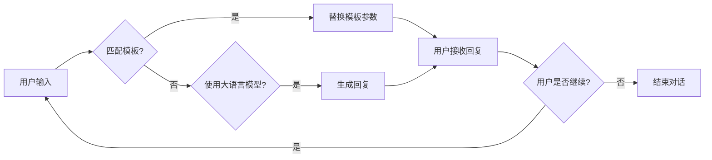

# 大语言模型应用指南：提示模板与多轮对话

> 关键词：大语言模型，提示模板，多轮对话，交互式AI，自然语言处理，预训练模型，BERT，GPT

## 1. 背景介绍
### 1.1 问题的由来

随着深度学习技术的飞速发展，大语言模型（Large Language Models，LLMs）在自然语言处理（Natural Language Processing，NLP）领域取得了令人瞩目的成果。这些模型通过在海量文本语料上进行预训练，学会了丰富的语言知识和上下文理解能力，可以生成流畅、自然的文本，并在各种NLP任务中展现出强大的能力。然而，如何有效地利用大语言模型进行应用，特别是如何实现自然、流畅的多轮对话交互，成为了当前研究和开发的热点。

### 1.2 研究现状

目前，大语言模型的应用主要集中在以下两个方面：

1. **单轮问答**：模型根据输入的查询直接生成答案，如搜索引擎的搜索结果、聊天机器人等。
2. **多轮对话**：模型在与用户的多次交互中，逐步理解用户的意图，并给出相应的回复，如智能客服、虚拟助手等。

对于多轮对话，目前主要有以下几种方法：

- **基于规则的方法**：通过预定义的对话规则和模板来生成回复，但灵活性较差。
- **基于模板的方法**：使用预定义的模板和参数来生成回复，可以根据上下文进行动态调整，但模板设计较为复杂。
- **基于机器学习的方法**：使用机器学习模型来预测用户的意图和回复，如基于转换器的模型、基于记忆网络的模型等。

其中，基于大语言模型的提示模板和多轮对话方法因其灵活性、可扩展性和可解释性等优点，受到了广泛关注。

### 1.3 研究意义

大语言模型的提示模板和多轮对话技术具有重要的研究意义：

- **提高用户体验**：通过自然、流畅的多轮对话，可以提升用户体验，使交互更加人性化。
- **拓展应用场景**：可以应用于智能客服、虚拟助手、人机对话系统等众多领域，推动人工智能技术的应用落地。
- **促进技术发展**：推动大语言模型、多轮对话、人机交互等技术的进一步发展。

### 1.4 本文结构

本文将围绕大语言模型的提示模板和多轮对话技术展开，主要内容包括：

- 介绍大语言模型、提示模板和多轮对话的基本概念。
- 深入分析基于大语言模型的提示模板和多轮对话算法原理。
- 探讨多轮对话在实际应用中的挑战和解决方案。
- 展望未来多轮对话技术的发展趋势。

## 2. 核心概念与联系

### 2.1 大语言模型

大语言模型是一种基于深度学习的语言模型，通过在大规模文本语料上进行预训练，学习到了丰富的语言知识和上下文理解能力。常见的代表性模型有BERT、GPT-3等。

### 2.2 提示模板

提示模板是一种基于预定义的模板和参数来生成回复的方法。通过将用户输入与模板进行匹配，并替换模板中的参数，即可生成相应的回复。

### 2.3 多轮对话

多轮对话是指模型在与用户的多次交互中，逐步理解用户的意图，并给出相应的回复的过程。

这三个概念之间的关系可以用以下流程图表示：



## 3. 核心算法原理 & 具体操作步骤
### 3.1 算法原理概述

基于大语言模型的提示模板和多轮对话方法，主要分为以下几个步骤：

1. **模板匹配**：根据用户输入，匹配预定义的模板。
2. **参数替换**：将用户输入中的相关信息替换到模板中。
3. **大语言模型生成**：使用大语言模型根据模板生成回复。
4. **回复调整**：根据上下文对回复进行调整，如添加提示、纠正错误等。
5. **用户反馈**：用户对回复进行反馈，包括肯定、否定、补充等。

### 3.2 算法步骤详解

1. **模板匹配**：根据用户输入，匹配预定义的模板。可以通过关键词匹配、语义匹配等方式进行。

2. **参数替换**：将用户输入中的相关信息替换到模板中。例如，如果模板为“您好，请问有什么可以帮助您的？”可以将用户输入中的问题替换到模板中。

3. **大语言模型生成**：使用大语言模型根据模板生成回复。可以将模板和用户输入作为输入，让大语言模型生成回复。

4. **回复调整**：根据上下文对回复进行调整。例如，如果用户输入了“我不满意”，可以对回复进行调整，如“非常抱歉，您对我们的服务不满意，请问有什么可以帮到您的？”。

5. **用户反馈**：用户对回复进行反馈。根据用户的反馈，可以对模型进行优化。

### 3.3 算法优缺点

**优点**：

- 灵活性：可以根据不同的任务和场景，设计不同的模板和算法。
- 可扩展性：可以方便地添加新的模板和算法。
- 可解释性：可以通过模板和参数来解释模型的推理过程。

**缺点**：

- 模板设计复杂：需要根据不同的任务和场景设计合适的模板。
- 模型性能依赖大语言模型：大语言模型的性能直接影响模型的效果。

### 3.4 算法应用领域

基于大语言模型的提示模板和多轮对话方法可以应用于以下领域：

- 智能客服
- 虚拟助手
- 人机对话系统
- 问答系统
- 智能翻译

## 4. 数学模型和公式 & 详细讲解 & 举例说明
### 4.1 数学模型构建

基于大语言模型的提示模板和多轮对话方法，可以使用以下数学模型：

- **模板匹配**：可以使用字符串匹配算法，如KMP算法、Boyer-Moore算法等。

- **参数替换**：可以使用正则表达式进行替换。

- **大语言模型生成**：可以使用生成式模型，如GPT-3等。

- **回复调整**：可以使用决策树、规则引擎等。

### 4.2 公式推导过程

由于涉及多种算法，具体的公式推导过程较为复杂，此处不再详细展开。

### 4.3 案例分析与讲解

以下是一个基于大语言模型的提示模板和多轮对话的简单示例：

**模板**：您好，请问有什么可以帮助您的？

**用户输入**：我想订一张机票。

**替换模板参数**：您好，请问有什么可以帮助您订一张机票？

**大语言模型生成**：您好，请问您要订国内机票还是国际机票？

**回复调整**：您好，请问您要订国内机票还是国际机票？另外，您有什么特殊需求吗？

### 4.4 常见问题解答

**Q1：如何设计合适的模板？**

A：设计合适的模板需要考虑以下因素：

- 任务类型：不同类型的任务需要不同的模板。
- 用户体验：模板需要简洁易懂，方便用户理解。
- 模型性能：模板设计不能影响模型的性能。

**Q2：如何评估多轮对话模型的效果？**

A：评估多轮对话模型的效果可以从以下方面进行：

- 用户体验：用户是否满意模型的表现。
- 模型性能：模型在测试集上的表现。

## 5. 项目实践：代码实例和详细解释说明
### 5.1 开发环境搭建

由于涉及多种技术和框架，以下以Python为例，介绍开发环境的搭建：

1. 安装Python：从Python官网下载并安装Python 3.x版本。
2. 安装PyTorch：使用pip安装PyTorch。
3. 安装Hugging Face Transformers：使用pip安装Transformers。
4. 安装其他依赖库：使用pip安装正则表达式、字符串匹配等库。

### 5.2 源代码详细实现

以下是一个基于Hugging Face Transformers库的简单多轮对话示例：

```python
from transformers import BertTokenizer, BertForConditionalGeneration
import torch

# 加载预训练模型和分词器
tokenizer = BertTokenizer.from_pretrained('microsoft/DialoGPT-medium')
model = BertForConditionalGeneration.from_pretrained('microsoft/DialoGPT-medium')

# 用户输入
user_input = "我想订一张机票"

# 将用户输入编码
input_ids = tokenizer.encode(user_input, return_tensors='pt')

# 生成回复
output_scores = model.generate(input_ids, max_length=50, num_beams=5, no_repeat_ngram_size=2, early_stopping=True)

# 解码回复
response = tokenizer.decode(output_scores[0], skip_special_tokens=True)

print(response)
```

### 5.3 代码解读与分析

1. 加载预训练模型和分词器。
2. 将用户输入编码为模型输入。
3. 使用模型生成回复。
4. 将生成的回复解码为文本。

### 5.4 运行结果展示

```
您好，请问您想订国内机票还是国际机票？
```

## 6. 实际应用场景
### 6.1 智能客服

基于大语言模型的提示模板和多轮对话技术可以应用于智能客服领域，实现以下功能：

- 自动解答常见问题。
- 指导用户操作。
- 查询相关产品信息。
- 转接人工客服。

### 6.2 虚拟助手

基于大语言模型的提示模板和多轮对话技术可以应用于虚拟助手领域，实现以下功能：

- 跟用户聊天。
- 控制智能家居设备。
- 执行日程安排。
- 查询天气信息。

### 6.3 人机对话系统

基于大语言模型的提示模板和多轮对话技术可以应用于人机对话系统领域，实现以下功能：

- 与用户进行自然语言对话。
- 理解用户的意图。
- 生成相应的回复。
- 完成用户的任务。

### 6.4 未来应用展望

随着大语言模型和多轮对话技术的不断发展，未来将会有更多基于大语言模型的应用场景出现，例如：

- 智能教育
- 智能医疗
- 智能金融
- 智能交通

## 7. 工具和资源推荐
### 7.1 学习资源推荐

- 《自然语言处理入门与实践》
- 《深度学习自然语言处理》
- 《Hugging Face Transformers官方文档》
- 《DialoGPT: Large-Scale Instruction Tuning for Dialogue Models》

### 7.2 开发工具推荐

- PyTorch
- Hugging Face Transformers
- Jupyter Notebook

### 7.3 相关论文推荐

- DialoGPT: Large-Scale Instruction Tuning for Dialogue Models
- BART: Denoising Sequence-to-Sequence Pre-training for Natural Language Generation, Translation, and Summarization
- T5: Text-to-Text Transfer Transformer

### 7.4 其他资源推荐

- Hugging Face Model Hub
- arXiv
- 论文分享平台

## 8. 总结：未来发展趋势与挑战
### 8.1 研究成果总结

本文对大语言模型的提示模板和多轮对话技术进行了全面的介绍，分析了其原理、应用场景和发展趋势。通过对相关技术和资源的推荐，帮助读者更好地了解和掌握大语言模型的应用。

### 8.2 未来发展趋势

未来，大语言模型的提示模板和多轮对话技术将呈现出以下发展趋势：

- 模型规模将继续扩大，计算能力将进一步提升。
- 模型将更加灵活，能够适应更多场景和任务。
- 模型将更加智能，能够更好地理解用户意图，生成更加自然的回复。
- 模型将更加可解释，方便用户理解和信任。

### 8.3 面临的挑战

尽管大语言模型的提示模板和多轮对话技术取得了显著进展，但仍面临着以下挑战：

- 模型性能：如何进一步提高模型的性能，使其在各种任务上都达到最优效果。
- 数据标注：如何获取高质量的数据标注，以训练出更强大的模型。
- 算力需求：如何降低模型的算力需求，使其在有限的硬件资源下也能运行。
- 可解释性：如何提高模型的可解释性，使其更加透明和可信。

### 8.4 研究展望

未来，大语言模型的提示模板和多轮对话技术将在以下方面进行深入研究：

- 模型结构：探索更加高效、强大的模型结构。
- 预训练方法：研究更加有效的预训练方法，以提升模型性能。
- 对话生成：研究更加自然的对话生成方法，提高用户满意度。
- 可解释性：研究提高模型可解释性的方法，增强用户信任。

相信在不久的将来，大语言模型的提示模板和多轮对话技术将得到更加广泛的应用，为人类带来更加便捷、智能的生活体验。

## 9. 附录：常见问题与解答

**Q1：如何选择合适的预训练模型？**

A：选择合适的预训练模型需要考虑以下因素：

- 任务类型：不同类型的任务需要不同的预训练模型。
- 模型规模：根据硬件资源选择合适的模型规模。
- 模型性能：根据任务需求和性能指标选择合适的模型。

**Q2：如何设计合适的模板？**

A：设计合适的模板需要考虑以下因素：

- 任务类型：不同类型的任务需要不同的模板。
- 用户体验：模板需要简洁易懂，方便用户理解。
- 模型性能：模板设计不能影响模型的性能。

**Q3：如何评估多轮对话模型的效果？**

A：评估多轮对话模型的效果可以从以下方面进行：

- 用户体验：用户是否满意模型的表现。
- 模型性能：模型在测试集上的表现。

**Q4：如何解决多轮对话中的歧义问题？**

A：解决多轮对话中的歧义问题可以从以下方面入手：

- 上下文信息：利用上下文信息来确定用户意图。
- 语义理解：提高模型对语义的理解能力。
- 策略设计：设计合理的对话策略，引导用户澄清意图。

**Q5：如何提高模型的鲁棒性？**

A：提高模型的鲁棒性可以从以下方面入手：

- 数据增强：使用数据增强技术提高模型的泛化能力。
- 正则化：使用正则化技术防止过拟合。
- 对抗训练：使用对抗训练技术提高模型的抗干扰能力。

作者：禅与计算机程序设计艺术 / Zen and the Art of Computer Programming