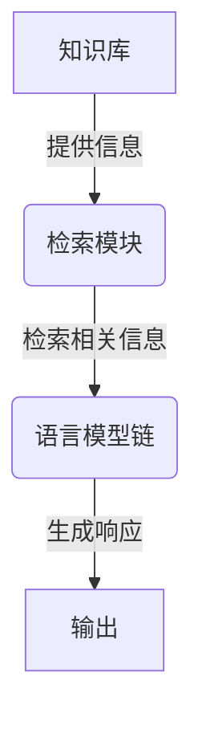

# 大语言模型应用指南：改进ReAct框架

## 1. 背景介绍

### 1.1 问题的由来

在当前的人工智能领域,大型语言模型(Large Language Models, LLMs)已经成为了备受关注的研究热点。这些模型通过在海量文本数据上进行预训练,能够获取丰富的语言知识和上下文理解能力,从而在自然语言处理任务上展现出了令人惊叹的性能表现。

然而,尽管大型语言模型在生成高质量文本方面具有独特优势,但它们在一些实际应用场景中仍然存在一些局限性和挑战。例如,在对话系统、问答系统等交互式应用中,大型语言模型往往难以保持一致的个性特征和情景理解能力,导致生成的响应缺乏连贯性和上下文相关性。此外,由于缺乏明确的决策机制,大型语言模型也容易受到不当输入的影响,产生不当或有害的输出。

为了解决这些问题,研究人员提出了ReAct(Retrieval-Augmented Language Model Chains)框架,旨在通过结合检索模块和语言模型链的方式,增强大型语言模型在交互式任务中的表现。ReAct框架的核心思想是利用检索模块从知识库中获取相关信息,并将这些信息作为上下文输入到语言模型链中,从而提高模型的上下文理解能力和响应质量。

### 1.2 研究现状

近年来,ReAct框架及其改进版本受到了广泛关注和研究。一些重要的工作包括:

- **原始ReAct框架**:最初由Weston等人于2018年提出,旨在通过检索和语言模型链的结合来增强对话系统的性能。
- **RAG(Retrieval-Augmented Generation)**:由Lewis等人于2020年提出,将ReAct框架应用于开放式问答任务,取得了显著的性能提升。
- **FiD(Fusion-in-Decoder)**:由Izacard和Grave于2021年提出,通过在解码器中融合检索信息,进一步提高了ReAct框架在开放式问答任务上的表现。
- **REALM(Retrieval-Enhanced Language Model)**:由Guu等人于2020年提出,将ReAct框架应用于事实性问答和对话任务,展现了优异的性能。

尽管取得了一定进展,但现有的ReAct框架及其改进版本仍然存在一些局限性和挑战,例如检索模块的效率和准确性、语言模型链的鲁棒性和可解释性等,这些问题都有待进一步研究和改进。

### 1.3 研究意义

改进ReAct框架对于提升大型语言模型在实际应用中的表现具有重要意义。通过优化检索模块和语言模型链的设计,我们可以获得以下潜在收益:

1. **提高响应质量**:改进后的ReAct框架能够更好地利用知识库中的信息,生成更加准确、相关和上下文一致的响应,从而提升用户体验。

2. **增强决策机制**:通过引入更加明确的决策机制,改进后的ReAct框架可以更好地控制输出的内容和语气,避免生成不当或有害的响应。

3. **提升可解释性**:优化后的ReAct框架能够更清晰地展示决策过程和依赖的知识,从而提高模型的可解释性和可信度。

4. **扩展应用场景**:改进后的ReAct框架不仅可以应用于对话系统和问答系统,还有望拓展到其他需要利用知识库的自然语言处理任务,如文本摘要、机器翻译等。

总的来说,改进ReAct框架有助于充分发挥大型语言模型的优势,同时缓解其在实际应用中的局限性,为构建更加智能、可靠和有用的自然语言处理系统奠定基础。

### 1.4 本文结构

本文将系统地介绍改进ReAct框架的方法和实践。文章的主要结构如下:

1. **背景介绍**:阐述问题的由来、研究现状和意义,为后续内容做好铺垫。

2. **核心概念与联系**:详细解释ReAct框架的核心概念,并阐明它们之间的联系。

3. **核心算法原理与具体操作步骤**:深入探讨改进ReAct框架的核心算法原理,并详细说明具体的操作步骤。

4. **数学模型和公式详细讲解与举例说明**:构建数学模型,推导相关公式,并通过案例分析进行详细讲解和常见问题解答。

5. **项目实践:代码实例和详细解释说明**:提供开发环境搭建方法、源代码实现细节、代码解读与分析,以及运行结果展示。

6. **实际应用场景**:介绍改进ReAct框架在实际应用中的场景,并对未来应用前景进行展望。

7. **工具和资源推荐**:推荐相关的学习资源、开发工具、论文资料和其他有用资源。

8. **总结:未来发展趋势与挑战**:总结研究成果,探讨未来发展趋势,分析面临的挑战,并对未来研究方向进行展望。

9. **附录:常见问题与解答**:解答与改进ReAct框架相关的常见问题。

通过全面而深入的介绍,本文旨在为读者提供改进ReAct框架的完整指南,帮助他们掌握相关知识,并能够在实践中有效应用和改进该框架。

## 2. 核心概念与联系

在深入探讨改进ReAct框架的算法原理和实现细节之前,我们需要先了解该框架的核心概念及它们之间的联系。ReAct框架主要由三个关键组件组成:知识库(Knowledge Base)、检索模块(Retrieval Module)和语言模型链(Language Model Chain)。

### 2.1 知识库(Knowledge Base)

知识库是ReAct框架的信息来源,它存储了大量的文本数据,包括但不限于网页内容、维基百科条目、新闻报道等。这些数据通常经过预处理和索引,以便于后续的检索和利用。

知识库的质量和覆盖范围直接影响着ReAct框架的性能。一个高质量的知识库应当包含丰富、准确和多样化的信息,以确保能够为各种查询提供有用的上下文信息。

### 2.2 检索模块(Retrieval Module)

检索模块是ReAct框架的核心部分之一,它的主要功能是从知识库中检索与当前查询相关的信息片段。检索模块通常采用基于向量空间模型(Vector Space Model)或语义索引(Semantic Indexing)等技术,将查询和知识库中的文本映射到同一个向量空间中,并根据相似度计算出最相关的信息片段。

检索模块的设计对ReAct框架的性能至关重要。一个高效准确的检索模块能够为语言模型链提供高质量的上下文信息,从而提高生成响应的质量和相关性。相反,如果检索模块的性能不佳,则可能导致语言模型链无法获取足够的上下文信息,进而影响最终的输出质量。

### 2.3 语言模型链(Language Model Chain)

语言模型链是ReAct框架中负责生成最终响应的组件。它由一系列预训练的语言模型组成,这些模型通过链式结构进行信息传递和协作,最终生成与查询相关的响应。

语言模型链的输入包括原始查询和检索模块提供的相关信息片段。每个语言模型会基于前一个模型的输出和检索到的信息,进行上下文理解和响应生成。通过这种链式结构,语言模型链能够逐步融合来自不同来源的信息,并最终生成高质量的响应。

语言模型链的设计也是ReAct框架性能的关键因素之一。不同的语言模型架构、训练方法和模型组合策略都会对最终的响应质量产生影响。此外,语言模型链还需要具备良好的鲁棒性和可解释性,以确保生成的响应符合预期,并且决策过程可以被理解和解释。

## 3. 核心算法原理与具体操作步骤

### 3.1 算法原理概述

改进ReAct框架的核心算法原理可以概括为三个主要步骤:

1. **检索相关信息片段**:利用检索模块从知识库中检索与当前查询相关的信息片段。

2. **融合上下文信息**:将检索到的信息片段与原始查询一起输入到语言模型链中,并通过链式结构逐步融合上下文信息。

3. **生成最终响应**:基于融合后的上下文信息,语言模型链生成与查询相关的最终响应。

在这个过程中,检索模块和语言模型链扮演着至关重要的角色。检索模块负责从海量知识库中准确高效地检索相关信息,而语言模型链则负责将这些信息与原始查询进行融合,并生成高质量的响应。

为了提高ReAct框架的性能,我们需要在以下几个方面进行改进:

1. **优化检索模块**:提高检索模块的效率和准确性,确保能够从知识库中检索到高质量的相关信息片段。

2. **优化语言模型链**:设计更加鲁棒和可解释的语言模型架构,并探索更有效的模型组合和训练策略,以提高响应质量和可解释性。

3. **引入决策机制**:在语言模型链中引入明确的决策机制,以控制输出的内容和语气,避免生成不当或有害的响应。

4. **优化知识库**:持续优化和扩充知识库,确保其包含丰富、准确和多样化的信息,以满足不同领域和场景的需求。

在后续章节中,我们将详细介绍改进ReAct框架的具体算法步骤和实现细节。

### 3.2 算法步骤详解

改进ReAct框架的算法步骤可以分为以下几个部分:

#### 3.2.1 查询预处理

在开始检索和生成响应之前,我们首先需要对原始查询进行预处理,以提高后续步骤的效率和准确性。常见的预处理操作包括:

1. **文本清理**:去除查询中的特殊字符、HTML标签、emoji等无用信息。

2. **分词和标记化**:将查询分割成单词序列,并进行词性标注等操作。

3. **查询扩展**:根据查询的上下文和语义,添加相关的同义词、扩展词等,以扩大检索范围。

4. **查询向量化**:将预处理后的查询映射到向量空间中,以便与知识库中的文本进行相似度计算。

经过预处理后,我们可以获得更加规范和富含语义信息的查询表示,为后续的检索和生成步骤奠定基础。

#### 3.2.2 检索相关信息片段

在这一步骤中,我们利用检索模块从知识库中检索与当前查询相关的信息片段。常见的检索方法包括:

1. **基于向量空间模型的检索**:计算查询向量与知识库中每个文本片段向量之间的相似度(如余弦相似度),并选取相似度最高的前N个片段作为相关信息。

2. **基于语义索引的检索**:利用预训练的语言模型对知识库中的文本进行语义索引,然后根据查询与索引之间的语义相关性进行检索。

3. **基于密集向量检索的方法**:将查询和知识库中的文本映射到同一个密集向量空间中,然后基于向量相似度进行检索。

4. **基于稀疏向量检索的方法**:利用传统的倒排索引和TF-IDF等技术,将查询和知识库中的文本映射到稀疏向量空间中,并基于向量相似度进行检索。

无论采用何种检索方法,关键是要确保检索到的信息片段与原始查询具有较高的相关性,并且能够为语言模型链提供有用的上下文信息。

#### 3.2.3 融合上下文信息

在获取到相关信息片段后,我们需要将它们与原始查询一起输入到语言模型链中,并通过链式结构逐